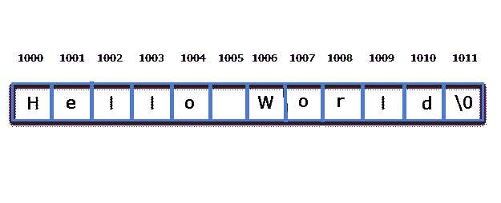
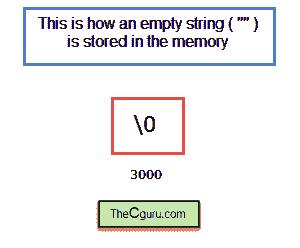
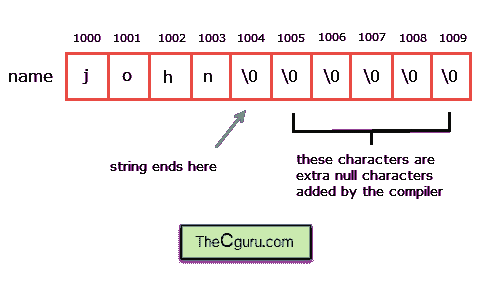

# C 语言中的字符串基础

> 原文：<https://overiq.com/c-programming-101/string-basics-in-c/>

最后更新于 2020 年 7 月 27 日

* * *

到目前为止，我们编写的程序只处理数字或字符，但一个真实世界的程序应该能够在需要时存储和操作文本。不幸的是，C 没有为字符串提供单独的数据类型，像 Java 和 C#这样的语言为字符串提供了单独的类型，但 C 却不是这样。在 C 中，字符串存储为以空字符结尾的字符数组。字符数组只有在最后一个元素是空字符(`'\0'`)时才是字符串。空字符是一个转义序列，就像`\n`(换行符)、`\t`(制表符)一样，ASCII 值为`0`。例如:

```c
char name[10] = {'s', 't', 'r', 'i', 'n', 'g' ,'\0'};

```

因此，我们可以说字符串只是一维字符数组，最后一个元素是空字符(“\0”)。

## 字符串文字

字符串文字只是用双引号(`""`)括起来的一系列字符。它也被称为一个**弦常量**。以下是一些字符串的例子:

```c
"I am learning C"
"My Lucky Number is 1"
"Hello World!"
""

```

双引号(`""`)不是字符串文字的一部分，它们只是用来描述(即标记边界)一个字符串。每当您在程序中创建字符串文字时，编译器都会自动在末尾添加空字符(`'\0'`)。

## 字符串是如何存储的？

如上所述，字符串实际上是以空字符(`'\0'`)结尾的字符数组。每当编译器看到长度为`n`的字符串时，它就为该字符串分配`n + 1`个连续字节的内存。该内存将包含字符串中的所有字符，以及字符串末尾的空字符(`'\0'`)。因此字符串文字`"Hello World"`将存储在内存中，如下所示:



如您所见，字符串`"Hello World"`存储为一个`12`字符数组(包括`'\0'`)。

字符串也可以为空。

`""`(空字符串，只包含`'\0'`)。它将作为一组`1`字符存储在内存中。



## 作为指针的字符串文字

字符串像数组一样存储。要理解的最重要的一点是，字符串文字是指向数组第一个字符的指针。换句话说`"Hello World"`是指向字符`'H'`的指针。由于`"Hello World"`指向字符`'H'`的地址，它的基本类型是指向`char`或`(char *)`的指针。这意味着，如果我们有一个指向`char`或`(char*)`类型的指针变量，我们可以将字符串指定为:

```c
char *str = "Hello World";

```

在此赋值后`str`指向第一个元素的地址，使用指针算法我们可以访问字符串文本中的任何字符。

```c
printf("%c" ,*(str+0) ); // prints H
printf("%c" ,*(str+4) ); // prints o

```

即使您可以访问字符串文字的单个元素。试图修改字符串文字是一种未定义的行为，可能会导致程序崩溃。

```c
*str = 'Y'; // wrong

```

由于`"Hello World"`是指针，我们可以直接对其应用指针算法。例如:

`"Hello World" + 0`指向字符`'H'`的地址。
`"Hello World" + 1`指向字符`'e'`的地址。
`"Hello World" + 2`指向字符`'l'`的地址。

等等。

要获取地址`"Hello World" + 1`处的值，只需取消引用表达式。

`*("Hello World" + 1)`给出`'e'`T4`*("Hello World" + 2)`给出`'l'`

等等。

在第一章一维数组中，我们讨论了:

```c
int arr[] = {16,31,39,59,11};

```

那么写`arr[i]`和写`*(arr+i)`是一样的。

因此`*("Hello World" + 1)`也可以写成`"Hello World"[1]`。

## 重新审视 printf()和 scanf()

如果你看一下`scanf()`和`print()`的原型，你会发现这两个函数都期望一个类型为`(char*)`的值作为它们的第一个参数。

```c
int printf (const char*, ...);
int scanf (const char*, ...);

```

**注意:**暂时忽略关键字`const`。这将在接下来的章节中详细讨论。

现在你知道当你调用`printf()`函数时:

```c
printf("Hello World");

```

您实际上是在传递`"Hello World"`的地址，即指向数组第一个字母`'H'`的指针。

## 字符串文字 v/s 字符文字

初学者经常混淆`"a"`和`'a'`，前者是字符串，其中`"a"`是指向包含字符`'a'`的内存位置的指针，后跟一个空字符(`'\0'`)。另一方面，字符文字，`'a'`代表字符`'a'`的 ASCII 值，即`97`。因此，在需要字符串文字的地方千万不要使用字符文字，反之亦然。

## 多行字符串文字

您不限于单行字符串。如果您的字符串足够大，可以容纳在一行中，那么您可以通过在行尾添加反斜杠来扩展它。例如:

```c
printf("This is first line \
some characters in the second line \
even more characters in the third line \n");

```

## 使用转义序列

您可以在字符串中使用像`\n`(换行符)、`\t`(制表符)这样的转义序列。例如:

```c
printf("Lorem ipsum \ndolor sit \namet, consectetur \nadipisicing elit \nsed do eiusmod");

```

**预期输出:**

```c
dolor sit
amet, consectetur
adipisicing elit
sed do eiusmod

```

## 字符串文字后跟字符串文字

当两个字符串文字彼此相邻时，编译器会将它们串联起来，并在串联字符串的末尾追加空字符(“\0”)。

```c
print("Hello"" World"); // prints Hello World

```

和写作一样:

```c
print("Hello World");

```

## 字符串变量

由于字符串是一个字符数组，我们必须声明一个足够大的数组来存储所有字符，包括空字符(`'\0'`)。

```c
char ch_arr[6];

```

这里`ch_arr`只能容纳`6`个字符，包括空字符(`'\0'`)。如果在声明时初始化数组的元素，那么可以省略大小。

```c
char ch_arr[] = {'H', 'e', 'l', 'l', 'o', ' ', 'W', 'o', 'r', 'l', 'd'};

```

C 语言还为初始化字符串提供了一种更简洁、更容易键入的语法。例如，上述语句也可以写成:

```c
char ch_arr[] = "Hello World";

```

我们已经研究过字符串文字是数组第一个字符的指针，但是这个规则有一个例外:当字符串文字被用来初始化一个字符数组，就像上面的语句一样，那么它不代表任何地址。这意味着我们不能使用`"Hello World"`进行指针运算。数组`ch_arr`的所有字符将存储在存储器中，如下所示:


如果要存储的字符数(包括`'\0'`)小于数组的大小怎么办。在这种情况下，编译器会添加额外的空字符(`'\0'`)。例如:

```c
char name[10] = "john";

```

数组`name`将存储在存储器中，如下所示:



如果要存储的字符数(包括`'\0'`)大于数组的大小，那么编译器会显示一条警告消息:数组初始值设定项中有多余的元素。

一般来说，创建字符串的最好方法是忽略数组的大小，在这种情况下，编译器会根据初始值设定项中的字符数来计算数组的大小。例如:

```c
char str[] = "this is the best way";

```

需要注意的是，省略大小并不意味着数组字符串的长度可以在程序后期增加或减少(使用`malloc()`或`calloc()`来调整数组的长度)。一旦程序被编译，字符串的大小被固定为`21`字节。由于对长字符串中的字符进行计数是一个容易出错的过程，因此当字符串太长时，此方法也是首选方法。

让我们通过创建两个简单的程序来结束这一章。

**例 1:**

下面的程序打印字符串的字符和每个字符的地址。

```c
#include<stdio.h>

int main()
{
    int i;
    char str[6] = "hello";

    for(i = 0; str[i] != '\0'; i++)
    {
        printf("Character = %c\t Address = %u\n", str[i], &str[i]);
    }

    // signal to operating system program ran fine
    return 0;
}

```

**预期输出:**

```c
Character = h Address = 2686752
Character = e Address = 2686753
Character = l Address = 2686754
Character = l Address = 2686755
Character = o Address = 2686756

```

**注意:**每次运行程序时，地址可能会有所不同。

在程序中需要注意的重要事情是 for 循环中的终止条件，它说:继续循环，直到遇到空字符。

**例 2:**

下面的程序使用指针打印字符串中的字符和字符的地址。

```c
#include<stdio.h>

int main()
{
    int i;
    char str[6] = "hello";
    char *p;

    for(p = str; *p != '\0'; p++)
    {
        printf("Character = %c\t Address = %u\n", *(p), p);
    }

    // signal to operating system program ran fine
    return 0;
}

```

**预期输出:**

```c
Character = h Address = 2686752
Character = e Address = 2686753
Character = l Address = 2686754
Character = l Address = 2686755
Character = o Address = 2686756

```

**注意:**每次运行程序时，地址可能会有所不同。

**工作原理:**

这里，我们已经将数组名称字符串(指向`char`或`(char*)`的指针)分配给指针变量`p`。这个说法之后`p`和`str`都指向了同一个同一个阵。现在我们可以使用指针算法来回移动来访问数组中的元素。对于循环的每次迭代，将`p`的值增加`1`。当`p`指向空字符(`'\0'`)的地址时，for 循环停止。

* * *

* * *