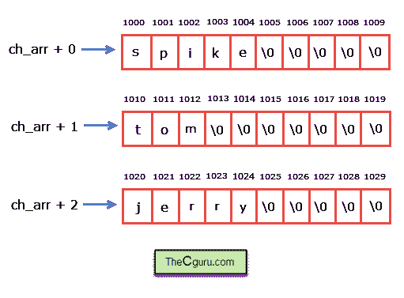

# C 语言中的字符串数组

> 原文：<https://overiq.com/c-programming-101/array-of-strings-in-c/>

最后更新于 2020 年 7 月 27 日

* * *

## 什么是字符串数组？

字符串是一维字符数组，因此字符串数组是二维字符数组。就像我们可以创建`int`、`float`等的二维数组一样；我们还可以创建一个二维字符数组或字符串数组。下面是我们如何声明一个二维字符数组。

```c
char ch_arr[3][10] = {
                         {'s', 'p', 'i', 'k', 'e', '\0'},
                         {'t', 'o', 'm','\0'},
                         {'j', 'e', 'r', 'r', 'y','\0'}
                     };

```

用空字符结束每个一维数组很重要，否则，它将只是一个字符数组。我们不能把它们当作琴弦。

以这种方式声明字符串数组相当繁琐，这就是为什么 C 语言提供了一种替代语法来实现同样的事情。上述初始化相当于:

```c
char ch_arr[3][10] = {
                         "spike",
                         "tom",
                         "jerry"
                     };

```

数组的第一个下标，即`3`表示数组中的字符串数量，第二个下标表示字符串的最大长度。回想一下，在 C 语言中，每个字符占用`1`字节的数据，所以当编译器看到上面的语句时，它会分配`30`字节(`3*10`)的内存。

我们已经知道数组的名称是指向数组第 0 个元素的指针。你能猜出`ch_arr`的类型吗？

`ch_arr`是指向一组`10`字符或`int(*)[10]`的指针。

因此，如果`ch_arr`指向地址`1000`，那么`ch_arr + 1`将指向地址`1010`。

由此，我们可以得出结论:

`ch_arr + 0`指向第 0 个字符串或第 0 个一维数组。
`ch_arr + 1`指向第一个字符串或第一个一维数组。
`ch_arr + 2`指向第二个字符串或第二个一维数组。

一般来说，`ch_arr + i`指向第 ith 个字符串或者第 ith 个一维数组。



我们知道，当我们取消引用指向数组的指针时，我们得到了数组的基址。因此，在解引用`ch_arr + i`时，我们得到第 0 个一维数组的基址。

由此我们可以得出结论:

`*(ch_arr + 0) + 0`指向第 0 个一维数组的第 0 个字符(即`s` )
`*(ch_arr + 0) + 1`指向第 0 个一维数组的第 1 个字符(即`p` )
`*(ch_arr + 1) + 2`指向第 1 个一维数组的第 2 个字符(即`m`

总的来说，我们可以说:`*(ch_arr + i) + j`指向一维数组的 jth 字符。

注意`*(ch_arr + i) + j`的基类型是指向`char`或`(char*)`的指针，`ch_arr + i`的基类型是 10 个字符的数组或`int(*)[10]`。

要获取一维数组第十个位置的元素，只需取消引用整个表达式`*(ch_arr + i) + j`。

```c
*(*(ch_arr + i) + j)

```

我们在“指针和二维数组”一章中了解到，在二维数组中，指针符号相当于下标符号。所以上面的表达式可以写成如下:

```c
ch_arr[i][j]

```

下面的程序演示了如何打印字符串数组。

```c
#include<stdio.h>

int main()
{
    int i;

    char ch_arr[3][10] = {
                             "spike",
                             "tom",
                             "jerry"
                         };

    printf("1st way \n\n");

    for(i = 0; i < 3; i++)
    {
        printf("string = %s \t address = %u\n", ch_arr + i, ch_arr + i);
    }

    // signal to operating system program ran fine
    return 0;
}

```

**预期输出:**

```c
string = spike address = 2686736
string = tom address = 2686746
string = jerry address = 2686756

```

## 对字符串数组的一些无效操作

```c
char ch_arr[3][10] = {
                         {'s', 'p', 'i', 'k', 'e', '\0'},
                         {'t', 'o', 'm','\0'},
                         {'j', 'e', 'r', 'r', 'y','\0'}
                     };

```

它分配`30`字节的内存。即使我们在声明时没有初始化数组的元素，编译器也会做同样的事情。

我们已经知道数组的名称是一个常量指针，所以下面的操作是无效的。

```c
ch_arr[0] = "tyke";   // invalid
ch_arr[1] = "dragon"; // invalid

```

在这里，我们试图将一个字符串(一个指针)赋给一个常量指针，这显然是不可能的。

要为`ch_arr`分配新字符串，请使用以下方法。

```c
strcpy(ch_arr[0], "type"); // valid
scanf(ch_arr[0], "type");  // valid

```

让我们通过创建另一个简单的程序来结束这一章。

这个程序要求用户输入用户名。如果输入的用户名是主列表中的一个名称，则允许用户计算一个数字的阶乘。否则，将显示一条错误消息。

```c
#include<stdio.h>
#include<string.h>
int factorial(int );

int main()
{
    int i, found = 0, n;

    char master_list[5][20] = {
                                  "admin",
                                  "tom",
                                  "bob",
                                  "tim",
                                  "jim"
                              }, name[10];

    printf("Enter username: ");
    gets(name);

    for(i = 0; i < 5; i++)
    {
        if(strcmp(name, master_list[i]) == 0 )
        {
            found = 1;
            break;
        }
    }

    if(found==1)
    {
        printf("\nWelcome %s !\n", name);
        printf("\nEnter a number to calculate the factorial: ");
        scanf("%d", &n);
        printf("Factorial of %d is %d", n, factorial(n));
    }

    else
    {
        printf("Error: You are not allowed to run this program.", name);
    }

    // signal to operating system program ran fine
    return 0;
}

int factorial(int n)
{
    if(n == 0)
    {
        return 1;
    }

    else
    {
        return n * factorial(n-1);
    }
}

```

**预期输出:**第一次运行:

```c
Enter username: admin

Welcome admin !

Enter a number to calculate the factorial: 4
Factorial of 4 is 24

```

第二次运行:

```c
Enter username: jack
Error: You are not allowed to run this program.

```

**工作原理:**

程序要求用户输入姓名。输入名称后，它会使用`strcmp()`功能将输入的名称与`master_list`数组中的名称进行比较。如果找到匹配，则`strcmp()`返回`0`，如果条件`strcmp(name, master_list[i]) == 0`变为真。找到的变量被赋值为`1`，这意味着允许用户访问程序。程序要求用户输入一个数字，并显示一个数字的阶乘。

如果输入的名称不是`master_list`数组中的一个名称，则程序通过显示错误信息退出。

* * *

* * *