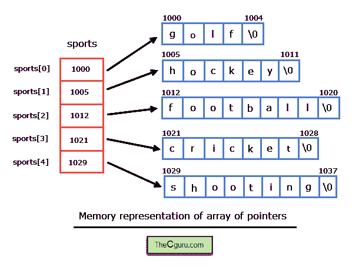

# C 语言中指向字符串的指针数组

> 原文：<https://overiq.com/c-programming-101/array-of-pointers-to-strings-in-c/>

最后更新于 2020 年 7 月 27 日

* * *

在上一章中，我们已经学习了如何使用字符串数组或二维字符数组。它可能会在您需要存储多个字符串时出现，那么字符串数组就是您要走的路，不幸的是，事实并非如此。考虑下面的例子。

```c
char sports[5][15] = {
                         "golf",
                         "hockey",
                         "football",
                         "cricket",
                         "shooting"
                     };

```

`sports`数组存储在存储器中，如下所示:


正如您所看到的，并不是所有的字符串都足够长来填充数组的所有行，这就是编译器用空字符(`'\0'`)填充这些空格(使用浅灰色突出显示)的原因。运动阵列的总大小为`75`字节，但仅使用了`34`字节，浪费了`41`字节。`41`字节可能不会出现很多，但是在一个大型程序中，相当多的字节会被浪费掉。我们需要的是一个交错数组:一个二维数组，它的行可以有不同的长度。C 语言不提供交错数组，但是我们可以使用指向字符串的指针数组来模拟它们。

## 指向字符串的指针数组

指向字符串的指针数组是一个字符指针数组，其中每个指针指向字符串的第一个字符或字符串的基址。让我们看看如何声明和初始化指向字符串的指针数组。

```c
char *sports[5] = {
                      "golf",
                      "hockey",
                      "football",
                      "cricket",
                      "shooting"
                  };

```

这里`sports`是一个指向字符串的指针数组。如果数组的初始化是在声明时完成的，那么我们可以省略数组的大小。所以上面的说法也可以写成:

```c
char *sports[] = {
                     "golf",
                     "hockey",
                     "football",
                     "cricket",
                     "shooting"
                 };

```

需要注意的是，sports 数组的每个元素都是字符串，由于字符串指向第一个字符的基址，因此 sports 数组每个元素的基类型都是指向`char`或`(char*)`的指针。

第 0 个元素即`arr[0]`指向字符串`"golf"`的基址。同样，第一个元素`arr[1]`指向字符串`"hockey"`的基址，以此类推。

以下是指向字符串的指针数组是如何存储在内存中的。



```c
34 + 20 = 54

```

在这种情况下，所有字符串文字占用`34`字节，`20`字节由指针数组(即 sports)占用。因此，仅仅通过创建一个指向字符串的指针数组，而不是字符的二维数组，我们就节省了`21`字节(`75-54=21`)的内存。

需要强调的是，在指向字符串的指针数组中，不能保证所有字符串都存储在连续的内存位置。虽然特定字符串文字的字符总是存储在连续的内存位置。

下面的程序演示了如何访问字符串指针数组中的字符串文字，并在此过程中打印每个字符串文字的地址。

```c
#include<stdio.h>
#include<string.h>
int factorial(int );

int main()
{
    int i = 1, *ip = &i;

    char *sports[] = {
                         "golf",
                         "hockey",
                         "football",
                         "cricket",
                         "shooting"
                     };

    for(i = 0; i < 5; i++)
    {
        printf("String = %10s", sports[i] );
        printf("\tAddress of string literal = %u\n", sports[i]);
    }

    // signal to operating system program ran fine
    return 0;
}

```

**预期输出:**

```c
String = golf Address of string literal = 4206592
String = hockey Address of string literal = 4206597
String = football Address of string literal = 4206604
String = cricket Address of string literal = 4206613
String = shooting Address of string literal = 4206621

```

在上一章中，我们了解到不能使用赋值运算符(`=`)将新字符串赋给二维字符数组。

```c
char games[3][10] = {
                        "roadrash",
                        "nfs",
                        "angrybirds"
                    };

games[0] = "hitman";   // wrong

```

但是同样的事情也可以用指向字符串的指针数组来完成。

```c
char *games[3] = {
                     "roadrash",
                     "nfs",
                     "angrybirds"
                 };

games[0] = "hitman";   // ok

```

由于`games`数组的每个元素都是指向`char`或`(char*)`的指针，因此它可以指向分配给它的任何字符串。

## 对字符串指针数组的一些无效操作

让我们讨论一些不能在指向字符串的指针数组中直接执行的操作。考虑以下示例:

```c
char *top_games[5];

```

当编译器看到上面的语句时，它会保留`20`字节的内存(`4*5`)来存储类型为`char`的`5`指针，但不会为字符串分配任何内存。此时，`top_games`数组的所有元素都包含垃圾值，并且可能指向内存中的任何位置。这意味着以下操作无效。

```c
scanf("%s", top_games[0]);             // invalid
strcpy(top_games[0], "mario");         // invalid
gets(top_games[0]);                    // invalid
strcat(top_games[0], "needforspeed");  // invalid

```

* * *

* * *