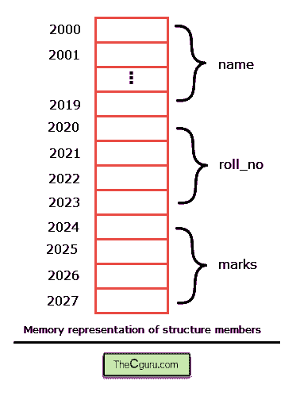
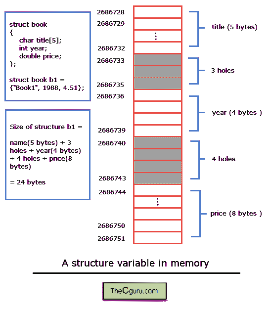

# C 语言中的结构基础

> 原文：<https://overiq.com/c-programming-101/structure-basics-in-c/>

最后更新于 2020 年 7 月 27 日

* * *

C 语言中的结构用于创建新的数据类型。那么为什么我们需要创建新的数据类型呢？考虑以下示例:

假设我们正在创建一个存储学生记录的程序。一个学生有许多属性，如姓名、学号、分数、出勤率等。有些项目是字符串，有些是数字。这是解决这个问题的一种方法。

```c
#include<stdio.h>
#include<string.h>

int main()
{
    char name[20];
    int roll_no, i;
    float marks[5];

    printf("Enter name: ");
    scanf("%s", name);

    printf("Enter roll no: ");
    scanf("%d", &roll_no);

    printf("\n");

    for(i = 0; i < 5; i++)
    {
        printf("Enter marks for %d: subject: ", i+1);
        scanf("%f", &marks[i]);
    }

    printf("\nYou entered: \n\n");

    printf("Name: %s\n", name);
    printf("roll no: %d\n", roll_no);

    printf("\n");

    for(i = 0; i < 5; i++)
    {
        printf("Marks in %d subject %f: l\n", i+1, marks[i]);
    }

    // signal to operating system program ran fine
    return 0;
}

```

毫无疑问，使用这种方法，我们将能够存储学生的姓名、学号和分数。但问题是这种方法的可扩展性不是很好。如果我们想存储更多的学生，那么程序就变得很难处理。这种方法最大的缺点是，它模糊了我们正在与一个单一的实体——学生打交道的事实。

利用结构，我们可以很容易地解决这类问题。该结构允许我们将不同类型的相关数据组合在一个名称下。每个数据元素(或属性)都被称为成员。

## 定义结构

**语法:**

```c
struct tagname
{
    data_type member1;
    data_type member2;
    ...
    ...
    data_type memberN;
};

```

这里`struct`是一个关键字，告诉 C 编译器正在定义一个结构。`member1`、`member2`……`memberN`是结构的成员或者只是结构成员，必须在花括号(`{}`)内声明。每个成员声明都以分号(`;`)结束。标记名是结构的名称，用于声明这种结构类型的变量。需要注意的一点是，结构定义必须始终以右大括号后面的分号(`;`)结束。

如上所述，除了内置数据类型之外，该结构还提供了一种数据类型。从结构类型中声明的所有变量都将采用该模板的形式。

定义一个新的结构不会保留任何空间和内存，只有当我们声明这种结构类型的变量时，才会保留内存。还有一点很重要，结构定义里面的成员是依附于结构变量的，没有结构变量他们就没有任何存在。结构内部的成员名称必须不同，但两个不同结构的成员名称可以相同。

让我们定义一个叫做学生的简单结构。

```c
struct student
{
    char name[20];
    int roll_no;
    float marks;
};

```

这里我们定义了一个名为`student`的结构，它有三个结构成员`name`、`roll_no`和`marks`。您可以在全局和本地定义结构。如果结构是全局的，那么它必须放在所有函数之上，这样任何函数都可以使用它。另一方面，如果在函数内部定义了一个结构，那么只有该函数可以使用该结构。

## 创建结构变量

除非我们声明结构变量，否则我们不能以任何方式使用结构定义。

```c
struct student
{
    char name[20];
    int roll_no;
    float marks;
};

```

有两种方法可以声明结构变量:

1.  有了结构定义
2.  使用标记名

让我们从第一个开始。

### 有了结构定义

```c
struct student
{
char name[20];
int roll_no;
float marks;
} student1, student2;

```

这里`student1`和`student2`是`struct student`类型的变量。如果在定义结构模板时声明了结构变量，则`tagname`是可选的。这意味着我们也可以将上述结构声明为:

```c
struct
{
    char name[20];
    int roll_no;
    float marks;
} student1, student2;

```

以这种方式定义结构有几个限制:

1.  由于这个结构没有与之相关的名称，我们不能在程序的任何其他地方创建这种结构类型的结构变量。如果您有必要声明这种结构类型的变量，那么您必须再次编写相同的模板。
2.  我们不能将这些结构变量发送给其他函数。

由于上述限制，这种方法没有得到广泛应用。

### 使用标记名

```c
struct student
{
    char name[20];
    int roll_no;
    float marks;
};

```

要使用标记名声明结构变量，请使用以下语法:

**语法:** `struct tagname variable_name;`

其中`variable_name`必须是有效的标识符。

下面是我们如何创建`struct student`类型的结构变量。

```c
struct student student1;

```

我们还可以通过用逗号(`,`)符号分隔来声明多个结构变量。

```c
struct student student1, student2, student3;

```

当一个变量被声明时，编译器只在内存中保留空间。理解一个结构的成员按照它们被定义的顺序存储在内存中是很重要的。在这种情况下，学生类型的每个结构变量有 3 个成员，即:`name`、`roll_no`、标记。因此，编译器将分配足够的内存来容纳该结构的所有成员。所以这里每个结构变量占用`28`字节(`20+4+4`)的内存。



**注:**在此图中，我们假设结构的成员之间没有间隙。正如您将在本章后面看到的，结构的成员通常会在它们之间留下一些间隙。

## 初始化结构变量

为了初始化结构变量，我们使用与初始化数组相同的语法。

```c
struct student
{
    char name[20];
    int roll_no;
    float marks;
} student1 = {"Jim", 14, 89};

struct student student2 = {"Tim", 10, 82};

```

这里`student1`的成员值将有`name`的`"Jim"`、`roll_no`的`14`和`marks`的`89`。同样的，`student2`的成员值为`name`的`"Tim"`、`10`的`roll_no`和`82`的`marks`。

成员的值必须按照结构模板中定义的相同顺序和相同类型放置。

要理解的另一件重要的事情是，我们不允许在定义结构时初始化成员。

```c
struct student
{
    char name[20] = "Phil";   // invalid
    int roll_no = 10;         // invalid
    float marks = 3.14;       // invalid
};

```

定义结构只会创建一个模板，在创建结构变量之前不会分配内存。因此在这一点上不存在称为`name`、`roll_no`和`marks`的变量，那么我们如何将数据存储在一个不存在的变量中呢？我们不能。

如果初始值设定项的数量少于成员的数量，那么剩余的成员被赋予一个值`0`。例如:

```c
struct student student1 = {"Jon"};

```

与...相同

```c
struct student student1 = {"Jon", 0, 0.0};

```

## 结构上的操作

创建结构定义和结构变量后。显然，下一个逻辑步骤是学习如何访问结构的成员。

点(`.`)运算符或成员运算符用于使用结构变量访问结构的成员。以下是语法:

**语法:** `structure_variable.member_name;`

我们可以通过编写结构变量，后跟点(`.`)运算符，后跟成员名称来引用结构的成员。例如:

```c
struct student
{
    char name[20];
    int roll_no;
    float marks;
};

struct student student1 = {"Jon", 44, 96};

```

要访问`student1`的名称，请使用`student1.name`，同样，要访问`roll_no`和`marks`，请分别使用`student1.roll_no`和`student1.marks`。例如，以下语句将显示`student_1`成员的值。

```c
printf("Name: %s", student_1.name);
printf("Name: %d", student_2.roll_no);
printf("Name: %f", student_1.marks);

```

我们可以像使用其他普通变量一样使用`student1.name`、`student1.roll_no`和`student1.marks`。它们可以被读取、显示、赋值、在表达式中使用、作为参数传递给函数等。

让我们尝试更改结构成员的值。

```c
student_1.roll_no = 10; // change roll no of student_1 from 44 to 10
student_1.marks++;      // increment marks of student_1 by 1

```

回想一下运算符优先级和结合性一章，点(`.`)运算符的优先级高于`++`运算符和赋值运算符(`=`)。所以在上面的表达式中，第一个点(`.`)运算符应用于后面跟有`++`运算符的表达式中。

看看下面的陈述。

```c
scanf("%s", student_1.name);

```

这里`structure student`的`name`成员是一个数组，数组名是指向数组第 0 个元素的常量指针。所以我们不需要在`student_1.name`之前加上`&`运算符。另一方面在声明中:

```c
scanf("%d", &student_1.roll_no);

```

要求在`student_2.roll_no`前加`&`运算符，因为`roll_no`是变量名，不是指针。另一点值得注意的是，在上面的表达式中，`&`运算符之前应用了点(`.`)运算符。

我们还可以将一个结构变量赋给另一个相同类型的结构变量。

```c
struct student
{
    char name[20];
    int roll_no;
    float marks;
};

struct student student1 = {"Jon", 44, 96}, student2;

student2 = student1;

```

本声明将`student1.name`复制成`student2.name`，`student1.roll_no`复制成`student2.roll_no`等等。

需要注意的是，我们不能对结构变量使用算术、关系和按位运算符。

```c
student1 + student2;  // invalid
student1 == student2; // invalid
student1 & student2;  // invalid

```

下面的程序演示了我们如何定义一个结构和读取结构成员的值。

```c
#include<stdio.h>
#include<string.h>

struct student
{
    char name[20];
    int roll_no;
    float marks;
};

int main()
{
    struct student student_1 = {"Jim", 10, 34.5}, student_2, student_3;

    printf("Details of student 1\n\n");

    printf("Name: %s\n", student_1.name);
    printf("Roll no: %d\n", student_1.roll_no);
    printf("Marks: %.2f\n", student_1.marks);

    printf("\n");

    printf("Enter name of student2: ");
    scanf("%s", student_2.name);

    printf("Enter roll no of student2: ");
    scanf("%d", &student_2.roll_no);

    printf("Enter marks of student2: ");
    scanf("%f", &student_2.marks);

    printf("\nDetails of student 2\n\n");

    printf("Name: %s\n", student_2.name);
    printf("Roll no: %d\n", student_2.roll_no);
    printf("Marks: %.2f\n", student_2.marks);
    strcpy(student_3.name, "King");
    student_3.roll_no = ++student_2.roll_no;
    student_3.marks = student_2.marks + 10;

    printf("\nDetails of student 3\n\n");

    printf("Name: %s\n", student_3.name);
    printf("Roll no: %d\n", student_3.roll_no);
    printf("Marks: %.2f\n", student_3.marks);

    // signal to operating system program ran fine
    return 0;
}

```

**预期输出:**

```c
Details of student 1

Name: Jim
Roll no: 10
Marks: 34.50

Enter name of student2: jack
Enter roll no of student2: 33
Enter marks of student2: 15.21

Details of student 2

Name: jack
Roll no: 33
Marks: 15.21

Details of student 3

Name: King
Roll no: 34
Marks: 25.21

```

**工作原理:**

这里我们已经初始化了三个类型为`struct student`的变量。第一个结构变量`student_1`在声明时初始化。第一个学生的详细信息会用`printf()`语句打印出来。然后程序要求用户输入`name`、`roll_no`和`marks`作为结构变量`student_2`。然后使用`printf()`语句打印`student_2`的详细信息。

我们知道`student_3.name`是一个数组，所以我们不能只给它分配一个字符串，这就是为什么在第 37 行中使用`strcpy()`函数给`student_3.name`分配一个字符串。

因为点(`.`)运算符的优先级大于`++`运算符。因此在表达式`++student_2.roll_no`中，点(`.`)运算符首先应用，然后`student.roll_no`的值递增，并最终分配给`student_3.roll_no`。同样在表达式`student_2.marks + 10`中，由于点(`.`)运算符的优先级大于`+`运算符，首先得到`student_2`的标记，然后将其值增加`10`并最终赋给`student_3.marks`。最后打印`student_3`的详细信息。

## 结构如何存储在内存中

结构的成员总是存储在连续的内存位置，但是每个成员占用的内存可能会有所不同。考虑以下程序:

```c
#include<stdio.h>

struct book
{
    char title[5];
    int year;
    double price;
};

int main()
{
    struct book b1 = {"Book1", 1988, 4.51};

    printf("Address of title = %u\n", b1.title);
    printf("Address of year = %u\n", &b1.year);
    printf("Address of price = %u\n", &b1.price);

    printf("Size of b1 = %d\n", sizeof(b1));

    // signal to operating system program ran fine
    return 0;
}

```

**预期输出:**

```c
Address of title = 2686728
Address of year = 2686736
Address of price = 2686744
Size of b1 = 24

```

在结构上，书名占据`5`字节，年份占据`4`字节，价格占据`8`字节。所以结构变量的大小应该是`17`字节。但是，正如您在输出中看到的，变量`b1`的大小是`24`字节，而不是`17`字节。为什么会这样？

这是因为有些系统要求某些数据类型的地址是`2`、`4`或`8`的倍数。例如，有些机器只在偶数地址存储整数，`unsigned long int`和`double`存储在`4`的倍数等地址。在我们的例子中，名称成员的地址是`2686728`，因为它是`5`字节`long`，所以它占据了`2686728` - `2686732`的所有地址。

我运行这些示例程序的机器以`4`的倍数存储整数，这就是为什么`2686732`之后的三个连续字节(即`2686733`、`2686734`、`2686735`)没有使用的原因。这些未使用的字节称为**孔**。需要注意的是，这些孔不属于结构的任何成员，但它们确实会影响结构的整体尺寸。所以下一个成员`year`存储在`2686736`(是 4 的倍数)。它占用从`2686736`到`2686739`的地址`4`字节。同样，2686739 之后的四个字节未被使用，最终`price`成员存储在地址`2686744`(是`8`的倍数)。



* * *

* * *