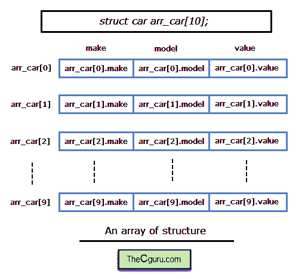

# C 语言中的结构数组

> 原文：<https://overiq.com/c-programming-101/array-of-structures-in-c/>

最后更新于 2020 年 7 月 27 日

* * *

声明结构数组与声明基本类型数组是一样的。因为数组是同一类型元素的集合。在结构数组中，数组的每个元素都属于结构类型。

让我们举个例子:

```c
struct car
{
    char make[20];
    char model[30]; 
    int year;
};

```

下面是我们如何声明`structure car`的数组。

```c
struct car arr_car[10];

```



这里`arr_car`是`10`元素的数组，其中每个元素都是`struct car`类型。我们可以使用`arr_car`来存储`struct car`类型的`10`结构变量。为了访问单个元素，我们将使用下标符号(`[]`)，为了访问每个元素的成员，我们将像往常一样使用点(`.`)运算符。

```c
arr_stu[0] : points to the 0th element of the array.
arr_stu[1] : points to the 1st element of the array.

```

等等。同样的，

```c
arr_stu[0].name : refers to the name member of the 0th element of the array.
arr_stu[0].roll_no : refers to the roll_no member of the 0th element of the array.
arr_stu[0].marks : refers to the marks member of the 0th element of the array.

```

回想一下`[]`数组下标和点(`.`)运算符的优先级是相同的，它们从左到右求值。因此，在上面的表达式中，首先应用数组下标(`[]`)，然后应用点(`.`)运算符。数组下标(`[]`)和点(`.`)运算符是相同的，它们从左到右计算。因此，在上面的表达式中，首先应用`[]`数组下标，然后应用点(`.`)运算符。

让我们重写上一章中作为结构介绍的程序。

```c
#include<stdio.h>
#include<string.h>
#define MAX 2

struct student
{
    char name[20];
    int roll_no;
    float marks;
};

int main()
{
    struct student arr_student[MAX];
    int i;

    for(i = 0; i < MAX; i++ )
    {
        printf("\nEnter details of student %d\n\n", i+1);

        printf("Enter name: ");
        scanf("%s", arr_student[i].name);

        printf("Enter roll no: ");
        scanf("%d", &arr_student[i].roll_no);

        printf("Enter marks: ");
        scanf("%f", &arr_student[i].marks);
    }

    printf("\n");

    printf("Name\tRoll no\tMarks\n");

    for(i = 0; i < MAX; i++ )
    {
        printf("%s\t%d\t%.2f\n",
        arr_student[i].name, arr_student[i].roll_no, arr_student[i].marks);
    }

    // signal to operating system program ran fine
    return 0;
}

```

**预期输出:**

```c
Enter details of student 1

Enter name: Jim
Enter roll no: 1
Enter marks: 44

Enter details of student 2

Enter name: Tim
Enter roll no: 2
Enter marks: 76

Name Roll no Marks
Jim 1 44.00
Tim 2 76.00

```

**工作原理:**

在第 5-10 行，我们已经声明了一个名为`student`的结构。

在第 14 行，我们已经声明了一个类型为`struct student`的结构数组，其大小由符号常量`MAX`控制。如果你想增加/减少数组的大小，只要改变符号常量的值，我们的程序就会适应新的大小。

在第 17-29 行，第一个 for 循环用于输入学生的详细信息。

在第 36-40 行，第二个 for 循环以表格形式打印学生的所有详细信息。

## 初始化结构数组

我们还可以使用与初始化数组相同的语法来初始化结构数组。让我们举个例子:

```c
struct car
{
    char make[20];
    char model[30]; 
    int year;
};
struct car arr_car[2] = {
                            {"Audi", "TT", 2016},
                            {"Bentley", "Azure", 2002}
                        };

```

* * *

* * *