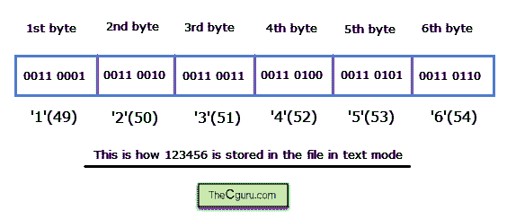
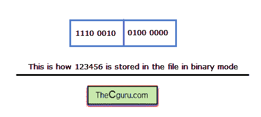

# C 语言文件处理基础

> 原文：<https://overiq.com/c-programming-101/basics-of-file-handling-in-c/>

最后更新于 2020 年 7 月 27 日

* * *

到目前为止，我们创建的所有程序都受到严重限制，因为它们不能读写文件中的数据。大多数真实世界的程序都需要在文件中读写数据。在本章中，我们将学习如何在文件中执行输入和输出操作。c 在头文件 stdio.h 中提供了广泛的函数，用于在文件中读写数据。文本和二进制模式我们可以通过两种方式将数据存储到文件中:

1.  文本模式。
2.  二元模式。

在文本模式下，数据存储为以换行符(' \n ')结尾的一行字符，其中每个字符占用`1`字节。在文本文件中存储`1234`需要`4`字节，每个字符需要`1`字节。在文本模式下需要注意的重要事情是存储在内存中的是字符的二进制等价 ASCII 码。以下是`123456`如何以文本模式存储在文件中。



如您所见，在文本模式下存储`123456`需要 6 个字节。

在二进制模式下，数据存储在磁盘上的方式与存储在计算机内存中的方式相同。因此，以二进制模式存储`123456`只需要`2`字节。在 Linux 系统中，文本模式和二进制模式没有区别。以下是 123456 如何以二进制模式存储在文件中。



因此，通过使用二进制模式，我们可以节省大量磁盘空间。

在文本文件中，每行以一个或两个特殊字符结尾。在 Windows 系统中，每一行都以回车(`'\r'`)结束，后跟换行符(`'\n'`)。另一方面，在 Unix、Linux 和 Mac 操作系统中，每行都以一个换行符(`'\n'`)结尾。

文本文件和二进制文件跟踪文件的长度，也跟踪文件的结尾。但是在文本文件中，还有一种方法可以检测文件的结尾。文本文件可能包含一个特殊的文件结束标记，其 ASCII 值为`26`。当遇到该字符时，所有输入/输出功能停止从文件中读取，并向程序返回文件结束信号。没有输入/输出功能会自动插入该字符。在 Windows 中，可以使用 Ctrl+Z 将该字符插入文件中，需要注意的是，并没有要求 Ctrl+Z 必须存在，但如果存在，则认为是文件的结尾。Ctrl+Z 之后的任何字符都不会被读取。另一方面，基于 Unix 的操作系统具有如此特殊的文件结尾特征。

你需要记住的另一件重要的事情是文本文件是可移植的。这意味着您可以使用 Windows 创建一个文本文件，并在 Linux 系统中打开它，没有任何问题。另一方面，数据类型的大小和字节顺序可能因系统而异，因此二进制文件不可移植。

## 缓冲存储器

与读写存储在内存中的数据相比，读写存储在磁盘中的文件是一个相对较慢的过程。因此，所有标准的输入/输出函数都使用一种叫做缓冲存储器的东西来临时存储数据。

缓冲存储器是一种在数据写入文件之前临时存储数据的存储器。当缓冲存储器已满时，数据被写入(刷新)文件。此外，当文件关闭时，即使缓冲区已满或未满，缓冲存储器中的数据也会自动写入文件。这个过程称为刷新缓冲区。

您不必做任何事情来创建缓冲内存。一旦你打开一个文件，后台会自动为你创建一个缓冲存储器。但是，在一些罕见的情况下，您必须手动刷新缓冲区。如果是这样，您可以调用使用`fflush()`函数，如下所述。

## 打开文件

在对文件执行任何输入/输出(缺少输入/输出)之前，您必须先打开文件。`fopen()`功能用于打开一个文件。

**语法:** `FILE *fopen(const char *filename, const char *mode);`

`filename:`包含文件名的字符串。
`mode:`它指定你想对文件做什么，即读、写、追加。

成功时`fopen()`函数返回一个指向`FILE`类型结构的指针。`FILE`结构在`stdio.h`中定义，包含关于文件的信息，如名称、大小、缓冲区大小、当前位置、文件结尾等。

出错时`fopen()`功能返回`NULL`。

模式的可能值是:

1.  `"w"`(写入)-该模式用于将数据写入文件。如果文件不存在，此模式会创建一个新文件。如果文件已经存在，那么这种模式首先清除文件中的数据，然后再写入任何内容。
2.  `"a"`(追加)-该模式称为追加模式。如果文件不存在，此模式会创建一个新文件。如果文件已经存在，那么这种模式会在文件末尾追加新数据。
3.  `"r"`(读取)-该模式打开文件进行读取。要以这种模式打开文件，文件必须已经存在。无论如何，此模式不会修改中的文件内容。如果您只想读取文件的内容，请使用此模式。
4.  `"w+"`(写+读)-这个模式和`"w"`是一个相同的模式，但是在这个模式下，你也可以读取数据。如果文件不存在，此模式会创建一个新文件。如果该文件已经存在，则在写入新数据之前，会删除以前的数据。
5.  `"r+"`(读+写)-该模式与`"r"`模式相同，但也可以修改文件内容。要以这种模式打开文件，文件必须已经存在。您可以在此模式下修改数据，但文件的先前内容不会被删除。这种模式也称为更新模式。
6.  `"a+"`(追加+读取)-该模式与`"a"`模式相同，但在该模式下，您也可以从文件中读取数据。如果文件不存在，则会创建一个新文件。如果文件已经存在，那么新数据将被附加到文件的末尾。请注意，在这种模式下，您可以追加数据，但不能修改现有数据。

要以二进制模式打开文件，您需要将`"b"`附加到如下模式:

| 方式 | 描述 |
| --- | --- |
| `"wb"` | 以二进制模式打开文件 |
| `"a+b"`或`"ab+"` | 以追加+二进制读取模式打开文件 |

要以文本模式打开文件，您可以将`"t"`附加到该模式。但是由于文本模式是默认模式`"t"`一般省略。

| 方式 | 描述 |
| --- | --- |
| `"w"`或`"wt"` | 以文本模式打开文件进行写入 |
| `"r"`或`"rt"` | 以文本模式打开文件进行阅读。 |

**注意:**模式是一个字符串，所以必须始终用双引号括起来。

```c
fopen("somefile.txt", 'r'); // Error
fopen("somefile.txt", "r"); // Ok

```

如果您想同时打开几个文件，那么它们必须有自己的文件指针变量，该变量是使用对`fopen()`函数的单独调用创建的。

```c
File fp1 = fopen("readme1.txt", 'r');
File fp2 = fopen("readme2.txt", 'r');
File fp3 = fopen("readme3.txt", 'r');

```

这里我们创建了 3 个文件指针，用于读取三个文件。

## 检查错误

如前所述，当打开文件时遇到错误时`fopen()`返回`NULL`。因此，在对文件执行任何操作之前，您必须始终检查错误。

```c
// Checking for errors

File *fp;
fp = fopen("somefile.txt", "r");

if(fp == NULL)
{
    // if error opening the file show error message and exit the program
    printf("Error opening a file");
    exit(1);
}

```

我们也可以给`fopen()`函数取完整的路径名。假设我们要打开位于`/home/downloads/`的文件`list.txt`。以下是如何在`fopen()`中指定路径名。

```c
fp = fopen("/home/downloads/list.txt", "r");

```

需要注意的是，Windows 使用反斜杠字符(`'\'`)作为目录分隔符，但是由于 C 将反斜杠作为转义序列的开始，所以我们不能在字符串内部直接使用`'\'`字符。要解决这个问题，用两个`'\'`代替一个`'\'`。

```c
fp = fopen("C:\home\downloads\list.txt", "r");    // Error
fp = fopen("C:\\home\\downloads\\list.txt", "r"); // ok

```

另一种技术是使用正斜杠(`'/'`)代替反斜杠(`'\'`)。

```c
fp = fopen("C:/home/downloads/list.txt", "r");

```

## 关闭文件

当你处理完一个文件后，你应该立即使用`fclose()`功能关闭它。

**语法:** `int fclose(FILE *fp);`

当一个文件关闭时，与之相关的所有缓冲区都会被刷新，即缓冲区中的数据会被写入文件。

通过`fclose()`关闭文件并不是强制性的，因为程序一结束，所有文件都会立即关闭。但是，最好在处理完文件后立即将其关闭。否则，在大型程序中，您将浪费大量空间给未使用的文件指针。

成功时`fclose()`返回`0`，出错时返回`EOF`，即`stdio.h`中定义的常量文件结束，其值为`-1`。

如果您打开了多个文件，那么您必须像这样分别关闭它们:

```c
fclose(fp1);
fclose(fp2);

```

也可以使用`fcloseall()`功能一次关闭所有打开的文件。

成功时`fcloseall()`返回关闭的文件数，出错时返回`EOF`。

下面是我们如何检查是否所有文件都已关闭。

```c
// check whether all files are closed or not

n = fcloseall();

if(n == EOF)
{
    printf("Error in closing some files \n");
}

else
{
    printf("%d files closed \n", n);
}

```

## 文件结束-电渗流

文件读取功能需要知道文件何时到达末尾。因此，当到达文件结尾时，操作系统向程序发送文件结尾或`EOF`信号以停止读取。当程序收到信号时，文件读取功能停止读取文件并返回`EOF`。如前所述`EOF`是 stdio.h 头文件中定义的常量，数值为`-1`。重要的是要理解`EOF`不是出现在文件末尾的字符，而是在到达文件末尾时由文件读取功能返回。

## 一个 C 语言文件程序的基本工作流程

```c
// Basic workflow of a file program in C

int main()
{
    FILE *fp; // declare file pointer variable
    fp = fopen("somefile.txt", "w"); // fopen() function called

    /*
       do something here
    */

    fclose(fp); // close the file
}

```

* * *

* * *