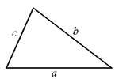

# C 程序：确定三角形的类型和面积

> 原文：<https://overiq.com/c-examples/c-program-to-determine-the-type-and-area-of-a-triangle/>

最后更新于 2020 年 7 月 27 日

* * *

下面是一个确定三角形的类型和面积的 C 程序:

```c
/*****************************************************
 Program to determine the type and area of a triangle
 *****************************************************/

#include<stdio.h> // include stdio.h library
#include<math.h> // include math.h library

int main(void)
{   
    float a, b, c, s, area;

    printf("Enter sides of a triangle: \n");

    printf("a: ");
    scanf("%f", &a);

    printf("b: ");
    scanf("%f", &b);

    printf("c: ");
    scanf("%f", &c);

    // sum of any two sides must be greater than the third side    
    if( (a + b > c) && (b + c > a) && (c + a > b) )
    {
        //  three sides are equal
        if( (a == b) && (b == c) )
        {
            printf("Triangle is equilateral.\n");
        }

        //  two sides are equal
        else if( (a == b) || (b == c) || (a == c) )
        {
            printf("Triangle is isosceles.\n");
        }

        // no sides are equal
        else
        {
            printf("Triangle is scalene.\n");
        }

        //  area of triangle using heron's formula https://en.wikipedia.org/wiki/Heron's_formula

        s = (a + b + c) / 2;  //semi perimeter

        area = sqrt(  s * (s - a) * (s - b) * (s - c) ); // area

        printf("Area of triangle %.2f.", area);

    }

    else
    {
        printf("Sides don't make a triangle.");
    }

    return 0; // return 0 to operating system
}

```

**预期输出:**

第一次运行:

```c
Enter sides of a triangle: 
a: 3
b: 4
c: 5
Triangle is scalene.
Area of triangle 6.00.

```

第二次运行:

```c
Enter sides of a triangle: 
a: 4
b: 5
c: 1
Sides don't make a triangle.

```

## 它是如何工作的

上面的程序使用了两个定理:

*   三角形不等式定理
*   赫伦公式

### 三角形不等式定理

三角形不等式定理指出三角形的两条边之和必须大于第三条边。



让`a`、`b` `c`成为三角形的三条边，然后根据三角形不等式定理:

```c
a + b > c
b + c > a
c + a > b

```

我们还可以利用三角不等式定理来判定给定的三条线段是否可以用来构造三角形。

为了使三条线段形成三角形的边，必须满足所有三个条件。

如果任何一个条件失败了，那么给定的线段就不能用来构建三角形。例如:

例 1:我们能用以下长度构造一个三角形吗:7，3，2？

```c
7 + 3 > 2 => true 
3 + 2 > 7 => false
7 + 2 > 3 => true

```

第二个条件是假的。因此，长度 7、3 和 2 不能构成三角形。

例 2:我们能用以下长度构造一个三角形吗:3，4，5？

```c
3 + 4 > 5 => true  
4 + 5 > 3 => true
5 + 3 > 4 => true

```

三个条件都是真的。因此，长度 3、4、5 可以用来构建三角形。

## 赫伦公式

Heron 公式允许我们利用三条边的长度来找到三角形的面积。

\ begin { collect * }
Area = \ sqrt { s(s-a)(s-b)(s-c)}
\ end { collect * }

其中`s`称为三角形的半周长，计算如下:

\ begin { collect * }
s = \ frac { a+b+c } { 2 }
\ end { collect * }

* * *

* * *