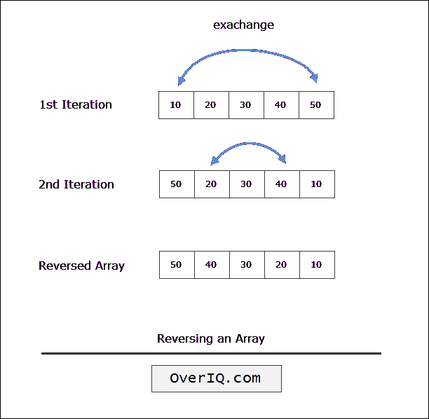

# C 程序：反转数组元素

> 原文：<https://overiq.com/c-examples/c-program-to-reverse-the-elements-of-an-array/>

最后更新于 2020 年 9 月 23 日

* * *

下面是一个反转数组元素的 C 程序:

```c
/**********************************************
 Program to reverse the elements of an array 
 **********************************************/

#include<stdio.h> // include stdio.h library
#define MAX 5

int main(void)
{    
    int arr[MAX] = {10, 20, 30, 40, 50},
            i, j, tmp;

    i = 0;
    j = MAX - 1; // assign the last valid index 

    while(i < j)
    {
        // swap the elements
        tmp = arr[i];
        arr[i] = arr[j];
        arr[j] = tmp; 

        i++;  
        j--;
    }

    //  print the reversed array
    for(int k = 0; k < MAX; k++)
    {
        printf("%d ", arr[k]);
    }

    return 0; // return 0 to operating system
}

```

[现在试试](https://overiq.com/c-online-compiler/O8G/)

**预期输出:**

```c
50 40 30 20 10

```

## 它是如何工作的

为了反转数组的元素，我们用最后一个元素交换数组的第一个元素，用第二个元素交换最后一个元素，以此类推。我们不断重复这个过程，直到到达阵列的一半。

下图展示了运行中的流程:



* * *

* * *