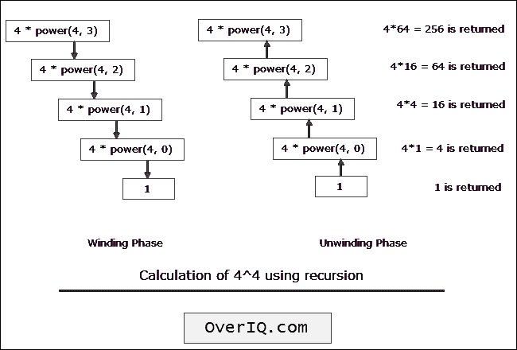

# C 程序：使用递归计算幂

> 原文：<https://overiq.com/c-examples/c-program-to-calculate-the-power-using-recursion/>

最后更新于 2020 年 9 月 24 日

* * *

下面是一个用递归计算幂的 C 程序:

```c
/***************************************************
 Program to calculate the power using recursion 
 * 
 * Enter base: 2
 * Enter exponent: 5
 * 2^5 = 32
 ***************************************************/

#include<stdio.h> // include stdio.h library
int power(int, int);

int main(void)
{    
    int base, exponent;

    printf("Enter base: ");
    scanf("%d", &base);

    printf("Enter exponent: ");
    scanf("%d", &exponent);

    printf("%d^%d = %d", base, exponent, power(base, exponent));

    return 0; // return 0 to operating system
}

int power(int base, int exponent)
{    

    //base condition
    if(exponent == 0)
    {
        return 1;
    }

    else
    {
        // recursive call
        return base * power(base, exponent - 1);
    }

}

```

[现在试试](https://overiq.com/c-online-compiler/3wn/)

**预期输出:**第一次运行:

```c
Enter base: 2
Enter exponent: 0
2^0 = 1

```

第二次运行:

```c
Enter base: 4
Enter exponent: 4
4^4 = 256

```

## 它是如何工作的

下图显示了\(4^4\的递归计算是如何进行的。



* * *

**推荐阅读:**

*   [C 中的递归函数](/c-programming-101/recursive-function-in-c/)
*   [使用递归计算阶乘的 C 程序](/c-examples/c-program-to-calculate-factorial-using-recursion/)

* * *

* * *