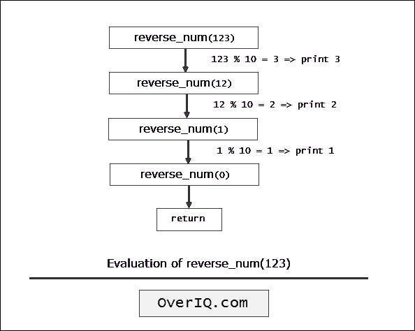

# C 程序：使用递归反转数字

> 原文：<https://overiq.com/c-examples/c-program-to-reverse-the-digits-of-a-number-using-recursion/>

最后更新于 2020 年 9 月 24 日

* * *

下面是一个使用递归反转数字的 C 程序:

```c
/**********************************************************
 Program to reverse the digits of a number using recursion 
 * 
 * Enter a number: 4321
 * 1234
 **********************************************************/

#include<stdio.h> // include stdio.h library
void reverse_num(int num);

int main(void)
{    
    int num;

    printf("Enter a number: ");
    scanf("%d", &num);       

    reverse_num(num);

    return 0; // return 0 to operating system
}

void reverse_num(int num)
{    
    int rem;

    // base condition
    if (num == 0)
    {
        return;
    }

    else
    {
        rem = num % 10; // get the rightmost digit
        printf("%d", rem);
        reverse_num(num/10);  // recursive call
    }

}

```

[现在试试](https://overiq.com/c-online-compiler/4L0/)

**预期输出:**第一次运行:

```c
Enter a number: 12345
54321

```

第二次运行:

```c
Enter a number: 1331 
1331

```

## 它是如何工作的

下图显示了`reverse_num(123)`的评估是如何进行的:



* * *

**推荐阅读:**

*   [C 中的递归函数](/c-programming-101/recursive-function-in-c/)
*   [使用递归计算功率的 C 程序](/c-examples/c-program-to-calculate-the-power-using-recursion/)
*   [使用递归计算阶乘的 C 程序](/c-examples/c-program-to-calculate-factorial-using-recursion/)
*   [使用递归打印斐波那契序列的 C 程序](/c-examples/c-program-to-print-fibonacci-sequence-using-recursion/)

* * *

* * *