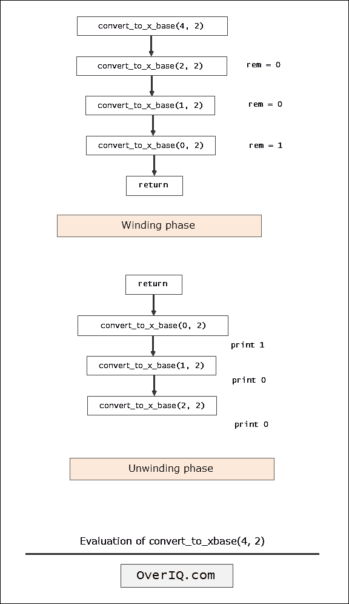

# C 程序：使用递归将十进制数转换成二进制、八进制和十六进制

> 原文：<https://overiq.com/c-examples/c-program-to-convert-a-decimal-number-to-binary-octal-and-hexadecimal-using-recursion/>

最后更新于 2020 年 9 月 24 日

* * *

下面是一个使用递归将十进制数转换为二进制、八进制和十六进制的 C 程序:

```c
/**********************************************************
 Program to convert a decimal number to binary, 
 octal and hexadecimal using recursion 
 * 
 * Select conversion: 

 * 1\. Decimal to binary. 
 * 2\. Decimal to octal. 
 * 3\. Decimal to hexadecimal. 
 * 4\. Exit. 

 * Enter your choice: 1
 * Enter a number: 4
 * Result = 100
 **********************************************************/

#include<stdio.h> // include stdio.h library
void convert_to_x_base(int, int);

int main(void)
{
    int num, choice, base;

    while(1)
    {
        printf("Select conversion: \n\n");
        printf("1\. Decimal to binary. \n");
        printf("2\. Decimal to octal. \n");
        printf("3\. Decimal to hexadecimal. \n");              
        printf("4\. Exit. \n");

        printf("\nEnter your choice: ");
        scanf("%d", &choice);

        switch(choice)
        {
            case 1:
                base = 2;
                break;
            case 2:
                base = 8;
                break;              
            case 3:
                base = 16;
                break;
            case 4:
                printf("Exiting ...");
                exit(1);
            default:
                printf("Invalid choice.\n\n");
                continue;
        }

        printf("Enter a number: ");
        scanf("%d", &num);

        printf("Result = ");

        convert_to_x_base(num, base);

        printf("\n\n");
    }        

    return 0; // return 0 to operating system
}

void convert_to_x_base(int num, int base)
{    
    int rem;

    // base condition
    if (num == 0)
    {
        return;
    }

    else
    {
        rem = num % base; // get the rightmost digit        
        convert_to_x_base(num/base, base);  // recursive call        
        if(base == 16 && rem >= 10)
        {
            printf("%c", rem+55);
        }

        else
        {
            printf("%d", rem);
        }
    }

}

```

[现在试试](https://overiq.com/c-online-compiler/5LZ/)

**预期输出:**

```c
Select conversion:

1\. Decimal to binary. 
2\. Decimal to octal. 
3\. Decimal to hexadecimal. 
4\. Exit.

Enter your choice: 1
Enter a number: 7
Result = 111

Select conversion:

1\. Decimal to binary. 
2\. Decimal to octal. 
3\. Decimal to hexadecimal. 
4\. Exit.

Enter your choice: 2
Enter a number: 25
Result = 31

Select conversion:

1\. Decimal to binary. 
2\. Decimal to octal. 
3\. Decimal to hexadecimal. 
4\. Exit.

Enter your choice: 4
Exiting ...

```

## 它是如何工作的

下图显示了`convert_to_x_base(4, 2)`的评估是如何进行的:



* * *

**推荐阅读:**

*   [将十进制数转换为二进制数的 C 程序](/c-examples/c-program-to-convert-a-decimal-number-to-a-binary-number/)
*   [将十进制数转换为八进制数的 C 程序](/c-examples/c-program-to-convert-a-decimal-number-to-an-octal-number/)
*   [将十进制数转换为十六进制数的 C 程序](/c-examples/c-program-to-convert-a-decimal-number-to-a-hexadecimal-number/)
*   [C 中的递归函数](/c-programming-101/recursive-function-in-c/)
*   [使用递归计算阶乘的 C 程序](/c-examples/c-program-to-calculate-factorial-using-recursion/)

* * *

* * *