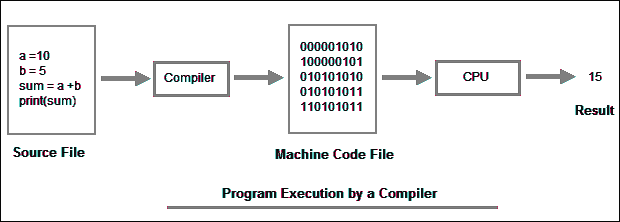
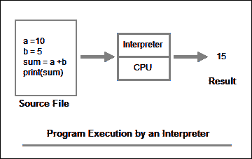

# Python 入门

> 原文：<https://overiq.com/python-101/intro-to-python/>

最后更新于 2020 年 9 月 6 日

* * *

Python 是由 Guido Van Rossum 创建的高级通用编程语言。它于 1991 年公开发行。所谓高级，我们指的是一种对程序员隐藏细节的语言。此外，它还用来指人类容易理解的计算机语言。Python 以其简单性和可读性而闻名。

## Python 的特性

## Python 很简单

Python 是最容易上手的语言之一。用 Python 编写的程序看起来非常像英语。由于其简单性，大多数入门级编程课程都使用 Python 向学生介绍编程概念。

## Python 是可移植的/独立于平台的

Python 是可移植的，这意味着我们可以在各种不同的操作系统中运行 Python 程序，而无需任何更改。

## Python 是一种解释语言

Python 是一种解释语言。像 C、C++这样的语言是编译语言的例子。

用高级语言编写的程序称为源代码或源程序，源代码中的命令称为语句。一台计算机不能执行用高级语言编写的程序，它只能理解仅由 0 和 1 组成的机器语言。

有两种类型的程序可供我们将高级语言翻译成机器语言:

1.  编译程序
2.  解释者

### 编译程序

编译器一次将整个源代码翻译成机器语言，然后执行机器语言。



### 解释者

另一方面，解释器将高级语言逐行翻译成机器语言，然后执行。Python 解释器从文件顶部开始，将第一行翻译成机器语言，然后执行。这个过程一直重复，直到文件结束。



像 C、C++这样的编译语言使用编译器将高级代码翻译成机器语言，而像 Python 这样的解释语言使用解释器将高级代码翻译成机器语言。

编译语言和解释语言的另一个重要区别是，编译语言的性能略好于使用解释语言编写的程序。然而，我确实想指出编译语言的这种优势正在慢慢消失。

## Python 是强类型的

强类型语言不会自动将数据从一种类型转换为另一种类型。像 JavaScript 和 PHP 这样的语言被称为松散类型语言，因为它们可以自由地将数据从一种类型转换为另一种类型。考虑以下 JavaScript 代码:

```py
price = 12
str = "The total price = " + 12
console.log(str)

```

**输出:**

```py
The total price = 12
```

在这种情况下，在将`12`添加到字符串之前；JavaScript 首先将数字`12`转换为字符串`"12"`，然后将其附加到字符串的末尾。

然而，在 Python 中，像`str = "The total price = " + 12`这样的语句会产生错误，因为 Python 不会自动将数字`12`转换为字符串。

[现在试试](https://overiq.com/python-online-compiler/k5/)

## 一大套图书馆

Python 有大量的库，这使得添加新功能变得容易，而无需重新发明轮子。我们可以在 https://pypi.python.org/pypi 访问这些图书馆。

下面是我从初级 Python 程序员那里听到的两个常见问题。

## 我可以使用 Python 创建什么类型的应用？

我们可以使用 Python 创建以下类型的应用:

1.  Web 应用
2.  安卓应用
3.  图形用户界面应用
4.  比赛
5.  科学应用
6.  系统管理应用
7.  控制台应用

名单还在继续...

## 谁用 Python？

以下是使用 Python 的知名公司的小列表:

1.  收纳盒
2.  唱片公司
3.  Reddit
4.  Quora
5.  浏览器名
6.  谷歌
7.  油管（国外视频网站）

我想这足以让你印象深刻。

在下一课中，我们将学习如何安装 Python。

**注:**本教程源代码可在[https://github.com/overiq/intro-to-python](https://github.com/overiq/intro-to-python)获得。

* * *

* * *