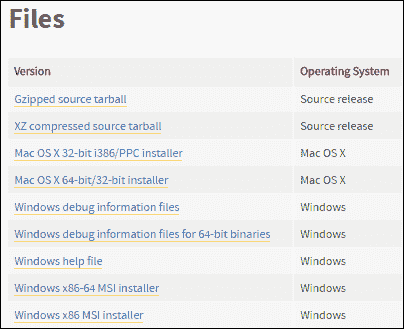
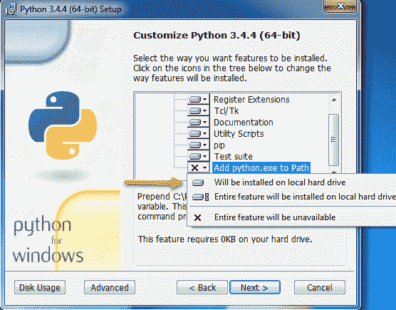
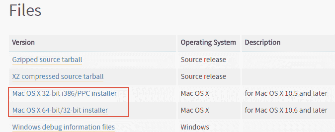

# 安装 Python

> 原文：<https://overiq.com/python-101/installing-python/>

最后更新于 2020 年 7 月 27 日

* * *

本课将指导您完成在 Windows、Ubuntu 和 Mac OS 中安装 Python 的过程。虽然整个教程是面向 Python 3.4 的，但是如果您选择使用高于 3.4 的 Python，那就完全没问题了。只是不要用 Python 2。

## 在 Windows 上安装 Python

要在 Windows 中安装 Python，请前往[https://www.python.org/downloads/release/python-344/](https://www.python.org/downloads/release/python-344/)，向下滚动页面，直到看到“文件”标题。在那里你可以找到不同版本的 Python，你可以下载。



如果您使用的是 32 位版本的 Windows，请下载 Windows x86 安装程序，如果您使用的是 64 位版本的 Windows，请下载 Windows x86-64 安装程序。请注意，Windows x86 安装程序将在 32 位和 64 位上工作。

下载安装程序后，双击它开始安装过程。安装非常简单，只需接受所有默认值。安装过程中唯一关键的一步是当您被要求定制 Python 安装时。



当此窗口出现时，使用滚动条向下滚动列表。在最后一项，即“将 python.exe 添加到路径”前面，使用下拉菜单选择“将安装在本地硬盘上”。该选项允许我们从命令提示符下的任何工作目录调用`python.exe`，而无需指定其完整路径。

要验证安装，请打开命令提示符并输入以下命令。

```py
C:\Users\Q>python --version
Python 3.4.4
C:\Users\Q>

```

## 在 Ubuntu 中安装 Python

像大多数 Linux 发行版一样，Ubuntu 预装了 Python。事实上，现在的一些 Linux 发行版默认安装了 Python 2 和 Python 3。要测试机器上的 Python 版本，请执行以下命令。

```py
q@vm:~$ python3 --version
Python 3.5.2
q@vm:~$

```

如您所见，我的 Ubuntu 安装有 Python 3.5，这意味着我可以开始了。但是，如果您得到如下输出:

```py
q@vm:~$ python3 --version
python3: command not found

```

这意味着您的计算机上没有安装 Python 3。要安装 Python 3.4，请在终端中逐一执行以下命令。

```py
q@vm:~$: sudo add-apt-repository ppa:fkrull/deadsnakes
q@vm:~$: sudo apt-get update
q@vm:~$: sudo apt-get install python3.4

```

执行完这些命令后，再次运行`python3 --version`。这次您应该会得到以下输出:

```py
q@vm:~$ python3 --version
Python 3.4.5
q@vm:~$

```

## 在苹果电脑上安装 Python

大多数苹果电脑已经安装了 Python 2。要在 Mac 上安装 Python 3.4，请访问[https://www.python.org/downloads/release/python-344/]( https://www.python.org/downloads/release/python-344/)并向下滚动到“文件”标题下的底部，选择与您的 Mac OS 版本相对应的安装程序。



如果您使用的是 Mac OS X 32 位系统，请下载 Mac OS X 32 位 i386/PPC 安装程序，如果您使用的是 Mac OS X 64 位，请下载 Mac OS X 64 位/32 位安装程序。在 64 位系统上，两个安装程序都可以工作。

双击下载的文件开始安装过程，并接受所有默认值。与 Windows 不同的是，Macs 的 Python 安装程序会自动将`python`添加到 PATH 环境变量中，因此您不需要做任何事情。要验证安装，请执行以下命令。

```py
Qs-Mac:~ q$ python3 --version
Python 3.4.4
Qs-Mac:~ q$

```

* * *

* * *