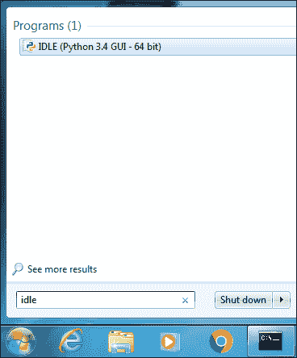
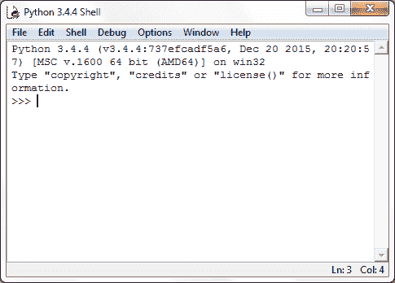
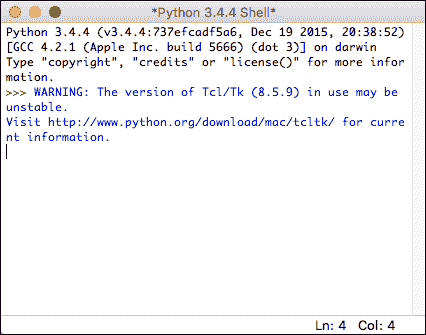
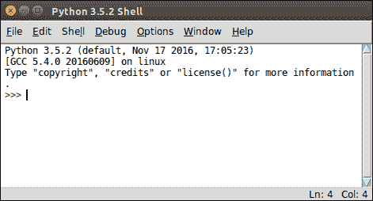
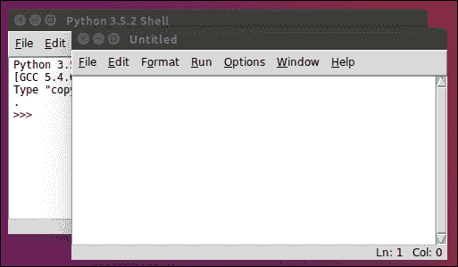
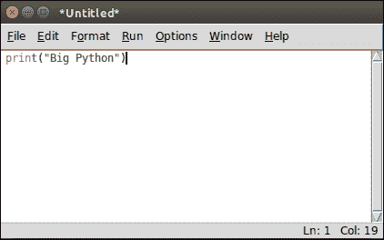
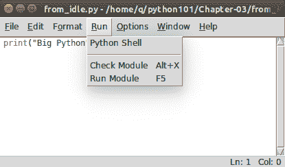
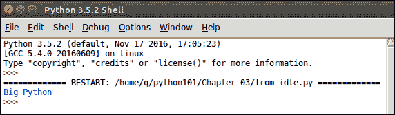

# IDLE 和 Python Shell

> 原文：<https://overiq.com/python-101/idle-and-python-shell/>

最后更新于 2020 年 9 月 6 日

* * *

在本课程中，我们将使用 Python 3.4，但是如果您选择使用 Python 3.4 或更高版本，那就没问题了。

在最后一章，我们已经安装了 Python 解释器。解释器是一个把你的代码翻译成机器语言，然后一行一行执行的程序。

我们可以在两种模式下使用 Python 解释器:

1.  互动模式。
2.  脚本模式。

在交互模式下，Python 解释器等待您输入命令。当您键入命令时，Python 解释器会继续执行该命令，然后它会再次等待您的下一个命令。

在脚本模式下，Python 解释器从源文件运行程序。

## 对话方式

交互模式下的 Python 解释器俗称 Python Shell。要启动 Python Shell，请在终端或命令提示符下输入以下命令:

```py
C:\Users\Q>python
Python 3.4.4 (v3.4.4:737efcadf5a6, Dec 20 2015, 20:20:57) [MSC v.1600 64 bit (AM
D64)] on win32
Type "help", "copyright", "credits" or "license" for more information.
>>>

```

例如，如果您的系统同时安装了 Python 2 和 Python 3，Ubuntu 默认情况下会安装 Python 2 和 3。要启动 Python 3 Shell，请输入`python3`而不仅仅是`python`。

```py
q@vm:~$ python3
Python 3.5.2 (default, Nov 17 2016, 17:05:23) 
[GCC 5.4.0 20160609] on linux
Type "help", "copyright", "credits" or "license" for more information.
>>>

```

你现在看到的叫做 Python Shell。`>>>`被称为提示字符串，它只是意味着 Python shell 已经准备好接受你的命令了。Python shell 允许您键入 Python 代码，并立即看到结果。在技术术语中，这也被称为 REPL，是读-评估-打印-循环的缩写。每当你听到 REPL 的话，你就会想到一个环境，它可以让你快速测试代码片段，并立即看到结果，就像一个计算器一样。在 Python shell 中，逐个输入以下计算，然后按 enter 键即可获得结果。

```py
>>>
>>> 88 + 4
92
>>>
>>> 45 * 4
180
>>>
>>> 17 / 3
5.666666666666667
>>>
>>> 78 - 42
36
>>>

```

在 Python 中，我们使用`print()`函数在屏幕上打印一些东西。

在 Python shell 中键入`print("Big Python")`并点击回车:

```py
>>>
>>> print("Big Python")
Big Python
>>>

```

[现在试试](https://overiq.com/python-online-compiler/l5/)

我们刚刚使用了两个重要的编程构造——一个函数和一个字符串。

1.  `print()`是一个函数——编程中的函数是一堆代码，做一些非常具体的事情。在我们的例子中，`print()`函数打印它被给予控制台的参数(即`"Big Python"`)。

2.  字符串只是括在单引号或双引号内的一系列字符串。例如:`"olleh"`、`'print it'`是弦而`1`、`3`不是。

别担心，我们不指望你在这一点上理解这些事情。在接下来的课程中，我们将详细讨论这些概念。

像`17 / 3`、`print("Big Python")`这样的命令在编程中被称为语句。语句只是 Python 解释器要执行的指令。正如我们将看到的，语句有不同的类型。程序通常由一系列语句组成。

要退出 Windows 中的 Python shell，请按 Ctrl+Z 后按回车键，在 Linux 或 Mac 上，请按 Ctrl+D 后按回车键。

## 脚本模式

Python shell 非常适合测试小块代码，但是有一个问题——您在 Python Shell 中输入的语句不会保存在任何地方。

如果您想多次执行同一组语句，最好将整个代码保存在一个文件中。然后，在脚本模式下使用 Python 解释器执行文件中的代码。

创建一个名为`python101`的新目录，你可以在任何你想创建的地方创建这个目录，只要记住位置就可以了，因为我们会用这个目录来存储我们整个课程的所有程序。在`python101`内创建另一个名为`Chapter-03`的目录来存储本章的源文件。

要创建可以使用任何文本编辑器的程序，只需确保将文件保存为纯文本即可。然而，如果你拼命寻找推荐，去崇高的文本。

在`Chapter-03`目录中创建一个名为`hello.py`的新文件，并添加以下代码:

**蟒蛇 101/章-03/hello.py**

```py
print("Woods are lovely dark and deep")
print("but I have promises to keep")
print("and miles to go before I sleep")

```

[现在试试](https://overiq.com/python-online-compiler/mO/)

按照惯例，所有 Python 程序都有`.py`扩展名。文件`hello.py`称为源代码或源文件或脚本文件或模块。要执行程序，打开终端或命令提示符，使用`cd`命令将当前工作目录更改为`python101`，然后键入以下命令:

```py
Woods are lovely dark and deep
but I have promises to keep
and miles to go before I sleep

```

**注意**:在 Windows 上使用`python hello.py`执行程序。

该命令以脚本模式启动 Python 解释器，并执行`hello.py`文件中的语句。

我们知道，在 Python Shell 中，如果您键入任何表达式并按 enter 键，Python 解释器会计算该表达式并显示结果。

```py
>>>
>>> 12+8
20
>>> 75/2
37.5
>>> 100*2
200
>>> 100-24
76
>>>

```

但是，如果您在文件中键入这些语句并运行该文件，您将根本得不到任何输出。在`Chapter-03`目录中创建新的名为`no_output.py`的文件，并向其中添加以下代码。

**蟒蛇 101/第-03 章/no_output.py**

```py
12+8
75/2
100*2
100-24

```

[现在试试](https://overiq.com/python-online-compiler/nR/)

要运行文件，请输入以下命令。

```py
q@vm:~/python101/Chapter-03$ python3 no_output.py
q@vm:~/python101/Chapter-03$

```

如您所见，程序没有输出任何内容。

要从 Python 脚本打印值，您必须显式使用`print()`函数。用以下代码创建一个名为`no_output2.py`的新文件:

**蟒蛇 101/章-03/no_output2.py**

```py
print(12+8)
print(75/2)
print(100*2)
print(100-24)

```

**输出:**

```py
20
37.5
200
76

```

[现在试试](https://overiq.com/python-online-compiler/oj/)

## 闲置的

除了安装 Python 解释器，Mac 和 Windows 的 Python 安装程序还安装了一个轻量级的集成开发环境，简称 IDLE。

那么什么是 IDLE？

IDLE 允许在同一屋檐下创建/读取/编辑和执行您的程序，而无需接触命令行。也可以从 IDLE 访问 Python Shell。

要在 Windows 上启动 IDLE，请单击开始菜单并搜索“IDLE”或“IDLE”。如图所示，单击 IDLE，您将看到一个类似如下的窗口:





这还是 Python Shell，只需键入命令，按 enter 键，它就会显示结果。

```py
>>>
>>> print("Big Python")
Big Python
>>>
>>> 12 + 774
786
>>> 89 * 321
28569
>>>

```

要在 Mac 上启动 IDLE，只需在终端中键入`idle3`。



Ubuntu 没有安装 IDLE。无论您使用的是 Ubuntu 预装的 Python，还是您自己通过在课程[安装 Python](https://overiq.com/python-101/installing-python/#installing-python-in-ubuntu) 中输入命令安装的 Python，都是如此。

要安装 IDLE，在终端中发出以下命令。

```py
q@vm:~/python101/Chapter-03$ sudo apt-get install idle3

```

要启动 IDLE，输入`idle3`并在终端中输入:

```py
q@vm:~/python101/Chapter-03$ idle3

```



现在让我们使用 IDLE 创建一个 Python 程序。IDLE 还有一个内置的文本编辑器来编写 Python 程序。要创建新程序，请转到文件>新建文件。将会打开一个新的无标题窗口。该窗口是一个文本编辑器，您可以在其中编写程序。



在编辑器中键入以下代码:

```py
print("Big Python")

```



点击 Ctrl + S 或转到文件>另存为。将文件保存为`Chapter-03`目录中的`from_idle.py`。要运行程序，请转到运行>运行模块或点击 F5。



您的编辑器窗口将移动到后台，Python Shell 将变为活动状态，您将看到您的`from_idle.py`程序的输出，如下所示:



## 错误的类型

在编程中错误是不可避免的，迟早你会遇到一个。编程错误主要分为三种类型:

1.  语法错误。
2.  运行时错误。
3.  逻辑错误。

### 句法误差

语法是正确编写计算机语言的一套规则。如果不遵守语法规则，就会出现语法错误。它们通常出现在你的代码中，是因为一个错别字。当程序中遇到语法错误时，程序的执行会暂停，Python 解释器会显示一条错误消息，解释错误的可能原因。当语句被翻译成机器语言时，但在执行之前，会出现语法错误。名为 parser 的解释器组件发现了这些错误。

以下是语法错误的一些常见原因:

1.  拼错的关键字。
2.  操作员使用不正确。
3.  在函数调用中省略括号。
4.  不要用单引号或双引号将字符串括起来。

等等。

以下 Python Shell 会话演示了一些语法错误:

**例 1:**

```py
>>>
>>> 4 +
  File "<stdin>", line 1
    4 +
       ^
SyntaxError: invalid syntax
>>>

```

[现在试试](https://overiq.com/python-online-compiler/p2/)

在上面的例子中，我们试图添加两个数字，但是我们忘记了包括第二个数字。这就是 Python 解释器报告`SyntaxError`的原因。另外，请注意插入符号(`^`)指向 Python 解释器认为是问题原因的位置。

**例 2:**

```py
>>>
>>> print("Big Python)
  File "<stdin>", line 1
    print("Big Python)
                     ^
SyntaxError: EOL while scanning string literal
>>>

```

[现在试试](https://overiq.com/python-online-compiler/q2/)

在这种情况下，我们忘记了用双引号结束字符串，这就是在遇到语法错误的原因。再次注意，插入符号指向 Python 解释器认为是问题原因的位置。

修复语法错误相当容易，你只需要训练你的眼睛去寻找插入符号(`^`)。

### 运行时错误

顾名思义，运行时错误是程序运行时发生的错误。就像语法错误一样，当遇到语法错误时，程序的执行会暂停，解释器会显示一条关于问题可能原因的消息。

它们通常发生在解释器处理无法执行的操作时。一个这样的操作是将一个数除以`0`。因为用`0`除一个数是没有定义的。当解释器遇到被`0`操作除的情况时，它会如下提升`ZeroDivisionError`:

```py
>>>
>>> 99/0
Traceback (most recent call last):
  File "<stdin>", line 1, in <module>
ZeroDivisionError: division by zero
>>>

```

以下是运行时错误的一些其他常见原因:

1.  当您尝试创建新变量时，系统内存不足，可能会出现运行时错误。
2.  试图使用尚未定义的函数或变量。
3.  访问不存在的文件。

等等。

### 逻辑错误

当程序产生不正确的结果时，就会出现逻辑错误。例如，假设我们正在创建一个简单的程序，将温度从华氏温度转换为摄氏温度，如下所示:

**蟒蛇 101/章节-03/fah_to_cel.py**

```py
print("20 degree Fahrenheit in degree Celsius is: ")
print(5 / 9 * 20 - 32)

```

**输出:**

```py
20 degree Fahrenheit in degree Celsius is: 
-20.88888888888889

```

[现在试试](https://overiq.com/python-online-compiler/rE/)

以上程序输出`-20.88888888888889`，有误。正确的数值是`-6.666`。这些类型的错误被称为逻辑错误。要获得正确答案，请使用`5 / 9 * (20 - 32)`代替`5 / 9 * 20 - 32`。`20 - 32`周围的括号强制 Python 在除法和乘法之前执行减法。我们将在 Python 中的[运算符](https://overiq.com/python-101/operators-in-python/)一课中了解这样做的原因。

* * *

* * *