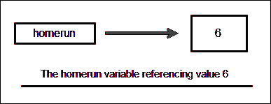
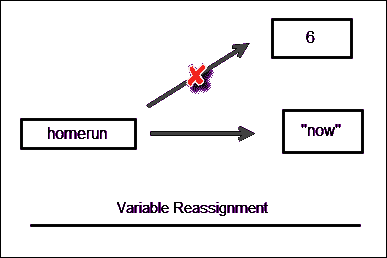
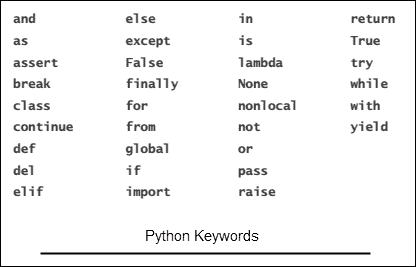

# Python 中的数据类型和变量

> 原文：<https://overiq.com/python-101/data-types-and-variables-in-python/>

最后更新于 2020 年 9 月 6 日

* * *

## 数据类型

数据类型只不过是不同类型数据的分类。数据类型定义了一组值以及可以对这些值执行的操作。我们在程序中使用的显式值被称为字面量。例如，`10`、`88.22`、`'pypi'`称为文字。每个文字都有一个关联的类型。例如`10`为`int`型，`88.22`为`float`型，`'pypi'`为`str`型(或弦)。文字的类型决定了可以对其执行哪些类型的操作。下表显示了 Python 中的一些基本数据类型以及示例:

| 数据类型 | 在 Python 中，我们称之为 | 例子 |
| --- | --- | --- |
| 整数 | `int` | `12`、`-999`、`0`、`900000`等 |
| 实数 | `float` | `4.5`、`0.0003`、`-90.5`、`3.0`；等等 |
| 特性 | `str` | `'hello'`、`"100"`、`"$$$"`、`""`；等等 |

Python 有一个名为`type()`的内置函数，我们可以用它来确定文字的数据类型。

```py
>>>
>>> type(54)
<class 'int'>
>>>
>>> type("a string")
<class 'str'>
>>>
>>> type(98.188)
<class 'float'>
>>>
>>> type("3.14")
<class 'str'>
>>>
>>> type("99")
<class 'str'>
>>>

```

[现在试试](https://overiq.com/python-online-compiler/jR/)

`<class 'int'>`表示`54`的类型为`int`。同样，`<class 'str'>`、`<class 'float'>`表示`"a string"`、`98.188`分别为`str`、`float`型。

一开始，你可能会认为`"3.14"`是`float`类型，但是因为`3.14`是用双引号括起来的，所以它实际上是一个字符串。出于同样的原因`"99"`也是一根弦。

Python 还有许多其他数据类型，我们将在后面讨论。

## 变量

变量用于在我们的程序中存储数据。我们还使用变量来访问数据和操作数据。变量之所以这样叫，是因为它的值可以改变。

## 创建变量

为了在 Python 中创建一个变量，我们使用赋值语句，其格式如下。

```py
variable_name = expression

```

[现在试试](https://overiq.com/python-online-compiler/vm/)

`variable_name`是变量的名称，(`=`)被称为赋值运算符，`expression`只是值、变量和运算符的组合。这里有一个例子:

```py
homerun = 6

```

该语句创建一个名为`homerun`的变量，并为其赋值`6`。当 Python 解释器遇到这样的语句时，它会在幕后做以下事情。

1.  将变量`6`存储在内存的某个地方。
2.  使变量`homerun`参考它。

这里需要理解的重要一点是，变量`homerun`本身并不包含任何值，它只是指一个包含实际值的内存位置。



与 C、C++和 Java 等语言不同，在 Python 中，我们不会提前声明变量的类型。事实上，如果您尝试这样做，它是一个语法错误。

```py
>>>
>>> int homerun
  File "<stdin>", line 1
    int homerun
              ^
SyntaxError: invalid syntax
>>>

```

为变量赋值时，始终将变量名写在赋值(`=`)运算符的左侧。如果不这样做，您将得到如下语法错误:

```py
>>>
>>> 100 = words
  File "<stdin>", line 1
SyntaxError: can't assign to literal
>>>

```

Python 会根据变量包含的值的类型自动检测变量的类型以及可以对其执行的操作。在编程术语中，这种行为被称为动态类型。这意味着我们可以使用同一个变量来引用与它最初指向的完全不同类型的数据。例如:

```py
>>>
>>> homerun = 6  # at this point, homerun contains an int or integer
>>> homerun
6
>>> homerun = "now"  # now homerun contains a string 
>>> homerun
'now'
>>>
>>> type(homerun)
<class 'str'>
>>>
>>> homerun =  2.3   # now homerun contains a float
>>> homerun
2.3
>>> type(homerun)
<class 'float'>
>>>

```

[现在试试](https://overiq.com/python-online-compiler/wR/)

当我们给一个变量赋值时，对旧值的引用就会丢失。例如，当`"now"`被分配给`homerun`时，对值`6`的引用丢失。此时，没有任何变量指向该内存位置。当这种情况发生时，Python 解释器会通过一个称为垃圾收集的过程自动从内存中移除该值。



如果在给变量赋值之前试图访问它。你会得到这样的`NameError`错误:

```py
>>>
>>> age
Traceback (most recent call last):
  File "<stdin>", line 1, in <module>
NameError: name 'age' is not defined
>>>

```

我们也可以使用`print()`函数来打印一个变量值，如下所示:

```py
>>>
>>> age = 100
>>> print(age)
100
>>>

```

## 变量名

在 Python 中，我们有以下规则来创建有效的变量名。

1.  只允许使用字母(`a-z`、`A-Z`)、下划线(`_`)和数字(`0-9`)来创建变量名，其他不允许。

2.  它必须以下划线(`_`)或字母开头。

3.  您不能使用保留关键字来创建变量名称。(见下文)。

4.  变量名可以是任意长度。

Python 是区分大小写的语言，这意味着`HOME`和`home`是两个不同的变量。

## Python 关键字

Python 关键字是在 Python 语言中表示特定事物的单词。这就是为什么，我们不允许使用它们作为变量名称。下面是 Python 关键字的列表:



随着本课程的进行，我们将进一步了解这里提到的一些关键字。

以下是一些有效和无效的变量名:

`home4you` -有效
`after_you` -有效
`_thatsall` -有效
`all10` -有效
`python_101` -有效

`$money` -无效，变量不能以`$`字符
`hello pi`开头-无效，变量之间不能有空格
`2001` -无效，变量不能以数字
`break`开头-无效，关键字不能是变量名

## 评论

注释用于给程序添加注释。在大型程序中，注释可能描述程序的目的及其工作方式。它们只针对那些试图理解程序源代码的人。它们不是编程语句，因此在执行程序时会被 Python 解释器忽略。

在 Python 中，从`#`到行尾的所有内容都被视为注释。例如:

```py
# This is a comment on a separate line
print("Testing comments")  # This is a comment after print statement

```

[现在试试](https://overiq.com/python-online-compiler/x9/)

## 命名常量

常量是在程序生命周期内其值不变的变量。不像 C 或 Java 这样的语言；Python 没有创建常量的特殊语法。我们像普通变量一样创建常量。但是，为了将它们与普通变量分开，我们使用了所有大写字母。

```py
>>>
>>> MY_CONST = 100   # a constant
>>>

```

[现在试试](https://overiq.com/python-online-compiler/y7/)

注意`MY_CONST`只是一个变量，指的是`int`类型的值。它没有其他特殊属性。

您甚至可以通过给`MY_CONST`常量赋值来改变它的值，如下所示:

```py
>>>
>>> MY_CONST = "new value"
>>>

```

我们将在程序中不时使用命名常量。

## 使用打印()功能显示多个项目

我们也可以使用`print()`语句，通过用逗号(`,`)分隔每个项目，在一次调用中打印多个项目。当多个参数被传递到`print()`函数时，它们被打印到控制台，用空格隔开。例如:

```py
>>>
>>> message = "item2"
>>> print("item1", message, "item3")
item1 item2 item3
>>>

```

[现在试试](https://overiq.com/python-online-compiler/zY/)

## 同时分配

我们可以使用具有以下语法的同时赋值来同时为多个变量赋值:

```py
var1, var2, var3, ...  varN = exp1, exp2, exp3, ... expN

```

当 Python 遇到同时赋值语句时，它首先计算右侧的所有表达式，然后将它们的值赋给左侧相应的变量。例如:

```py
>>>
>>> name, age, designation = "tom", 25, "Lead Developer"
>>>
>>> name
'tom'
>>>
>>> age
25
>>>
>>> designation
'Lead Developer'
>>>
>>>

```

[现在试试](https://overiq.com/python-online-compiler/AO/)

在两个变量之间交换值是一种常见的编程操作。在像 C 这样的语言中，要执行交换，你必须创建一个额外的变量来临时存储数据。例如:

```py
int i = 10, j = 20;
int tmp;  // variable to store data temporary 
tmp = i;  // now tmp contains 10
i = j;  // now i contains 20
j = tmp;  // now j contains 10

```

在 Python 中，我们可以使用同时赋值来交换值，如下所示:

```py
>>>
>>> x, y = 10, 20   
>>> print(x, y)   
10 20   # initial value
>>>
>>> x, y = y, x   ## swapping values
>>> print(x, y)
20 10   # final value
>>>

```

[现在试试](https://overiq.com/python-online-compiler/BX/)

## Python 中的函数

函数是一段代码，它执行一些非常具体的任务。在这一点上，我们只讨论了`print()`和`type()`函数，但是 Python 标准库实际上有成千上万个执行各种操作的内置函数。

一个函数不能自己做任何事情，除非你调用它。要调用一个函数，请在括号内键入该函数的名称，后跟参数列表，即`()`，如下所示:

```py
function_name(arg1, arg2, arg3, arg4, ..., argN)

```

那么什么是论点呢？

参数是函数执行任务所需的附加数据。有些函数需要参数，有些则不需要。要调用不接受任何参数的函数，请键入函数名，后跟空括号，如下所示:

```py
function_name()

```

参数通常也称为参数。

在语句中，`print("Big Python")`、`"Big Python"`是一个自变量。

当一个函数完成它的任务时，它通常会返回值。并非所有函数都返回值，有些函数返回值，而有些函数不返回值。如果一个函数没有显式返回任何值，那么它会返回一个名为`None`的特殊值，这是 Python 中保留的关键字之一。这就是你现在需要知道的。我们将在第[课中详细讨论 Python 中的函数](/python-101/functions-in-python/)。

## Python 中的模块

Python 使用模块对相似的函数、类、变量等进行分组。例如，`math`模块包含各种数学函数和常量，`datetime`模块包含各种处理日期和时间等的类和函数。要使用模块中定义的函数、常量或类，我们首先必须使用`import`语句导入它。`import`语句的语法如下:

```py
import module_name

```

要在 Python Shell 中导入`math`模块，请键入以下代码:

```py
>>>
>>> import math
>>>

```

要使用模块类型中的方法或常量，模块名称后跟点(`.`)运算符，运算符后跟要访问的方法或变量的名称。例如，`math`模块有`sqrt()`函数，它的任务是返回一个数的平方根。要使用此函数，请在 Python shell 中键入以下代码。

```py
>>>
>>> math.sqrt(441)
21.0
>>>

```

`math`模块还有两个常用的数学常量`pi`和`e`。要访问它们，请键入以下代码:

```py
>>>
>>> math.pi
3.141592653589793
>>>
>>> math.e
2.718281828459045
>>>

```

[现在试试](https://overiq.com/python-online-compiler/Dx/)

要查看由`math`模块提供的函数和常量的完整列表，请查看`math`模块[的文档。](https://docs.python.org/3/library/math.html)

像`print()`、`type()`、`input()`这样的内置功能(我们接下来讨论这个功能)属于一个叫做`__builtin__`的特殊模块。但是为什么它是特别的呢？因为`__builtin__`模块中的功能总是可以使用的，而无需显式导入`__builtin__`模块。

## 从键盘读取输入

Python 有一个名为`input()`的内置函数，用于读取键盘输入。它的语法如下:

```py
var = input(prompt)

```

`prompt`指的是指示用户输入的可选字符串。`input()`功能从键盘读取输入数据，并将其作为字符串返回。然后将输入的数据分配给一个名为`var`的变量进行进一步处理。

不管输入的数据是类型`int`、`float`还是其他什么，最终`input()`函数会将数据转换为字符串。

当遇到`input()`语句时，程序暂停，等待用户输入。完成输入后，按回车键提交输入。`input()`函数然后将输入的数据作为字符串返回。

```py
>>>
>>> name = input("Enter your name: ")
Enter your name: Tom
>>>
>>> name
'Tom'
>>>
>>> type(name)
<class 'str'>
>>>
>>>

```

[现在试试](https://overiq.com/python-online-compiler/Ev/)

## 使用帮助()函数获取帮助

文档是任何计算机语言的重要组成部分，作为一名初露头角的程序员，您应该知道如何访问 Python 的文档，以了解更多关于语言及其提供的各种功能的信息。

我们可以使用`help()`命令来了解更多关于函数、类或模块的信息。要使用`help()`函数，只需传递函数、类或模块的名称。例如，要了解`input()`函数调用`help()`函数如下:

```py
>>>
>>> help(input)
Help on built-in function input in module builtins:

input(...)
    input([prompt]) -> string

    Read a string from standard input.  The trailing newline is stripped.
    If the user hits EOF (Unix: Ctl-D, Windows: Ctl-Z+Return), raise EOFError.
    On Unix, GNU readline is used if enabled.  The prompt string, if given,
    is printed without a trailing newline before reading.

>>>
>>>

```

[现在试试](https://overiq.com/python-online-compiler/G7/)

第`input([prompt]) -> string`行称为函数签名。函数签名定义了它的参数和返回值。如果一个参数是可选的，那么它将被包装在方括号`[]`中。

第`input([prompt]) -> string`行表示`input()`函数接受一个名为`prompt`的可选参数，并返回一个字符串类型的值。

请注意，`help()`功能不使用互联网连接来获取文档，而是使用存储在硬盘中的文档的离线副本。Python 文档也可以在线获得，要访问它，请访问[https://docs.python.org/3/](https://docs.python.org/3/)。

* * *

* * *