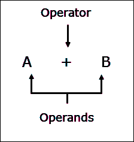
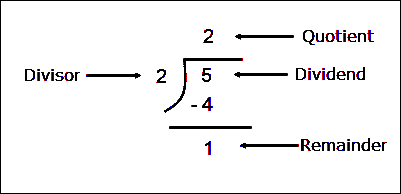

# Python 中的运算符

> 原文：<https://overiq.com/python-101/operators-in-python/>

最后更新于 2020 年 9 月 17 日

* * *

在本课中，我们将学习 Python 提供的表达式和各种运算符。

**操作符**:操作符是指定特定动作的符号。

**操作数**:操作数是操作符作用的数据项。



一些运算符需要两个操作数，而另一些只需要一个。

**表达式**:表达式只不过是运算符、变量、常量和函数调用的组合，最终得到一个值。例如:

```py
## some valid expressions

1 + 8
(3 * 9) / 5
a * b + c * 3
a + b * math.pi
d + e * math.sqrt(441)

```

让我们从算术运算符开始。

## 算术运算符

算术运算符通常用于执行数值计算。Python 有以下算术运算符。

| 操作员 | 描述 | 例子 |
| --- | --- | --- |
| `+` | 加法运算符 | `100 + 45 = 145` |
| `-` | 减法运算符 | `500 - 65 = 435` |
| `*` | 乘法运算符 | `25 * 4 = 100` |
| `/` | 浮点除法运算符 | `10 / 2 = 5.0` |
| `//` | 整数除法运算符 | `10 / 2 = 5` |
| `**` | 幂运运算符 | `5 ** 3 = 125` |
| `%` | 余数运算符 | `10 % 3 = 1` |

我们在日常生活中使用`+`、`-`、`*`运算符，不值得任何解释。但是，需要注意的重要一点是`+`和`-`运算符既可以是二元的，也可以是一元的。一元运算符只有一个操作数。我们可以使用`-`运算符来否定任何正数。例如:`-5`，在这种情况下`-`运算符充当一元运算符，而在`100 - 40`中，`-`运算符充当二元运算符。同样，我们可以使用一元`+`运算符。比如`+4`。由于表达式`4`和`+4`相同，在表达式中应用一元`+`运算符一般没有意义。

### 浮点除法运算符(/)

`/`运算符执行浮点除法。简单的说就是`/`返回一个浮点结果。例如:

```py
>>>
>>> 6/3
2.0
>>>
>>> 3.14/45
0.06977777777777779
>>>
>>>
>>> 45/2.5
18.0
>>>
>>>
>>> -5/2
-2.5
>>>

```

[现在试试](https://overiq.com/python-online-compiler/3M/)

### 整数除法运算符(//)

`//`运算符的工作方式类似于`/`运算符，但它返回的不是浮点值，而是整数。例如:

```py
>>>
>>> 6//3
2
>>>
>>> 100//6
16
>>>

```

[现在试试](https://overiq.com/python-online-compiler/41/)

与`/`运算符不同，当结果为负时，`//`运算符将结果从零舍入到最接近的整数。

```py
>>>
>>> -5//2
-3
>>>
>>> -5/2
-2.5
>>>

```

### 幂运运算符(**)

我们用`**`运算符计算`a^b`。例如:

```py
>>>
>>> 21**2
441
>>>
>>> 5**2.2
34.493241536530384
>>>

```

[现在试试](https://overiq.com/python-online-compiler/5B/)

### 余数运算符(%)

`%`运算符返回左操作数除以右操作数后的余数。例如:

```py
>>>
>>> 5%2
1
>>>

```

[现在试试](https://overiq.com/python-online-compiler/6n/)



余数运算符`%`是编程中非常有用的运算符。`%`运算符的一个常见用法是判断一个数是否为偶数。

一个数即使被`2`整除也是偶数。换句话说，一个数即使被`2`除，剩下`0`作为余数。我们将在第[课中学习如何用 Python](/python-101/if-else-statements-in-python/) 编写这样的程序。

## 运算符优先级和结合性

考虑以下表达式:

```py
10 * 5 + 9

```

它的结果会是什么？

如果在加法之前进行乘法运算，那么答案将是`59`。另一方面，如果在乘法之前进行加法，那么答案将是`140`。为了解决这个难题，我们使用了运算符优先级。

Python 中的运算符被组合在一起，并被赋予一个优先级。下表列出了运算符的优先级。

| 操作员 | 描述 | 结合性 |
| --- | --- | --- |
| `[ v1, … ]`、`{ v1, …}`、`{ k1: v1, …}`、`(…)` | 列表/集合/字典/生成器创建或理解，带圆括号的表达式 | 从左到右 |
| `seq [ n ]`、`seq [ n : m ]`、`func ( args… )`、`obj.attr` | 索引、切片、函数调用、属性引用 | 从左到右 |
| `**` | 幂运算 | 从右向左 |
| `+x`、`-x`、`~x` | 正、负、按位非 | 从左到右 |
| `*`、`/`、`//`、`%` | 乘法、浮点除法、整数除法、余数 | 从左到右 |
| `+`、`-` | 加法、减法 | 从左到右 |
| `<<`、`>>` | 按位左移、右移 | 从左到右 |
| `&` | 按位“与” | 从左到右 |
| &#124; | 按位“或” | 从左到右 |
| `in`、`not in`、`is`、`is not`、`<`、`<=`、`>`、`>=`、`!=`、`==` | 比较、成员资格和身份测试 | 从左到右 |
| `not x` | 布尔非 | 从左到右 |
| `and` | 布尔与 | 从左到右 |
| `or` | 布尔或 | 从左到右 |
| `if-else` | 条件表达式 | 从左到右 |
| 希腊字母的第 11 个 | λ表达式 | 从左到右 |

上面几行中的运算符优先级最高，随着我们向表格底部移动，优先级会降低。每当我们有一个表达式，其中涉及的运算符具有不同的优先级，具有较高优先级的运算符将首先被计算。因此，在表达式`10 * 5 + 9`中，首先对`*`运算符进行评估，然后对`+`运算符进行评估。

```py
=> 10 * 5 + 9 (multiplication takes place first)
=> 50 + 9 (followed by addition)
=> 59 (Ans)

```

[现在试试](https://overiq.com/python-online-compiler/7j/)

### 运算符的结合性

在优先级表中，同一组中的运算符具有相同的优先级，例如，(`*`、`/`、`//`、`%`)具有相同的优先级。现在考虑以下表达式:

```py
5 + 12 / 2 * 4

```

从优先级表中我们知道`/`和`*`的优先级都比`+`高，但是`/`和`*`的优先级是一样的，那么你认为先评估哪个算符`/`还是`*`？

当运算符优先级相同时，为了确定求值顺序，我们使用运算符关联性。运算符关联性定义了计算具有相同优先级的运算符的方向，它可以是从左到右或从右到左。同一组中的运算符具有相同的关联性。从表中可以看出，`/`和`*`的关联性是从左到右。所以在表达中:

```py
5 + 12 / 2 * 4

```

首先评估`/`运算符，然后评估`*`运算符。最后对`+`运算符进行了评价。

```py
=> 5 + 12 / 2 * 4  (/ operator is evaluated first)
=> 5 + 6 * 4 (then * operator is evaluated)
=> 5 + 24 (at last + operator is evaluated)
=> 29 (Ans)

```

[现在试试](https://overiq.com/python-online-compiler/8m/)

以下是关于优先表需要记住的两点。

1.  同一组中除幂运运算符(`**`)外，大多数运运算符的结合性都是从左到右。幂运运算符(`**`)的结合性是从右到左。

2.  我们有时使用括号，即`()`来改变评估的顺序。例如:

```py
2 + 10 * 4

```

在上面的表达式中`*`将首先执行，然后是`+`。我们可以通过在要首先求值的表达式或子表达式周围加上圆括号来轻松更改运算符优先级。例如:

```py
(2 + 10) * 4

```

由于`()`运算符的优先级高于`*`运算符(见优先级表)，将首先执行加法，然后是`*`。

以下是一些表达式及其计算顺序:

**例 1:**

```py
Expression: 10 * 3 + (10 % 2) ** 1

1st Step: 10 * 3 + 0 ** 1 
2nd Step: 10 * 3 + 0 
3rd Step: 30 + 0 
4th Step: 30

```

[现在试试](https://overiq.com/python-online-compiler/9x/)

**例 2:**

```py
Expression: 45 % 2 - 5 / 2 + ( 9 * 3 - 1 )

1st Step: 45 % 2 - 5 / 2 + 26
2nd Step: 1 - 2.5 + 26
3rd Step: 24.5

```

[现在试试](https://overiq.com/python-online-compiler/0v/)

## 复合赋值运算符

在编程中，增加或减少变量值，然后将该值重新分配回同一个变量是非常常见的。例如:

```py
x = 10
x = x + 5

```

`x`的初始值为`10`。在第二个表达式中，我们将`10`添加到 x 的现有值中，然后将新值重新分配回`x`。所以现在`x`的价值是`15`。

第二个语句`x = x + 5`可以使用复合赋值运算符以更简洁的方式编写，如下所示:

```py
x += 5

```

[现在试试](https://overiq.com/python-online-compiler/gJY/)

这里`+=`被称为复合赋值运算符。下表列出了 Python 中可用的其他复合赋值运算符。

| 操作员 | 例子 | 等效语句 |
| --- | --- | --- |
| `+=` | `x += 4` | `x = x + 4` |
| `-=` | `x -= 4` | `x = x - 4` |
| `*=` | `x *= 4` | `x = x * 4` |
| `/=` | `x /= 4` | `x = x / 4` |
| `//=` | `x //= 4` | `x = x // 4` |
| `%=` | `x %= 4` | `x = x % 4` |
| `**=` | `x **= 4` | `x = x ** 4` |

不像其他基于 C 的语言，比如 Java、PHP、JavaScriptPython 没有递增运算符(`++`)和递减运算符(`--`)。在这些语言中，`++`和`--`运算符通常分别用于通过`1`增加和减少变量值。例如，要在 JavaScript 中将变量值增加/减少`1`，您可以这样做:

```py
x = 10;
x++;  // increment x by 1 
console.log(x); // prints 11

x = 10;
x--;  // decrement x by 1 
console.log(x); // prints 9

```

我们可以很容易地使用复合赋值运算符来模拟这种行为，如下所示:

```py
x = 10
x += 1
print(x) ## prints 11

x = 10
x -= 1
print(x) ## prints 9

```

## 类型变换

到目前为止，我们还没有考虑在 Python Shell 和我们的程序中的表达式中使用的数据类型。说到执行涉及不同类型数据的计算，Python 有以下规则:

1.  当一个表达式中涉及的两个操作数都是`int`时，那么结果就是`int`。

2.  当一个表达式中涉及的两个操作数都是`float`时，那么结果就是`float`。

3.  当一个操作数为`float`类型，另一个操作数为`int`类型时，结果将始终是一个`float`值。在这种情况下，Python 解释器会自动将`int`值临时转换为`float`，然后执行计算。这个过程称为类型转换。

以下是一些例子:

```py
>>>
>>> 45 * 3
135     # result is int because both operands are int
>>>
>>>
>>>
>>> 3.4 * 5.3
18.02    # result is float because both operands are float
>>>    
>>>
>>>
>>> 88 * 4.3
378.4    # result is float because one operand is float
>>>

```

[现在试试](https://overiq.com/python-online-compiler/jRR/)

在最后一个表达式中，文字`88`首先转换为`88.0`，然后进行乘法运算。

有时，我们希望根据自己的意愿将数据从一种类型转换为另一种类型。为了处理这种情况，Python 为我们提供了以下功能:

| 函数名 | 描述 | 例子 |
| --- | --- | --- |
| `int()` | 它接受字符串或数字，并返回类型为`int`的值。 | `int(2.7)`返回`2`，`int("30")`返回`30` |
| `float()` | 它接受一个字符串或数字，并返回一个类型为`float`的值 | `float(42)`返回`42.0`，`float("3.4")`返回`3.4` |
| `str()` | 它接受任何值并返回值类型`str` | `str(12)`返回`"12"`，`str(3.4)`返回`"3.4"` |

以下是一些例子:

### int()函数

```py
>>>
>>> int(2.7)  # convert 2.7 to int
2
>>>
>>> int("30") # convert "30" to int
30
>>>

```

[现在试试](https://overiq.com/python-online-compiler/kR5/)

注意当`int()`函数将一个浮点数转换为`int`时，它只是去掉小数点后的数字。如果你想取整一个数字，使用`round()`功能。

```py
>>>
>>> int(44.55)
44
>>> round(44.55)
45
>>>

```

### float()函数

```py
>>>
>>> float(42)  # convert 42 to float
42.0
>>>
>>> float("3.4")  # convert "3.4" to float
3.4
>>>

```

### str()函数

```py
>>>
>>> str(12)   # convert 12 to str
'12'
>>>
>>> str(3.4)  # convert 3.4 to str
'3.4'
>>>

```

## 将语句分成多行

到目前为止，我们写的所有声明都仅限于一行。如果你的陈述变得太长了怎么办？

在一行中输入长语句在屏幕上和纸上都很难阅读。

Python 允许我们使用行延续符号(`\`)将长表达式拆分成多行。`\`符号告诉 Python 解释器语句在下一行继续。例如:

```py
>>>
>>> 1111100 + 45 - (88 / 43) + 783 \
... + 10 - 33 * 1000 + \
... 88 + 3772
1082795.953488372
>>>

```

要将一条语句扩展为多行，请在要中断该语句的位置键入行延续符号(`\`)，然后按回车键。

当 Python Shell 遇到扩展到多行的语句时，会将提示字符串从`>>>`改为`...`。当你完成输入语句后，点击回车查看结果。

下面是另一个将`print()`语句分成多行的例子:

```py
>>>
>>> print("first line\
...  second line\
...  third line")
first line second line third line
>>>
>>>

```

以下示例显示了如何在 Python 脚本中编写多行语句。

**python 101/章节-06/multiline_statements.py**

```py
result = 1111100 + 45 - (88 / 43) + 783 \
         + 10 - 33 * 1000 + \
         88 + 3772

print(result)

print("first line\
 second line\
 third line")

```

**输出:**

```py
1082795.953488372
first line second line third line

```

[现在试试](https://overiq.com/python-online-compiler/lY5/)

## 布尔类型

`bool`数据类型代表两种状态，即真或假。Python 分别使用保留关键字`True`和`False`来定义值 true 和 false。`bool`类型的变量只能包含这两个值中的一个。例如:

```py
>>>
>>> var1 = True
>>> var2 = False
>>>
>>> type(var1)
<class 'bool'>   # type of var1 is bool
>>>
>>> type(var2)
<class 'bool'>   # type of var2 is bool
>>>
>>>
>>> type(True)
<class 'bool'>   # type of True keyword is bool
>>>
>>> type(False)
<class 'bool'>   # type of False keyword is bool
>>>
>>> var1
True
>>>
>>> var2
False
>>>

```

[现在试试](https://overiq.com/python-online-compiler/mZO/)

计算出`bool`值`True` `or` `False`的表达式称为布尔表达式。

我们通常使用`bool`变量作为标志。标志只不过是一个变量，它表示程序中的某种情况。如果标志变量设置为假，则意味着条件不为真。另一方面，如果它是真的，那么它意味着条件是真的。

在内部，Python 使用`1`和`0`分别表示`True`和`False`。我们可以通过使用`True`和`False`关键字上的`int()`功能来验证这个事实，如下所示:

```py
>>>
>>> int(True)   # convert keyword True to int
1
>>>
>>> int(False)   # convert keyword False to int
0
>>>

```

## 真理和谬误的价值

**真值**:相当于真值的值称为真值。

**虚假值**:相当于布尔值 False 的值称为虚假值。

在 Python 中，以下值被认为是错误的。

1.  `None`
2.  `False`
3.  零，即`0`、`0.0`
4.  空序列，例如，`''`、`[]`、`()`
5.  空字典即`{}`

**注:**顺序和字典在后面章节讨论。

其他一切都被认为是真实的。我们也可以使用`bool()`函数来测试一个值是真还是假。如果值为真，则`bool()`函数返回真，否则返回`False`。以下是一些例子:

```py
>>>
>>> bool("")    # an empty string is falsy value
False
>>>
>>> bool(12)    # int 12 is a truthy value
True
>>>
>>> bool(0)     # int 0 is falsy a value
False
>>>
>>> bool([])    # an empty list is a falsy value
False
>>>
>>> bool(())    # an empty tuple is a falsy value
False
>>>
>>> bool(0.2)   # float 0.2 is truthy a value
True
>>>
>>> bool("boolean")   # string "boolean" is a truthy value
True
>>>

```

[现在试试](https://overiq.com/python-online-compiler/n5R/)

在接下来的课程中，真理和谬误价值观的重要性将变得更加明显。

## 关系运算符

为了比较值，我们使用关系运算符。包含关系运算符的表达式称为关系表达式。如果表达式为真，则返回布尔值`True`，如果表达式为假，则返回布尔值`False`。关系运算符是二元运算符。下表列出了 Python 中可用的关系运算符。

| 操作员 | 描述 | 例子 | 返回值 |
| --- | --- | --- | --- |
| `<` | 小于 | `3 < 4` | `True` |
| `>` | 大于 | `90 > 450` | `False` |
| `<=` | 小于或等于 | `10 <= 11` | `True` |
| `>=` | 大于或等于 | `31 >= 40` | `False` |
| `!=` | 不等于 | `100 != 101` | `True` |
| `==` | 等于 | `50==50` | `True` |

```py
>>>
>>> 3 < 4        #  Is 3 is smaller than 4 ? Yes
True
>>>
>>> 90 > 450     # Is 90 is greater than 450 ? No
False
>>>
>>> 10 <= 11     # Is 10 is smaller than or equal to 11 ? Yes
True
>>>
>>> 31 >= 40     # Is 31 is greater than or equal to 40 ? No
False
>>>
>>> 100 != 101     # Is 100 is not equal to 101 ?  Yes
True
>>>
>>> 50 == 50     # Is 50 is equal to 50 ? Yes
True
>>>

```

[现在试试](https://overiq.com/python-online-compiler/o2j/)

初学者经常混淆`==`和`=`运算符。永远记住`=`是赋值运算符，用于给变量赋值。另一方面，`==`是一个相等运算符，用于测试两个值是否相等。

## 逻辑运算符

逻辑运算符用于组合两个或多个布尔表达式，并测试它们是真还是假。包含逻辑运算符的表达式称为逻辑表达式。下表列出了 Python 中可用的逻辑运算符。

| 操作员 | 描述 |
| --- | --- |
| `and` | 逻辑积算符 |
| `or` | 或运算符 |
| `not` | “非”算符 |

`and`和`or`是二元运算符，`not`是一元运算符。

## 逻辑积算符

如果两个操作数都为真，`and`运算符将返回一个`bool`值`True`。否则返回`False`。

**语法:** `operand_1 and operand_2`

`and`运算符的真值表如下:

| 操作数 _1 | 操作数 _2 | 结果 |
| --- | --- | --- |
| `False` | `False` | `False` |
| `False` | `True` | `False` |
| `True` | `False` | `False` |
| `True` | `True` | `True` |

以下是一些例子:

| 表示 | 中间表达 | 结果 |
| --- | --- | --- |
| `(10>3) and (15>6)` | `True and True` | `True` |
| `(1>5) and (43==6)` | `False and False` | `False` |
| `(1==1) and (2!=2)` | `True and False` | `False` |

```py
>>>
>>> (10>3) and (15>6)  # both conditions are true so, the result is true
True
>>>
>>> (1>5) and (43==6)  # both conditions are false so, the result is false
False
>>>
>>> (1==1) and (2!=2)  # one condition is false(right operand) so, the result is false
False
>>>

```

[现在试试](https://overiq.com/python-online-compiler/pY2/)

关系运算符(即`>`、`>=`、`<`、`<=`、`==`和`!=`)的优先级大于`and`运算符，因此以上表达式中的括号不是必须的，这里添加它只是为了使代码更易读。例如:

```py
>>>
>>> (10>3) and (15>6) 
True
>>>
>>> 10 > 3 and 15 > 6  # this expression is same as above
True
>>>

```

可以看到`(10>3) and (15>6)`这个表达比`10 > 3 and 15 > 6`要清晰的多。

在`and`运算符中，如果第一个操作数被求值为`False`，那么第二个操作数根本不会被求值。例如:

```py
>>>
>>> (10>20) and (4==4)
False
>>>

```

在这种情况下，`(10>20)`为 False，整个逻辑表达式也是如此。因此，无需评估表达式`(4==4)`。

## 或运算符

当两个操作数都为`False`时，`or`运算符返回`False`。否则返回`True`。它的语法是:

**语法** : `operand_1 or operand_2`

`or`运算符的真值表如下:

| 操作数 _1 | 操作数 _2 | 结果 |
| --- | --- | --- |
| `False` | `False` | `False` |
| `False` | `True` | `True` |
| `True` | `False` | `True` |
| `True` | `True` | `True` |

以下是一些例子:

| 表示 | 中间表达 | 结果 |
| --- | --- | --- |
| `(100<200) or (55<6)` | `True or False` | `True` |
| `(11>55) or (6==6)` | `False or True` | `True` |
| `(1>12) or (2==3)` | `False or False` | `False` |
| `(10<22) or (20>3)` | `True or True` | `True` |

```py
>>>
>>> (100<200) or (55<6)
True
>>>
>>> (11>55) or (6==6)
True
>>>
>>> (1>12) or (2==3)
False
>>>
>>> (10<22) or (20>3)
True
>>>

```

[现在试试](https://overiq.com/python-online-compiler/qx2/)

在`or`运算符中，如果第一个操作数被求值为`True`，那么第二个操作数根本不会被求值。例如:

```py
>>>
>>> (100>20) or (90<30)
True
>>>

```

在这种情况下，`(100>20)`就是`True`，整个逻辑表达式也是如此。因此没有必要评价`(90<30)`这个表达。

`or`运算符的优先级低于`and`运算符。

## “非”算符

`not`运算符否定表达式的值。换句话说，如果表达式为`True`，则 not 运算符返回`False`，如果表达式为`False`，则返回`True`。与其他两个逻辑运算符不同，not 是一元运算符。`not`运算符的优先级高于`and`运算符和`or`运算符。它的语法是:

**语法** : `not operand`

`not`运算符的真值表如下:

| 操作数 | 结果 |
| --- | --- |
| `True` | `False` |
| `False` | `True` |

以下是一些例子:

| 表示 | 中间表达 | 结果 |
| --- | --- | --- |
| `not (200==200)` | `not True` | `False` |
| `not (10<=5)` | `not False` | `True` |

```py
>>>
>>> not (200==200)
False
>>>
>>> not (10<=5)
True
>>>

```

[现在试试](https://overiq.com/python-online-compiler/rkE/)

* * *

* * *