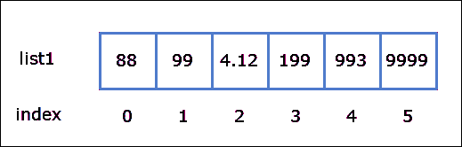
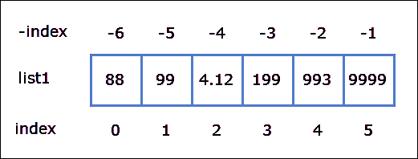

# Python 中的列表

> 原文：<https://overiq.com/python-101/lists-in-python/>

最后更新于 2020 年 9 月 21 日

* * *

## 顺序

Sequences 是一个通用术语，用于指代可以保存多项数据的数据类型。在 Python 中，我们有几种类型的序列，以下三种是最重要的:

1.  目录
2.  元组
3.  用线串

在本章中，我们将讨论列表类型。

## 什么是列表？

假设我们要计算一个班级 100 个学生的平均分数。为了完成这项任务，我们的第一步是通过创建 100 个变量来存储 100 名学生的分数。目前为止一切顺利。如果我们要计算 1000 名或以上学生的平均分数会怎样？我们应该创建 1000 个变量吗？不要。当然不是。这种解决问题的方法是非常不切实际的。我们需要的是一份清单。

列表是由多个项目组成的序列，用逗号分隔，用方括号括起来，即`[]`。创建列表的语法如下:

```py
variable = [item1, item2, item3, ..., itemN]

```

存储在列表中的每一项都称为列表元素或简称为元素。例如:

```py
>>>
>>> numbers = [11, 99, 66, 22]
>>>

```

[现在试试](https://overiq.com/python-online-compiler/7LA/)

该语句创建一个包含 4 个元素的列表，并将其分配给变量`numbers`。请注意，就像其他所有东西一样，列表也是一个对象，类型为`list`。`numbers`变量不存储列表的内容，它只存储对列表对象实际存储在内存中的地址的引用。

```py
>>>
>>> type(numbers) 
<class 'list'>
>>>

```

要在 Python shell 中打印列表内容，只需键入列表名称。

```py
>>>
>>> numbers
[11, 99, 66, 22]
>>>

```

我们也可以使用`print()`功能打印列表。

```py
>>>
>>> print(numbers)
[11, 99, 66, 22]
>>>

```

[现在试试](https://overiq.com/python-online-compiler/7LA/)

列表可以包含相同或不同类型的元素。

```py
>>>
>>> mixed = ["a string", 3.14, 199]  # list where elements are of different types
>>>
>>> mixed
['a string', 3.14, 199]
>>>

```

[现在试试](https://overiq.com/python-online-compiler/86o/)

要创建一个空列表，只需键入没有任何元素的方括号。

```py
>>>
>>> empty_list = []  # an empty list
>>>

```

[现在试试](https://overiq.com/python-online-compiler/9Q3/)

我们也可以使用`list()`构造函数创建列表。

```py
>>>
>>> list1 = list()  # an empty list
>>> list2 = list([3.2, 4, 0.12])  # again elements in a list can be of different types
>>> list3 = list(["@@", "###", ">>>"])   # you can use symbols too
>>> list4 = list("1234")  # creating list from string
>>>
>>>
>>> list1
[]
>>>
>>> list2
[3.2, 4, 0.12]
>>>
>>> list3
['@@', '###', '>>>']
>>>
>>> list4
['1', '2', '3', '4']
>>>
>>>

```

[现在试试](https://overiq.com/python-online-compiler/0VX/)

列表的元素也可以是列表。

```py
>>>
>>> list5 = [
...    [33, 55, 77],  # first element
...    [99, 31, 64]   # second element
... ]
>>>
>>>
>>> list5
[[33, 55, 77], [99, 31, 64]]
>>>
>>>

```

[现在试试](https://overiq.com/python-online-compiler/gL6/)

`list5`包含两种类型的元素`list`。这种类型的列表被称为列表或嵌套列表或多维列表。

## 使用 range()函数创建列表

`range()`功能也可以用来创建长列表。回想一下`range()`函数返回一个 iterable 类型的对象(要了解更多信息[请点击此处](/python-101/loops-in-python/#for-loop-with-range-function)，我们只需要创建一个列表，将这个 iterable 对象传递给`list()`构造函数，如下所示:

```py
>>>
>>> list1 = list(range(5))
>>> list1
[0, 1, 2, 3, 4]
>>>
>>>

```

[现在试试](https://overiq.com/python-online-compiler/jq5/)

`range(5)`生成以下序列:

```py
0, 1, 2, 3, 4

```

`list()`函数然后使用这个序列中的数字创建一个列表。

下面是更多的例子:

**例 1:**

```py
>>>
>>> list2 = list(range(1, 101))  ## create a list of numbers from 1 to 100
>>> list2
[1, 2, 3, 4, 5, 6, 7, 8, 9, 10, 11, 12, 13, 14, 15, 16, 17, 18, 19, 20, 21, 22,
23, 24, 25, 26, 27, 28, 29, 30, 31, 32, 33, 34, 35, 36, 37, 38, 39, 40, 41, 42,
43, 44, 45, 46, 47, 48, 49, 50, 51, 52, 53, 54, 55, 56, 57, 58, 59, 60, 61, 62,
63, 64, 65, 66, 67, 68, 69, 70, 71, 72, 73, 74, 75, 76, 77, 78, 79, 80, 81, 82,
83, 84, 85, 86, 87, 88, 89, 90, 91, 92, 93, 94, 95, 96, 97, 98, 99, 100]
>>>
>>>

```

[现在试试](https://overiq.com/python-online-compiler/kZX/)

**例 2:**

```py
>>>
>>> list3 = list(range(0, 100, 10))  ## create a list of numbers from 0 to 100 with step value of 10
>>> list3
[0, 10, 20, 30, 40, 50, 60, 70, 80, 90]
>>>
>>>

```

[现在试试](https://overiq.com/python-online-compiler/l56/)

## 列出功能

下表列出了我们在处理列表时常用的一些函数。

| 功能 | 描述 |
| --- | --- |
| `len()` | 返回序列中元素的数量。 |
| `sum()` | 返回序列中元素的总和。 |
| `max()` | 返回序列中值最大的元素。 |
| `min()` | 返回序列中值最小的元素。 |

```py
>>>
>>>
>>> list1 = [1, 9, 4, 12, 82]
>>>
>>> len(list1)  # find the length of the list
5
>>>
>>> sum(list1)  # find the sum of the list
108
>>>
>>> max(list1)  # find the greatest element in the list
82
>>>
>>> min(list1)  # find the smallest element in the list
1
>>>
>>>

```

[现在试试](https://overiq.com/python-online-compiler/mQ0/)

## 索引运算符

就像字符串一样，列表中的元素被`0`索引，这意味着第一个元素在索引`0`处，第二个在`1`，第三个在`2`处，以此类推。最后一个有效索引将比列表长度少一个。我们使用以下语法从列表中访问一个元素。

```py
a_list[index]

```

其中`index`必须是整数。

例如，下面的语句创建了一个包含 6 个元素的列表。

```py
list1 = [88, 99, 4.12, 199, 993, 9999]

```



这里`list1[0]`指的是元素`88`，`list1[1]`指的是`99`，`list[5]`指的是`9999`。

```py
>>>
>>> list1 = [88, 99, 4.12, 199, 993, 9999]
>>>
>>> list1[0]  # get the first element
88
>>> list1[1]  # get the second element
99
>>> list1[5]  # get the sixth element
9999
>>>

```

[现在试试](https://overiq.com/python-online-compiler/nrl/)

我们还可以使用`len()`函数计算列表的最后一个有效索引，如下所示:

```py
>>>
>>> len(list1) - 1
5
>>>
>>> list1[len(list1) - 1]  # get the last element 
9999
>>>

```

[现在试试](https://overiq.com/python-online-compiler/oQK/)

试图访问超过最后一个有效索引的元素将导致`IndexError`。

```py
>>>
>>> list1[100]   # get the element at index 100
Traceback (most recent call last):
  File "<stdin>", line 1, in <module>
IndexError: list index out of range
>>>
>>>

```

[现在试试](https://overiq.com/python-online-compiler/pQ6/)

就像字符串一样，负索引在这里仍然有效。事实上，我们可以在 Python 中的几乎所有类型的序列上使用 can 负索引。



从图中可以看到，最后一个元素在索引`-1`处，第二个最后一个元素在`-2`处，以此类推。第一个元素在索引`-6`。

```py
>>>
>>> list1
[88, 99, 4.12, 199, 993, 9999]
>>>
>>> list1[-1]   # get the last element
9999
>>> list1[-2]   # get the second last element
993
>>>

```

[现在试试](https://overiq.com/python-online-compiler/qYr/)

要计算第一个元素的指数，使用`len()`函数，如下所示:

```py
>>>
>>> list1[-len(list1)]  # get the first element
88
>>>

```

[现在试试](https://overiq.com/python-online-compiler/rR6/)

## 列表是可变的

列表是可变的，这意味着我们可以在不创建新列表的情况下修改列表。考虑以下示例:

```py
>>>
>>> list1 = ["str", "list", "int", "float"]
>>>
>>> id(list1)   # address where list1 is stored
43223176
>>>
>>> list1[0] = "string"  # Update element at index 0
>>>
>>> list1   # list1 is changed now
['string', 'list', 'int', 'float']
>>>
>>> id(list1)  # notice that the id is still same
43223176
>>>
>>>

```

[现在试试](https://overiq.com/python-online-compiler/vor/)

请注意，即使修改了列表，变量`list1`的 id 也保持不变。这表明当我们在索引`0`处分配新元素时，没有创建新的列表对象。

## 遍历列表中的元素

为了迭代一个列表，我们可以使用如下循环:

```py
>>>
>>> marks = [122, 45, 23, 78, 65, 12]
>>> for m in marks:
...   print(m)
...
122
45
23
78
65
12
>>>

```

[现在试试](https://overiq.com/python-online-compiler/wmw/)

在每次迭代中，从列表中为变量`m`分配一个值。更改循环体中变量`m`的值不会更新列表中的元素。因此，当我们不需要修改列表中的元素时，这个方法通常用于遍历列表。

要修改元素，我们可以结合`range()`函数使用 for 循环，如下所示:

```py
>>>
>>> marks = [122, 45, 23, 78, 65, 12]
>>>
>>> import random
>>>
>>> for i in range(len(marks)):
...   marks[i] = random.randint(1, 100)  # assign some random value between 1 to 100 to all elements
...
>>>
>>> marks
[59, 9, 59, 21, 75, 61]
>>>
>>>

```

[现在试试](https://overiq.com/python-online-compiler/xvr/)

虽然 for 循环是遍历列表的首选方式，但如果我们愿意，也可以使用 while 循环。例如:

```py
>>>
>>> i = 0
>>>
>>> while i < len(marks):
...   print(marks[i])
...   i += 1
...
59
9
59
21
75
61
>>>
>>>

```

[现在试试](https://overiq.com/python-online-compiler/yrW/)

## 列表切片

我们在第[课讨论的切片操作符 Python 中的字符串](/python-101/strings-in-python/)也可以在列表中找到。唯一的区别是，它不是返回一片字符串，而是返回一片列表。它的语法是:

```py
list[start:end]

```

这将返回从索引`start`到`end - 1`的列表片段。以下是一些例子:

```py
>>>
>>> list1 = [11, 33, 55, 22, 44, 89]
>>>
>>> list1[0:4]
[11, 33, 55, 22]
>>>
>>>
>>> list1[1:5]
[33, 55, 22, 44]
>>>
>>>
>>> list1[4:5]
[44]
>>>

```

[现在试试](https://overiq.com/python-online-compiler/zK8/)

`start`和`end`索引是可选的，如果没有指定，那么开始索引是`0`，结束索引是列表的`length`。例如:

```py
>>>
>>> list1
[11, 33, 55, 22, 44, 89]
>>>
>>> list1[:2]       # same as list1[0:2]
[11, 33]
>>>
>>> list1[2:]       # same as list1[2:len(list1)]
[55, 22, 44, 89]
>>>
>>> list1[:]        # same as list1[0:len(list1)]
[11, 33, 55, 22, 44, 89]
>>>
>>>

```

[现在试试](https://overiq.com/python-online-compiler/APz/)

# 中的成员资格运算符，而不是中的

就像字符串一样，我们可以使用`in`和`not in`运算符来检查列表中是否存在某个元素。以下是一些例子:

```py
>>>
>>> cards  = ["club", "diamond", "heart", "spades"]
>>>
>>> "club" in cards
True
>>>
>>> "joker" in cards
False
>>>
>>> "pikes" not in cards
True
>>>
>>> "heart" not in cards
False
>>>
>>>

```

[现在试试](https://overiq.com/python-online-compiler/BLJ/)

## 列表串联

使用`+`操作符也可以加入列表。当两边的操作数都是列表时`+`运算符通过组合两个列表中的元素来创建一个新列表。例如:

```py
>>>
>>> list1 = [1,2,3]  # create list1
>>> list2 = [11,22,33]  # create list2
>>>
>>> id(list1)   # address of list1
43223112 
>>> id(list2)   # address of list2
43223048
>>>
>>>

```

```py
>>>
>>> list3 = list1 + list2   # concatenate list1 and list2 and create list3
>>> list3
[1, 2, 3, 11, 22, 33]
>>>
>>>

```

```py
>>>
>>> id(list3)  # address of the new list list3
43222920
>>>
>>>
>>> id(list1)   # address of list1 is still same
43223112
>>> id(list2)   # address of list2 is still same
43223048
>>>
>>>

```

[现在试试](https://overiq.com/python-online-compiler/D9n/)

请注意，串联并不影响`list1`和`list2`，它们的地址在串联前后保持不变。

连接列表的另一种方法是使用`+=`运算符。`+=`操作员修改列表，而不是创建新列表。这里有一个例子:

```py
>>>
>>> list1
[1, 2, 3]
>>>
>>> id(list1)
43223112
>>>
>>> list1 += list2   # append list2 to list1
>>>
>>> list1
[1, 2, 3, 11, 22, 33]
>>>
>>>
>>> id(list1)  # address is still same
43223112
>>>

```

[现在试试](https://overiq.com/python-online-compiler/E9k/)

语句`list1 += list2`将`list2`附加到`list1`的末尾。注意`list1`的地址还是没变。不像像 C、C++和 Java 这样的语言，数组是固定大小的。在 Python 中，列表是动态调整大小的。这意味着列表的大小会根据需要自动增长。

## 重复运算符

我们也可以对列表使用`*`运算符。它的语法是:

```py
sequence * n

```

`*`操作符复制列表，然后加入它们。以下是一些例子:

```py
>>>
>>> list1 = [1, 5]
>>>
>>>
>>> list2 = list1 * 4  # replicate list1 4 times and assign the result to list2
>>>
>>> list2
[1, 5, 1, 5, 1, 5, 1, 5]
>>>
>>>

```

[现在试试](https://overiq.com/python-online-compiler/G50/)

`*`运算符也可以用作复合赋值运算符`*=`。唯一的区别是，它不是创建一个新的列表对象，而是更新现有的列表对象。

```py
>>>
>>> action = ["eat", "sleep", "repeat"]
>>>
>>> id(action)  # address of action list
32182472
>>>
>>> action *= 5
>>>
>>> action
['eat', 'sleep', 'repeat', 'eat', 'sleep', 'repeat', 'eat', 'sleep', 'repeat', '
eat', 'sleep', 'repeat', 'eat', 'sleep', 'repeat']
>>>
>>> id(action)   # address is still the same
32182472
>>>

```

[现在试试](https://overiq.com/python-online-compiler/Jqo/)

## 比较列表

就像字符串一样，我们可以使用关系运算符(`>`、`>=`、`<`、`<=`、`!=`、`==`)来比较列表。列表比较仅在涉及的操作数包含相同类型的元素时有效。该过程从比较两个列表中索引`0`处的元素开始。只有当到达列表末尾或列表中对应的字符不同时，比较才会停止。

考虑以下示例:

```py
>>>
>>> n1 = [1,2,3]
>>> n2 = [1,2,10]
>>>
>>>
>>> n1 > n2
False
>>>

```

[现在试试](https://overiq.com/python-online-compiler/KZn/)

以下是列表`n1`和`n2`比较涉及的步骤。

**第一步**:`n1`的`1`与`n2`的`1`比较。由于它们是相同的，接下来将对两个字符进行比较。

**第二步**:`n2`的`2`与`n2`的`2`进行对比。同样，它们是相同的，下面两个字符进行比较。

**第三步**:将`n1`的`3`与`10`的`10`进行比较。显然`3`比`10`小。所以比较`n1 > n2`返回`False`。

这里还有一个例子，其中的元素是字符串。

```py
>>>
>>> word_list1 = ["pow", "exp"]
>>> word_list2 = ["power", "exponent"]
>>>
>>> word_list1 < word_list2
True
>>>

```

[现在试试](https://overiq.com/python-online-compiler/L84/)

第一步:`word_list1`的`"pow"`与`word_list2`的`"power"`进行比较。显然`"pow"`比`"power"`小。此时，比较停止，因为我们发现列表中的元素不一样，所以比较`word_list1 < word_list2`为真。

## 列表理解

通常，您需要创建列表，其中序列中的每个元素都是某些操作的结果，或者列表中的每个元素都满足某些条件。例如，创建一系列从`50`到`100`的数字立方体。我们在这种情况下使用列表理解。列表理解的语法是:

```py
[ expression for item in iterable ]

```

以下是它的工作原理:

在每次迭代中`item`从可迭代对象中被赋值，然后`for`关键字之前的`expression`被求值；`expression`的结果随后用于产生列表的值。重复这个过程，直到没有更多的元素需要迭代。

这里有一个例子:

```py
>>>
>>> cube_list = [ i**3 for i in range(50, 101) ]
>>>
>>> cube_list
[125000, 132651, 140608, 148877, 157464, 166375, 175616, 185193, 195112, 205379,
 216000, 226981, 238328, 250047, 262144, 274625, 287496, 300763, 314432, 328509,
 343000, 357911, 373248, 389017, 405224, 421875, 438976, 456533, 474552, 493039,
 512000, 531441, 551368, 571787, 592704, 614125, 636056, 658503, 681472, 704969,
 729000, 753571, 778688, 804357, 830584, 857375, 884736, 912673, 941192, 970299,
 1000000]
>>>

```

[现在试试](https://overiq.com/python-online-compiler/MQ3/)

我们还可以在列表理解中包含一个 if 条件，如下所示:

```py
[ expression for item in iterable if condition ]

```

这和上面的完全一样，唯一的区别是`for`关键字前的`expression`只有在`condition`为`True`时才被评估。

这里有一个例子:

```py
>>>
>>> even_list = [ i for i in range(1, 10) if i % 2 == 0 ]
>>>
>>> even_list
[2, 4, 6, 8]
>>>

```

[现在试试](https://overiq.com/python-online-compiler/N9z/)

## 列出方法

`list`类有许多内置方法，允许我们添加元素、移除元素、更新元素等等。下表列出了`list`类提供的一些操作列表的常用方法。

| 方法 | 描述 |
| --- | --- |
| `appends(item)` | 在列表末尾添加一个`item`。 |
| `insert(index, item)` | 在指定的`index`处插入一个`item`。如果指定的`index`大于最后一个有效的`index`，则`item`被添加到列表的末尾。 |
| `index(item)` | 返回指定`item`第一次出现的索引。如果列表中不存在指定的`item`，则会引发异常。 |
| `remove(item)` | 从列表中删除指定`item`的第一次出现。如果列表中不存在指定的`item`，则会引发异常。 |
| `count(item)` | 返回一个`item`在列表中出现的次数。 |
| `clear()` | 从列表中移除所有元素。 |
| `sort()` | 按升序对列表进行排序。 |
| `reverse()` | 颠倒列表中元素的顺序。 |
| `extend(sequence)` | 将`sequence`的元素追加到列表的末尾。 |
| `pop([index])` | 移除指定`index`处的元素并返回该元素。如果未指定`index`，则从列表中移除并返回最后一个元素。当`index`无效时，会引发异常。 |

请注意，除了`count()`之外，所有这些方法都会修改调用它的列表对象。

下面的 shell 会话演示了如何使用这些方法:

### append()方法

```py
>>>
>>> list1 = [1,2,3,4,5,6]
>>>
>>> id(list1)
45741512        # address of list1
>>>
>>> list1.append(10)   # append 10 to list1
>>>
>>> list1               
[1, 2, 3, 4, 5, 6, 10]  
>>>
>>> id(list1)   # address remains unchanged
45741512
>>>

```

[现在试试](https://overiq.com/python-online-compiler/OyN/)

### insert()方法

```py
>>>
>>> list1 = [1,2,3,4,5,6]
>>>
>>> id(list1)
45739272
>>>
>>> list1.insert(2, 1000)  # insert item 1000 at index 2
>>>
>>> list1
[1, 2, 1000, 3, 4, 5, 6]   # now the last valid index is 6
>>>
>>>
>>> list1.insert(6, 4000)  # insert the item 4000 at index 6
>>>
>>> list1
[1, 2, 1000, 3, 4, 5, 4000, 6]  # now the last valid index is 7
>>>
>>>
>>> list1.insert(8, 8000)  # insert the item 8000 at index 8, which is beyond the last valid index
>>>
>>> list1
[1, 2, 1000, 3, 4, 5, 4000, 6, 8000] 
>>> list1[8]
8000
>>>

```

[现在试试](https://overiq.com/python-online-compiler/PZn/)

### index()方法

```py
>>>
>>> list1 = [1, 2, 3, 4, 5, 6, 1, 2, 3]
>>>
>>> list1.index(1)  # index of first occurrence of element 1
0
>>> list1.index(3)  # index of first occurrence of element 3
2
>>> list1.index(90)  # an exception is raised, as value 90 doesn't exists in the list
Traceback (most recent call last):
  File "<stdin>", line 1, in <module>
ValueError: 90 is not in list
>>>
>>>

```

[现在试试](https://overiq.com/python-online-compiler/Q0Y/)

### remove()方法

```py
>>>
>>> list1 = [1, 2, 3, 4, 5, 6, 1, 2, 3]
>>>
>>> list1.remove(1)   # remove first occurence of element 1 
>>>
>>> list1
[2, 3, 4, 5, 6, 1, 2, 3]
>>>
>>> list1.remove(2)   # remove first occurence of element 2
>>>
>>> list1
[3, 4, 5, 6, 1, 2, 3]  
>>>
>>> list1.remove(100)  # an exception is raised, as value 100 doesn't exists in the list
Traceback (most recent call last):
  File "<stdin>", line 1, in <module>
ValueError: list.remove(x): x not in list
>>>
>>>

```

[现在试试](https://overiq.com/python-online-compiler/RoR/)

### count()方法

```py
>>>
>>> list1 = [1, 2, 3, 4, 5, 6, 1, 2, 3]
>>>
>>> list1.count(2)   # count the appearance of element 2 in the list
2
>>> list1.count(100)  # count the appearance of element 100 in the list
0
>>> list1.count(1)  # count the appearance of element 1 in the list
2
>>>

```

[现在试试](https://overiq.com/python-online-compiler/VP1/)

### clear()方法

```py
>>>
>>>
>>> list1 = [1, 2, 3, 4, 5, 6, 1, 2, 3]
>>>
>>> id(list1)
45738248
>>>
>>> list1.clear()   # clear all the elements in the list list1
>>>
>>> list1
[]
>>>
>>> id(list1)
45738248
>>>
>>>

```

[现在试试](https://overiq.com/python-online-compiler/W7g/)

### sort()方法

```py
>>>
>>> list1 = [12, -2, 3, 4, 100, 50]
>>>
>>> list1.sort()   # sort the list in ascending order
>>>
>>> list1
[-2, 3, 4, 12, 50, 100]
>>>
>>> types = ["str", "float", "int", "list"]  
>>>
>>> types.sort()  # sort the list, strings are sorted based on the ASCII values
>>>
>>> types
['float', 'int', 'list', 'str']  
>>>
>>>

```

[现在试试](https://overiq.com/python-online-compiler/Xom/)

### 反向()方法

```py
>>>
>>> list1 = [12, -2, 3, 4, 100, 50]
>>>
>>>
>>> list1.sort()  # sort the list in ascending order
>>>
>>> list1
[-2, 3, 4, 12, 50, 100]
>>>
>>> list1.reverse()  # sort the list in descending order
>>>
>>> list1
[100, 50, 12, 4, 3, -2]
>>>
>>>

```

[现在试试](https://overiq.com/python-online-compiler/YWp/)

### 扩展()方法

```py
>>>
>>> list1 = [1, 2, 3]
>>>
>>> id(list1)
45738248
>>>
>>> list1.extend([100, 200, 300])   # append elements of list [100, 200, 300] to list1
>>>
>>> list1
[1, 2, 3, 100, 200, 300]
>>>
>>> id(list1) 
45738248
>>>
>>>
>>> list1.extend("str")  # We can pass strings too
>>>
>>> list1
[1, 2, 3, 100, 200, 300, 's', 't', 'r']
>>>
>>>
>>> id(list1)
45738248
>>>
>>>

```

[现在试试](https://overiq.com/python-online-compiler/ZY6/)

### pop()方法

```py
>>>
>>> list1 = [1, 2, 3, 4, 5, 6]
>>>
>>> list1.pop(4)  # remove the element at index 4
5
>>> list1
[1, 2, 3, 4, 6]
>>>
>>> list1.pop()   # remove the last element
6
>>>
>>> list1
[1, 2, 3, 4]
>>>
>>>
>>> list1.pop(10)  # index specified is not valid
Traceback (most recent call last):
  File "<stdin>", line 1, in <module>
IndexError: pop index out of range
>>>
>>>

```

[现在试试](https://overiq.com/python-online-compiler/1Wj/)

* * *

* * *