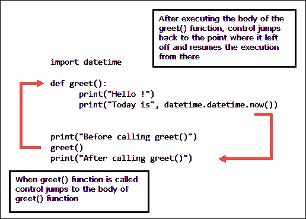

# Python 中的函数

> 原文：<https://overiq.com/python-101/functions-in-python/>

最后更新于 2020 年 9 月 22 日

* * *

到目前为止，在本课程中，我们一直在使用 Python 附带的内置函数。在本课中，我们将学习如何创建自己的函数。但在此之前，让我们花点时间了解一下为什么我们一开始就需要它们。

假设您想创建一个程序，允许用户计算两个数字之间的和。在这一点上，你写这样的程序应该没有任何问题；无论如何，您的代码看起来可能是这样的:

```py
sum = 0
start = 10
end = 30
for i in range(start, end+1):
    sum += i    

print("Sum is", sum)

```

[现在试试](https://overiq.com/python-online-compiler/2xv/)

该程序计算从`10`到`30`的所有数字的总和。如果我们想计算从`100`到`200`的数字总和，我们需要更新程序如下:

```py
sum = 0
start = 100
end = 200
for i in range(start, end+1):
    sum += i    

print("Sum is", sum)

```

正如你所看到的，程序的两个版本几乎相同，唯一的区别在于`start`和`end`变量的值。所以每次我们想计算两个数的和时，我们都需要更新程序的源代码。如果我们能以某种方式重用整个代码而不做任何修改，那就太好了。我们可以用函数来实现。

## 什么是函数

一个函数被命名为一组执行特定任务的语句。定义函数的语法如下:

```py
def function_name(arg1, arg2, arg3 ... argN):
    # function body
    <indented statement 1>
    <non-indented statement 2>
    ...
    <indented statement n>
    <return statement>

```

函数由两部分组成:标题和正文。函数头以`def`关键字开始，然后是函数名，接着是参数，最后是冒号(`:`)。

`def`是一个保留的关键字，所以你不应该在你的程序中使用它作为变量或函数名。`function_name`可以是任何有效的标识符。在函数名之后，我们有一个用逗号(`,`)分隔的括号内的参数列表。我们使用这些参数向函数传递必要的数据。一个函数可以接受任意数量的参数，也可以不接受任何参数。如果函数不接受任何参数，则圆括号为空。

在下一行，我们有一个语句块或函数体。函数体包含定义函数功能的语句。像往常一样，Python 使用语句缩进来确定块开始和结束的时间。函数主体中的所有语句必须同等缩进，否则会出现语法错误。

特别注意函数体中的最后一个语句，即`<return statement>`。`return`语句用于从函数返回值。`return`语句不是强制性的，有些函数返回值，有些则不是。如果函数体中没有`return`语句，则自动返回一个保留的关键字`None`。`None`实际上是一个内置类型的物体`NoneType`。如果发现`return`语句混乱，不用担心；他们不是，我们将在下一节详细讨论`return`声明。

这里有一个小功能，可以打印当前日期和时间以及问候语:

**蟒蛇 101/第 13 章/first_function.py**

```py
import datetime

def greet():
    print("Hello !")
    print("Today is", datetime.datetime.now())

```

[现在试试](https://overiq.com/python-online-compiler/3QQ/)

`greet()`函数不接受任何参数，这就是括号留空的原因。函数体包含两个`print()`语句。这两个语句将在我们调用`greet()`函数时执行。`greet()`函数不返回值。

## 函数调用

函数定义本身没有任何作用。要使用一个函数，我们必须调用它。调用函数的语法如下:

```py
function_name(arg1, arg2, arg3, ... argN)

```

如果函数不接受任何参数，则使用以下语法:

```py
function_name()

```

以下代码调用`greet()`函数:

```py
greet()  # calling greet() function

```

**python 101/第 13 章/调用 _first_function.py**

```py
import datetime

def greet():
    print("Hello !")
    print("Today is", datetime.datetime.now())

greet()

```

[现在试试](https://overiq.com/python-online-compiler/4Q6/)

**输出:**

```py
Hello !
Today is 2017-06-20 13:20:45.281651

```

函数调用必须在定义函数后出现，否则会遇到`NameError`异常。例如:

**蟒蛇 101/第 13 章/call_before_definition.py**

```py
import datetime

greet() ## ERROR: trying to call greet() before its defined

def greet():
    print("Hello !")
    print("Today is", datetime.datetime.now())

```

[现在试试](https://overiq.com/python-online-compiler/5QR/)

**输出:**

```py
q@vm:~/python101/Chapter-13$ python call_before_definition.py 
Traceback (most recent call last):
  File "call_before_definition.py", line 3, in <module>
    greet() ## ERROR: trying to call greet() before its defined
NameError: name 'greet' is not defined

```

当一个函数被调用时，程序控制跳转到该函数定义并执行函数体内的语句。在执行函数体之后，程序控制跳回到调用函数的程序部分，并在该点恢复执行。

下面的示例演示了调用函数时会发生什么。

**蟒蛇 101/第 13 章/控制权转移**

```py
import datetime

def greet():
    print("Hello !")
    print("Today is", datetime.datetime.now())

print("Before calling greet()")
greet()
print("After calling greet()")

```

[现在试试](https://overiq.com/python-online-compiler/6X9/)

**输出:**

```py
Before calling greet()
Hello !
Today is 2017-06-20 13:20:45.281651
After calling greet()

```

在第 3-5 行，我们定义了一个`greet()`语句。第 7 行的`print()`语句将字符串`"Before calling greet()"`打印到控制台。在第 8 行，我们正在调用`greet()`函数。此时，调用`greet()`后语句的执行停止，程序控制跳转到`greet()`函数的定义。执行完`greet()`功能程序的主体后，控制再次跳回到它停止的位置，并从那里继续执行。



我们之前的程序只有一个功能。程序拥有数百甚至数千个功能并不罕见。在 python 中，定义一个名为`main()`的函数是一种常见的约定，当程序启动时会调用该函数。该`main()`函数随后根据需要调用其他函数。下面的程序演示了当我们在一个程序中有两个功能时程序控制的流程。

**蟒蛇 101/第-13 章/two _ func _ program _ control . py**

```py
import datetime

def greet(name):
    print("Hello", name, "!")
    print("Today is", datetime.datetime.now())

def main():
    print("main() function called")
    greet("Jon")
    print("main() function finished")

main()

```

[现在试试](https://overiq.com/python-online-compiler/71A/)

在第 3-5 行和第 8-11 行，我们定义了两个函数`greet()`和`main()`。`greet()`函数现在被更新为接受一个名为`name`的参数，然后在下一行中使用它来问候用户。

`main()`函数不接受任何参数，体内有三个语句。

第 13 行的语句调用`main()`函数。程序控制跳转到`main()`功能的主体。`main()`内的第一条语句将字符串`"main() function called"`打印到控制台。第 10 行的语句调用带有参数`"Jon"`的`greet()`函数，该参数将被分配给函数头中的变量`name`。此时，调用`greet()`后的语句执行停止，程序控制跳转到`greet()`函数的主体。在执行完`greet()`函数的主体后，程序控制跳回到它停止的地方，并执行第 11 行的`print()`语句。由于在`main()`函数中没有剩余的要执行的语句，程序控制再次跳回到函数调用后停止执行语句的地方(第 13 行)。

## 局部变量、全局变量和范围

**变量作用域:**变量的作用域是指程序中可以被访问的部分。

我们在函数内部创建的变量称为局部变量。局部变量只能在定义它的函数体内访问。换句话说，局部变量的范围从它们被定义的点开始，一直持续到函数结束。函数一结束，局部变量就要进行垃圾收集。因此，试图访问其范围之外的局部变量将导致错误。

在光谱的另一端，我们有全局变量。全局变量是在任何函数之外定义的变量。全局变量的范围从它们被定义的点开始，一直持续到程序结束。

现在考虑以下示例:

**例 1** :

**python 101/第-13 章/variable_scope.py**

```py
global_var = 200  # a global variable

def func():

    # local_var is a local variable
    # and is only available inside func() 
    local_var = 100

    print("Inside func() - local_var =", local_var)

    # accessing a global variable inside a function
    print("Inside func() - global_var =", global_var)

func()

print("Outside func() - global_var =", global_var)

# print("Outside func() - local_var =", local_var)  # ERROR: local_var is not available here

```

[现在试试](https://overiq.com/python-online-compiler/81o/)

**输出:**

```py
Inside func() - local_var = 100
Inside func() - global_var = 200
Outside func() - global_var = 200

```

在第 1 行，我们创建了一个名为`global_var`的全局变量。然后在第 12 行`func()`函数内部和第 17 行函数外部访问。我们还在函数`func()`中声明了一个名为`local_var`的局部变量。然后在第 9 行的函数中访问它。

让我们看看如果我们试图访问函数外部的局部变量会发生什么。为此，取消第 19 行代码的注释，并再次运行程序。

**输出:**

```py
Inside func() - local_var = 100
Inside func() - global_var = 200
Outside func() - global_var = 200
Traceback (most recent call last):
  File "variable_scope.py", line 37, in <module>
    print("Outside func() - local_var =", local_var)
NameError: name 'local_var' is not defined

```

`NameError: name 'local_var' is not defined`告诉我们这个范围内不存在名为`local_var`的变量。

如果我们有同名的局部变量和全局变量呢？考虑以下程序。

**例 2:**

**蟒蛇 101/第 13 章/相同 _ 全局 _ 和 _ 局部. py**

```py
num = "global"  # global num variable

def func():
    num = "local"   # local num variable is entirely different from global num variable
    print(num)

func()
print(num)

```

[现在试试](https://overiq.com/python-online-compiler/913/)

**输出:**

```py
local
global

```

这里我们在第 1 行有一个全局变量`num`，在第 4 行的函数内部有一个同名的局部变量。每当函数内部的局部变量和全局变量之间发生冲突时，局部变量优先。这就是`print()`函数(第 5 行)打印本地`num`变量的原因。然而，函数外`num`指的是全局`num`变量。

我们也可以在不同的函数中使用相同的变量名，而不会相互冲突。

**python 101/第-13 章/相同 _ 变量 _ 名称 _ in _ differential _ functions . py**

```py
def func_1():
    x = 100  # this x is only visible inside func_1()
    print("func_1(): x =", x)
    x = 200
    print("func_1(): x =", x)

def func_2():
    x = "str" # this x is only visible inside func_2() and it entirely different from func1()'s variable x
    print("func_2(): x =", x)
    x = "complex"
    print("func_2(): x =", x)

# x is not visible in here

func_1()
func_2()

```

[现在试试](https://overiq.com/python-online-compiler/0YX/)

**输出:**

```py
func_1(): x = 100
func_1(): x = 200
func_2(): x = str
func_2(): x = complex

```

## 传递参数

参数只不过是调用函数时传递给函数的一段数据。如前所述，函数可以接受任意数量的参数，也可以不接受任何参数。例如，`print()`函数接受一个或多个参数，而`random.random()`函数不接受任何参数。

如果希望函数接收参数，在调用它时，我们必须首先定义一个或多个参数。参数或参数变量只是函数头中的一个变量，它在调用函数时接收一个参数。就像局部变量一样，参数变量的范围只限于函数体。下面是一个接受单个参数的函数示例:

```py
def add_100(num):
    print("Result =", num+100)

```

当用参数调用函数`add_100()`时，参数的值被赋给变量`num`，`print()`语句在加上`100`后打印出`num`的值。

下面的程序演示了如何用参数调用函数。

**python 101/第-13 章/function_argument.py**

```py
def add_100(num):  # num is a parameter
    print("Result =", num+100)

x = 100
add_100(x)

```

[现在试试](https://overiq.com/python-online-compiler/gZ6/)

**输出:**

```py
Result = 200

```

在第 6 行，函数`add_100()`用参数`100`调用。该参数的值随后被分配给参数变量`num`。

**例 2:** 计算一个数的阶乘的函数。

**蟒蛇 101/第 13 章/阶乘 py**

```py
def factorial(n):
    f = 1
    for i in range(n, 0, -1):
        f *= n
        n -= 1

    print(f)

num = input("Enter a number: ")
factorial(int(num))

```

[现在试试](https://overiq.com/python-online-compiler/jZ5/)

**输出:**

```py
Enter a number: 4
24

```

数字`n`的阶乘定义为从`1`到`n`的所有数字的乘积。

```py
n! = 1 * 2 * 3 * ... * (n-1) * n

```

其中`n!`表示`n`的阶乘。以下是一些例子:

```py
6! = 1 * 2 * 3 * 4 * 5 * 6
4! = 1 * 2 * 3 * 4

```

现在，让我们看看当`n`的值为`4`时，for 循环是如何工作的:

| 在强制循环开始之前 | `i`未定义 | `f = 1` | `n = 4` |
| --- | --- | --- | --- |
| 第一次迭代后 | `i = 4` | `f = n * f = 4 * 1 = 4` | `n = 3` |
| 第二次迭代后 | `i = 3` | `f = n * f = 3 * 4 = 12` | `n = 2` |
| 第三次迭代后 | `i = 2` | `f = n * f = 2 * 12 = 24` | `n = 1` |
| 第四次迭代后 | `i = 1` | `f = n * f = 1 * 24 = 24` | `n = 0` |

第四次迭代循环结束后，`print()`函数输出该数的阶乘。

**示例 3** :向函数传递多个参数

**python 101/第-13 章/multiple_arguments.py**

```py
def calc(num1, num2):
    print("Sum =", num1 + num2)
    print("Difference =", num1 - num2)
    print("Multiplication =", num1 * num2)
    print("Division =", num1 / num2)
    print()  # prints a blank line

calc(10, 20)

```

[现在试试](https://overiq.com/python-online-compiler/k8X/)

**输出:**

```py
Sum = 30
Difference = -10
Multiplication = 200
Division = 0.5

```

第 8 行调用`calc()`函数时，参数`10`传递给参数变量`num1`，`20`传递给参数变量`num2`。

调用函数时传递的参数顺序必须与函数头中的参数顺序相匹配，否则，您可能会得到意外的结果。

## 按值传送

回想一下，Python 中的一切都是对象。所以一个对象的变量，实际上是对该对象的引用。换句话说，变量存储对象在内存中的存储地址。它不包含实际对象本身。

当用参数调用函数时，存储在参数中的对象地址被传递给参数变量。然而，为了简单起见，我们说参数的值在调用函数时被传递给参数。这种机制被称为按值传递。考虑以下示例:

```py
def func(para1):
    print("Address of para1:", id(para1))
    print(para1)

arg1 = 100
print("Address of arg1:", id(arg1))
func(arg1)

```

[现在试试](https://overiq.com/python-online-compiler/lx6/)

**输出:**

```py
Address of arg1: 1536218288
Address of para1: 1536218288
100

```

注意`id`值是相同的。这意味着变量`arg1`和`para1`引用同一个对象。换句话说，`arg1`和`para1`都指向存储`int`对象(`100`)的同一存储位置。


这种行为有两个重要后果:

1.  如果传递给函数的参数是不可变的，那么对参数变量所做的更改不会影响该参数。

2.  但是，如果传递给函数的参数是可变的，那么对参数变量所做的更改将影响该参数。

让我们通过一些例子来检查这种行为:

**示例 1** :将不可变对象传递给函数。

**蟒蛇 101/第 13 章/传递 _ 不可变 _ 对象. py**

```py
def func(para1):
    para1 += 100  # increment para1 by 100
    print("Inside function call, para1 =", para1)

arg1 = 100
print("Before function call, arg1 =", arg1)
func(arg1)
print("After function call, arg1 =", arg1)

```

[现在试试](https://overiq.com/python-online-compiler/mO0/)

**输出:**

```py
Before function call, arg1 = 100
Inside function call, para1 = 200
After function call, arg1 = 100

```

在第 7 行中，`func()`被一个参数`arg1`调用(它指向一个不可变的对象`int`)。`arg1`的值被传递给参数`para1`。`para1`的内函数值增加`100`(第 3 行)。当该功能结束时，执行第 8 行的打印语句，并将字符串`"After function call, arg1 = 100"`打印到控制台。这证明了一点，无论`para1`做什么功能，`arg1`的值不变。

仔细想想，这种行为完全有道理。回想一下，不可变对象的内容是不能改变的。因此，每当我们给一个变量分配一个新的整数值时，我们实际上是在创建一个完整的新`int`对象，同时给这个变量分配新对象的引用。这正是`func()`功能内部正在发生的事情。

**示例 2** :将可变对象传递给函数

**蟒蛇 101/第 13 章/传递 _ 可变 _ 对象. py**

```py
def func(para1):
    para1.append(4)
    print("Inside function call, para1 =", para1)

arg1 = [1,2,3]
print("Before function call, arg1 =", arg1)
func(arg1)
print("After function call, arg1 =", arg1)

```

[现在试试](https://overiq.com/python-online-compiler/nxl/)

**输出:**

```py
Before function call, arg1 = [1, 2, 3]
Inside function call, para1 = [1, 2, 3, 4]
After function call, arg1 = [1, 2, 3, 4]

```

代码几乎是一样的，但是这里我们传递一个列表给函数，而不是一个整数。由于列表是一个可变对象，因此第 2 行的`func()`函数所做的更改会影响变量`arg1`所指向的对象。

## 位置和关键字参数

函数的参数可以通过两种方式传递:

1.  位置论证。
2.  关键字参数。

在第一种方法中，我们将参数传递给一个函数，传递顺序与函数头中它们各自的参数相同。我们一直在使用这个方法向我们的函数传递参数。例如:

**勾股 101/第-13 章/勾股 _ 三胞胎. py**

```py
def is_pythagorean_triplet(base, height, perpendicular):
    if base ** 2 + height ** 2 ==  perpendicular ** 2:
        print("Numbers passed are Pythagorean Triplets")
    else:
        print("Numbers passed are not Pythagorean Triplets")

```

[现在试试](https://overiq.com/python-online-compiler/oVK/)

报表`is_pythagorean_triplet(3, 4, 5)`传递`3`到`base`、`4`到`height`、`5`到`perpendicular`，打印`"Numbers passed are Pythagorean Triplets"`。但是语句`is_pythagorean_triplet(3, 5, 4)`，将`3`传递给底座，`5`传递给`height`，`4`传递给`perpendicular`，打印`"Numbers passed are not Pythagorean Triplets"`，是错误的。所以在使用位置参数时，一定要确保函数调用中参数的顺序和函数头中参数的顺序相匹配。否则，你可能会得到预期的结果。

向函数传递参数的另一种方法是使用关键字参数。在此方法中，我们以以下形式传递每个参数:

```py
parameter_name = val

```

其中`parameter_name`是函数头中参数变量的名称，`val`是指要传递给参数变量的值。因为我们将参数名称与值相关联，所以函数调用中参数的顺序并不重要。

以下是我们可以使用关键字参数调用`is_pythagorean_triplet()`函数的一些不同方式:

```py
is_pythagorean_triplet(base=3, height=4, perpendicular=5) 

is_pythagorean_triplet(base=3, perpendicular=5, height=4)

is_pythagorean_triplet(perpendicular=5, height=4, base=3)

```

[现在试试](https://overiq.com/python-online-compiler/p86/)

关键字参数有点灵活，因为我们不必记住函数头中参数的顺序。

## 混合位置和关键字参数

我们还可以在函数调用中混合位置参数和关键字参数。这样做的唯一要求是位置参数必须出现在任何关键字参数之前。这意味着以下两个调用完全有效，因为在这两个调用中，位置参数都出现在关键字参数之前。

```py
## valid 

is_pythagorean_triplet(3, 4, perpendicular=5)
is_pythagorean_triplet(3, perpendicular=5, height=4)

```

[现在试试](https://overiq.com/python-online-compiler/q7r/)

但是，我们不能这样做:

```py
# not valid

is_pythagorean_triplet(3, height=4, 5)

```

[现在试试](https://overiq.com/python-online-compiler/q7r/)

这里的问题是位置参数(`5`)出现在关键字参数(`height=4`)之后。试图以这种方式调用`is_pythagorean_triplet()`会导致以下错误:

```py
File "pythagorean_triplets.py", line 8
    is_pythagorean_triplet(3, height=4, 5)
                                       ^
SyntaxError: positional argument follows keyword argument

```

## 返回值

到目前为止，我们一直在创建不返回值的函数，这种函数也被称为 void 函数。

要从函数中返回值，我们使用`return`语句。它的语法是:

```py
return [expression]

```

`expression`周围的方括号(`[]`)表示可选。如果省略，则返回特殊值`None`。

当在函数内部遇到`return`语句时，函数终止，后面跟有`return`关键字的`expression`的值被发送回调用函数的程序部分。`return`语句可以出现在函数体的任何地方。返回值的函数称为返回值函数。

这里有一个例子:

```py
def add(num1, num2):
    return num1 + num2

```

一个函数有两种调用方式，这取决于它们是否返回值。

如果一个函数返回值，那么对这个函数的调用可以用作程序中任何表达式的操作数。例如:

```py
result = add(12, 10)

```

[现在试试](https://overiq.com/python-online-compiler/r86/)

在上面的表达式中，我们首先调用`add()`函数，然后将函数的返回值赋给`result`变量。如果我们没有在`add()`函数中使用`return`语句，我们将无法编写这段代码。这里有一些我们可以称之为`add()`函数的其他方法。

```py
result = add(12, 10) * 10  # return value of add() is multiplied by 10 and then assigned to result

if add(12, 10) == 100:   #  return value of add() is compared with 100 in the if statement
    print("It is True")

print(add(12, 10))  # return value of add() is printed

```

[现在试试](https://overiq.com/python-online-compiler/vlr/)

我们不一定要使用函数的返回值。如果我们不想使用返回值，只需将函数作为语句调用即可。例如:

```py
add(12, 10)

```

在这种情况下，`add()`的返回值被简单丢弃。

让我们重写阶乘程序来返回阶乘，而不是打印它。

**蟒蛇 101/第 13 章/return_factorial.py**

```py
def factorial(n):
    f = 1
    for i in range(n, 0, -1):
        f *= n
        n -= 1

    return f

print("Factorial of 4 is", factorial(4))
print("Factorial of 4 is", factorial(6))

```

[现在试试](https://overiq.com/python-online-compiler/wVw/)

**输出:**

```py
Factorial of 4 is 24
Factorial of 4 is 720

```

在上面的例子中，我们从函数中返回了一个整数值，但是我们可以使用任何类型的数据`int`、`float`、`str`、`bool`；你说吧。以下程序演示了如何从函数中返回`bool`类型:

**蟒蛇 101/第 13 章/是偶数还是奇数**

```py
def is_even(number):
    if number % 2 == 0:
        return True
    else:
        return False

num = int(input("Enter a number: "))

if is_even(num):
    print(num, "is even")
else:
    print(num, "is odd")

```

[现在试试](https://overiq.com/python-online-compiler/gZ9/)

**第一次运行输出:**

```py
Enter a number: 13
13 is odd

```

**第二次运行输出:**

```py
Enter a number: 456
456 is even

```

如果省略了后跟`return`关键字的表达式，则返回一个特殊值`None`。

**蟒蛇 101/第 13 章/返回 _none.py**

```py
def foo():
    return

result = foo()
print(result)

```

[现在试试](https://overiq.com/python-online-compiler/jZW/)

**输出:**

```py
None

```

我们也可以在函数内部多次使用`return`语句，但是一旦遇到第一个`return`语句，函数就会终止，并且它后面的所有语句都不会执行。例如:

**蟒蛇 101/第 13 章/等级 _ 计算器. py**

```py
def calculate_grade(marks):
    if marks >= 90:
        return 'A'
    elif marks >= 80:
        return 'B'
    elif marks >= 70:
        return 'C'
    elif marks >= 60:
        return 'D'
    else:
        return 'F'

m = int(input("Enter your marks: "))
print("Your grade is", calculate_grade(m))

```

[现在试试](https://overiq.com/python-online-compiler/k8x/)

**首次运行输出:**

```py
Enter your marks: 68
Your grade is D

```

**第二次运行输出:**

```py
Enter your marks: 91
Your grade is A

```

## 无效函数返回无。

在 Python 中，void 函数与 C、C++或 Java 中的函数略有不同。如果函数体没有任何`return`语句，那么当函数终止时会返回一个特殊值`None`。在 Python 中，`None`是类型`NoneType`的字面意思，用于表示缺少值。它通常被分配给一个变量，以指示该变量不指向任何对象。

下面的程序演示了 void 函数返回`None`。

**蟒蛇 101/第 13 章/void_function.py**

```py
def add(num1, num2):
    print("Sum is", num1 + num2)

return_val = add(100, 200)
print(return_val)

```

[现在试试](https://overiq.com/python-online-compiler/lxl/)

**输出:**

```py
Sum is 300
None

```

果然！`add()`功能确实返回`None`。所以我们可以说，在 Python 中，无论是否使用`return`语句，所有函数都是返回值的。然而，这并不意味着您可以像使用返回值函数一样使用 void 函数。考虑以下示例:

**python 101/第 13 章/使用 _ void _ function _ as _ non _ void _ function . py**

```py
def add(num1, num2):
    print("Sum is", num1 + num2)

result = add(10, 200) + 100

```

[现在试试](https://overiq.com/python-online-compiler/mOp/)

**输出:**

```py
Sum is 210
Traceback (most recent call last):
  File "using_void_function_as_non_void_function.py", line 5, in <module>
    result = add(10, 200) + 100
TypeError: unsupported operand type(s) for +: 'NoneType' and 'int'

```

在第 5 行，我们试图将从`add()`即`None`返回的值添加到整数`100`，但是操作失败，因为`+`操作无法将`NoneType`添加到`int`。

这就是为什么 void 函数通常被调用为这样的语句:

```py
add(100, 200)

```

## 返回多个值

要从一个函数返回多个值，只需在`return`关键字后指定用逗号(`,`)分隔的每个值。

```py
return val1, val2, val3, ..., valN

```

调用返回多个值的函数时，`=`运算符左侧的变量个数必须等于`return`语句返回的值个数。因此，如果一个函数返回两个值，那么您必须在`=`运算符的左侧使用两个变量。这里有一个例子:

**python 101/第 13 章/返回 _multiple_values.py**

```py
def sort_two_num(num1, num2):
    if num1 < num2:
        return num1, num2
    else:
        return num2, num1

number1, number2 = sort_two_num(100, 15)
print("number1 is", number1)
print("number2 is", number2)

```

[现在试试](https://overiq.com/python-online-compiler/nx4/)

**输出:**

```py
number1 is 15
number2 is 100

```

请注意在调用函数时如何赋值。该声明:

```py
number1, number2 = sort_two_num(100, 15)

```

给变量`number1`分配较小的数字，给变量`number2`分配较大的数字。

## 默认参数

在 Python 中，我们可以定义一个带有默认参数值的函数，当一个函数在没有任何参数的情况下被调用时，将使用这个默认值。要指定参数的默认值，只需使用赋值运算符后跟参数名称来指定值。考虑以下示例:

**python 101/第 13 章/setting_default_values.py**

```py
def calc_area(length=2, width=3):
    print("length=", length,  ", width = ", width)
    print("Area of rectangle is", width * length)
    print()

calc_area()
calc_area(4, 6)
calc_area(width=100, length=23)
calc_area(length=12)

```

[现在试试](https://overiq.com/python-online-compiler/oVz/)

**输出:**

```py
length= 2 , width =  3
Area of rectangle is 6

length= 4 , width =  6
Area of rectangle is 24

length= 23 , width =  100
Area of rectangle is 2300

length= 12 , width =  3
Area of rectangle is 36

```

在第 7 行，我们在调用函数`calc_area()`时没有任何参数，因此默认值`2`和`3`将分别分配给`length`和`width`参数。

在第 8 行，我们通过将`4`传递到`length`和将`6`传递到`width`来呼叫`calc_area()`。由于两个参数的值都是在调用函数时提供的，因此在这种情况下将不使用默认值。第 9 行的`calc_area()`调用也是如此，除了这里我们使用的是关键字参数。

在第 10 行中，我们只使用关键字参数向`length`参数提供值，因此将使用`width`参数的默认值。

* * *

* * *