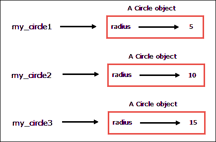

# Python 中的对象和类

> 原文：<https://overiq.com/python-101/objects-and-classes-in-python/>

最后更新于 2020 年 9 月 22 日

* * *

有两种常用的编程范例:

1.  编程。
2.  面向对象编程。

## 编程

编程使用一系列步骤来告诉计算机做什么。过程编程广泛使用过程，我们可以把过程看作是执行特定任务的函数，例如计算员工的激励、将数据保存到数据库、运行备份等等。过程编程背后的中心思想是创建可重用的函数来操作数据。这种方法没有错，但是随着程序的增长，它变得很难管理。到目前为止，我们编写的所有程序都是程序性的，因为它们广泛依赖程序/函数来执行各种任务。

## 面向对象编程

面向对象编程围绕着对象而不是过程。对象是包含数据以及对数据进行操作的过程的实体。对象内部的数据和过程分别称为属性和方法。在创建对象之前，我们首先必须定义一个类。类只是一个模板，我们在其中定义属性和方法。当我们定义一个类时，我们实际上创建了一个新的数据类型。需要注意的是，类只是一个蓝图，它自己什么也做不了。要使用一个类，我们必须创建基于该类的对象。对象也称为类的实例、类的实例或仅仅是实例。从类创建对象的过程称为实例化类，我们可以根据需要创建任意多的对象。

## 定义类

定义类的语法如下:

```py
class class_name(parent_class_name):
    <method_1_definition>
    ...
    <method_n_definition>

```

类定义分为两部分:类头和类体。

类头以`class`关键字开始，后跟类名，括号内是可选的`parent_class_name`。`class_name`和`parent_class_name`可以是任何有效的标识符。

`parent_class_name`类是指你要继承的类。这就是所谓的继承。如果您在定义类时没有指定父类名，它将被自动设置为`object`。我们将在第[课中更详细地讨论继承和 Python 中的多态](https://overiq.com/python-101/inheritance-and-polymorphism-in-python/)。

在下一行，我们有一个类主体，这是我们定义对数据进行操作的方法的地方。方法定义必须同样缩进，否则会出现语法错误。

好了，说够了！现在让我们定义一个类。

在下面的列表中，我们定义了一个类来表示`Circle`。一个`Circle`类定义了一个名为`radius`的属性和三个方法，即`__init__()`、`get_area()`和`get_perimeter()`。

**蟒蛇 101/第 15 章/圆圈. py**

```py
import math

class Circle:

    def __init__(self, radius):
        self.radius = radius

    def get_area(self):
        return math.pi * self.radius ** 2  

    def get_perimeter(self):
        return 2 * math.pi * self.radius

```

[现在试试](https://overiq.com/python-online-compiler/p81/)

让我们一行一行地浏览代码:

在第 1 行，我们正在导入`math`模块，因为我们将在我们的方法中使用它的`pi`常量。

在第 3 行，我们有一个类头，它以`class`关键字开始，后跟类名，在本例中是`Circle`，后跟冒号(`:`)。

在下一行中，我们有一个类主体，其中定义了以下三种方法:

1.  `__init__()`方法。
2.  `get_area()`方法。
3.  `get_perimeter()`方法。

定义方法的语法与定义函数的语法完全相同。

请注意，每个方法都有一个名为`self`的第一个参数。在 Python 中，每个方法都需要`self`参数。`self`参数是指调用该方法的对象。Python 使用`self`参数来知道在类内部操作哪个对象。在调用方法时，不需要向`self`参数传递任何值，当调用方法时，Python 解释器会自动将`self`参数绑定到对象。

在第 5-6 行，我们定义了一个名为`__init__`的方法。`__init__()`是一种特殊的方法，称为初始化器或构造器。每次在内存中创建新对象后都会调用它。初始值设定项方法的目的是用一些初始值创建对象的属性。除了`self`参数，`__init__()`方法期望`radius`参数为`Circle`对象的`radius`属性提供初始值。对象属性通常也称为实例变量。对实例变量进行操作的方法称为实例方法。我们的`Circle`类有两个实例方法`get_perimeter()`和`get_area()`。每个对象都有自己的一组实例变量。这些变量存储对象的数据。实例变量和关键字`self`的范围仅限于类的主体。在一个类中，我们使用`self`来访问对象的属性和方法。例如，我们可以使用`self.var`访问名为`var`的实例变量，使用`self.foo()`调用对象的`foo()`实例方法。

定义构造函数方法(即`__init__()`)不是必需的，如果不定义，Python 会自动提供一个空的`__init__()`方法，该方法什么也不做。

在第 6 行，实例变量`self.radius`被初始化为`radius`变量的值。

```py
self.radius = radius

```

换句话说，上面一行代码为刚刚创建的对象创建了一个名为`radius`的属性，该属性具有初始值。

与实例变量`radius`(左侧)不同的是，赋值运算符的`right`手动端的`radius`变量是一个局部变量，其范围仅限于`__init__()`方法。

在第 8 行到第 9 行，我们定义了`get_area()`实例方法，计算并返回圆的面积。

在第 11 行到第 12 行，我们定义了`get_perimeter()`实例方法，该方法计算并返回圆的周长。

请注意，在`get_area()`和`get_perimeter()`中，我们使用`self.radius`而不仅仅是`radius`来访问实例变量`radius`。

现在我们知道`Circle`类是如何定义的了。让我们创建一些`Circle`类的对象。

## 创建对象

我们可以通过调用类名从类中创建对象，就好像它是一个函数:

```py
ClassName()

```

但是，如果您已经定义了`__init__()`方法，那么您将需要使用如下参数调用类名:

```py
ClassName(arguments)

```

参数必须与没有`self`的`__init__()`方法中的参数匹配。否则，你会得到一个错误。

这里有一个例子:

```py
my_circle = Circle(5)

```

上面的陈述做了以下事情:

1.  创建一个`Circle`类的对象。
2.  调用`__init__()`方法，将这个新创建的圆形对象传递给`self`，将另一个参数(即 5)传递给`radius`变量。
3.  为`self`引用的对象创建一个名为`radius`的属性值。
4.  返回`Circle`对象
5.  将`Circle`对象的引用分配给变量`my_circle`。

注意`my_circle`只包含对象的引用(地址)，不包含实际对象。

## 访问属性和方法

一旦我们有了一个类的对象，我们就可以使用以下语法使用它来访问对象的属性(或实例变量)和方法:

```py
object.attribute    # syntax to access attributes
object.method(arguments)    # syntax to access instance methods

```

下面是我们如何访问`Circle`对象的属性和方法。

**蟒蛇 101/第 15 章/circle_client.py**

```py
from circle import *

my_circle = Circle(5)

print("Circle of radius is",my_circle.radius)
print("Area of circle:", format(my_circle.get_area(), ".2f"))
print("Area of perimeter of circle:", format(my_circle.get_perimeter(), ".2f"), end="\n\n")

```

[现在试试](https://overiq.com/python-online-compiler/q73/)

**输出:**

```py
Circle of radius is 5
Area of circle: 78.54
Area of perimeter of circle: 31.42

```

请注意，在调用实例方法时，我们没有向`self`参数传递任何值，因为 Python 会自动将对用于调用方法的对象的引用传递给`self`参数。因此在这种情况下，变量`my_circle`引用的对象被传递给`self`参数。但是，不允许在代码中将参数传递给`self`参数。如果你试图这样做，你会出错。例如:

**蟒蛇 101/第 15 章/传递参数给自己**

```py
from circle import *

my_circle = Circle(5)
my_circle.get_area(my_circle)
my_circle.get_perimeter(my_circle)

```

[现在试试](https://overiq.com/python-online-compiler/r8w/)

**输出:**

```py
Traceback (most recent call last):
  File "passing_argument_to_self.py", line 4, in <module>
    my_circle.get_area(my_circle)
TypeError: get_area() takes 1 positional argument but 2 were given

```

我们还可以使用以下语法更改对象的属性:

```py
object.attribute = new_val

```

以下代码将`my_circle`对象的`radius`属性的值从`5`更改为`10`。

```py
my_circle.radius = 10

```

最后，我们可以创建任意多的对象。每个对象都有自己的一组属性。更改一个对象的属性不会影响其他对象的属性。例如:

**蟒蛇 101/第 15 章/多重 _ 物体. py**

```py
from circle import *

my_circle1 = Circle(5)
my_circle2 = Circle(10)
my_circle3 = Circle(15)

print("Address of Circle objects")
print("my_circle1:", id(my_circle1))  # print the address of Circle object referenced by variable my_circle1
print("my_circle2:", id(my_circle2))  # print the address of Circle object referenced by variable my_circle2
print("my_circle3:", id(my_circle3))  # print the address of Circle object referenced by variable my_circle3
print()

print("Address of radius attribute")
print("my_circle1:", id(my_circle1.radius)) # print the address of my_circle1's radius attribute
print("my_circle2:", id(my_circle2.radius)) # print the address of my_circle2's radius attribute
print("my_circle3:", id(my_circle3.radius), end="\n\n")  # print the address of my_circle3's radius attribute

print("Initial value of radius attribute: ")
print("my_circle1's radius:", my_circle1.radius)
print("my_circle2's radius:", my_circle2.radius)
print("my_circle3's radius:", my_circle3.radius, end="\n\n")

# changing radius attribute of circle objects
my_circle1.radius = 50
my_circle2.radius = 100
my_circle3.radius = 150

print("After changing radius attribute of circle objects", end="\n\n")

print("Final value of radius attribute: ")
print("my_circle1's radius:", my_circle1.radius)
print("my_circle2's radius:", my_circle2.radius)
print("my_circle3's radius:", my_circle3.radius)

```

[现在试试](https://overiq.com/python-online-compiler/vlV/)

**输出:**

```py
Address of Circle objects
my_circle1: 5236440
my_circle2: 5236608
my_circle3: 32036008

Address of radius attribute
my_circle1: 1586284752
my_circle2: 1586284912
my_circle3: 1586285072

Initial value of radius attribute: 
my_circle1's radius: 5
my_circle2's radius: 10
my_circle3's radius: 15

After changing radius attribute of circle objects

Final value of radius attribute: 
my_circle1's radius: 50
my_circle2's radius: 100
my_circle3's radius: 150

```

`my_circle1`、`my_circle2`和`my_circle3`是指存储在`distinct`存储位置的三个不同的`Circle`对象。除此之外，每个对象的属性也存储在不同的内存位置。



下面是另一个创建名为`BankAccount`的类的例子。这个类的对象模拟一个银行帐户，允许用户检查余额，取款和存款。

**蟒蛇 101/第 15 章/银行账户. py**

```py
class BankAccount:

    def __init__(self, balance):
        self.balance = balance

    def make_deposit(self, amount):
        self.balance += amount

    def make_withdrawal(self, amount):
        if self.balance < amount:
            print("Error: Not enough funds")
        else:
            print("Successfully withdrawn $", amount, sep="")
            self.balance -= amount

    def get_balance(self):
        return self.balance

my_account = BankAccount(5000)   # Create my bank account with $5000
print("Current Balance: $", my_account.get_balance(), sep="")

print("Withdrawing $10000 ...")
my_account.make_withdrawal(10000)

print("Lets try withdrawing $1000 ...")
my_account.make_withdrawal(1000)

print("Now Current Balance: $", my_account.get_balance(), sep="")

print("Depositing $2000 ...")
my_account.make_deposit(2000)
print("Now Current Balance: $", my_account.get_balance(), sep="")

```

[现在试试](https://overiq.com/python-online-compiler/wVJ/)

**输出:**

```py
Current Balance: $5000
Withdrawing $10000 ...
Error: Not enough funds
Lets try withdrawing $1000 ...
Successfully withdrawn $1000
Now Current Balance: $4000
Depositing $2000 ...
Now Current Balance: $6000

```

## 隐藏对象的属性

默认情况下，对象的属性在类外部可见。这就是为什么我们能够分别在`Circle`和`BankAccount`类之外访问`radius`和`balance`属性的原因。大多数情况下，我们不会在类外访问对象的属性，因为这可能会导致属性数据的意外损坏。根据目前的情况，我们的两个程序(`circle.py`和`bank_account.py`)都允许在类外访问对象属性，因为我们的程序有以下限制:

1.  `BankAccount`对象中的`balance`属性非常敏感，因为它直接改变了账户余额。理想情况下，我们希望只有当有人存款或取款时，余额`attribute`才会发生变化。从目前的情况来看，任何人都可以增加或减少`balance`属性，而无需存取任何资金。

    ```py
    my_account = BankAccount(5000) # Initially account is created with $2000 balance
    my_account.balance = 0  # well now your balance is 0

    ```

    [现在试试](https://overiq.com/python-online-compiler/xnJ/)

    像这样的错误肯定会导致使用这种程序的公司破产。

2.  `Circle`对象的`radius`属性必须包含一个正数，但此时没有任何东西阻止我们在其中存储一个字符串或列表。

    ```py
    my_circle = Circle(4)
    my_circle.radius = "www"

    ```

    [现在试试](https://overiq.com/python-online-compiler/yoV/)

我们可以通过限制对类外对象属性的访问，以及实现访问器和变异器方法来防止这些问题。

Python 中的数据隐藏可以通过定义私有属性来实现。我们可以通过用两个下划线字符(`__`)来定义私有属性的名称。因此，如果我们将`self.balance`和`self.radius`分别更改为`self.__balance`和`self.__radius`，那么我们将无法访问类外的`radius`和`balance`属性。同样，我们可以通过用两个前导下划线(`__`)来定义一个私有方法。私有属性和方法只能在类内部访问。如果你试图在类外访问它们，你会得到一个错误。

为了使属性值可以在类外访问，我们使用访问器方法。存取方法只是一种返回对象属性值但不改变它的方法。它们也通常被称为吸气剂方法或简称吸气剂，通常以单词`get`开头。下面是访问器方法的一般格式。

```py
def get_attributeName(self):
    return self.attributeName

```

同样，我们可以有变异方法。将值存储到对象属性的方法称为 mutator 方法。当我们需要改变或设置对象属性的值时，我们调用 mutator 方法。除了为对象的属性设置值之外，它们还可以提供额外的验证，以便在将数据分配给对象的属性之前对其进行验证。Mutator 方法通常也称为 setter 方法或 setter。它的一般格式是:

```py
def set_attributeName(self, newvalue):
    ## add data validation here
    self.attributeName = newvalue

```

这是对`Circle`类的重写，它使`radius`属性成为私有的，并且还为`radius`属性实现了 getter 和 setter 方法。

**蟒 101/第-15 章/改良 _ 圈. py**

```py
import math

class Circle:

    def __init__(self, radius):
        self.__radius = radius  #

    def get_area(self):
        return math.pi * self.__radius ** 2

    def get_perimeter(self):
        return 2 * math.pi * self.__radius

    # getter method for radius attribute

    def get_radius(self):
        return self.__radius

    # setter method for radius attribute

    def set_radius(self, radius):
        if not isinstance(radius, int):
            print("Error: ", radius, "is not an int")
            return
        self.__radius = radius

```

[现在试试](https://overiq.com/python-online-compiler/zvr/)

注意`set_radius()`方法只能接受整数参数，如果传递任何其他类型的数据，都会报错。`set_radius()`中的数据验证是使用`isinstance()`功能实现的。`isinstance()`功能用于测试给定对象的类型。它的语法是:

```py
isinstance(object, class_name)

```

`object`代表我们要测试的对象，`class_name`代表类名。如果`object`是`class_name`的实例，那么`isinstance()`返回`True`。否则`False`。

现在考虑下面的 shell 会话。

```py
>>>
>>> from improved_circle import Circle
>>>
>>> c = Circle(6)
>>>
>>> c.__radius
Traceback (most recent call last):
  File "<stdin>", line 1, in <module>
AttributeError: 'Circle' object has no attribute '__radius'
>>>
>>> c.get_radius()  # get the initial value of __radius attribute
6
>>>
>>> c.set_radius("a radius")  # trying to set invalid value
Error:  a radius is not an int
>>>
>>> c.get_radius()  # value of __radius attribute is still same
6
>>>
>>> c.set_radius(10) # this time operation succeeds
>>>
>>> c.get_radius()  #  get the new value of __radius attribute 
10
>>>

```

[现在试试](https://overiq.com/python-online-compiler/zvr/)

在第 6 行，我们试图访问`Circle`对象的`__radius`属性，但是我们得到`AttributeError`错误，因为`__radius`属性是私有的。要在类外获取或设置`__radius`属性的值，请分别使用`get_radius()`和`set_radius()`。

在第 11 行，我们使用`get_radius()` getter 方法来访问`Circle`对象的`__radius`属性的值。

在第 14 行，我们试图使用`set_radius()`方法为`__radius`属性设置一个无效值，这就是为什么我们得到一个错误。

在第 20 行，我们再次尝试使用`set_radius()`方法为`__radius`属性设置值，但这次操作成功了。

## 将对象作为参数传递给函数

就像内置对象一样，我们可以将用户定义类的对象传递给函数或方法。

以下程序显示了如何将类型为`Circle`的对象传递给名为`print_circle_info()`的函数。

**python 101/第 15 章/objects_as_arguments.py**

```py
from improved_circle import Circle

c1 = Circle(5.4)
c2 = Circle(10.5)

def print_circle_info(circle_obj):
    print("#########################")
    print("Radius of circle", format(circle_obj.get_radius(), "0.2f"))
    print("Perimeter of circle", format(circle_obj.get_perimeter(), "0.2f"))
    print("Area of circle", format(circle_obj.get_area(), "0.2f"))
    print("#########################", end="\n\n")

print_circle_info(c1) # passing circle object c1 to print_circle_info()
print_circle_info(c2) # passing circle object c2 to print_circle_info()

```

[现在试试](https://overiq.com/python-online-compiler/ANB/)

**输出:**

```py
#########################
Radius of circle 5.40
Perimeter of circle 33.93
Area of circle 91.61
#########################

#########################
Radius of circle 10.50
Perimeter of circle 65.97
Area of circle 346.36
#########################

```

* * *

* * *