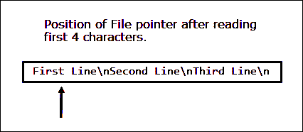

# Python 中的文件处理

> 原文：<https://overiq.com/python-101/file-handling-in-python/>

最后更新于 2020 年 7 月 27 日

* * *

到目前为止，在本课程中，我们一直使用变量来存储数据。这种方法的问题是，一旦程序结束，我们的数据就会丢失。永久存储数据的一种方法是将其放入文件中。本章讨论如何在文件中存储数据以及从文件中读取数据。

在 Python 中，文件处理包括以下三个步骤:

1.  打开文件。
2.  处理文件，即执行读或写操作。
3.  关闭文件。

## 文件类型

有两种类型的文件:

1.  文本文件
2.  二进制文件

可以使用文本编辑器查看其内容的文件称为文本文件。文本文件只是一系列 ASCII 或 Unicode 字符。Python 程序、HTML 源代码都是一些文本文件的例子。

二进制文件存储数据的方式与存储在内存中的方式相同。mp3 文件、图像文件、word 文档是二进制文件的一些例子。您不能使用文本编辑器读取二进制文件。

在本课中，我们将讨论如何处理这两种类型的文件。

我们开始吧。

## 打开文件

在对文件执行任何操作之前，必须先将其打开。Python 提供了一个名为`fopen()`的函数来打开文件。它的语法是:

```py
fileobject = open(filename,  mode)

```

`filename`是文件的名称或路径。

`mode`是一个字符串，它指定了您想要对文件执行的类型操作(即读、写、追加等)。下表列出了您可以使用的不同模式。

| 方式 | 描述 |
| --- | --- |
| `"r"` | 打开文件进行阅读。如果文件不存在，你将得到`FileNotFoundError`错误。 |
| `"w"` | 打开文件进行写入。在这种模式下，如果指定的文件不存在，将创建该文件。如果文件存在，那么它的数据就被销毁了。 |
| `"a"` | 以追加模式打开文件。如果文件不存在，此模式将创建文件。如果文件已经存在，那么它会将新数据附加到文件的末尾，而不是像`"w"`模式那样销毁数据。 |

我们还可以指定文件的类型(即文本文件或二进制文件。)我们希望在`mode`字符串中通过追加`'t'`来处理文本文件，追加`'b'`来处理二进制文件。但是由于文本模式是默认模式，所以在文本模式下打开文件时通常会省略。

成功后，`open()`返回一个与调用时指定的`filename`相关联的文件对象。

以下是一些如何打开文件的示例:

**例 1:**

```py
f = open("employees.txt", "rt")

```

该语句打开文本文件`employees.txt`进行阅读。由于文本模式是默认的，上面的语句也可以写成:

```py
f = open("employees.txt", "r")

```

**例 2:**

```py
f = open("teams.txt", "w")

```

该语句以写模式打开文本文件。

**例 3:**

```py
f = open("teams.dat", "wb")

```

该语句以写模式打开二进制文件。

**例 4:**

```py
f = open("teams.dat", "ab")

```

该语句以追加模式打开二进制文件。

除了使用相对文件路径，我们还可以使用绝对文件路径。例如:

```py
f = open("/home/tom/documents/README.md", "w")

```

该语句以写模式打开位于`/home/tom/documents/`目录中的文本文件`README.md`。

在 Windows 中，使用绝对路径名时记得转义反斜杠，否则会出错。例如:

```py
f = open("C:\\Users\\tom\\documents\\README.md", "w")

```

我们也可以通过在字符串前面指定`r`字符来使用称为“原始字符串”的东西，如下所示:

```py
f = open(r"C:\Users\tom\documents\README.md", "w")

```

`r`字符使 Python 将字符串中的每个字符都视为文字字符。

## 关闭文件

一旦我们处理完文件或者我们想以其他模式打开文件，我们应该使用文件对象的`close()`方法关闭文件，如下所示:

```py
f.close()

```

关闭文件会释放宝贵的系统资源。万一忘记关闭文件，当程序结束或者程序中不再引用文件对象时，Python 会自动关闭文件。但是，如果您的程序很大，并且您正在读取或写入多个文件，这可能会占用系统上大量的资源。如果你一直不小心打开新文件，你可能会耗尽资源。所以，做一个好的程序员，一写完就关闭文件。

## 文本包装类

`open()`函数返回的文件对象是`_io.TextIOWrapper`类型的对象。类`_io.TextIOWrapper`提供了帮助我们读写文件的方法和属性。下表列出了`_io.TextIOWrapper`类的一些常用方法。

| 方法 | 描述 |
| --- | --- |
| `read([num])` | 从文件中读取指定数量的字符，并将其作为字符串返回。如果省略`num`，则读取整个文件。 |
| `readline()` | 读取一行并将其作为字符串返回。 |
| `readlines()` | 逐行读取文件内容，并将它们作为字符串列表返回。 |
| `write(str)` | 将字符串参数写入文件，并返回写入文件的字符数。 |
| `seek(offset, origin)` | 将文件指针从原点移动到给定的偏移量。 |
| `tell()` | 返回文件指针的当前位置。 |
| `close()` | 关闭文件 |

## 将数据写入文本文件

以下程序演示了如何将数据写入文件:

**python 101/第 18 章/writing_to_file.py**

```py
f = open("readme.md", "w")

f.write("First Line\n")
f.write("Second Line\n")
f.write("Third Line\n")

f.close()

```

在第 1 行，我们使用`open()`方法以写模式打开文本文件。如果`readme.md`文件不存在，`open()`方法将创建该文件。如果文件已经存在，那么它的数据将被覆盖。运行程序，然后打开`readme.md`文件。应该是这样的:

**蟒蛇 101/第 18 章/readme.md**

```py
First Line
Second Line
Third Line

```

让我们仔细看看`write()`方法是如何将数据写入文件的。

文件中的所有读写操作都从文件指针开始。什么是文件指针？文件指针只是一个标记，用于记录文件中读取或写入的字节数。该指针在每次读或写操作后自动移动。

打开文件时，文件指针指向文件的开头。`write()`功能从当前文件位置开始写入，然后递增文件指针。例如，下图显示了每次写入操作后文件指针的位置。


请注意，与`print()`函数不同，`write()`方法不会自动在字符串末尾打印换行符(`\n`)。我们也可以使用`print()`功能将数据写入文件。让我们使用`help()`功能仔细看看`print()`的签名。

```py
>>>
>>> help(print)
Help on built-in function print in module builtins:

print(...)
    print(value, ..., sep=' ', end='\n', file=sys.stdout, flush=False)

    Prints the values to a stream, or to sys.stdout by default.
    Optional keyword arguments:
    file:  a file-like object (stream); defaults to the current sys.stdout.
    sep:   string inserted between values, default a space.
    end:   string appended after the last value, default a newline.
    flush: whether to forcibly flush the stream.

>>>

```

注意函数签名中的第四个参数，即`file`。默认情况下，`file`指向标准输出意味着将数据打印到屏幕上。要向文件输出数据，只需指定文件对象。以下程序使用`print()`功能代替`write()`将数据写入文件。

**python 101/第 18 章/writing _ data _ using _ print _ function . py**

```py
f = open("readme.md", "w")

print("First Line", file=f)
print("Second Line", file=f)
print("Third Line", file=f)

f.close()

```

这个程序产生和以前一样的输出，唯一的区别是，在这种情况下，换行符(`\n`)是由`print()`功能自动添加的。

## 从文本文件中读取数据

要读取文件，您必须在`"r"`模式下打开它。除此之外，您还应该确保您想要读取的文件已经存在，因为在`"r"`模式下，`open()`函数在找不到文件时会抛出`FileNotFoundError`错误。

要测试文件是否存在，我们可以从`os.path`模块使用`isfile()`功能。`isfile()`的句法是:

```py
isfile(path)

```

如果在给定路径`isfile()`找到文件，则返回`True`。否则`False`。下面的 shell 会话演示了`isfile()`功能的工作。

```py
>>>
>>> import os
>>>
>>> os.path.isfile("/home/q/python101/Chapter-18/readme.md")  # file exists
True
>>>
>>> os.path.isfile("/home/q/python101/Chapter-18/index.html")  # file doesn't exists
False
>>>

```

以下程序演示了如何使用`read()`、`readline()`和`readlines()`功能读取文件。

**示例 1:** 使用`read()`方法立即读取数据。

**蟒蛇 101/第 18 章/read_method_demo.py**

```py
f = open("readme.md", "r")

print(f.read())  # read all content at once

f.close()

```

**输出:**

```py
First Line
Second Line
Third Line

```

**示例 2** :使用`read()`方法读取数据块。

**蟒蛇 101/第 18 章/阅读 _in_chunks.py**

```py
f = open("readme.md", "r")

print("First chunk:", f.read(4), end="\n\n")    # read the first 4 characters
print("Second chunk:", f.read(10), end="\n\n")  # read the next 10 character
print("Third chunk:", f.read(), end="\n\n")     # read the remaining characters 

f.close()

```

**输出:**

```py
First chunk: Firs

Second chunk: t Line
Sec

Third chunk: ond Line
Third Line

```

当文件以读取模式打开时，文件指针指向文件的开头。


读取前 4 个字符后，文件指针位于`t`。



读取后面 10 个字符后，文件指针在字符`o`处。


对`read()`的第三次调用读取文件中剩余的字符，并将它们作为字符串返回。此时，文件位置指针指向文件的末尾。因此，对`read()`方法的任何后续调用都会返回一个空字符串。


**示例 3** :使用`readline()`从文件中读取数据。

**蟒蛇 101/第 18 章/readline_method_demo.py**

```py
f = open("readme.md", "r")

# read first line
print("Ist line:", f.readline())  

# read the fist two characters in the second line
print("The first two characters in the 2nd line:", f.read(2), end="\n\n")

# read the remaining characters int the second line
print("Remaining characters in the 2nd line:", f.readline())

# read the next line
print("3rd line:", f.readline())  

# end of the file reached, so readline returns an empty string ""
print("After end of file :", f.readline())  

f.close()

```

**输出:**

```py
Ist line: First Line

The first two characters in the 2nd line: Se

Remaining characters in the 2nd line: cond Line

3rd line: Third Line

After end of file :

```

打开文件时，文件指针通常指向文件的开头。


对`readline()`方法的第一次调用将文件指针移动到下一行的开始。


`read()`功能然后从文件中读取两个字符，这将文件指针移动到字符`c`。


在第 10 行中，再次调用`readline()`，但这次它开始从字符`c`读取到行尾(包括换行符)。


在第 13 行中，再次调用`readline()`，读取最后一行。此时，文件位置指针在文件的末尾。这就是为什么第 16 行的`readline()`调用返回一个空字符串(`""`)。


**示例 4** :使用`readlines()`从文件中读取数据。

**蟒蛇 101/第 18 章/readline _ method _ demo . py**

```py
f = open("readme.md", "r")

# read all the line as return and them as a list of strings
print(f.readlines())   

f.close()

```

**输出:**

```py
['First Line\n', 'Second Line\n', 'Third Line\n']

```

## 读取大文件

`read()`和`readlines()`方法适用于小文件。但是如果你的文件有几千或几百万行呢？在这种情况下，使用`read()`或`readlines()`可能会导致记忆猪。更好的方法是使用循环，以小块读取文件数据。例如:

**蟒蛇 101/第 18 章/reading _ large _ file _ demo 1 . py**

```py
f = open("readme.md", "r")

chunk = 10  # specify chunk size
data = ""

# keep looping until there is data in the file
while True:
    data = f.read(chunk)
    print(data, end="")

    # if end of file is reached, break out of the while loop
    if data == "":
        break

f.close()

```

**输出:**

```py
First Line
Second Line
Third Line

```

这里我们使用一个无限循环来迭代文件的内容。一旦到达文件末尾，`read()`方法返回一个空字符串(`""`)，如果第 12 行的条件为真，`break`语句导致循环终止。

Python 还允许我们使用 for 循环来循环使用文件对象的文件数据，如下所示:

**python 101/第 18 章/reading _ large _ files _ using _ for _ loop . py**

```py
f = open("readme.md", "r")

for line in f:
    print(line, end="")

f.close()

```

**输出:**

```py
First Line
Second Line
Third Line

```

## 将数据追加到文本文件

我们可以使用`"a"`模式将数据追加到文件末尾。下面的程序演示了如何将数据追加到文件的末尾。

**python 101/第 18 章/append_data.py**

```py
f = open("readme.md", "a")

print("Appending data to the end of the file ...")
f.write("Fourth Line\n")
f.write("Fifth Line\n")
print("Done!")

f.close()

## open the file again

print("\nOpening the file again to read the data ...\n")

f = open("readme.md", "r")

for line in f:
    print(line, end="")

f.close()

```

**输出:**

```py
Appending data to the end of the file ...
Done!

Opening the file again to read the data ...

First Line
Second Line
Third Line
Fourth Line
Fifth Line

```

## 使用 with 语句处理文件

Python 还使用`with`语句为文件处理提供了一个很好的快捷方式。以下是`with`语句用于文件时的一般形式。

```py
with open(filename, mode) as file_object:
    # body of with statement
    # perform the file operations here

```

这个快捷方式最大的好处是它可以自动关闭文件，而不需要你做任何工作。with 语句体中的语句必须同样缩进，否则会出错。`file_object`变量的范围仅限于`with`语句的正文。如果你试图在块外调用`read()`或`write()`方法，你会得到一个错误。

下面的例子展示了我们如何使用`with`语句来读写文件中的数据。

**例 1** :使用 for 循环逐行读取数据。

**蟒蛇 101/第 18 章/with_statement.py**

```py
with open("readme.md", "r") as f:
    for line in f:
        print(line, end="")

```

**输出:**

```py
First Line
Second Line
Third Line
Fourth Line
Fifth Line

```

**例 2** :使用`read()`方法一次读取所有数据。

**蟒蛇 101/第 18 章/with_statement2.py**

```py
with open("readme.md", "r") as f:
    print(f.read())

```

**输出:**

```py
First Line
Second Line
Third Line
Fourth Line
Fifth Line

```

**例 3** :小块读取大文件。

**蟒蛇 101/第 18 章/with_statement3.py**

```py
with open("readme.md", "r") as f:
    chunk = 10  # specify chunk size
    data = ""

    # keep looping until there is data in the file
    while True:
        data = f.read(chunk)
        print(data, end="")

        # if end of file is reached, break out of the while loop
        if data == "":
            break

```

**输出:**

```py
First Line
Second Line
Third Line
Fourth Line
Fifth Line

```

**示例 4** :使用`write()`方法将数据写入文件

**蟒蛇 101/第 18 章/with_statement4.py**

```py
with open("random.txt", "w") as f:
    f.write("ONE D\n")
    f.write("TWO D\n")
    f.write("THREE D\n")
    f.write("FOUR D\n")

```

## 读取和写入二进制数据

以下程序将二进制数据从源文件(`source.jpg`)复制到目标文件(`dest.jpg`)。

**python 101/第 18 章/reading _ and _ writing _ binary _ data . py**

```py
f_source = open("source.jpg", "rb")
f_dest = open("dest.jpg", "wb")

char_count = 0

for line in f_source:
    char_count += len(line)
    f_dest.write(line)

print(char_count, "characters copied successfully")

f_source.close()
f_dest.close()

```

**输出:**

```py
2115658 characters copied successfully

```

运行程序，它应该在与`source.jpg`相同的目录下创建`dest.jpg`文件。

* * *

* * *