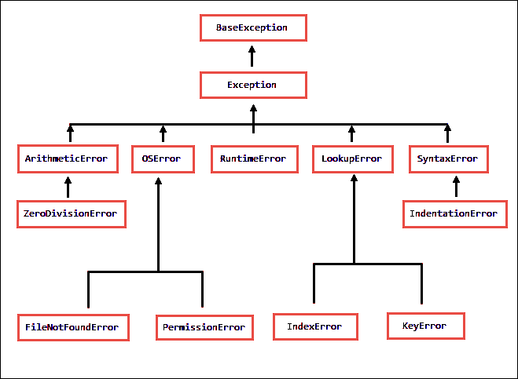

# Python 中的异常处理

> 原文：<https://overiq.com/python-101/exception-handling-in-python/>

最后更新于 2020 年 9 月 22 日

* * *

异常处理是一种机制，它允许我们在程序运行时优雅地处理错误，而不是突然终止程序执行。

## 运行时错误

运行时错误是程序运行时发生的错误。请注意，运行时错误并不表示程序的结构(或语法)有问题。当出现运行时错误时，Python 解释器完全理解您的语句，但它就是不能执行它。但是，由于程序结构不正确，会出现语法错误。这两种类型的错误一遇到就停止程序的执行，并显示一条错误消息(或追溯)，解释问题的可能原因。

以下是运行时错误的一些示例。

**例 1** :除以零。

```py
>>>
>>> 2/0
Traceback (most recent call last):
  File "<stdin>", line 1, in <module>
ZeroDivisionError: division by zero
>>>

```

[现在试试](https://overiq.com/python-online-compiler/Qk7/)

**例 2** :将字符串添加到整数中。

```py
>>>
>>> 10 + "12"
Traceback (most recent call last):
  File "<stdin>", line 1, in <module>
TypeError: unsupported operand type(s) for +: 'int' and 'str'
>>>

```

[现在试试](https://overiq.com/python-online-compiler/RlL/)

**示例 3** :试图访问无效索引处的元素。

```py
>>>
>>> list1 = [11, 3, 99, 15]
>>>
>>> list1[10]
Traceback (most recent call last):
  File "<stdin>", line 1, in <module>
IndexError: list index out of range
>>>

```

[现在试试](https://overiq.com/python-online-compiler/Vv5/)

**例 4** :以读取模式打开一个不存在的文件。

```py
>>>
>>> f = open("filedoesntexists.txt", "r")
Traceback (most recent call last):
  File "<stdin>", line 1, in <module>
FileNotFoundError: [Errno 2] No such file or directory: 'filedoesntexists.txt'
>>>
>>>

```

[现在试试](https://overiq.com/python-online-compiler/WPW/)

再次注意，上述所有语句在语法上都是有效的，唯一的问题是当 Python 试图执行它们时，它们进入了无效状态。

程序运行时出现的错误称为异常。当这种情况发生时，我们说 Python 已经引发了一个异常或者抛出了一个异常。每当这种错误发生时，Python 都会创建一个特殊类型的对象，其中包含关于刚刚发生的错误的所有相关信息。例如，它包含发生错误的行号、错误消息(记住这叫做回溯)等等。默认情况下，这些错误只是暂停程序的执行。异常处理机制允许我们在不停止程序的情况下优雅地处理这样的错误。

## try-except 语句

在 Python 中，我们使用`try-except`语句进行异常处理。它的语法如下:

```py
try:
    # try block
    # write code that might raise an exception here
    <statement_1>
    <statement_2>
except ExceptiomType:
    # except block
    # handle exception here
    <handler>

```

代码以单词`try`开头，这是一个保留的关键字，后面跟一个冒号(`:`)。在下一行中，我们有 try block。try 块包含可能引发异常的代码。之后，我们有一个以单词`except`开头的`except`子句，它也是一个保留关键字，后面是一个异常类型和一个冒号(`:`)。在下一行，我们有一个例外块。异常块包含处理异常的代码。像往常一样，try and except 块中的代码必须正确缩进，否则会出错。

以下是`try-except`语句的执行方式:

当 try 块中出现异常时，会跳过 try 块中其余语句的执行。如果引发的异常与`except`子句中的异常类型匹配，则执行相应的处理程序。

如果在 try 块中引发的异常与`except`子句中指定的异常类型不匹配，程序将停止并进行回溯。

另一方面，如果在尝试块中没有引发异常，则跳过除`clause`之外的部分。

让我们举个例子:

**蟒蛇 101/第 19 章/异常处理. py**

```py
try:
    num =  int(input("Enter a number: "))
    result = 10/num
    print("Result: ", result)    

except ZeroDivisionError:
    print("Exception Handler for ZeroDivisionError")
    print("We cant divide a number by 0")

```

[现在试试](https://overiq.com/python-online-compiler/XQk/)

运行程序并输入 0。

**首次运行输出:**

```py
Enter a number: 0
Exception Handler for ZeroDivisionError
We cant divide a number by 0

```

在本例中，第 3 行中的 try 块会引发`ZeroDivisionError`。当异常发生时，Python 会查找具有匹配异常类型的`except`子句。在这种情况下，它会找到一个并在该块中运行异常处理程序代码。请注意，因为在第 3 行中引发了异常，所以会跳过 try 块中语句重置的执行。

再次运行程序，但这次输入一个字符串而不是数字:

**第二次运行输出:**

```py
Enter a number: str
Traceback (most recent call last):
  File "exception_example.py", line 2, in <module>
    num = int(input("Enter a number: "))
ValueError: invalid literal for int() with base 10: 'str'

```

这次我们的程序崩溃了，出现了`ValueError`异常。问题是内置的`int()`只适用于只包含数字的字符串，如果你传递一个包含非数字字符的字符串，它会抛出一个`ValueError`异常。

```py
>>>
>>> int("123")              // that's fine because string only contains numbers
123
>>>
>>> int("str")              // error can't converts characters to numbers
Traceback (most recent call last):
  File "<stdin>", line 1, in <module>
ValueError: invalid literal for int() with base 10: 'str'
>>>

```

由于我们没有带`ValueError`异常的`except`子句，我们的程序因`ValueError`异常而崩溃。

再次运行程序，这次输入`0`以外的整数。

**第三次运行输出:**

```py
Enter a number: 4
Result:  2.5

```

[现在试试](https://overiq.com/python-online-compiler/Y70/)

在这种情况下，try 块中的语句执行时不会引发任何异常，因此`except`子句被跳过。

## 处理多个异常

我们可以添加任意多的`except`子句来处理不同类型的异常。这种`try-except`语句的一般格式如下:

```py
try:
    # try block
    # write code that might raise an exception here
    <statement_1>
    <statement_2>
except <ExceptiomType1>:
    # except block
    # handle ExceptiomType1 here
    <handler>
except <ExceptiomType2>:
    # except block
    # handle ExceptiomType2 here
    <handler>
except <ExceptiomType2>:
    # except block
    # handle ExceptiomType3 here
    <handler>
except:
    # handle any type of exception here
    <handler>

```

以下是它的工作原理:

当异常发生时，Python 会按顺序匹配针对每个`except`子句引发的异常。如果找到匹配项，则执行相应的`except`子句中的处理程序，并跳过其余的`except`子句。

如果引发的异常与最后一个`except`子句之前的任何`except`子句不匹配(第 18 行)，则执行最后一个`except`子句中的处理程序。请注意，最后一个`except`子句前面没有任何异常类型，因此，它可以捕获任何类型的异常。当然，最后一个`except`子句是完全可选的，但是我们通常将它作为捕捉意外错误的最后手段，从而防止程序崩溃。

下面的程序演示了如何使用多个`except`子句。

**python 101/第 19 章/处理多种类型的异常。py**

```py
try:
    num1 = int(input("Enter a num1: "))
    num2 = int(input("Enter a num2: "))

    result = num1 / num2
    print("Result: ", result)

except ZeroDivisionError:
    print("\nException Handler for ZeroDivisionError")
    print("We cant divide a number by 0")

except ValueError:
    print("\nException Handler for ValueError")
    print("Invalid input: Only integers are allowed")

except:
    print("\nSome unexpected error occurred")

```

[现在试试](https://overiq.com/python-online-compiler/Z8v/)

**首次运行输出:**

```py
Enter a num1: 10
Enter a num2: 0

Exception Handler for ZeroDivisionError
We cant divide a number by 0

```

**第二次运行输出:**

```py
Enter a num1: 100
Enter a num2: a13

Exception Handler for ValueError
Invalid input: Only integers are allowed

```

**第三次运行输出:**

```py
Enter a num1: 5000
Enter a num2: 2
Result:  2500

```

下面是另一个示例程序，它要求用户输入文件名，然后将文件内容打印到控制台。

**python 101/第 19 章/异常处理 _while_reading_file.py**

```py
filename = input("Enter file name: ")

try:
    f = open(filename, "r")

    for line in f:
        print(line, end="")

    f.close()

except FileNotFoundError:
    print("File not found")

except PermissionError:
    print("You don't have the permission to read the file")

except:
    print("Unexpected error while reading the file")

```

[现在试试](https://overiq.com/python-online-compiler/163/)

运行程序并指定一个不存在的文件。

**首次运行输出:**

```py
Enter file name: file_doesnt_exists.md
File not found

```

再次运行程序，这次指定一个您无权读取的文件。

**第二次运行输出:**

```py
Enter file name: /etc/passwd
You don't have the permission to read the file

```

再次运行程序，但这次指定一个确实存在的文件，并且您有权限读取它。

**第三次运行输出:**

```py
Enter file name: ../Chapter-18/readme.md
First Line
Second Line
Third Line
Fourth Line
Fifth Line

```

## else and finally 子句

一个`try-except`语句也可以有一个可选的`else`子句，该子句只有在没有引发异常时才会被执行。带有`else`条款的`try-except`声明的一般格式如下:

```py
try:    
    <statement_1>
    <statement_2>
except <ExceptiomType1>:    
    <handler>
except <ExceptiomType2>:    
    <handler>
else:
    # else block only gets executed
    # when no exception is raised in the try block
    <statement>
    <statement>

```

下面是使用`else`子句对上述程序的重写。

**蟒蛇 101/第 19 章/else _ 子句 _demo.py**

```py
import os
filename = input("Enter file name: ")

try:
    f = open(filename, "r")

    for line in f:
        print(line, end="")

    f.close()

except FileNotFoundError:
    print("File not found")

except PermissionError:
    print("You don't have the permission to read the file")

except FileExistsError:
    print("You don't have the permission to read the file")

except:
    print("Unexpected error while reading the file")

else:
    print("Program ran without any problem")

```

[现在试试](https://overiq.com/python-online-compiler/28J/)

运行程序并输入一个不存在的文件。

**首次运行输出:**

```py
Enter file name: terraform.txt
File not found

```

再次运行程序，但这次输入一个确实存在的文件，并且您有访问它的权限。

**第二次运行输出:**

```py
Enter file name: ../Chapter-18/readme.md
First Line
Second Line
Third Line
Fourth Line
Fifth Line
Program ran without any problem

```

不出所料，`else`子句中的语句这次被执行了。`else`子句通常用于在 try 块中的代码成功运行后编写我们想要运行的代码。

同样，我们可以在所有`except`子句之后有一个`finally`子句。`finally`条款下的声明将始终执行，无论是否提出例外。它的一般形式如下:

```py
try:    
    <statement_1>
    <statement_2>
except <ExceptiomType1>:    
    <handler>
except <ExceptiomType2>:    
    <handler>
finally:
    # statements here will always
    # execute no matter what
    <statement>
    <statement>

```

`finally`条款通常用于定义在任何情况下都必须执行的清理动作。如果`try-except`语句有一个`else`子句，那么`finally`子句必须出现在它之后。

以下程序显示了`finally`子句的作用。

**蟒蛇 101/第 19 章/finally _ 子句 _demo.py**

```py
import os
filename = input("Enter file name: ")

try:
    f = open(filename, "r")

    for line in f:
        print(line, end="")

    f.close()

except FileNotFoundError:
    print("File not found")

except PermissionError:
    print("You don't have the permission to read the file")

except FileExistsError:
    print("You don't have the permission to read the file")

except:
    print("Unexpected error while reading the file")

else:
    print("\nProgram ran without any problem")

finally:
    print("finally clause: This will always execute")

```

[现在试试](https://overiq.com/python-online-compiler/36r/)

**首次运行输出:**

```py
Enter file name: little.txt
File not found
finally clause: This will always execute

```

**第二次运行输出:**

```py
Enter file name: readme.md
First Line
Second Line
Third Line
Fourth Line
Fifth Line
Program ran without any problem
finally clause: This will always execute

```

## 异常传播和引发异常

在前面几节中，我们已经学习了如何使用`try-except`语句处理异常。在本节中，我们将讨论谁抛出异常、如何创建异常以及它们如何传播。

异常只是一个由函数引发的对象，它发出信号表示发生了函数本身无法处理的意外情况。函数通过从适当的类创建异常对象引发异常，然后使用`raise`关键字将异常抛出到调用代码，如下所示:

```py
raise SomeExceptionClas("Error message describing cause of the error")

```

我们可以通过创建一个`RuntimeError()`的实例来从我们自己的函数中引发异常，如下所示:

```py
raise RuntimeError("Someting went very wrong")

```

当一个异常在一个函数中被引发并且没有在那里被捕获时，它会自动传播到调用函数(以及堆栈中的任何函数)，直到它被某个调用函数中的`try-except`语句捕获。如果异常到达主模块但仍未处理，程序将终止并显示一条错误消息。

举个例子吧。

假设我们正在创建一个函数来计算一个数的阶乘。由于阶乘仅对正整数有效，传递任何其他类型的数据都会使函数无用。我们可以通过检查参数的类型并在参数不是正整数时引发异常来防止这种情况。这是完整的代码。

**蟒蛇 101/第 19 章/阶乘 py**

```py
def factorial(n):
    if  not isinstance(n, int):
        raise RuntimeError("Argument must be int")

    if n < 0:
        raise RuntimeError("Argument must be >= 0")

    f = 1
    for i in range(n):
        f *= n
        n -= 1

    return f

try:
    print("Factorial of 4 is:", factorial(4))
    print("Factorial of 12 is:", factorial("12"))
except RuntimeError:
    print("Invalid Input")

```

[现在试试](https://overiq.com/python-online-compiler/462/)

**输出:**

```py
Factorial of 4 is: 24
Invalid Input

```

请注意，当使用字符串参数调用`factorial()`函数时(第 17 行)，第 3 行会引发运行时异常。由于`factorial()`函数不处理异常，引发的异常被传播回`main`模块，在那里被第 18 行的`except`子句捕获。

请注意，在上面的例子中，我们已经在`factorial()`函数之外对`try-except`语句进行了编码，但是我们可以很容易地在`factorial()`函数内部进行相同的编码，如下所示。

**蟒蛇 101/第 19 章/处理 _ 异常 _ 内部 _ 阶乘 _ 函数 py**

```py
def factorial(n):

    try:
        if not isinstance(n, int):
            raise RuntimeError("Argument must be int")

        if n < 0:
            raise RuntimeError("Argument must be >= 0")

        f = 1
        for i in range(n):
            f *= n
            n -= 1

        return f

    except RuntimeError:
        return  "Invalid Input"

print("Factorial of 4 is:", factorial(4))
print("Factorial of 12 is:", factorial("12"))

```

[现在试试](https://overiq.com/python-online-compiler/57x/)

**输出:**

```py
Factorial of 4 is: 24
Factorial of 12 is: Invalid Input

```

但是，不建议这样做。通常，被调用的函数会向调用方抛出一个异常，处理该异常是调用代码的职责。这种方法允许我们以不同的方式处理异常，例如，在一种情况下，我们向用户显示错误消息，而在另一种情况下，我们默默记录问题。如果我们在被调用的函数中处理异常，那么每次需要新的行为时，我们都必须更新函数。除此之外，Python 标准库中的所有函数也符合这一行为。库函数只检测问题并引发异常，客户端决定需要做什么来处理这些错误。

现在，让我们看看在深度嵌套的函数调用中引发异常时会发生什么。回想一下，如果在函数内部引发了异常，并且该异常没有被函数本身捕获，那么它将被传递给它的调用方。这个过程一直重复，直到被堆栈中的某个调用函数捕获。考虑下面的例子。

```py
def function3():
    try:

        ...
        raise SomeException()
    statement7
    except ExceptionType4:
        handler
    statement8

def function2():
    try:
        ...
        function3()
        statement5
    except ExceptionType3:
        handler
    statement6

def function1():
    try:
        ...
        function2()
        statement3
    except ExceptionType2:
        handler
    statement4

def main():
    try:
        ...
        function1()
        statement1
    except ExceptionType1:
        handler
     statement2

main()

```

程序执行从调用`main()`函数开始。`main()`功能调用`function1()`、`function1()`调用`function2()`，最后`function2()`调用`function3()`。让我们假设`function3()`可以引发不同类型的异常。现在考虑以下情况。

1.  如果异常类型为`ExceptionType4`，则跳过`statement7`，第 7 行的`except`子句捕捉到它。`function3()`的执行照常进行，`statement8`被执行。

2.  如果异常类型为`ExceptionType3`，则`function3()`的执行被中止(因为没有匹配的`except`子句来处理引发的异常)，并且控制被转移到调用方，即`function2()`，其中`ExceptionType3`由第 17 行的`except`子句处理。跳过`function2()`中的`statement5`，执行`statement6`。

3.  如果异常类型为`ExceptionType2`，则`function3()`中止，控制转移至`function2()`。由于`function2()`没有任何匹配的`except`子句来捕获异常，因此其执行被中止，并且控制被转移到`function1()`，在那里异常被第 26 行的`except`子句捕获。跳过`function1()`中的`statement3`，执行`statement4`。

4.  如果异常是类型`ExceptionType1`，那么控制转移到功能`main()`(因为`function3()`、`function2()`和`function1()`没有匹配的`except`子句来处理异常)，其中异常由第 35 行的`except`子句处理。跳过`main()`中的`statement1`，执行`statement2`。

5.  如果异常类型为`ExceptionType0`。由于没有一个可用的函数能够处理这个异常，程序会以错误消息结束。

## 访问异常对象

现在我们知道如何处理异常，以及在需要的时候抛出异常。我们还没有涉及到的一件事是如何访问函数抛出的异常对象。我们可以使用以下形式的 except 子句来访问异常对象。

```py
except ExceptionType as e

```

从现在开始，每当`except`子句捕捉到类型为`ExceptionType`的异常时，它会将异常对象分配给变量`e`。

下面的示例演示如何访问异常对象:

**蟒蛇 101/第 19 章/访问 _ 异常 _ 对象. py**

```py
def factorial(n):
    if not isinstance(n, int):
        raise RuntimeError("Argument must be int")

    if n < 0:
        raise RuntimeError("Argument must be >= 0")

    f = 1
    for i in range(n):
        f *= n
        n -= 1

    return f

try:
    print("Factorial of 4 is:", factorial(4))
    print("Factorial of 12 is:", factorial("12"))

except RuntimeError as e:
    print("Error:", e)

```

[现在试试](https://overiq.com/python-online-compiler/6W7/)

**输出:**

```py
Factorial of 4 is: 24
Error: Argument must be int

```

请注意，异常对象(第 21 行)打印的错误消息与我们在创建`RuntimeError`对象(第 3 行)时传递的消息相同。

## 创建您自己的例外

到目前为止，在本章中，我们一直在使用内置的异常类，如`ZeroDivisionError`、`ValueError`、`TypeError`、`RuntimeError`等。Python 还允许您创建新的异常类来满足您自己的特定需求。`BaseException`类是 Python 中所有异常类的根。下图显示了 Python 中的异常类层次结构。



我们可以通过从`Exception`内置类中派生出自己的异常类来创建。以下示例显示了如何创建自定义异常。

**蟒蛇 101/第 19 章/无效因子参数异常. py**

```py
class InvalidFactorialArgumentException(Exception):
    def __init__(self, message):
        super().__init__()
        self.message = message

    def __str__(self):
        return self.message

```

**python 101/第 19 章/阶乘 WithCustomException.py**

```py
from InvalidFactorialArgumentException import *

def factorial(n):
    if not isinstance(n, int):
        raise InvalidFactorialArgumentException("Argument must be int")

    if n < 0:
        raise InvalidFactorialArgumentException("Argument must be >= 0")

    f = 1
    for i in range(n):
        f *= n
        n -= 1

    return f

try:
    print("Factorial of 4 is:", factorial(4))
    print("Factorial of 12 is:", factorial("12"))

except InvalidFactorialArgumentException as e:
    print("Error:", e)

```

[现在试试](https://overiq.com/python-online-compiler/79w/)

**输出:**

```py
Factorial of 4 is: 24
Error: Argument must be int

```

* * *

* * *