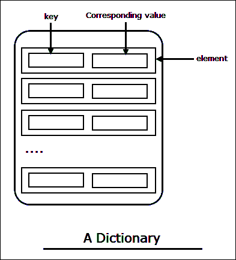

# Python 中的字典

> 原文：<https://overiq.com/python-101/dictionary-in-python/>

最后更新于 2020 年 9 月 23 日

* * *

字典是另一种内置的数据类型，它允许我们存储键值对的集合。



如图所示。字典中的每个元素都有两个部分:键和值。

把字典想象成一个列表，不像列表，然而，存储在字典中的元素没有特定的顺序，我们使用一个键来访问一个特定的值。大多数时候，键是一个字符串，但它可以是任何不可变的类型，如 int、float、tuple、string 等。每个键映射到一个值，所以我们不能有重复的键。字典是可变的对象，这意味着我们可以在创建之后添加、移除或更新元素。

## 创建词典

我们可以使用以下语法创建字典:

```py
variable_name = {
    'key1' : 'value1',
    'key1' : 'value1',
    ...
    'keyN' : 'valueN',
}

```

这里有一个例子:

```py
>>>
>>> contacts = {
...     "tom": "122-444-333",
...     "jim": "412-1231-121",
...     "ron": "8912-121-1212",
...     "jake": "333-1881-121"
... }
>>>
>>> contacts   
{'jim': '412-1231-121', 'jake': '333-1881-121', 'tom': '122-444-333', 'ron': '89
12-121-1212'}
>>>

```

[现在试试](https://overiq.com/python-online-compiler/RPL/)

这个语句创建了一个包含 4 个元素的字典。第一个元素中的键是`"tom"`，对应的值是`"122-444-333"`。其余元素的创建方式相同。虽然我在字典中缩进了每个元素，但这不是必需的。这里这么做只是为了可读性。

请注意，元素在控制台中的显示顺序与它们的创建顺序不同。这表明字典中的元素没有特定的存储顺序。

要创建空字典，请执行以下操作:

```py
>>>
>>> empty_dict = {}
>>>

```

[现在试试](https://overiq.com/python-online-compiler/V75/)

回想一下 Python 中的[集合，我们也使用花括号(`{}`)来创建集合。当`{}`创建一个空字典时，使用`set()`构造函数创建一个空集合，如下所示:](/python-101/sets-in-python/)

```py
>>>
>>> empty_set = set()  # create an empty set
>>> type(empty_set)
<class 'set'>
>>>

```

我们也可以使用`dict()`构造函数来创建一个字典对象，但是语法有点不同。`dict()`函数要求您传递关键字参数，而不是用冒号(`:`)分隔的键值对。下面是我们如何使用`dict()`构造函数创建相同的`contacts`字典。

```py
>>>
>>> dict_contacts = dict(
...    tom = "122-444-333",
...    jim = "412-1231-121",
...    ron = "8912-121-1212",
...    jake = "333-1881-121"
... )
>>>

```

[现在试试](https://overiq.com/python-online-compiler/WQW/)

这个语句创建了完全相同的字典。有些人更喜欢`dict()`函数而不是花括号`{}`，因为`dict()`函数不需要在按键周围加引号。这只是个人喜好的问题，你可以自由选择你想要的任何东西。在本指南中，我们将使用`{}`语法来创建词典。

## 从字典中访问值

如前所述，字典中元素的顺序可能会有所不同。因此，我们不能使用元素的索引位置来访问该值。相反，我们使用一把钥匙。要从字典中访问值，我们使用以下语法:

```py
dict_name[key]

```

```py
>>>
>>> contacts = {
...     "tom": "122-444-333",
...     "jim": "412-1231-121",
...     "ron": "8912-121-1212",
...     "jake": "333-1881-121"
... }
>>>
>>> contacts['ron']
'8912-121-1212'
>>>
>>> contacts['tom']
'122-444-333'
>>>

```

[现在试试](https://overiq.com/python-online-compiler/Xrk/)

如果指定的键不存在，将引发`KeyError`异常。

```py
>>>
>>> contacts['jane']
Traceback (most recent call last):
  File "<stdin>", line 1, in <module>
KeyError: 'jane'
>>>
>>>

```

[现在试试](https://overiq.com/python-online-compiler/Yy0/)

## 添加和修改值

我们可以使用以下语法向字典中添加新元素:

```py
dict_name[key] = value

```

这里有一个例子:

```py
>>>
>>> contacts['jane'] = '443-123-991'  # adding new element
>>>
>>> contacts
{
    'jim': '412-1231-121', 
    'jake': '333-1881-121', 
    'tom': '122-444-333', 
    'jane': '443-123-991', 
    'ron': '8912-121-1212'
}
>>>

```

[现在试试](https://overiq.com/python-online-compiler/pk1/)

如果关键字已经存在于字典中，那么它的值将被更新。

```py
>>>
>>> contacts['jane'] = '443-123-000'  # update Jane's number
>>>
>>> contacts['jane']
'443-123-000'
>>>
>>>

```

[现在试试](https://overiq.com/python-online-compiler/Zzv/)

## 删除元素

要从字典中删除一个元素，我们使用`del`语句。`del`语句的语法如下:

```py
del dict_name[key]

```

这里有一个例子:

```py
>>>
>>> del contacts['ron']
>>>
>>> contacts
{
    'jim': '412-1231-121', 
    'jake': '333-1881-121', 
    'tom': '122-444-333', 
    'jane': '443-123-000'
}
>>>

```

[现在试试](https://overiq.com/python-online-compiler/1G3/)

如果关键字在字典中不存在，则会引发`KeyError`异常。

```py
>>>
>>> del contacts['ron']
Traceback (most recent call last):
  File "<stdin>", line 1, in <module>
KeyError: 'ron'
>>>

```

[现在试试](https://overiq.com/python-online-compiler/27J/)

## 使用 len()获取字典长度

我们可以使用内置的`len()`函数来统计字典中的元素数量。

```py
>>>
>>> len(contacts)
4
>>>
>>> contacts
{
    'jim': '412-1231-121', 
    'jake': '333-1881-121', 
    'tom': '122-444-333', 
    'jane': '443-123-000'
}
>>>

```

[现在试试](https://overiq.com/python-online-compiler/3yr/)

## 使用 for 循环迭代元素

我们可以使用 for 循环遍历字典中的所有键，如下所示:

```py
>>>
>>> for key in contacts:
...   print(key, end=" ")
...
jim jake tom jane >>>
>>>

```

[现在试试](https://overiq.com/python-online-compiler/4z2/)

一旦我们有了一个密钥，我们就可以访问它相应的值。

```py
>>>
>>> for key in contacts:
...   print(key, ":" , contacts[key])
...
jim : 412-1231-121
jake : 333-1881-121
tom : 122-444-333
jane : 443-123-000
>>>

```

[现在试试](https://overiq.com/python-online-compiler/5Rx/)

## 带字典的成员运算符

`in`和`not in`运算符可以用来测试字典中某个键的存在。以下是一些例子:

```py
>>>
>>> "jane" in contacts     # Does key 'jane' exists in contacts ?
True
>>>
>>> "ron" in contacts      # Does key 'ron' exists in contacts ?
False
>>>
>>> "tom" not in contacts  # Doesn't key 'tom' exists in contacts
False
>>>

```

[现在试试](https://overiq.com/python-online-compiler/6B7/)

## 带字典的比较运算符

我们可以使用`==`和`!=`运算符来测试两个字典是否包含相同的元素。

```py
>>>
>>> marks1 = { 'larry': 90, 'bill': 60}
>>> marks2 = { 'bill': 60, 'larry': 90}
>>>
>>> marks1 ==  marks2 
True
>>>
>>> marks1 !=  marks2
False
>>>

```

[现在试试](https://overiq.com/python-online-compiler/7pw/)

剩余的比较运算符如`<`、`<=`、`>`和`>=`不能用于字典，因为字典中的元素没有特定的存储顺序。

## 词典方法

下表列出了我们可以对字典对象调用的一些常见方法。

| 方法 | 描述 |
| --- | --- |
| `keys()` | 返回仅包含字典中的键的序列。 |
| `values()` | 返回仅包含字典中的值的序列。 |
| `items()` | 返回元组序列，其中每个元组包含一个元素的键和值。 |
| `get(key, [default])` | 返回与`key`相关的值。如果没有找到`key`，则返回`None`。我们还可以提供一个可选的默认值作为第二个参数，在这种情况下，如果没有找到`key`，将返回默认值而不是`None`。 |
| `pop(key)` | 返回与`key`相关的值，然后从字典中删除指定的`key`及其对应的值。如果密钥不存在`KeyError`将引发异常。 |
| `popitem()` | 从字典中移除随机元素并将其作为元组返回。 |
| `copy()` | 创建词典的新副本。 |
| `clear()` | 从字典中移除所有元素。 |

### keys()方法

```py
>>>
>>> contacts.keys()
dict_keys(['jim', 'jane', 'tom', 'jake'])
>>>
>>> type(contacts.keys())
<class 'dict_keys'>
>>>

```

[现在试试](https://overiq.com/python-online-compiler/8Ml/)

`keys()`方法返回类型为`dict_keys`的序列。把`dict_keys`对象想象成一个不可变的列表，你可以在 for 循环中使用它，或者把它的结果传递给其他函数做进一步的处理。如果您想要一个列表或元组，只需将`keys()`方法的结果传递给`list()`或`tuple()`构造函数，如下所示:

```py
>>>
>>> list(contacts.keys())
['jim', 'jane', 'tom', 'jake']
>>>
>>> tuple(contacts.keys())
('jim', 'jane', 'tom', 'jake')
>>>
>>>

```

[现在试试](https://overiq.com/python-online-compiler/9DP/)

### values()方法

```py
>>>
>>> contacts.values()
dict_values(['412-1231-121', '443-123-000', '122-444-333', '333-1881-121'])
>>>
>>> type(contacts.values())
<class 'dict_values'>
>>>
>>> list(contacts.values())
['412-1231-121', '443-123-000', '122-444-333', '333-1881-121']
>>>
>>> tuple(contacts.values())
('412-1231-121', '443-123-000', '122-444-333', '333-1881-121')
>>>

```

[现在试试](https://overiq.com/python-online-compiler/007/)

### items()方法

```py
>>>
>>> contacts.items()
dict_items([
    ('jim', '412-1231-121'), 
    ('jane', '443-123-000'), 
    ('tom', '122-444-333'), 
    ('jake', '333-1881-121')
])
>>>

>>>
>>> type(contacts.items())
<class 'dict_items'>
>>>

```

[现在试试](https://overiq.com/python-online-compiler/gn9/)

`items()`方法返回一个元组序列，其中每个元组包含一个元素的键和值。我们可以使用 for 循环来循环元组，如下所示:

```py
>>>
>>> for k, v in contacts.items():
...    print(key, ":", value)
...
jim : 412-1231-121
jane : 443-123-000
tom : 122-444-333
jake : 333-1881-121
>>>
>>>

```

[现在试试](https://overiq.com/python-online-compiler/j0W/)

请注意，在 for 循环中，我们有两个目标变量`key`和`value`，因为元组有两个元素。for 循环对序列中的每个元组迭代一次。每次循环迭代时，第一个元素(它是一个键)被分配给变量`k`，第二个元素(它是一个值)被分配给变量`v`。这个过程一直持续到字典中有元素为止。

### get()方法

```py
>>>
>>> print(contacts.get('jake'))   
333-1881-121
>>>
>>> print(contacts.get('paul'))
None
>>>
>>> print(contacts.get('paul', "Not found"))
Not found
>>>

```

[现在试试](https://overiq.com/python-online-compiler/krx/)

### pop()方法

```py
>>>
>>> contacts
{
    'jim': '412-1231-121', 
    'jane': '443-123-000', 
    'tom': '122-444-333', 
    'jake': '333-1881-121'
}
>>>
>>> contacts.pop('jim')
'412-1231-121'
>>>
>>> contacts
{
    'jane': '443-123-000', 
    'tom': '122-444-333', 
    'jake': '333-1881-121'
}
>>>
>>> contacts.pop('jim')
Traceback (most recent call last):
  File "<stdin>", line 1, in <module>
KeyError: 'jim'
>>>

```

[现在试试](https://overiq.com/python-online-compiler/l2l/)

### popitem()方法

```py
>>>
>>> contacts.popitem()
('jane', '443-123-000')
>>>
>>> contacts
{'tom': '122-444-333', 'jake': '333-1881-121'}
>>>

```

[现在试试](https://overiq.com/python-online-compiler/mYp/)

### copy()方法

```py
>>>
>>> contacts
{'tom': '122-444-333', 'jake': '333-1881-121'}
>>>
>>> id(contacts)  # address of contacts dictionary
4131208
>>>
>>> copy_contacts = contacts.copy()  # create a copy of the contacts dictionary
>>>
>>> copy_contacts
{'jake': '333-1881-121', 'tom': '122-444-333'}
>>>
>>> id(copy_contacts)   # address of copy_contacts dictionary
4131272
>>>

```

[现在试试](https://overiq.com/python-online-compiler/ng4/)

### clear()方法

```py
>>>
>>> contacts.clear()  # delete all the elements of a dictionary
>>>
>>> contacts 
{}
>>>
>>> copy_contacts    # however, copy_contacts still contains a copy of the original dictionary object
{'jake': '333-1881-121', 'tom': '122-444-333'}
>>>

```

[现在试试](https://overiq.com/python-online-compiler/ojz/)

虽然，我们已经删除了原`contacts`词典，`copy_contacts`仍然包含它的副本。

* * *

* * *