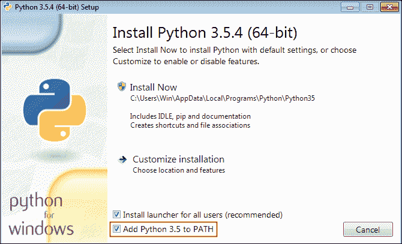
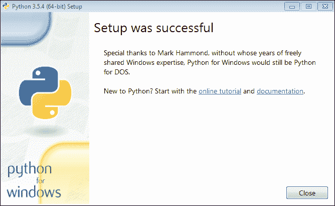

# 安装 Django

> 原文：<https://overiq.com/django-1-11/installing-django/>

最后更新于 2020 年 7 月 27 日

* * *

## 安装 Django

要创建新的 Django 应用，您必须在计算机上安装以下内容:

*   计算机编程语言
*   虚拟环境
*   Django

**注意:**在整个教程中，针对 Ubuntu、Mac 和 Windows 给出了说明。无论您使用哪种操作系统，大多数命令都是相同的。然而，有几个命令因系统而异。如果是这样的话，我已经明确提到了它，并提供了特定于系统的命令。

我们先从 Windows 上安装 Python 开始。

## 在 Windows 上安装 Python

从[这里](https://www.python.org/downloads/windows/)下载 Python 3.5 安装程序。一旦下载完成；双击启动安装程序，您将看到如下屏幕:



勾选“将 Python 3.5 添加到路径”选项。这允许我们从目录结构中的任何地方执行 Python，而无需指定 Python 可执行文件的绝对路径。要开始安装，请单击“立即安装”。然后，安装程序将在您的系统上安装 Python。完成后，单击“完成”按钮关闭安装程序。



## 在 Windows 上测试安装

要测试 Python 安装是否成功，请打开命令提示符并键入以下命令:

```py
C:\Users\Win>python --version
Python 3.5.4

C:\Users\Win>

```

## Python 包管理器或画中画

在 Python 中，我们使用`pip` (Python 包索引)来安装和管理在[https://pypi.python.org/pypi](https://pypi.python.org/pypi)提供的不同包(或库)。需要注意的是`pip`本身是一个包，用于安装其他包。Windows 的 Python 安装程序会自动安装`pip`，所以你不需要做其他事情。要检查系统上安装的`pip`版本，请执行以下命令。

```py
C:\Users\Win>pip3 --version
pip 9.0.1 from c:\users\win\appdata\local\programs\python\python35\lib\site-packages (python 3.5)
```

## 在 Linux 上安装 Python

现在几乎所有的现代 Linux 发行版都安装了 Python 3.5 或更高版本。要检查您的发行版上的 Python 版本，请键入以下命令:

```py
$ python3 --version
Python 3.5.2

```

如您所见，我已经安装了 Python 3.5，这意味着我已经为下一步做好了准备。如果你的系统有 Python 3.4 或 3.6，你可以很好地遵循，而不必安装 Python 3.5。请记住，Django 1.11 可以与 Python 2.7、3.4、3.5 和 3.6 一起使用。

如果由于某种原因，您的发行版没有安装 Python 或者没有任何旧版本的 Python，那么您将不得不手动安装 Python。要在像 Ubuntu 这样的基于 Debian 的系统上安装 Python 3.5，请键入以下命令:

```py
$ sudo add-apt-repository ppa:fkrull/deadsnakes
$ sudo apt-get update
$ sudo apt-get install python3.5

```

如果您使用的是基于红帽的系统，如 Fedora，请键入以下内容:

```py
$ sudo dnf install python35

```

与 Windows 不同，在 Linux 中，你必须手动安装`pip`。无论 Python 是预装在您的发行版中，还是您手动安装的，都是如此。要在基于 Debian 的系统上安装`pip`，请键入以下命令:

```py
$ sudo apt-get install python3-pip

```

要在基于红帽的系统上安装`pip`，请键入以下命令:

```py
$ sudo dnf install python3-pip

```

## 在 Linux 上测试安装

如果您已经手动安装了 Python，您可以使用以下命令来测试 Python 安装。

```py
$ python3.5 --version
Python 3.5.2    

$ pip3 --version
pip 8.1.1 from /usr/lib/python3/dist-packages (python 3.5)

```

## 在苹果操作系统上安装 Python

从[这里](https://www.python.org/downloads/mac-osx/)下载 Python 安装程序。下载完成后，双击启动安装程序并完成常规安装步骤。与 Windows 不同，Mac OS 的 Python 安装程序不会提示您将 Python 可执行文件添加到`PATH`环境变量中，而是会自动添加。除此之外，苹果的 Python 安装程序也安装了`pip`，所以你不需要做其他任何事情。

## 在苹果操作系统上测试安装

```py
$ python3 --version
Python 3.5.2
$
$ pip3 --version
pip 9.0.1 from /usr/local/bin/site-packages (python 3.5)

```

## 用 Virtualenv 创建虚拟环境。

使用`mkdir`命令创建名为`djangobin`的新目录，如下所示:

```py
$ mkdir djangobin

```

我们将使用这个文件夹来存储我们的 Django 应用。我们的应用将是一个代码共享网站，允许用户创建、管理和搜索代码片段。你可以在[https://djangosnippets.org](https://djangosnippets.org)看到这样一个网站的真实例子。

你可以在任何地方创建`djangobin`目录，位置并不重要。我正在使用 Ubuntu，我已经在我的主目录中创建了这个目录。完成后，使用`cd`命令将当前工作目录更改为`djangobin`，如下所示:

```py
$ cd djangobin

```

我们现在准备创建一个虚拟环境。

一个[虚拟环境](/how-to-use-virtualenv/)帮助我们在机器上运行 Python/Django 项目的孤立实例，而不会相互冲突。要理解虚拟环境背后的理念，请考虑以下示例:

假设我们正在为两个不同的客户开发两个项目，一个博客和一个论坛。我们的博客使用版本 2 的`super_lib`库，而我们的论坛使用版本 1。在给定的时间点，我们的系统上只能安装一个版本的`super_lib`。我们不能同时拥有两个版本。虚拟环境帮助我们解决这些问题。

将虚拟环境视为单独的 Python 安装。安装后，您使用`pip`在那里安装的任何库都不会与系统范围的 Python 安装中可用的库冲突。

创建这些隔离环境所需的包称为`virtualenv`。

要在 Ubuntu/Mac OS 上安装`virtualenv`，请使用`pip3`而不是`pip`。

```py
$ pip3 install virtualenv

```

要在 Windows 上安装`virtualenv`，打开命令提示符，键入以下命令。

```py
$ pip install virtualenv

```

要创建虚拟环境，请键入`virtualenv`命令，后跟虚拟环境的名称。例如:

```py
$ virtualenv env

```

该命令将在当前工作目录
( `djangobin`)内创建一个名为`env`的目录。`env`的目录结构应该是这样的:

```py
env/
├── bin/
├── include/
├── lib/
└── pip-selfcheck.json

```

`env`目录包含一个单独的 Python 安装。您在此安装的任何库或包都将放在`env/lib/python3.5/site-packages`目录中，而不是全局`site-packages`目录中。您可以使用以下命令打印全局`site-packages`的路径:

```py
$ python3 -c "from distutils.sysconfig import get_python_lib; print(get_python_lib())"

```

默认情况下，`virtualenv`使用安装它的 Python 版本创建虚拟环境。换句话说，如果您在 Python 3.5 下将`virtualenv`作为一个包安装，那么这就是 Python 的版本，它将在虚拟环境中可用。

要指定 Python 的任何其他版本，请使用如下的`-p`选项:

```py
$ virtualenv env -p /usr/bin/python2.7

```

这将使用 Python 2.7 而不是 3.5 创建一个虚拟环境。

## 激活虚拟环境

在上一步中，我们已经创建了我们的虚拟环境。现在要使用它，我们首先要激活它。要在 Linux 或 Mac 操作系统中激活虚拟环境，请键入以下命令:

```py
$ source env/bin/activate
(env) $

```

Windows 用户可以使用以下命令:

```py
C:\Users\Win>env\Scripts\activate.bat
(end) C:\Users\Win>

```

注意提示字符串前面的`(env)`，表示名为`env`的虚拟环境已经启动运行。从这一点开始，您使用`pip`添加或删除的任何包都只会影响该虚拟环境。您的系统级 Python 安装将保持不变。我们可以使用`pip list`命令查看这个虚拟环境中安装的软件包。

```py
(env) $ pip list
Package    Version
---------- -------
pip        10.0.1 
setuptools 39.2.0 
wheel      0.31.1 
(env) $:

```

这个虚拟环境安装了 3 个软件包。需要注意的是，一旦虚拟环境处于活动状态，您可以使用`pip`或`pip3`调用 pip。Window、Ubuntu 以及 Mac OS 都是如此。

## 停用虚拟环境

要停用虚拟环境，请键入以下命令:

```py
(env) $ deactivate

```

这个命令对于 Windows、Ubuntu 和 Mac 都是一样的。现在我们脱离了虚拟环境。再次运行`pip3 list`命令，但这一次它会显示您系统上安装的所有系统范围的软件包。

```py
$ pip3 list
apt-clone (0.2.1)
apt-xapian-index (0.47)
apturl (0.5.2)
blinker (1.3)
Brlapi (0.6.4)
chardet (2.3.0)
command-not-found (0.3)
cryptography (1.2.3)
decorator (4.2.1)
defer (1.0.6)
dirspec (13.10)
httplib2 (0.9.1)
idna (2.0)
...

```

**注意:**省略号(`...`)表示代码段被截断以节省空间。

在 Windows 上，可以用`pip list`代替`pip3 list`查看系统范围的包。

```py
C:\Users\Win>pip list
certifi (2017.4.17)
chardet (3.0.4)
colorama (0.3.9)
decorator (4.0.11)
httpie (0.9.9)
idna (2.5)
ipython (6.1.0)
ipython-genutils (0.2.0)
...

```

所以这些包在我的系统级 Python 安装中是可用的。你的可能会不一样。

下一步，我们将安装 Django。

## 安装 Django

在本教程中，我们将使用 Django 1.11。要安装 Django，激活虚拟环境，然后键入以下命令。

```py
$ pip3 install django==1.11

```

## 测试安装

在虚拟环境中，输入`python3`启动 Python shell，如果你在 Windows 上，只需输入`python`即可。

```py
(env) $ python3
Python 3.5.2 (default, Nov 23 2017, 16:37:01) 
[GCC 5.4.0 20160609] on linux
Type "help", "copyright", "credits" or "license" for more information.
>>>

```

验证安装是否成功，导入`django`包，调用`get_version()`函数如下。

```py
>>>
>>> import django
>>> 
>>> django.get_version()
'1.11'
>>>

```

如果一切顺利，您应该安装 Django 的版本。如果您遇到任何错误，请完成以上所有步骤，或者在下面的框中发表评论，我们会找出问题所在。

要退出 Python shell，请在 Linux/Mac 中键入`Ctrl+D`或在 Windows 中键入`Ctrl+Z`或只需键入`quit()`。

* * *

* * *