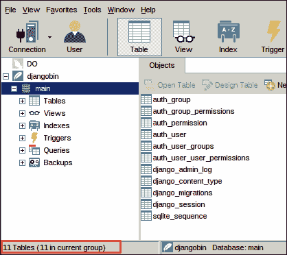

# 创建 Django 项目

> 原文：<https://overiq.com/django-1-11/creating-django-project/>

最后更新于 2020 年 7 月 27 日

* * *

## 创建项目

要创建新的 Django 项目，请确保虚拟环境处于活动状态，并且您当前的工作目录设置为`djangobin`，然后发出以下命令:

```py
$ django-admin startproject django_project

```

该命令将在`djangobin`目录内创建一个名为`django_project`的新目录。`django_project`目录也称为 Django 项目根目录或简称项目根目录。它的目录结构应该如下所示:

```py
django_project/
├── django_project
│   ├── __init__.py
│   ├── settings.py
│   ├── urls.py
│   └── wsgi.py
└── manage.py

1 directory, 5 files

```

在顶层，我们新创建的`django_project`目录包含以下两项。

*   与项目根目录同名的目录，即`django_project`。
*   一个叫做`manage.py`的 Python 脚本。

目录`django_project/django_project`被称为项目配置目录。在其中，您会发现以下四个 python 文件:

| 文件名 | 描述 |
| --- | --- |
| `__init__.py` | 一个特殊的空文件，告诉 Python 当前目录应该被视为 Python 包。 |
| `settings.py` | 这个文件包含了 Django 项目的所有设置和配置。 |
| `urls.py` | 一个 Python 脚本，用于存储 Django 项目的 URL 模式。 |
| `wsgi.py` | 运行开发服务器并将项目部署到生产环境的 Python 脚本。 |

* * *

`manage.py` -一个命令行工具，用于与您的 Django 项目进行交互或维护。我们可以通过简单地执行它来查看该文件提供的各种参数(或子命令)。

```py
$ ./django_project/manage.py 

Type 'manage.py help <subcommand>' for help on a specific subcommand.

Available subcommands:

[auth]
    changepassword
    createsuperuser

[contenttypes]
    remove_stale_contenttypes

[django]
    check
    compilemessages
    createcachetable
    ...    
    startapp
    startproject
    test
    testserver

[sessions]
    clearsessions

[staticfiles]
    collectstatic
    findstatic
    runserver

```

如果您在 Windows 上，请始终在 Python 文件前面加上`python`命令:

```py
C:\Users\overiq\djangobin> python django_project/manage.py

```

最基本的子命令之一是`runserver`(列表中最后一个)，用于运行 Django 开发 web 服务器。让我们看看它是如何完成的。

首先使用`cd`命令将当前工作目录更改为`manage.py`所在的目录，然后执行`runserver`子命令，如下所示:

```py
$ cd django_project
$ ./manage.py runserver
Performing system checks...

System check identified no issues (0 silenced).

You have 13 unapplied migration(s). Your project may not work properly until you apply the migrations for app(s): admin, auth, contenttypes, sessions.
Run 'python manage.py migrate' to apply them.

March 19, 2018 - 08:23:19
Django version 1.11, using settings 'django_project.settings'
Starting development server at http://127.0.0.1:8000/
Quit the server with CONTROL-C.

```

这里有几点需要注意。第一行:

```py
System check identified no issues (0 silenced).

```

表示在您的 Django 项目中没有发现错误。如果有错误，那么`./manage.py runserver`将无法启动服务器。这里需要注意的第二点如下:

```py
You have 13 unapplied migration(s). Your project may not work properly until you apply the migrations for app(s): admin, auth, contenttypes, sessions.
Run 'python manage.py migrate' to apply them.

```

这条线告诉我们项目中有一些未应用的迁移。在 Django，我们使用迁移来改变数据库的状态。不要太担心什么是迁移，我们将在后面的章节中深入讨论。

第三点也是目前最重要的一点是 Django 开发服务器的地址，即`http://127.0.0.1:8000/`。打开你喜欢的浏览器，访问`http://127.0.0.1:8000/`。您应该会看到这样的页面:


停止开发服务器点击`CTRL+C`。

默认情况下`manage.py`总是在端口 8000 启动开发服务器，但是您可以使用以下命令将其更改为其他端口。

```py
$ ./manage.py runserver <port>

```

例如`./manage.py runserver 3000`将在 3000 号港口启动 Django 开发。如果您想打开特定 IP 地址的端口，可以使用以下命令轻松实现:

```py
./manage.py runserver <ip-address>:<port>

```

例如，要在端口 4444 上的 localhost 运行 Django 开发服务器，请发出以下命令。

```py
$ ./manage.py runserver 127.0.0.1:4444

```

每次修改 Python 代码后，Django 开发服务器都会自动重启。因此，您不需要每次都手动重新启动服务器来使更改生效。但是，有些操作，如添加文件，不会触发重启。在这种情况下，您必须手动重新启动服务器。

## 设置数据库

Django 可以与几乎所有流行的数据库一起使用，如 MySQL、Oracle、PostgreSQL(这是 Django 开发人员的首选)、SQLite 等。由于这是一个初学者教程，我们将使用 SQLite 数据库。但是为什么是 SQLite 呢？因为安装和配置 SQLite 数据库不需要额外的步骤。SQLite 已经与 Python 捆绑在一起，因此您不必配置任何东西来使用它。

第一次执行`runserver`命令时，Django 会在项目根目录(即`djangobin/django_project`)中自动创建一个名为`db.sqlite3`的 SQLite 数据库。我们已经执行了一次`runserver`命令，所以此时，您的项目根目录(`djangobin/django_project`)中应该有一个名为`db.sqlite3`的 SQLite 数据库文件。

```py
django_project/
├── db.sqlite3   <-- SQLite database
├── django_project
│   ├── __init__.py
│   ├── settings.py
│   ├── urls.py
│   └── wsgi.py
└── manage.py

```

如果我们没有使用 SQLite 数据库，那么我们可以很容易地在位于项目配置目录(`djangobin/django_project/django_project`)中的`settings.py`文件中指定数据库配置。如前所述，`settings.py`文件包含与我们的 Django 项目相关的所有设置。

打开`settings.py`文件，滚动到一半，直到找到
`DATABASES`设置。`DATABASES`变量包含所有数据库特定的设置。`DATABASES`变量的默认值应该是这样的:

**djangobin/django _ project/django _ project/settings . py**

```py
#...

DATABASES = {
    'default': {
        'ENGINE': 'django.db.backends.sqlite3',
        'NAME': os.path.join(BASE_DIR, 'db.sqlite3'),
    }
}

#...

```

`ENGINE`指定 Django 正在使用的数据库后端的类型。在我们的例子中，我们使用的是 SQLite，这就是为什么它被设置为`django.db.backends.sqlite3`。以下是一些其他后端可供选择:

| 数据库ˌ资料库 | 发动机 |
| --- | --- |
| 关系型数据库 | `django.db.backends.mysql` |
| 神谕 | `django.db.backends.oracle` |
| 一种数据库系统 | `django.db.backends.postgresql` |

`NAME`指定我们正在使用的数据库的名称。由于 SQLite 数据库由单个文件组成，所以它当前指向`db.sqlite3`文件的绝对路径。这就是我们使用 SQLite 数据库所需要的。

要使用像 MySQL 或 PostgreSQL 这样的数据库，我们需要添加一些额外的参数，如`USER`、`PASSWORD`、`HOST`和`PORT`。例如，下面是如何配置 Django 来使用 MySQL 数据库。

```py
DATABASES = {
    'default': {
        'ENGINE': 'django.db.backends.mysql',
        'NAME': 'database_name',
        'USER': 'username',
        'PASSWORD': 'password',
        'HOST': '127.0.0.1',
        'PORT': '5432',
    }
}

```

## Django 应用

在 Django，项目和应用意味着不同的东西。根据 Django 术语，Django 项目是配置和应用的集合，这些配置和应用共同组成了整个网络应用。换句话说，一个项目是一个完整的网络应用，而一个应用只是一个特性。例如，应用可以是博客、评论系统、论坛、聊天室，甚至是联系人表单。所有这些小应用和配置共同构成了一个 Django 项目。

## Django 内置应用

Django 已经捆绑了几个内置应用。要查看这些内置应用，请查看`settings.py`文件顶部的`INSTALLED_APPS`设置。

**djangobin/django _ project/django _ project/settings . py**

```py
#...

INSTALLED_APPS = [
    'django.contrib.admin',
    'django.contrib.auth',
    'django.contrib.contenttypes',
    'django.contrib.sessions',
    'django.contrib.messages',
    'django.contrib.staticfiles',
]

#...

```

如您所见，默认安装了 6 个应用，它们都随 Django 一起提供。下面是每个应用的概要。

*   `django.contrib.admin`-一个管理站点。
*   `django.contrib.auth`——用户管理和认证的框架。
*   `django.contrib.contenttypes`——内容类型的框架。
*   `django.contrib.sessions`-一个会话框架。
*   `django.contrib.messages`-一个消息传递框架。
*   `django.contrib.staticfiles`–管理静态文件的框架。

其中一些应用需要数据库表，而另一些则不需要。回想一下，当我们试图运行 Django 开发服务器时，我们得到了以下警告。

```py
You have 13 unapplied migration(s). Your project may not work properly until you apply the migrations for app(s): admin, auth, contenttypes, sessions.
Run 'python manage.py migrate' to apply them

```

此警告告诉我们“未应用的迁移”。未应用的迁移意味着在所有应用成功运行之前，需要提交一些更改。迁移只是普通的 Python 文件，它描述了我们想要提交给数据库的更改。这些更改可能像重命名列一样微不足道，也可能像创建或更改数据库模式一样复杂。在任何时候，我们都可以使用`manage.py`的`showmigrations`子命令来获取已应用和未应用迁移的列表。

```py
$ ./manage.py showmigrations
admin
 [ ] 0001_initial
 [ ] 0002_logentry_remove_auto_add
auth
 [ ] 0001_initial
 [ ] 0002_alter_permission_name_max_length
 [ ] 0003_alter_user_email_max_length
 [ ] 0004_alter_user_username_opts
 [ ] 0005_alter_user_last_login_null
 [ ] 0006_require_contenttypes_0002
 [ ] 0007_alter_validators_add_error_messages
 [ ] 0008_alter_user_username_max_length
contenttypes
 [ ] 0001_initial
 [ ] 0002_remove_content_type_name
sessions
 [ ] 0001_initial

```

前面的输出显示了所有已安装应用下的未应用迁移文件列表(不带`.py`扩展名)。我们知道这些迁移未被应用，因为迁移名称前面的方括号(`[]`)未被选中。如果它们被应用，我们会在迁移名称前面看到`[x]`。从输出中我们还可以推断出`django.contrib.admin`有 2 个未应用的迁移，`django.contrib.auth`有 8 个，`django.contrib.contenttypes`有 2 个，`django.contrib.sessions`有 1 个未应用的迁移。为了应用这些迁移，我们使用`migrate`子命令。

在终端或命令提示符下，输入以下命令以应用迁移。

```py
$ ./manage.py migrate
Operations to perform:
  Apply all migrations: admin, auth, contenttypes, sessions
Running migrations:
  Applying contenttypes.0001_initial... OK
  Applying auth.0001_initial... OK
  Applying admin.0001_initial... OK
  Applying admin.0002_logentry_remove_auto_add... OK
  Applying contenttypes.0002_remove_content_type_name... OK
  Applying auth.0002_alter_permission_name_max_length... OK
  Applying auth.0003_alter_user_email_max_length... OK
  Applying auth.0004_alter_user_username_opts... OK
  Applying auth.0005_alter_user_last_login_null... OK
  Applying auth.0006_require_contenttypes_0002... OK
  Applying auth.0007_alter_validators_add_error_messages... OK
  Applying auth.0008_alter_user_username_max_length... OK
  Applying sessions.0001_initial... OK

```

再次运行`./manage.py showmigrations`命令。这次您将在每个迁移文件前面看到`[x]`，因为我们刚刚应用了挂起的迁移。

```py
$ ./manage.py showmigrations
admin
 [X] 0001_initial
 [X] 0002_logentry_remove_auto_add
auth
 [X] 0001_initial
 [X] 0002_alter_permission_name_max_length
 [X] 0003_alter_user_email_max_length
 [X] 0004_alter_user_username_opts
 [X] 0005_alter_user_last_login_null
 [X] 0006_require_contenttypes_0002
 [X] 0007_alter_validators_add_error_messages
 [X] 0008_alter_user_username_max_length
contenttypes
 [X] 0001_initial
 [X] 0002_remove_content_type_name
sessions
 [X] 0001_initial
$

```

在这一点上，我们并不期望您完全理解迁移。我们将在第[课“T2 Django 的移民”中详细了解他们。现在，请记住这一点——在 Django，我们使用迁移来创建/更改/删除数据库中的表。我们将在下一节检查由`migrate`子命令创建的表。](/django-1-11/migrations-in-django/)

使用`runserver`子命令再次运行开发服务器。这一次，您将看不到任何关于未应用迁移的警告。

```py
$ ./manage.py runserver
Performing system checks...

System check identified no issues (0 silenced).
March 19, 2018 - 10:01:48
Django version 1.11, using settings 'django_project.settings'
Starting development server at http://127.0.0.1:8000/
Quit the server with CONTROL-C.
[19/Mar/2018 10:01:56] "GET / HTTP/1.1" 200 1716

```

没有必要使用 Django 提供的所有应用。如果您不想使用任何特定的应用，只需将其从列表中删除即可。假设由于某种原因您不想使用`django.contrib.staticfiles`应用，在移除`django.contrib.staticfiles`后，`INSTALLED_APPS`列表将如下所示:

**djangobin/django _ project/django _ project/settings . py**

```py
#...
INSTALLED_APPS = [
    'django.contrib.admin',
    'django.contrib.auth',
    'django.contrib.contenttypes',
    'django.contrib.sessions',
    'django.contrib.messages',    
]
#...

```

但是现在我们什么都需要，所以把`django.contrib.staticfiles`加回`INSTALLED_APPS`列表。最后，`INSTALLED_APPS`的设定应该是这样的:

**djangobin/django _ project/django _ project/settings . py**

```py
#...
INSTALLED_APPS = [
    'django.contrib.admin',
    'django.contrib.auth',
    'django.contrib.contenttypes',
    'django.contrib.sessions',
    'django.contrib.messages',    
    'django.contrib.staticfiles',
]
#...

```

## 查看数据库

在本教程中，我们将使用名为 Navicat 的图形数据库管理程序不时查看我们的 SQLite 数据库的当前状态。像 Navicat 这样的程序使查看表格、以图形方式创建/更改记录变得非常容易，而无需编写一行 SQL。

但是，如果你是一个 SQL 专业人员，并且熟记 SQL 命令，你可以自由地从命令提示符或终端打开`db.sqlite3`文件，并从那里继续。

Navicat 不是免费软件，但是他们提供 30 天的试用期。还有许多其他的免费软件 Sqlite Browser，HeidiSQL，Sqlectron，Valentina Studio，DBeaver 等等，它们可以让你做或多或少相同的事情。

以下是使用 Navicat 打开 SQLite 数据库的说明，其他程序的说明大致相同。

启动 Navicat 高级版，然后转到连接> SQLite。


在新建连接窗口中，指定连接名称，选择“现有数据库文件”，浏览`db.sqlite3`文件所在位置。跳过密码字段，单击窗口底部的“测试连接”按钮。如果连接成功，请关闭对话框并单击“确定”按钮保存连接。如果遇到任何错误，请检查 SQLite 数据库文件的位置，然后重试。


要查看表格，请单击左侧窗格中的连接名称，然后双击“main”。您应该会在窗口的右侧看到一个表格列表，如下所示:



如您所见，目前 SQLite 数据库中有 11 个表。

## 正在创建 Django 应用

要创建一个新的应用，首先要确保你当前的工作目录与`manage.py`文件所在的目录相同。之后，执行以下命令。

```py
$ ./manage.py startapp djangobin

```

该命令将在项目根目录(`djangobin/django_project`)内创建一个名为`djangobin`的新目录。我们新创建的目录的目录结构如下:

```py
djangobin/
├── admin.py
├── apps.py
├── __init__.py
├── migrations
│   └── __init__.py
├── models.py
├── tests.py
└── views.py

1 directory, 7 files

```

以下是每个文件和文件夹的摘要:

| 文件名 | 描述 |
| --- | --- |
| `admin.py` | 该文件包含将 djangobin 应用连接到 Django 提供的管理应用所需的所有配置。我们将在第[课 Django 管理应用](https://overiq.com/django-1-11/django-admin-app/)中详细学习如何操作。 |
| `apps.py` | 该文件包含特定于应用的配置。 |
| `__init__.py` | `__init__.py`文件只是 Python 把这个(`djangobin`)目录当作一个包的说法。 |
| `migrations` | 这个目录将存储我们所有的迁移文件。换句话说，它会将我们所做的所有更改存储在数据库中。 |
| `migrations/__init__.py` | `__init__.py`文件只是 Python 的说法，把这个(`migrations`)目录当成一个包。 |
| `models.py` | 这个文件包含我们的应用模型。换句话说，这是我们定义表和它们之间关系的地方。 |
| `test.py` | 这个文件包含对我们的应用进行单元测试的功能。 |
| `views.py` | 该文件包含处理请求和返回响应的视图函数。 |

我们已经创建了一个新的应用`djangobin`，现在我们必须通知我们的 Django 项目它的存在。为此，打开位于项目配置目录(`djangobin/django_project/django_project`)中的`settings.py`文件，并在`INSTALLED_APPS`列表的末尾追加`'djangobin',`，如下所示:

**djangobin/django _ project/django _ project/settings . py**

```py
#...

INSTALLED_APPS = [
    'django.contrib.admin',
    'django.contrib.auth',
    'django.contrib.contenttypes',
    'django.contrib.sessions',
    'django.contrib.messages',
    'django.contrib.staticfiles',
    'djangobin',
]

#...

```

为了验证 Django 是否获得了我们新的`djangobin`应用，请重新启动服务器。如果您可以成功启动服务器而没有任何错误，那么这意味着您已经为下一步做好了准备。

* * *

* * *