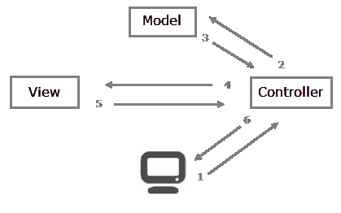

# MVC 模式与 Django

> 原文：<https://overiq.com/django-1-11/mvc-pattern-and-django/>

最后更新于 2020 年 7 月 27 日

* * *

## MVC 模式

在 MVC 框架出现之前，web 编程将数据库代码与页面的服务器端代码混合在一起。如果你已经用像 PHP 这样的语言编程了一段时间，你已经在某种程度上做到了。这个问题并不是 PHP 特有的；事实上，在大多数服务器端语言中，代码至少在三种语言之间共享，例如 Python(或 PHP)、SQL、HTML。

创建 MVC 模式是为了将业务逻辑与表示分离开来。MVC 是当今最流行的架构。许多流行的框架，如 Ruby on Rails、Laravel、CodeIgniter 甚至 Django 都使用它。MVC 架构将应用分为以下三层:

1.  模特。
2.  查看。
3.  控制器。

让我们分别讨论它们。

**模型:**模型表示数据在数据库中的组织方式。换句话说，在 MVC 模式中，我们使用模型来定义我们的数据库表以及它们之间的关系。

**视图:**视图是当你访问一个站点时看到的内容。例如，一篇博客文章，一个联系表等等，都是视图的例子。视图包含最终将发送给客户端的所有信息，即网络浏览器。通常，视图是 HTML 文档。

**控制器:**控制器控制信息流。当您请求一个页面时，该请求被传递给控制器，然后它使用编程逻辑来决定需要从数据库中提取什么信息以及应该将什么信息传递给视图。控制器是 MVC 架构的核心，因为它充当了模型和视图之间的粘合剂。

下面是一个 MVC 博客应用中涉及的步骤的概要。

1.  网络浏览器或客户端将请求发送到网络服务器，要求服务器显示博客文章。
2.  服务器接收的请求被传递给应用的控制器。
3.  控制器要求模型获取博客文章。
4.  模型将博客文章发送给控制器。
5.  然后，控制器将博客文章数据传递给视图。
6.  该视图使用博客文章数据来创建一个 HTML 页面。
7.  最后，控制器将 HTML 内容返回给客户端。

MVC 模式不仅帮助我们创建和维护一个复杂的应用。当涉及到关注点的分离时，它真的会发光。例如，在一个网络开发公司中，有网络设计师，也有开发人员。网页设计师的工作是创建视图。开发人员采用这些视图，并将它们与模型和控制器结合在一起。

## 决哥 MTV

Django 非常接近 MVC 模式，但是它使用的术语略有不同。Django 本质上是一个 MTV(模型-模板-视图)框架。Django 使用术语“视图模板”和“控制器视图”。换句话说，在 Django 中，视图被称为模板，控制器被称为视图。因此，我们的 HTML 代码将在模板中，Python 代码将在视图和模型中。

* * *

* * *