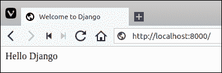
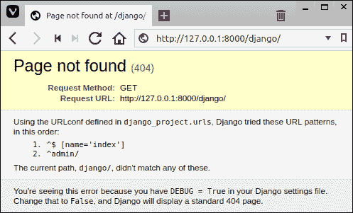
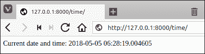
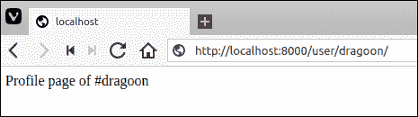
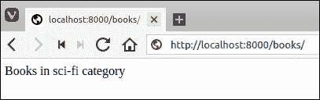
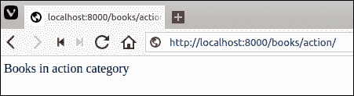
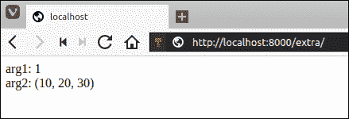
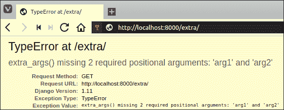
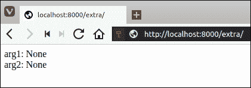

# Django 的视图和 URL 配置

> 原文：<https://overiq.com/django-1-11/views-and-urlconfs-in-django/>

最后更新于 2020 年 7 月 27 日

* * *

在前面的章节中，我们已经学习了如何设置 Django 项目和运行开发服务器。在本章中，我们将学习在 Django 中创建动态网页的基础知识。

## 创建第一个视图

让我们从简单开始。在本节中，我们将创建一个输出“你好，Django”的网页。为此，请在您最喜欢的文本编辑器中打开位于 djangobin 应用(即`djangobin/django_project/djangobin`)中的`views.py`。此时，`views.py`应该是这样的:

**djangobin/django_project/djangobin/views.py**

```py
from django.shortcuts import render

# Create your views here.

```

删除所有内容并输入以下代码。

**djangobin/django_project/djangobin/views.py**

```py
from django.shortcuts import HttpResponse

def index(request):
    return HttpResponse("<p>Hello Django</p>")

```

我们刚刚创建了一个简单的视图函数。

那么什么是视图函数呢？

一种功能，其工作是接受请求并返回正确的响应。

让我们一次添加一行代码。

1.  在第 1 行，我们正在从`django.shortcuts`模块导入`HttpResponse`类。
2.  在第 4-5 行，我们定义了`index()`函数，该函数返回一个`HttpResponse`对象的实例。

每个视图函数都有一个名为`request`的参数，这是一个类型为`HttpRequest`的对象。`HttpRequest`对象包含触发此视图的当前 web 请求的信息。

视图函数必须返回一个`HttpResponse`对象。要创建`HttpResponse`对象，只需将表示页面内容的字符串传递给构造函数。

现在我们已经创建了一个简单的视图。要调用这个视图，您必须在 URL 配置中创建一个 URL 模式，简称为 URLconf。你可以把 URLconf 看作是 Django 支持的网络应用的目录。换句话说，URLconf 是 URL 和应该为这些 URL 调用的视图函数之间的映射。这是 Django 的说法，这个 URL 调用这个视图函数，那个 URL 调用那个视图函数，等等。

我们使用`url()`函数创建网址模式。它接受两个参数，一个匹配网址的正则表达式和为该网址调用的视图函数的名称。

让我们创建一个网址模式。打开位于 Django 项目配置目录中的`urls.py`文件(即`djangobin/django_project/django_project`)。这个文件也被称为全网站`urls.py`。`urls.py`文件的内容应该是这样的。

**djangobin/django _ project/django _ project/URLs . py**

```py
from django.conf.urls import url
from django.contrib import admin

urlpatterns = [
    url(r'^admin/', admin.site.urls),
]

```

**注意:**为了节省空间，从上面的代码片段中删除了注释。

要将`index()`视图函数绑定到 URL 模式，我们需要做两件事:

1.  在导入列表的末尾添加`from djangobin import views`。
2.  通过在`urlpatterns`列表的开头添加以下一行来创建新的 URL 模式。

    ```py
    url(r'^$', views.index),

    ```

站点范围内`urls.py`文件的内容现在应该如下所示:

**djangobin/django _ project/django _ project/URLs . py**

```py
from django.conf.urls import url
from django.contrib import admin
from djangobin import views

urlpatterns = [
    url(r'^$', views.index),
    url(r'^admin/', admin.site.urls),
]

```

如果尚未运行，使用`./manage.py runserver`命令启动 Django 开发服务器，并访问`http://127.0.0.1:8000/`。您应该会看到这样的页面:



传递给`url()`函数的第一个参数是正则表达式字符串，第二个参数是视图函数的名称。正则表达式`r'^$'`什么都不匹配。换句话说，`r'^$'`指的是网站的根。如果我们的域是`http://example.com/`，那么对`http://example.com/`的请求将调用`index()`查看功能。当用户请求`http://example.com/`时，Django 使用`urlpatterns`列表来决定调用哪个方法。当它找到匹配的网址模式时，它会调用与该模式相关联的视图函数。如果没有找到匹配的模式，将返回一个 HTTP 404 错误。

别忘了 Django 所说的视图实际上是一个控制器。

`url()`函数接受许多其他可选参数，其中一个参数是`name`关键字参数。`name`关键字参数允许我们为 URL 模式指定一个唯一的名称。那么我们为什么要给我们的网址模式命名呢？定义名称允许我们在模板和视图中自动创建网址。我们将在第[课中看到如何在 Django](/django-1-11/creating-urls-and-custom-response/#reversing-url-patterns)创建网址。现在，让我们给我们新创建的网址模式命名。

**djangobin/django _ project/django _ project/URLs . py**

```py
from django.conf.urls import url
from django.contrib import admin
from djangobin import views

urlpatterns = [
    url(r'^$', views.index, name='index'),
    url(r'^admin/', admin.site.urls),
]

```

## Django 404 错误

我们的 URLconf 目前只包含两种 URL 模式——一种是由 Django 提供的，另一种是我们自己编写的。那么如果你请求一个不同的网址会发生什么呢？打开浏览器，尝试访问`http://127.0.0.1:8000/django/`。

如果请求的网址与 URLconf 中任何现有的网址模式都不匹配，那么 Django 将抛出一个 404 错误。由于请求的网址没有在 URLconf 中定义，Django 将抛出一个 HTTP 404 未找到错误。以下是它的外观:



关于这个页面需要注意的重要一点是，它给出的信息比要求的要多。请注意，它确切地告诉了 Django 在抛出 HTTP 404 错误之前尝试了哪些 URL 模式。当然，这是敏感信息，应该只向参与开发网络应用的人披露。

那么，如果这个信息是敏感的，那么为什么 Django 首先要透露这一切呢？

因为默认情况下 Django 项目安装时将`DEBUG`模式设置为`True`。要查看此设置，请在位于`djangobin/django_project/django_project`的 Django 项目配置目录中打开`settings.py`。

**djangobin/django _ project/django _ project/settings . py**

```py
#...

# SECURITY WARNING: keep the secret key used in production secret!
SECRET_KEY = '#=5=zv^cmqse-d=@#qp8f1bbto=235pz=we723*rt9is_$&hu)'

# SECURITY WARNING: don't run with debug turned on in production!
DEBUG = True

ALLOWED_HOSTS = []

#...

```

要关闭调试模式，请将`DEBUG`的值设置为`False`。当调试模式关闭时，Django 输出一个没有任何敏感信息的通用 HTTP 404 响应。由于我们目前处于开发阶段，请将`DEBUG`设置为`True`。

## 以正确的方式映射网址

目前，我们的 Django 项目中只有一个名为 djangobin 的应用。一般来说，一个项目至少由 3-4 个应用组成。如果我们继续为整个网站的`urls.py`文件中的每个应用编写 URLconf，很快就会变得一团糟。因此，我们可以通过为每个应用创建“T2”来使我们的应用模块化，而不是直接将网址映射到整个站点`urls.py`，这样我们就可以更有效、更容易地管理网址。为此，首先在 djangobin 应用中创建`urls.py`文件，并向其中添加以下代码。

**决哥/决哥 _ 项目/决哥/URL . py】**

```py
from django.conf.urls import url
from . import views

urlpatterns = [
    url(r'^$', views.index, name='index'),
]

```

在第 1 行和第 2 行，我们正在导入必要的功能和模块。在第 4 行，我们正在为 djangobin 应用创建 URLconf。

下一步是将 djangobin 应用的 URLconf 通知给 Django 项目。为此，按如下方式修改站点范围内的`urls.py`:

**djangobin/django _ project/django _ project/URLs . py**

```py
from django.conf.urls import url, include
from django.contrib import admin

urlpatterns = [
    url(r'^index/', include('djangobin.urls')),
    url(r'^admin/', admin.site.urls),
]

```

`include()`功能告诉整个站点的`urls.py`文件在 djangobin 应用中存在`urls.py`。这里需要注意的重要一点是，在正则表达式中`r'^index/'`没有尾随的`$`字符，而是有一个尾随的斜线`/`。这样做是因为每当 Django 遇到`include()`函数时，它都会砍掉与该点匹配的网址部分，并将网址的剩余部分发送到包含的 URLconf 进行进一步处理。

但是，我们想在根网址`http://127.0.0.1:8000/`而不是`http://127.0.0.1:8000/index/`显示`hello world`，为此，请将正则表达式`r'^index/'`替换为`r''`。

**djangobin/django _ project/django _ project/URLs . py**

```py
from django.conf.urls import url, include
from django.contrib import admin

urlpatterns = [
    url(r'', include('djangobin.urls')),
    url(r'^admin/', admin.site.urls),
]

```

打开浏览器，导航至`http://127.0.0.1:8000/`。Django 将以`"Hello Django"`回应迎接您。

## 深入挖掘网址

让我们看看当你请求一个页面时会发生什么。

1.  当你请求一个页面时，Django 做的第一件事就是删除 URL 的主机部分，例如，在 URL `https://overiq.com/contact/`中，主机部分是`overiq.com`。

2.  然后，Django 从 Django 项目的`settings.py`文件中读取变量`ROOT_URLCONF`的值。那么`ROOT_URLCONF`有什么作用呢？

`ROOT_URLCONF`包含必须首先加载的 URLconf。它也被称为根 URLconf 或站点范围 URLconf。在我们的例子中，它指向位于`djangobin/django_project/django_project`目录中的`urls.py`。

**djangobin/django _ project/django _ project/settings . py**

```py
#...

ROOT_URLCONF = 'django_project.urls'

#...

```

1.  读取`ROOT_URLCONF`后，Django 用请求的 URL 逐一检查根 URLconf 中的每个 URL 模式，直到找到匹配。如果没有找到模式，将返回 404 错误。

2.  另一方面，如果找到一个模式，那么 Django 调用相关的视图函数。如果`url()`函数的第二个参数包含对`include()`函数的调用，那么 Django 会将网址中与该点匹配的部分去掉，并将网址的剩余部分发送到包含的 URLconf 进行进一步处理。

这里有一个例子:

假设请求的 URL 是`http://example.com/time/`，Django 做的第一件事就是移除 URL 的主机部分。剥离宿主部分后`http://example.com/time/`变成`/time/`。然后对字符串`/time/`逐个检查每个网址模式，直到找到匹配。如果找到匹配，则调用相应的视图函数。否则，将返回一个 HTTP 404 错误。

## 输出动态数据

我们在上面部分创建的视图函数非常简单，尽管如此，它还是向您介绍了一些基本概念，如视图函数、URL 模式以及 Django 如何在幕后处理 URL。在我们的下一个视图中，我们将输出一些动态内容。让我们创建一个简单的网页来输出当前的日期和时间。如果你做过一些 Python 编程，那么你可能已经知道 Python 有`datetime`模块来处理日期和时间。以下是如何使用它的快速复习:

```py
>>>
>>> import datetime
>>>
>>> current_datetime = datetime.datetime.now()
>>>
>>> current_datetime
datetime.datetime(2017, 1, 24, 13, 59, 42, 135163)
>>>
>>> print(current_datetime)
2017-01-24 13:59:42.135163
>>>

```

需要注意的是，上面的代码片段是纯 Python，与 Django 无关。要返回当前日期和时间，我们首先必须创建一个新视图。在 djangobin app 中打开`views.py`，在`index()`视图功能下方新增一个名为`today_is()`的视图功能，如下所示:

**djangobin/django_project/djangobin/views.py**

```py
from django.http import HttpResponse
import datetime

def index(request):
    return HttpResponse("<p>Hello Django</p>")

def today_is(request):
    now = datetime.datetime.now()
    html = "<html><body>Current date and time: {0}</body></html>".format(now)
    return HttpResponse(html)

```

让我们浏览一下在`views.py`文件中所做的更改:

1.  在第 2 行，我们添加了一个导入语句来导入`datetime`模块，这样我们就可以计算当前的日期和时间。

2.  在第 9-12 行，我们定义了`today_is()`函数。在第 10 行，我们通过调用`now()`方法计算当前日期和时间，并将结果分配给`now`变量。在第 11 行，我们使用字符串对象的`format()`方法创建一个 HTML 响应。字符串中的`{0}`只是当前日期和时间的占位符，将被变量`now`的值替换。需要注意的是，变量`now`代表的是一个`datetime.datetime`对象，而不是一个常规的字符串，但是当`now`的值代替`{0}`打印在字符串内部时，`datatime.datetime`对象的`__str__()`方法将`datatime.datetime`对象转换为字符串。最后，视图返回一个包含生成响应的`HttpResponse()`对象。

有了视图功能，让我们创建一个新的 URL 模式来调用这个视图。打开 djangobin app 的`urls.py`并添加以下 URL 模式调用`today_is()`查看功能如下:

**决哥/决哥 _ 项目/决哥/URL . py】**

```py
from django.conf.urls import url
from . import views

urlpatterns = [
    url(r'^time/$', views.today_is, name='time'),
    url(r'^$', views.index, name='index'),
]

```

我们添加了一个新的网址模式，将`/time/`网址映射到`today_is()`视图功能。你现在可能已经掌握了窍门。如果尚未运行，请启动服务器并访问`http://127.0.0.1:8000/time/`。如果一切顺利，Django 会告诉你现在的日期和时间。



## 创建动态网址

动态网址是包含一个或多个影响网页输出的可变部分的网址。到目前为止，我们只创建了静态网址。

让我们创建另一个视图来显示用户配置文件。在`views.py`文件中添加`profile()`查看功能如下:

**djangobin/django_project/djangobin/views.py**

```py
#...
def today_is(request):
    #...

def profile(request):
    return HttpResponse("<p>Profile page of user</p>")

```

如果用户访问网址路径`/user/<username>/`，我们希望显示用户配置文件，其中`<username>`是分配给每个用户的唯一字母数字标识符。

匹配字母数字字符的正则表达式是`^[A-Za-z1-3]+$`。因此，网址模式`^/user/[A-Za-z0-9]+/$`将匹配像`/user/cs101/`、`/user/james/`、`/user/100ninja/`、`/user/1000`等网址路径。但是不会匹配`/user/string#$$$/`、`/user/high five/`、`/user/_10days/`等 URL 路径。

我们的网址模式`^/user/[A-Za-z0-9]+/$`工作得很好，但是有一个问题。要显示用户配置文件，我们需要在查看功能的 URL 中访问用户名。有两种方法可以解决这个问题。第一种方法包含一点小技巧，第二种方法相当简单。

回想一下，视图函数的`request`参数包含触发视图的当前 web 请求的所有信息。`request`对象有一个名为`path`的属性，它返回主机名后的网址部分。例如，如果用户请求`http://127.0.0.1:8000/user/foo/`，那么`request.path`将返回`/user/foo/`。现在，你只需要去掉`/user/`和尾部斜线，你就完成了。

第二种解决方案很简单，因此推荐使用。为了将 URL 参数传递给视图函数，我们使用了一种叫做正则表达式组或简称为组的东西。我们使用以下语法创建命名组:

```py
(?P<name>pattern)

```

`name`是 Python 标识符，用来指代匹配的子串，`pattern`是实际的正则表达式。Django 在幕后所做的是，它接受命名组，并将其值作为关键字参数传递给视图函数。以下是我们应用命名组后的完整网址模式:

```py
url(r'^user/(?P<username>[A-Za-z0-9]+)/$', views.profile, name='profile')

```

将此网址模式添加到`urlpatterns`列表的末尾，如下所示:

**决哥/决哥 _ 项目/决哥/URL . py】**

```py
#...

urlpatterns = [
    url(r'^time/$', views.today_is, name='todays_time'),
    url(r'^$', views.index, name='djangobin_index'),
    url(r'^user/(?P<username>[A-Za-z0-9]+)/$', views.profile, name='profile'),
]

```

接下来，更新`profile()`视图函数以接受名为`username`的附加参数，如下所示:

**djangobin/django_project/djangobin/views.py**

```py
#...

def profile(request, username):
    return HttpResponse("<p>Profile page of #{}</p>".format(username))

```

从现在开始，像`http://127.0.0.1:8000/user/foo/`这样的 URL 请求将调用`profile()`视图函数，如下所示:

```py
profile(request, username='foo')

```

访问`http://localhost:8000/user/dragoon/`会出现如下用户档案页面:



需要注意的是，无论用于执行匹配的正则表达式是什么，由命名组匹配的子字符串总是作为字符串传递给视图函数。例如:

```py
url(r'^user/(?P<user_id>[0-9]+)/$', views.profile),

```

在这个网址模式中，命名组只匹配整数。换句话说，网址模式将匹配类似`/user/100/`、`/user/9999/`、`/user/1234567/`等网址路径。但是`profile()`视图函数仍将使用字符串值调用:

```py
profile(request, user_id='1000')

```

最后，这里有一些网址模式和它们匹配的网址:

| 网址模式 | 描述 | 示例网址 |
| --- | --- | --- |
| `url(r'^post/\d+/$', viewname)` | 正则表达式`\d+`匹配一个或多个数字 | 该网址模式匹配类似`/post/1/`、`/post/123/`、`/post/9999/`等字符串。但是，与`/post/a/`、`/post/123abc/`、`/post/!@#$%`等不匹配； |
| `url(r'^blog/(?P<slug>[\w-]+)/$', viewname)` | 正则表达式`(?P<slug>[\w-]+)`匹配一个或多个单词字符(字母数字或下划线)或破折号(-)。该正则表达式通常用于匹配 URL 中的 slug | 该网址模式匹配类似`/blog/a-long-hyphenated-title/`、`/blog/mypost/`、`/blog/1111/`等字符串。但与`/blog/?search=query/`、`/blog/%3Apython/`等不匹配； |
| `url(r'^archive/(?P<year>\d{4})/(?P<month>\d{2})/(?P<day>\d{2})/$', viewname)` | 正则表达式`(?P<year>\d{4}+)/(?P<month>\d{2}+)/(?P<day>\d{2}+)/`匹配 ISO 8601 格式的日期，即 YYYY-MM-DD。 | 该网址模式匹配类似`/archive/2010/01/01/`、`/archive/5000/30/30/`、`/archive/9999/99/99/`等字符串；但不匹配`/archive/2018/5/5/`、`/archive/11/11/2018/`等字符串； |
| `url(r'^user/(?P<username>[\w.@+-]+)/$', viewname)` | 正则表达式`(?P<username>[\w.@+-]+)`匹配用户名和电子邮件。 | 该网址模式匹配类似`/user/@draco/`、`/user/foobar007/`、`/user/tinker@mail.com/`等字符串；但不匹配`/user/`、`/user/$w00t/`等字符串； |

## 将网址参数设为可选

偶尔，您会遇到希望将 URL 参数设为可选的情况。

假设我们想在 URL 路径`/books/<category>/`显示一个图书列表，其中`<category>`是图书类别的占位符。访问`/books/self-help/`会显示自助类书籍的列表。然而，访问`/books/`网址，会显示默认科幻类别的书籍。因此，网址路径`/books/<category>/`中的`<category>`是可选的。要完成此任务，请创建两个 URL 模式，一个不带可选参数，另一个带可选参数。

打开`urls.py`文件，添加如下两个网址模式:

**决哥/决哥 _ 项目/决哥/URL . py】**

```py
urlpatterns = [
    url(r'^time/$', views.today_is, name='todays_time'),
    url(r'^$', views.index, name='djangobin_index'),
    url(r'^user/(?P<username>[A-Za-z0-9]+)/$', views.profile, name='profile'),
    url(r'^books/$', views.book_category, name='book_category'),
    url(r'^books/(?P<category>[\w-]+)/$', views.book_category, name='book_category'),
]

```

这里有两件事需要注意。第一，两种网址模式使用相同的视图功能。第二，两种网址模式的名称也是一样的。

接下来，在`views.py`中添加`book_category`查看功能如下:

**djangobin/django_project/djangobin/views.py**

```py
#...
def profile(request, username):
    return HttpResponse("<p>Profile page of #{}</p>".format(username))

def book_category(request, category='sci-fi'):
    return HttpResponse("<p>Books in {} category</p>".format(category))

```

如果您现在访问`http://localhost:8000/books/`，您将看到默认`sci-fi`类别的书籍。



另一方面，如果您访问`http://localhost:8000/books/action/`，您将被显示来自`action`类别的书籍。



## 将额外的参数传递给视图函数

除了 URL 参数，我们还可以向视图函数传递额外的参数，如字典。`url()`函数可以将可选的第三个参数作为字典，包含额外的关键字参数传递给视图函数。内置视图函数通常使用这种技术来定制默认行为(我们将在后面的章节中讨论)。

在`urls.py`文件中，在`urlpatterns`列表的末尾添加名为`extra_args`的新网址模式:

**决哥/决哥 _ 项目/决哥/URL . py】**

```py
urlpatterns = [
    #...
    url(r'^book/(?P<category>[\w-]+)/$', views.book_category, name='book_category'),
    url(r'^extra/$', views.extra_args, {'arg1': 1, 'arg2': (10, 20, 30)},  name='extra_args'),
]

```

接下来，在`views.py`文件的末尾添加一个名为`extra_args`的视图函数:

**djangobin/django_project/djangobin/views.py**

```py
#...
def book_category(request, category='sci-fi'):
    return HttpResponse("<p>Books in {} category</p>".format(category))

def extra_args(request, arg1, arg2):
    return HttpResponse("<p>arg1: {} <br> arg2: {} </p>".format(arg1, arg2))

```

如果您现在访问`http://localhost:8000/extra/`，您将获得以下页面:



请注意，`extra_args()`视图功能中的`arg1`和`arg2`参数是必需的。未能通过它们将导致这样的`TypeError`:



我们可以通过提供一些默认值来使`arg1`和`arg2`成为可选的。修改`extra_args()`接受默认值如下:

**djangobin/django_project/djangobin/views.py**

```py
#...

def extra_args(request, arg1=None, arg2=None):
    return HttpResponse("<p>arg1: {} <br> arg2: {} </p>".format(arg1, arg2))

```

从`extra_args`网址模式中删除词典，访问`http://localhost:8000/extra/`。你会得到这样的回答:



## 视图限制

到目前为止，我们已经能够使用音乐电视模式的视图部分完成一个基本的应用。但是，由于以下原因，我们的应用受到严重限制:

1.  目前，我们正在视图中硬编码 HTML 代码。稍后，如果我们想修改我们的 HTML，逐个查看每个视图将是非常痛苦的。Django 附带了一个强大的模板系统，允许我们轻松创建复杂的 HTML 页面，而不是将它们硬编码在视图中。如果我们直接在视图中硬编码 HTML，我们将无法在 HTML 中使用 Django 模板系统提供的循环或条件语句(我们将在 Django 课程的[模板标签中看到如何使用它们)。](/django-1-11/template-tags-in-django/)

2.  在现实世界中，页面由许多动态组件组成。使用`format()`方法在大页面中嵌入动态内容非常容易出错且繁琐。

3.  在这一点上，我们还没有将数据库引入场景，因为这会造成更多的混乱。

在接下来的章节中，我们将看到将模型和模板与视图结合使用如何帮助我们大大简化所有这些问题。

* * *

* * *