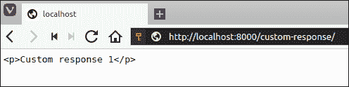
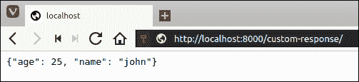
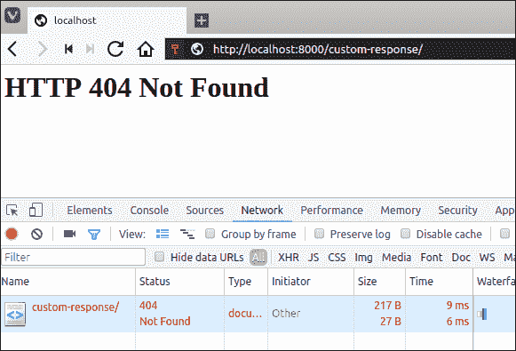
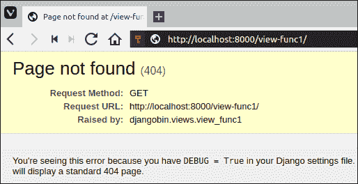
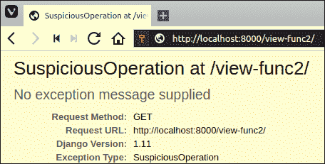
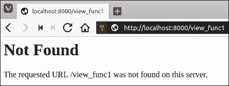
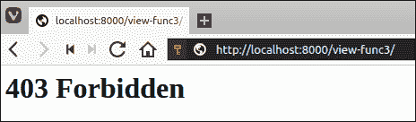

# 创建网址和自定义响应

> 原文：<https://overiq.com/django-1-11/creating-urls-and-custom-response/>

最后更新于 2020 年 7 月 27 日

* * *

## 反转网址模式

从 URL 模式的名称创建 URL 的过程称为反转 URL。那我们为什么要这么做呢？为什么不只是硬编码的网址？

因为在以后，如果你想更新网址结构，你必须手动访问每个 Python 模块和模板来进行更改。另一方面，如果你已经通过反转网址模式创建了网址，你只需要更新`urls.py`文件中的网址模式。模板和模块会自动选择变更。

## 反向()函数

要反转网址，我们使用`reverse()`功能。它接受网址模式的名称，并返回不带主机部分的网址。当`reverse()`无法反转网址时，会引发`NoReverseMatch`异常。要使用这个功能，我们首先要从`django.shortcuts`模块导入。

要查看动作中的`reverse()`方法，通过发出以下命令打开交互式 Python shell。

```py
$ ./manage.py shell
Python 3.5.2 (default, Nov 23 2017, 16:37:01) 
[GCC 5.4.0 20160609] on linux
Type "help", "copyright", "credits" or "license" for more information.
(InteractiveConsole)
>>> 
>>>

```

注意到这里有些不同了吗？好了，这里我们使用`./manage.py shell`而不仅仅是`python`来启动 Python shell。但是为什么呢？因为除了调用 Python 解释器之外`./manage.py shell`还导入了最少的 Django 来使用。我们将这个 Shell 称为 Django Shell。

目前，我们的 djangobin 应用包含以下 6 种网址模式:

**决哥/决哥 _ 项目/决哥/URL . py】**

```py
from django.conf.urls import url
from . import views

urlpatterns = [
    url(r'^time/$', views.today_is, name='time'),
    url(r'^$', views.index, name='index'),
    url(r'^user/(?P<username>[A-Za-z0-9]+)/$', views.profile, name='profile'),
    url(r'^books/$', views.book_category, name='book_category'),
    url(r'^books/(?P<category>[\w-]+)/$', views.book_category, name='book_category'),
    url(r'^extra/$', views.extra_args, name='extra_args'),
]

```

让我们尝试在 Django shell 中逐个反转每个 URL 模式。

```py
>>>
>>> from django.shortcuts import reverse
>>>
>>> 
>>> reverse("time")
'/time/'
>>> 
>>>
>>> reverse("index")
'/'
>>>
>>>
>>> reverse("book_category")
'/books/'
>>>
>>> 
>>> reverse("extra_args")
'/extra/'
>>> 
>>>

```

我们已经成功反转了 4 个网址。剩下的两种 URL 模式呢？

剩下的两个 URL 模式中有一个或多个动态组件，因此，我们需要传递这些组件来成功地反转它们。试图在不传递动态组件的情况下在这样的 URL 模式上调用`reverse()`会抛出`NoReverseMatch`异常。

```py
>>> 
>>> reverse("profile")
...  
django.urls.exceptions.NoReverseMatch: Reverse for 'profile' with no arguments not found. 1 pattern(s) tried: ['user/(?P<username>[A-Za-z0-9]+)/$']
>>> 
>>>
Traceback (most recent call last):

```

还要注意，有两个同名的 URL 模式，`book_category`，第一个没有动态组件，第二个有一个动态组件。当我们在前面的例子中调用`reverse("book_category")`时，Django 足够聪明，可以推断出我们想要在没有动态组件的情况下反转 URL。

要反转动态网址模式，请将动态组件作为列表传递给`args`关键字参数。

```py
reverse('url_pattern', args=['arg1', 'arg2'])

```

以下是一些例子:

```py
>>> 
>>> 
>>> reverse("book_category", args=['horror'])
'/books/horror/'
>>> 
>>> 
>>> reverse("profile", args=['foobar'])
'/user/foobar/'
>>> 
>>>

```

我们还可以选择将动态组件作为字典传递给`reverse()`:

```py
reverse('url_pattern', kwargs={'arg1': 'val1', 'arg2': 'val2'})

```

以下是一些例子:

```py
>>> 
>>> 
>>> reverse("book_category", kwargs={'category': 'crime'})
'/books/crime/'
>>> 
>>> 
>>> reverse("profile", kwargs={'username': 'tor'})
'/user/tor/'
>>> 
>>>

```

使用`kwargs`时，请记住密钥的名称必须与 URL 模式中的命名组的名称相同。否则会得到`NoReverseMatch`异常。

## 自定义响应

默认情况下，`HttpResponse`对象使用`Content-Type:text/html`头和 HTTP 状态代码 200 创建。我们可以分别使用`content_type`和`status`关键字参数来更改内容类型标题和状态代码。

```py
def custom_response(request):
    return HttpResponse("<p>Custom response 1</p>", content_type='text/plain')

```

这将使用内容类型`text/plain`向客户端发送响应。换句话说，客户端(浏览器)将按字面意思渲染文本`<p>Custom response 1</p>`，而不是将其解释为 HTML。



在构建 API 时，您将需要以 JSON 的形式发送数据。这可以通过将`content_type`标题设置为`application/json`来轻松完成。例如:

```py
def custom_response(request):
    import json
    data = {'name': 'john', 'age': 25}
    return HttpResponse(json.dumps(data), content_type='application/json')

```



下面是我们如何更改默认状态代码:

```py
def custom_response(request):
    return HttpResponse("<h1>HTTP 404 Not Found</h1>", status=404)

```

该视图功能将返回 HTTP 404 未找到错误，内容为`<h1>HTTP 404 Not Found</h1>`。



我们还可以通过将`HttpResponse`实例视为字典来设置额外的头。

```py
def custom_header(request):
    res = HttpResponse(status=302)
    res['location'] = 'http://example.com/'
    return res

```

该视图功能将使用临时重定向(HTTP 302 重定向)将用户重定向至`http://example.com/`。

下面是另一个例子:

```py
def custom_header(request):
    res = HttpResponse('some data')
    res['content-disposition'] = 'attachment; filename=file.txt;'
    return res

```

此查看功能将强制浏览器将响应视为文件附件。我们将使用完全相同的技术来下载代码片段。

## HttpResponse 的常见子类

下表列出了`HttpResponse`的一些常见子类:

| ClassName | 描述 |
| --- | --- |
| `HttpResponseRedirect` | 它将重定向到路径作为第一个参数，并执行临时重定向(HTTP 状态代码 302)。路径可以是完全限定的(如`http://example.com/contact`)、绝对的(`/books/crime/`)或相对的(`search/`)。 |
| `HttpResponsePermanentRedirect` | 与`HttpResponseRedirect`相同，但执行永久重定向(HTTP 状态代码 301) |
| `HttpResponseNotFound` | 与`HttpResponse`相同，但返回状态码 404。 |
| `HttpResponseForbidden` | 与`HttpResponse`相同，但返回状态码 403。 |
| `HttpResponseBadRequest` | 与`HttpResponse`相同，但返回状态码 400。 |
| `HttpResponseServerError` | 与`HttpResponse`相同，但返回状态码 500。 |

这些班级都住在`django.http`包里。但是也可以从`django.shortcuts`模块导入
和`HttpResponsePermanentRedirect`类。

下面的清单演示了如何使用这些类:

```py
from django.http import (
    HttpResponseRedirect, HttpResponsePermanentRedirect, HttpResponseNotFound,
    HttpResponseBadRequest, HttpResponseForbidden, HttpResponseServerError)

def tem_redirect(request):
    return HttpResponseRedirect("http://example.com")

def perm_redirect(request):
    return HttpResponsePermanentRedirect("http://example.com")

def not_found(request):
    return HttpResponseNotFound("Not Found")

def forbidden(request):
    return HttpResponseForbidden("Request Forbidden - 403")

def bad_request(request):
    return HttpResponseBadRequest("Bad Request - 400")

def server_error(request):
    return HttpResponseServerError("Internal Server Error - 500")

```

## 触发 HTTP 错误的内置快捷方式

Django 还提供了一些从视图函数中显式触发 HTTP 错误的快捷方式。下表列出了一些异常及其触发的 HTTP 错误:

| 例外 | HTTP 状态代码 |
| --- | --- |
| `django.http.Http404`或`django.shortcuts.Http404` | 404 未找到 |
| `django.core.exceptions.SuspiciousOperation` | 400 个错误请求 |
| `django.core.exceptions.PermissionDenied` | 403 禁止 |
| `Exception` | 500 内部服务器错误 |

下面的列表显示了如何使用这些异常:

```py
from django.http import Http404
from django.core.exceptions import SuspiciousOperation, PermissionDenied

def view_func1(request):
    if True: # some condition
        raise Http404  # show 404 Not Found
    else:
        return HttpResponse("hello")

def view_func2(request):
    if True: # some condition
        raise SuspiciousOperation # show 400 Bad Request
    else:
        return HttpResponse("hello")

def view_func3(request):
    if True: # some condition
        raise PermissionDenied # show 403 Forbidden
    else:
        return HttpResponse("hello")

def view_func4(request):
    if True: # some condition
        raise Exception # show 500 Internal Server Error
    else:
        return HttpResponse("hello")

```

当`DEBUG`为`True`时，所有这些异常都会显示一个描述问题性质的详细页面。例如，`Http404`异常将生成如下页面:



而`SuspiciousOperation`异常会生成这样一个页面:



一旦我们进入生产(`DEBUG`是`False`)它们都会返回一个通用的错误页面，只包含错误的名称，没有任何敏感的细节。例如，`Http404`异常将生成如下页面:



而`PermissionDenied`异常会生成这样一个页面:



## 重定向()快捷方式

在前面几节中，我们已经看到了执行临时重定向(HTTP 状态代码 302)和永久重定向(HTTP 状态代码 301)的几种方法。`redirect()`是将用户重定向到不同网址的快捷功能。它接受要重定向到的网址模式或完全限定网址的网址路径或名称。要使用它，首先从`django.shortcuts`模块导入。

```py
from django.shortcuts import redirect

```

以下查看功能将用户重定向至`http://example.com`。

```py
def view_func(request):
    return redirect('http://example.com')

```

默认情况下，`redirect()`执行临时重定向(HTTP 状态代码 302)，以执行永久重定向通过`permanent=True`。例如:

```py
def view_func(request):
    return redirect('http://example.com', permanent=True)

```

如果网址接受参数，将它们传递给网址模式名称后面的`redirect()`。例如:

```py
def view_func(request):
    return redirect('profile', 'foobar', permanent=True)

```

该视图功能将使用永久重定向将用户重定向至`/user/foobar/`。

## 命名空间 URL

随着项目的增长，您将很难防止 URL 模式之间的名称冲突。例如，假设我们有两个应用，一个论坛和一个博客。两者的`urls.py`文件中都有一个名为`index`的网址模式。那么，如果你试图使用`reverse()`功能来反转`index`的网址模式，会发生什么呢？

Django 将根据应用 URLConf 在全网站`urls.py`文件中注册的顺序生成网址。位于列表末尾的 URLConf 将覆盖其上方 URLConf 中同名的中的 URL 模式。

我们可以通过在 URL 模式中添加一个名称空间来解决这个问题。命名空间网址允许我们使用一个唯一的标识符来引用一组网址。

有两种方法可以添加命名空间:

1.  `app_name`属性。
2.  `include()`功能。

让我们探索这两种方法:

### 使用 app_name

从 djangobin 应用打开`urls.py`，定义`urlpatterns`列表正上方的`app_name`变量如下:

**决哥/决哥 _ 项目/决哥/URL . py】**

```py
from django.conf.urls import url
from . import views

app_name = 'djangobin'

urlpatterns = [
    url(r'^time/$', views.today_is, name='time'),
    url(r'^$', views.index, name='index'),
    url(r'^user/(?P<username>[A-Za-z0-9]+)/$', views.profile, name='profile'),
    url(r'^books/$', views.book_category, name='book_category'),
    url(r'^books/(?P<category>[\w-]+)/$', views.book_category, name='book_category'),
    url(r'^extra/$', views.extra_args, name='extra_args'),
]

```

从现在开始，要反转网址，你必须在网址模式的名称前面加上`djangobin`，后面加上一个冒号(`:`)。

```py
djangobin:url_name

```

下面的 shell 会话演示了名称空间 URL 模式的反转:

```py
>>> 
>>> reverse("djangobin:time")
'/time/'
>>> 
>>> reverse("djangobin:profile", args=['foobar'])
'/user/foobar/'
>>> 
>>> 
>>> reverse("djangobin:book_category", args=['biography'])
'/books/biography/'
>>> 
>>> 
>>> reverse("djangobin:index")
'/'
>>> 
>>>

```

试图在不指定名称空间的情况下反转 URL 将导致`NoReverseMatch`异常:

```py
>>> 
>>> reverse("index")
Traceback (most recent call last):
  ...
django.urls.exceptions.NoReverseMatch: Reverse for 'index' not found. 'index' is not a valid view function or pattern name.
>>> 
>>> 
>>> reverse("book_category", args=['action'])
Traceback (most recent call last):
  ...
django.urls.exceptions.NoReverseMatch: Reverse for 'book_category' not found. 'book_category' is not a valid view function or pattern name.
>>> 
>>>

```

### 使用包含()函数

回想一下`include()`函数用于包含来自指定路径下的应用的 URLConf。

创建名称空间的另一种方法是在定义名称空间的同时包含一个 URLConf。打开全网站`urls.py`文件并修改`include()`以包含名为`namespace`的额外关键字参数，如下所示:

**djangobin/django _ project/django _ project/URLs . py**

```py
from django.conf.urls import url, include
from django.contrib import admin

urlpatterns = [    
    url(r'', include('djangobin.urls', namespace='djangobin')),
    url(r'^admin/', admin.site.urls),
]

```

在本教程中，我们将使用第二种方法来命名 URL，因此请注释掉我们在 djangobin 的`urls.py`文件中使用`app_name`变量定义命名空间的那一行。

这就是创建命名空间网址所需要的。

* * *

* * *