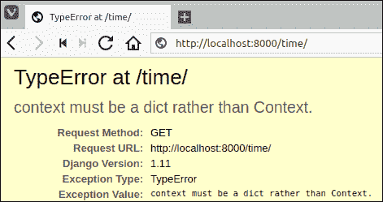
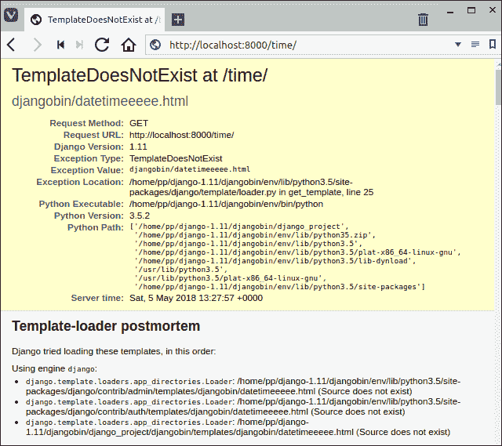
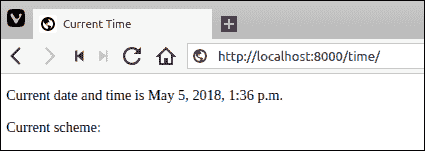
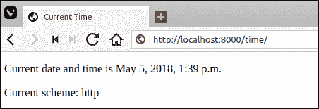

# 在 Django 中加载模板

> 原文：<https://overiq.com/django-1-11/loading-templates-in-django/>

最后更新于 2020 年 7 月 27 日

* * *

在最后几章中，我们已经了解了很多关于 Django 模板的知识。在这一课中，我们将把一些东西用到。从位于`djangobin/django_project/djangobin`的 djangobin 应用打开`views.py`。此时，文件应该如下所示:

**djangobin/django_project/djangobin/views.py**

```py
from django.shortcuts import HttpResponse
import datetime

def index(request):
    return HttpResponse("<p>Hello Django</p>")

def today_is(request, username):
    now = datetime.datetime.now()
    html = "<html><body>Current date and time: {0}</body></html>".format(now)
    return HttpResponse(html)

def profile(request, username):
    return HttpResponse("<p>Profile page of #{}</p>".format(username))

def book_category(request, category='sci-fi'):
    return HttpResponse("<p>Books in {} category</p>".format(category))

def extra_args(request, arg1=None, arg2=None):
    return HttpResponse("<p>arg1: {} <br> arg2: {} </p>".format(arg1, arg2))

```

让我们更新`today_is()`视图以使用模板，如下所示:

**djangobin/django_project/djangobin/views.py**

```py
from django.shortcuts import HttpResponse
import datetime
from django import template

#...

def today_is(request):
    now = datetime.datetime.now()
    t = template.Template("<html><body>Current date and time {{ now }}</body></html>")
    c = template.Context({'now': now})
    html = t.render(c)
    return HttpResponse(html)

```

启动服务器，如果还没有运行，访问`http://127.0.0.1:8000/time/`。你应该得到当前的日期和时间，就像以前一样。

当然，我们正在使用 Django 模板，但是我们仍然在视图中硬编码原始的 HTML。以这种方式为一个大的 HTML 页面创建模板将是非常麻烦和乏味的。如果我们能把 HTML 写在一个外部文件中，那就更好了。我们开始吧。

回想一下[Django 模板的基础知识](/django-1-11/basics-of-django-templates/)一课，默认情况下，Django 会在每个已安装应用的`templates`目录中搜索模板。在`djangobin/templates/djangobin`目录中创建一个名为`datetime.html`的新文件，然后向其中添加以下代码。

**决哥/决哥 _ 项目/决哥/样板/决哥/日期时间. html**

```py
<!DOCTYPE html>
<html lang="en">
<head>
    <meta charset="UTF-8">
    <title>Current Time</title>
</head>
<body>

    {# This is a comment #}

    {# check the existence of now variable in the template using if tag #}

       
        <p>Current date and time is {{ now }}</p>
                   
        <p>now variable is not available</p>
    

</body>
</html>

```

好了，现在我们已经创建了一个模板，下一个问题是如何在我们的视图中加载这个模板。原来`template`包提供了一个叫做`loader`的模块，这个模块又提供了一个`get_template()`函数来加载模板。`get_template()`函数接受一个指示模板名称的字符串参数，计算出模板的位置，打开文件并返回一个`Template`对象。如果`get_template()`找不到模板，则引发`TemplateDoesNotExist`异常。

打开`views.py`并修改`today_is()`查看功能如下:

**djangobin/django_project/djangobin/views.py**

```py
#...

def today_is(request):
    now = datetime.datetime.now()
    t = template.loader.get_template('djangobin/datetime.html')
    c = template.Context({'now': now})
    html = t.render(c)
    return HttpResponse(html)

```

请注意，在第 5 行中，我们只是将应用的名称，后跟斜杠(`/`)，后跟模板名称(即`datetime.html`)传递给`get_template()`函数，而不是传递给`datetime.html`的完整路径，后者是`djangobin/templates/djangobin/datetime.html`。这是因为我们使用的是存储模板的 Django 约定。因此，Django 会自动找出模板在哪里。

同样，如果我们有一个名为论坛的应用和一个名为`forums/templates/forums/discussions.html`的模板。然后我们将使用`forums/discussions.html`加载`discussions.html`模板。

其余代码照常工作。要检查您是否做对了所有事情，请再次访问`http://127.0.0.1:8000/time/`。你会得到这样的`TypeError`异常:



不要害怕。问题是在 Django 1.11 中不推荐使用`Context`类。要解决这个问题，只需将变量名到值的字典映射传递给`render()`方法。但是，如果您手动创建`django.template.Template`对象，那么您仍然需要将`Context`实例传递给`render()`方法(奇怪但真实)。这里是更新后的`today_is()`查看功能。

**djangobin/django_project/djangobin/views.py**

```py
#...

def today_is(request):
    now = datetime.datetime.now()
    t = template.loader.get_template('djangobin/datetime.html')
    html = t.render({'now': now})
    return HttpResponse(html)

```

再次访问`http://127.0.0.1:8000/time/`，你会看到现在的日期和时间和以前一样。

如果`get_template()`函数找不到模板，就会抛出`TemplateDoesNotExist`异常。查看`TemplateDoesNotExist`错误修改`today_is()`查看功能如下:

**djangobin/django_project/djangobin/views.py**

```py
#...

def today_is(request):
    now = datetime.datetime.now()
    t = template.loader.get_template('djangobin/datetimeeeeee.html')    
    html = t.render({'now': now})
    return HttpResponse(html)

```

打开浏览器，访问`http://127.0.0.1:8000/djangobin/time/`。您将获得如下`TemplateDoesNotExist`异常:



在 Django 开发网络应用时，你会多次遇到类似的错误。这里需要注意的重要事情是“模板加载器事后分析”部分。这个部分告诉你一个目录列表，Django 模板系统在抛出`TemplateDoesNotExist`异常之前试图在其中找到文件。在调试错误原因时，这些信息可能非常有价值。

在继续之前，让我们将`djangobin/datetimeeeeee.html`更改为`djangobin/datetime.html`。打开浏览器再次访问`http://127.0.0.1:8000/djangobin/time/`，错误应该已经消失了。

## 使用 render_to_response()缩短代码

大多数情况下，视图会执行以下任务:

1.  使用模型从数据库中提取数据(我们将在 Django 的[模型基础中讨论模型)。](/django-1-11/basics-of-models-in-django/)
2.  加载模板文件，创建`Template`对象。
3.  调用`render()`方法渲染模板。
4.  创建`HttpResponse()`对象并发送给客户端。

Django 提供了一个名为`render_to_response()`的函数来完成从第 2 步到第 5 步提到的所有事情。它接受两个参数，模板名和字典(将用于创建`Context`对象)。要使用`render_to_response()`必须先从`django.shortcuts`模块导入。

修改`views.py`文件中的`today_is()`查看功能，使用`render_to_response()`方法如下:

**djangobin/django_project/djangobin/views.py**

```py
from django.shortcuts import HttpResponse, render_to_response
import datetime

#...

def today_is(request):
    now = datetime.datetime.now()
    return render_to_response('djangobin/datetime.html', {'now': now })

```

在`http://127.0.0.1:8000/time/`刷新页面，Django 会再次用当前日期和时间问候你。

## render()函数

`render()`函数的工作方式与`render_to_response()`相似，但它在 Django 模板中自动提供了一些额外的变量。一个这样的变量是`request`，它是一个类型为`HttpRequest`的对象。回想一下，每个视图函数都接受`request`对象作为第一个参数。如果要访问模板内的`request`对象，必须使用`render()`而不是`render_to_response()`。在这一点上，我们不能用`request`对象做任何有用的事情，但只是给你一个例子，我们将尝试获取用于访问网页的方案。打开`datetime.html`模板，进行以下更改:

**决哥/决哥 _ 项目/决哥/样板/决哥/日期时间. html**

```py
<!DOCTYPE html>
<html lang="en">
<head>
    <meta charset="UTF-8">
    <title>Current Time</title>
</head>
<body>

    {# This is a comment #}

    {# check the existence of now variable in the template using if tag #}

       
        <p>Current date and time is {{ now }}</p>
                   
        <p>now variable is not available</p>
    

    <p>Current scheme: {{ request.scheme }}</p>

</body>
</html>

```

`request`对象有一个名为`scheme`的属性，它返回请求的方案。换句话说，如果使用`http`请求页面，那么`scheme`就是`http`。另一方面，如果使用`https`请求，那么`scheme`就是`https`。

打开浏览器，访问`http://127.0.0.1:8000/time/`会得到如下输出。



注意`request.scheme`处没有打印任何内容，因为我们使用的是`render_to_response()`。要使用`render()`功能，首先从`django.shortcuts`模块导入，然后更新`today_is()`视图功能使用`render()`功能，如下所示:

**djangobin/django_project/djangobin/views.py**

```py
from django.shortcuts import HttpResponse, render
import datetime

#...

def today_is(request):
    now = datetime.datetime.now()    
    return render(request, 'djangobin/datetime.html', {'now': now})

```

`render()`函数接受一个名为`request`的附加第一个参数。刷新页面，您将获得以下输出:



在你的代码中，你应该总是使用`render()`而不是`render_to_response()`，因为`render_to_response()`有可能在未来被弃用。

## 设置内容类型和 HTTP 状态

默认情况下，`render()`快捷方式创建一个`Content-Type: text/html`和 HTTP 状态为 200 的`HttpResponse`对象。

我们可以分别使用`content_type`和`status`关键字参数覆盖`Content-Type`头和 HTTP 状态。例如:

```py
def  my_view(request):
    return render(request,'myapp/markdown.md', context_dict, content_type=`text/markdown`)

```

这会返回一个内容类型为`text/markdown`且默认 HTTP 状态为 200 OK 的`HttpResponse`对象。

```py
def  my_view(request):
    return render(request,'myapp/404.html', context_dict, status=404)

```

这将返回一个内容类型为`text/html`且 HTTP 状态为 404“未找到”的`HttpResponse`对象。

```py
def  my_view(request):
    return render(request,'myapp/404.html', context_dict, content_type='application/json', status=405)

```

这将返回一个内容类型为`application/json`且 HTTP 状态为 404“不允许方法”的`HttpResponse`对象。

在最后几章中，我们已经了解了很多关于 Django 模板的知识。在这一课中，我们将把一些东西用到。从位于`djangobin/django_project/djangobin`的 djangobin 应用打开`views.py`。此时，文件应该如下所示:

**djangobin/django_project/djangobin/views.py**

```py
from django.shortcuts import HttpResponse
import datetime

def index(request):
    return HttpResponse("<p>Hello Django</p>")

def today_is(request, username):
    now = datetime.datetime.now()
    html = "<html><body>Current date and time: {0}</body></html>".format(now)
    return HttpResponse(html)

def profile(request, username):
    return HttpResponse("<p>Profile page of #{}</p>".format(username))

def book_category(request, category='sci-fi'):
    return HttpResponse("<p>Books in {} category</p>".format(category))

def extra_args(request, arg1=None, arg2=None):
    return HttpResponse("<p>arg1: {} <br> arg2: {} </p>".format(arg1, arg2))

```

让我们更新`today_is()`视图以使用模板，如下所示:

**djangobin/django_project/djangobin/views.py**

```py
from django.shortcuts import HttpResponse
import datetime
from django import template

#...

def today_is(request):
    now = datetime.datetime.now()
    t = template.Template("<html><body>Current date and time {{ now }}</body></html>")
    c = template.Context({'now': now})
    html = t.render(c)
    return HttpResponse(html)

```

启动服务器，如果还没有运行，访问`http://127.0.0.1:8000/time/`。你应该得到当前的日期和时间，就像以前一样。

当然，我们正在使用 Django 模板，但是我们仍然在视图中硬编码原始的 HTML。以这种方式为一个大的 HTML 页面创建模板将是非常麻烦和乏味的。如果我们能把 HTML 写在一个外部文件中，那就更好了。我们开始吧。

回想一下[Django 模板的基础知识](/django-1-11/basics-of-django-templates/)一课，默认情况下，Django 会在每个已安装应用的`templates`目录中搜索模板。在`djangobin/templates/djangobin`目录中创建一个名为`datetime.html`的新文件，然后向其中添加以下代码。

**决哥/决哥 _ 项目/决哥/样板/决哥/日期时间. html**

```py
<!DOCTYPE html>
<html lang="en">
<head>
    <meta charset="UTF-8">
    <title>Current Time</title>
</head>
<body>

    {# This is a comment #}

    {# check the existence of now variable in the template using if tag #}

       
        <p>Current date and time is {{ now }}</p>
                   
        <p>now variable is not available</p>
    

</body>
</html>

```

好了，现在我们已经创建了一个模板，下一个问题是如何在我们的视图中加载这个模板。原来`template`包提供了一个叫做`loader`的模块，这个模块又提供了一个`get_template()`函数来加载模板。`get_template()`函数接受一个指示模板名称的字符串参数，计算出模板的位置，打开文件并返回一个`Template`对象。如果`get_template()`找不到模板，则引发`TemplateDoesNotExist`异常。

打开`views.py`并修改`today_is()`查看功能如下:

**djangobin/django_project/djangobin/views.py**

```py
#...

def today_is(request):
    now = datetime.datetime.now()
    t = template.loader.get_template('djangobin/datetime.html')
    c = template.Context({'now': now})
    html = t.render(c)
    return HttpResponse(html)

```

请注意，在第 5 行中，我们只是将应用的名称，后跟斜杠(`/`)，后跟模板名称(即`datetime.html`)传递给`get_template()`函数，而不是传递给`datetime.html`的完整路径，后者是`djangobin/templates/djangobin/datetime.html`。这是因为我们使用的是存储模板的 Django 约定。因此，Django 会自动找出模板在哪里。

同样，如果我们有一个名为论坛的应用和一个名为`forums/templates/forums/discussions.html`的模板。然后我们将使用`forums/discussions.html`加载`discussions.html`模板。

其余代码照常工作。要检查您是否做对了所有事情，请再次访问`http://127.0.0.1:8000/time/`。你会得到这样的`TypeError`异常:


不要害怕。问题是在 Django 1.11 中不推荐使用`Context`类。要解决这个问题，只需将变量名到值的字典映射传递给`render()`方法。但是，如果您手动创建`django.template.Template`对象，那么您仍然需要将`Context`实例传递给`render()`方法(奇怪但真实)。这里是更新后的`today_is()`查看功能。

**djangobin/django_project/djangobin/views.py**

```py
#...

def today_is(request):
    now = datetime.datetime.now()
    t = template.loader.get_template('djangobin/datetime.html')
    html = t.render({'now': now})
    return HttpResponse(html)

```

再次访问`http://127.0.0.1:8000/time/`，你会看到现在的日期和时间和以前一样。

如果`get_template()`函数找不到模板，就会抛出`TemplateDoesNotExist`异常。查看`TemplateDoesNotExist`错误修改`today_is()`查看功能如下:

**djangobin/django_project/djangobin/views.py**

```py
#...

def today_is(request):
    now = datetime.datetime.now()
    t = template.loader.get_template('djangobin/datetimeeeeee.html')    
    html = t.render({'now': now})
    return HttpResponse(html)

```

打开浏览器，访问`http://127.0.0.1:8000/djangobin/time/`。您将获得如下`TemplateDoesNotExist`异常:


在 Django 开发网络应用时，你会多次遇到类似的错误。这里需要注意的重要事情是“模板加载器事后分析”部分。这个部分告诉你一个目录列表，Django 模板系统在抛出`TemplateDoesNotExist`异常之前试图在其中找到文件。在调试错误原因时，这些信息可能非常有价值。

在继续之前，让我们将`djangobin/datetimeeeeee.html`更改为`djangobin/datetime.html`。打开浏览器再次访问`http://127.0.0.1:8000/djangobin/time/`，错误应该已经消失了。

## 使用 render_to_response()缩短代码

大多数情况下，视图会执行以下任务:

1.  使用模型从数据库中提取数据(我们将在 Django 的[模型基础中讨论模型)。](/django-1-11/basics-of-models-in-django/)
2.  加载模板文件，创建`Template`对象。
3.  调用`render()`方法渲染模板。
4.  创建`HttpResponse()`对象并发送给客户端。

Django 提供了一个名为`render_to_response()`的函数来完成从第 2 步到第 5 步提到的所有事情。它接受两个参数，模板名和字典(将用于创建`Context`对象)。要使用`render_to_response()`必须先从`django.shortcuts`模块导入。

修改`views.py`文件中的`today_is()`查看功能，使用`render_to_response()`方法如下:

**djangobin/django_project/djangobin/views.py**

```py
from django.shortcuts import HttpResponse, render_to_response
import datetime

#...

def today_is(request):
    now = datetime.datetime.now()
    return render_to_response('djangobin/datetime.html', {'now': now })

```

在`http://127.0.0.1:8000/time/`刷新页面，Django 会再次用当前日期和时间问候你。

## render()函数

`render()`函数的工作方式与`render_to_response()`相似，但它在 Django 模板中自动提供了一些额外的变量。一个这样的变量是`request`，它是一个类型为`HttpRequest`的对象。回想一下，每个视图函数都接受`request`对象作为第一个参数。如果要访问模板内的`request`对象，必须使用`render()`而不是`render_to_response()`。在这一点上，我们不能用`request`对象做任何有用的事情，但只是给你一个例子，我们将尝试获取用于访问网页的方案。打开`datetime.html`模板，进行以下更改:

**决哥/决哥 _ 项目/决哥/样板/决哥/日期时间. html**

```py
<!DOCTYPE html>
<html lang="en">
<head>
    <meta charset="UTF-8">
    <title>Current Time</title>
</head>
<body>

    {# This is a comment #}

    {# check the existence of now variable in the template using if tag #}

       
        <p>Current date and time is {{ now }}</p>
                   
        <p>now variable is not available</p>
    

    <p>Current scheme: {{ request.scheme }}</p>

</body>
</html>

```

`request`对象有一个名为`scheme`的属性，它返回请求的方案。换句话说，如果使用`http`请求页面，那么`scheme`就是`http`。另一方面，如果使用`https`请求，那么`scheme`就是`https`。

打开浏览器，访问`http://127.0.0.1:8000/time/`会得到如下输出。


注意`request.scheme`处没有打印任何内容，因为我们使用的是`render_to_response()`。要使用`render()`功能，首先从`django.shortcuts`模块导入，然后更新`today_is()`视图功能使用`render()`功能，如下所示:

**djangobin/django_project/djangobin/views.py**

```py
from django.shortcuts import HttpResponse, render
import datetime

#...

def today_is(request):
    now = datetime.datetime.now()    
    return render(request, 'djangobin/datetime.html', {'now': now})

```

`render()`函数接受一个名为`request`的附加第一个参数。刷新页面，您将获得以下输出:


在你的代码中，你应该总是使用`render()`而不是`render_to_response()`，因为`render_to_response()`有可能在未来被弃用。

## 设置内容类型和 HTTP 状态

默认情况下，`render()`快捷方式创建一个`Content-Type: text/html`和 HTTP 状态为 200 的`HttpResponse`对象。

我们可以分别使用`content_type`和`status`关键字参数覆盖`Content-Type`头和 HTTP 状态。例如:

```py
def  my_view(request):
    return render(request,'myapp/markdown.md', context_dict, content_type=`text/markdown`)

```

这会返回一个内容类型为`text/markdown`且默认 HTTP 状态为 200 OK 的`HttpResponse`对象。

```py
def  my_view(request):
    return render(request,'myapp/404.html', context_dict, status=404)

```

这将返回一个内容类型为`text/html`且 HTTP 状态为 404“未找到”的`HttpResponse`对象。

```py
def  my_view(request):
    return render(request,'myapp/404.html', context_dict, content_type='application/json', status=405)

```

这将返回一个内容类型为`application/json`且 HTTP 状态为 404“不允许方法”的`HttpResponse`对象。

* * *

* * *