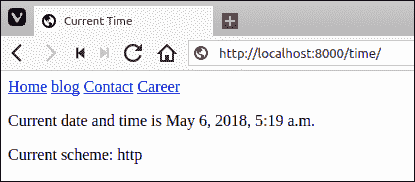
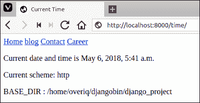
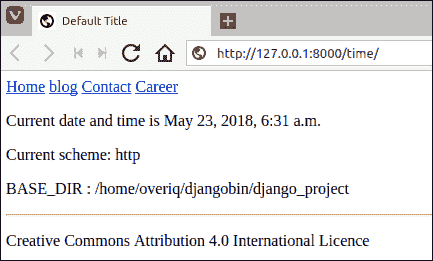
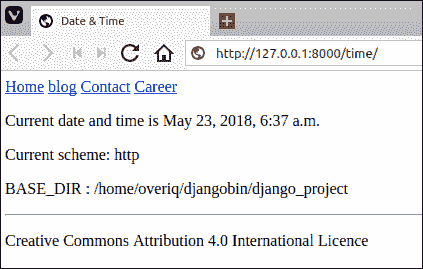
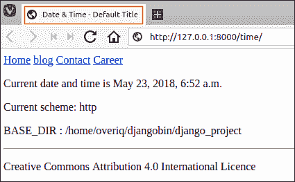

# Django 的模板继承

> 原文：<https://overiq.com/django-1-11/template-inheritance-in-django/>

最后更新于 2020 年 7 月 27 日

* * *

## 使用包含标签包含模板

``标签允许我们将一个模板的内容包含在另一个模板中。它的语法是:

```py


```

`template_name`可以是字符串或变量。让我们举个例子:

在 djangobin 应用的`templates`目录(即`templates/djangobin`)中创建新的名为`nav.html`的文件，代码如下:

**djangobin/django _ project/djangobin/templates/djangobin/nav . html**

```py
<nav>
    <a href="#">Home</a>
    <a href="#">blog</a>
    <a href="#">Contact</a>
    <a href="#">Career</a>
</nav>

```

假设你想把`nav.html`的内容包含在`datetime.html`文件中。为此，在`datetime.html`上添加``标签，如下所示:

**决哥/决哥 _ 项目/决哥/样板/决哥/日期时间. html**

```py
<!DOCTYPE html>
<html lang="en">
<head>
    <meta charset="UTF-8">
    <title>Title</title>
</head>
<body>

    

    {# This is a comment #}

    {# check the existence of now variable in the template using if tag #}

       
        <p>Current date and time is {{ now }}</p>
                   
        <p>now variable is not available</p>
    

    <p>Current scheme: {{ request.scheme }}</p>

</body>
</html>

```

打开浏览器，访问`http://127.0.0.1:8000/time/`，应该可以在页面顶部看到一个简单的导航栏，如下图:



请注意，在``标签中，我们使用相同的约定来指定我们在`get_template()`和`render()`方法中使用的模板名称。我们也可以通过上下文传递模板名称，而不是直接在模板中硬编码。

打开 djangobin 应用内的`views.py`文件。此时，`today_is()`视图功能应该是这样的:

**djangobin/django_project/djangobin/views.py**

```py
#...

def today_is(request):
    now = datetime.datetime.now()
    return render(request, 'djangobin/datetime.html', {'now': now })

```

修改如下:

**djangobin/django_project/djangobin/views.py**

```py
#...

def today_is(request):
    now = datetime.datetime.now()
    return render(request, 'djangobin/datetime.html',
                  {'now': now, 'template_name': 'djangobin/nav.html'})

```

打开`datetime.html`模板，用``替换``标签。

**决哥/决哥 _ 项目/决哥/样板/决哥/日期时间. html**

```py
<!DOCTYPE html>
<html lang="en">
<head>
    <meta charset="UTF-8">
    <title>Title</title>
</head>
<body>

    

    {# This is a comment #}

    {# check the existence of now variable in the template using if tag #}

       
        <p>Current date and time is {{ now }}</p>
                   
        <p>now variable is not available</p>
    

    <p>Current scheme: {{ request.scheme }}</p>

</body>
</html>

```

在`http://127.0.0.1:8000/time/`刷新页面，你应该会看到和之前一样的当前日期和时间。

`include`标签找不到模板怎么办？

在这种情况下，Django 将做以下两件事之一:

1.  如果`DEBUG`模式设置为`True`，那么 Django 模板系统将抛出`TemplateDoesNotExist`异常。
2.  如果`DEBUG`被设置为`False`，那么它将会失败，在`include`标签处不显示任何内容。

## 模板继承

到目前为止，我们一直在创建非常简单的模板，但在现实世界中，情况很少如此。为了给网站的所有页面一个共同的外观和感觉，一些 HTML 代码被重复。通常，页眉、导航、页脚和侧边栏在整个网站中保持不变。当我们想要修改页面的某些部分时，问题就出现了。为了更好地理解这个问题，让我们举个例子。

假设我们有两个页面，即`home.html`和`contact.html`，代码如下:

**home.html**

```py
<!DOCTYPE html>
<html lang="en">
<head>
    <meta charset="UTF-8">
    <title>Home</title>
</head>
<body>

    <nav>
        <a href="#">Home</a>
        <a href="#">blog</a>
        <a href="#">Contact</a>
        <a href="#">Career</a>
    </nav>

    <aside>
        <h3>Ut enim ad minim veniam</h3>
        <p>
            Lorem ipsum dolor sit amet, consectetur adipisicing elit, sed do eiusmod            
            quis nostrud exercitation ullamco laboris nisi ut aliquip ex ea commodo.
        </p>
    </aside>

    <article>
        <p>
            Lorem ipsum dolor sit amet, consectetur adipisicing elit, sed do eiusmod
            tempor incididunt ut labore et dolore magna aliqua. Ut enim ad minim veniam
        </p>
    </article>

    <footer> &copy; 2017\. All rights reserved </footer>

</body>
</html>

```

**contact.html**

```py
<!DOCTYPE html>
<html lang="en">
<head>
    <meta charset="UTF-8">
    <title>Contact</title>
</head>
<body>

    <nav>
        <a href="#">Home</a>
        <a href="#">blog</a>
        <a href="#">Contact</a>
        <a href="#">Career</a>
    </nav>

    <aside>
        <h3>Ut enim ad minim veniam</h3>
        <p>
            Lorem ipsum dolor sit amet, consectetur adipisicing elit, sed do eiusmod            
            quis nostrud exercitation ullamco laboris nisi ut aliquip ex ea commodo.
        </p>
    </aside>

    <article>
        <p>
            <form>
                 Name: <input type="text" name="name" required> <br>
                 Email: <input type="email" name="email" required> <br>
                 Query: <textarea name="message" required></textarea> <br>
                 <input type="submit" name="submit" value="Send">
            </form>
        </p>
    </article>

    <footer> &copy; 2017\. All rights reserved </footer>

</body>
</html>

```

假设在部署时，公司决定将导航中某个链接的锚文本从“职业”更改为“工作”。为了做出这种改变，我们必须手动访问每一页。如果我们有 50 或 100 页呢？如今，网站拥有数百甚至数千个页面是非常常见的。如你所见，这种方法不太适用。

如果你正在仔细阅读这一页，你可能会说“嘿，我们为什么不使用
标签？”。是的，当然我们可以使用``标签非常容易地解决这个特殊的问题，但是正如我们将看到的，模板继承提供了一个更强大和优雅的方法来解决这样的问题。

## 全网站模板

Django 模板，我们将在即将到来的部分创建，并不特定于任何应用。事实上，项目中任何已安装的应用都可以使用这些模板。如前所述，默认情况下，Django 会在每个已安装应用的`templates`目录中查找模板。但是 Django 没有定义任何默认位置来寻找不特定于任何应用的模板。因此，我们几乎可以在任何地方存储这些全网站模板。

为了保持简单和有条理，我们将把我们的站点范围模板存储在项目根目录(`djangobin/django_project/`)内的`templates`目录中。在`djangobin/django_project/`目录中创建一个名为`templates`的新目录。

现在我们必须通知 Django 这个目录。打开位于`djangobin/django_project/django_project/`的`settings.py`文件，找到`TEMPLATES`变量。该变量包含与模板相关的所有设置。如果你没有改变什么，应该是这样的:

**djangobin/django _ project/django _ project/settings . py**

```py
#...

TEMPLATES = [
    {
        'BACKEND': 'django.template.backends.django.DjangoTemplates',
        'DIRS': [],
        'APP_DIRS': True,
        'OPTIONS': {
            'context_processors': [
                'django.template.context_processors.debug',
                'django.template.context_processors.request',
                'django.contrib.auth.context_processors.auth',
                'django.contrib.messages.context_processors.messages',
            ],
        },
    },
]

#...

```

这里我们关注的设置是`DIRS`键。目前，它被设置为空列表。`DIRS`键指定模板引擎应该查找模板的路径列表。为了让 Django 在我们新创建的`templates`目录中搜索整个网站的模板，我们必须提供`DIRS`到它的绝对路径。

在我的电脑上，模板的绝对路径是`/home/overiq/djangobin/django_project/templates`。更改`DIRS`键，使其看起来像这样。

**djangobin/django _ project/django _ project/settings . py**

```py
#...
'DIRS': [
    '/home/overiq/djangobin/django_project/',
],
#...

```

你应该用你的用户名替换`overiq`。

但是有一个问题。如果您将您的 Django 项目发送给其他人，除非您和那个人共享完全相同的用户名和目录结构，否则它将不起作用。这里的要点是，在您的 Django 项目中永远不要硬编码路径。硬编码路径使我们的项目不太便携——这意味着它可能无法在其他计算机上运行。

解决方案是使用动态路径。

注意`settings.py`文件顶部的`BASE_DIR`变量。

**djangobin/django _ project/django _ project/settings . py**

```py
#...

import os

# Build paths inside the project like this: os.path.join(BASE_DIR, ...)
BASE_DIR = os.path.dirname(os.path.dirname(os.path.abspath(__file__)))

# Quick-start development settings - unsuitable for production
# See https://docs.djangoproject.com/en/1.10/howto/deployment/checklist/

#...

```

该变量存储 Django 项目根目录的路径。就我而言，它指向`/home/overiq/djangobin/django_project/`。在你的机器上，可能会有所不同。现在我们可以以`BASE_DIR`的形式访问 Django 项目根目录。因此，引用其他目录变得非常容易。我们的全网站`templates`目录在`BASE_DIR`指向的目录内。

```py
django_project/
├── db.sqlite3
├── djangobin
├── django_project
├── manage.py
└── templates   <--- sitewide templates directory

3 directories, 2 files

```

我们现在可以使用 Python 的`os.path.join()`函数来连接多个路径。更新`DIRS`值，使其看起来像这样:

**djangobin/django _ project/django _ project/settings . py**

```py
#...

'DIRS': [ 
    os.path.join(BASE_DIR, 'templates'), 
],

#...

```

从现在开始，Django 将在`djangobin/django_project/templates`目录中搜索模板。请记住，Django 首先在由`DIRS`设置指定的目录中搜索模板，然后在相应应用的`templates`目录中搜索模板(假设`APP_DIRS`设置为`True`)。这意味着，如果您在 sitewide `templates`目录中的`djangobin`目录中有一个名为`datetime.html`的模板，那么`today_is()`视图功能将使用 sitewide `templates`目录中的`datetime.html`而不是 djangobin 应用的`templates`目录。

## 访问视图中的设置

在查看功能中，有时您需要从`settings.py`文件访问设置。为此，您必须从`django.conf`包中导入`settings`变量。

在 djangobin app 中打开`views.py`，修改文件如下。

**djangobin/django_project/djangobin/views.py**

```py
from django.shortcuts import HttpResponse, render
import datetime
from django.conf import settings

#...

def today_is(request):
    now = datetime.datetime.now()
    return render(request, 'djangobin/datetime.html', {
                                    'now': now,
                                    'template_name': 'djangobin/nav.html' ,
                                    'base_dir': settings.BASE_DIR }
                                )

```

打开`datetime.html`并在文件末尾附加以下`<p>`标记。

**决哥/决哥 _ 项目/决哥/样板/决哥/日期时间. html**

```py
#...
    <p>Current scheme: {{ request.scheme }}</p>

    <p>BASE_DIR : {{ base_dir }}</p>

</body>
</html>

```

打开浏览器，访问`http://127.0.0.1:8000/time/`。您应该看到您的 Django 项目根目录的路径，如下所示:



## 行动中的模板继承

要使用模板继承，我们必须首先创建一个基础模板。基础模板只是一个简单的框架，可以用作网站所有其他页面的基础。基本模板定义了可以插入内容的区域。我们使用``标签定义这个区域。在全网站`templates`目录中创建一个名为`base.html`的新文件，并向其中添加以下代码。

**djangobin/django _ project/templates/base . html**

```py
<!DOCTYPE html>
<html>
<head>
    <title>Default Title</title>
</head>
<body>

    <nav>
        <a href="#">Home</a>
        <a href="#">blog</a>
        <a href="#">Contact</a>
        <a href="#">Career</a>
    </nav>

    

    

    <hr>

    
        <p>Creative Commons Attribution 4.0 International Licence</p>
    

</body>
</html>

```

这是我们的基础模板。这里我们使用了一个您还没有遇到的新模板标签。``标签接受单个参数`block_name`来指定块的名称。这里我们创建了三个区块，即`title`、`content`和`footer`。``标签定义了一个可以被子模板覆盖的块。什么是子模板？使用`base.html`作为其基础的模板，或者更正式地说，子模板是扩展基础模板的模板。子模板可以覆盖、添加或保留父块的内容。

要给子模板提供一些默认内容，请在``和``之间添加内容。

要使用我们的基础模板，我们首先必须创建一个子模板。从博客 app 打开`datetime.html`模板，删除其中的所有内容，然后添加以下代码。

**决哥/决哥 _ 项目/决哥/样板/决哥/日期时间. html**

```py




    
        <p>Current date and time is {{ now }}</p>
    
        <p>now variable is not available</p>
    

    <p>Current scheme: {{ request.scheme }}</p>
    <p>BASE_DIR : {{ base_dir }}</p>



```

以下是它的工作原理:

第 1 行，``告诉 Django 模板引擎，当前模板是子模板，继承自`base.html`。这必须是子模板中的第一行，否则它将不起作用。当模板引擎遇到这一行时，它会立即加载父模板(即`base.html`)，然后用子模板中定义的同名内容块替换父模板中的内容块。如果在子模板中找不到匹配名称的块，则使用父模板中的内容。请注意，在子模板中，我们没有覆盖`title`和`footer`块，因此渲染子模板时将使用父模板的默认内容。

如果尚未运行，请启动服务器并访问`http://127.0.0.1:8000/time/`。您应该会得到以下输出:



要更改子模板中的标题，请在`datatime.html`中添加标题栏，如下所示:

**决哥/决哥 _ 项目/决哥/样板/决哥/日期时间. html**

```py



    Date & Time




    
        <p>Current date and time is {{ now }}</p>
    
        <p>now variable is not available</p>
    

    <p>Current scheme: {{ request.scheme }}</p>
    <p>BASE_DIR : {{ base_dir }}</p>



</body>
</html>

```

刷新页面，您将获得以下输出:



假设您已经覆盖了子模板中的一个块，但是您仍然想要父模板中的默认内容。为此，请使用`{{ block.super }}`。`{{ block.super }}`允许我们在子模板中引用父模板的默认内容。

如下修改`datatime.html`中的标题栏:

**决哥/决哥 _ 项目/决哥/样板/决哥/日期时间. html**

```py



    Date & Time - {{ block.super }}




    
        <p>Current date and time is {{ now }}</p>
    
        <p>now variable is not available</p>
    

    <p>Current scheme: {{ request.scheme }}</p>
    <p>BASE_DIR : {{ base_dir }}</p>



```

刷新页面，您将获得以下输出:



* * *

* * *