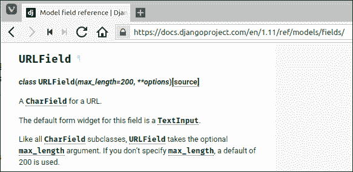

# Django 模型基础

> 原文：<https://overiq.com/django-1-11/basics-of-models-in-django/>

最后更新于 2020 年 7 月 27 日

* * *

在最后几章中，我们学到了很多东西。此时，您应该对什么是模板和视图有了很好的了解。在本章中，我们将了解 Django MTV 架构的模型部分。

## 数据库和模型

如今，大多数现代 web 应用都是由数据库驱动的。SQL 是访问数据库的事实语言。如果你已经做过一些网络编程，那么你可能知道在像 PHP 这样的语言中，混合 PHP 代码和 SQL 代码是非常常见的。除了杂乱之外，这种方法不鼓励分离关注点。对于 Django，我们没有这样做，我们不是执行原始的 SQL 查询来访问数据库，而是使用 [Django ORM](/django-1-11/django-orm-basics-part-1/) ，但是在此之前，我们必须使用模型来定义我们的数据。

那么什么是模型呢？

模型定义了您正在存储的数据的字段和行为。Django 模型大致映射到一个数据库表。一旦模型到位，Django 就提供了一个自动生成的 API(也称为 Django ORM)来访问数据库。

不要担心如果这一切都发生在你的头上。在接下来的几节中，我们将深入讨论一切。

## 功能清单

如您所知，在本教程中，我们将构建一个名为 djangobin 的代码共享应用。你可以在[https://djangosnippets.org/](https://djangosnippets.org/)看到这样一个网站的真实例子。然而，与 djangosnippets.org 不同的是，我们将允许用户为多种语言创建片段。与任何新应用一样，让我们编译一个我们希望在应用中实现的功能列表。这是完整的功能列表，供您参考。

1.  能够通过选择语言、曝光和过期时间以及可选的标题和标签来创建片段。
2.  按标签组织片段。
3.  趋势片段列表。
4.  列出最近的片段。
5.  语法感知代码突出显示。
6.  按语言列出的片段列表。
7.  追踪片段访问次数。
8.  下载代码片段，查看原始代码并删除代码片段。
9.  按关键字搜索片段。
10.  登录用户。
11.  重置密码。
12.  更新密码。
13.  更改帐户首选项。
14.  查看帐户详细信息
15.  联系页面。

## 我们需要什么数据？

为了实现上一节中概述的特性，我们需要存储关于四个实体的信息:作者、语言、片段和标签。

作者实体表示关于作者的信息。作者有姓名、电子邮件、创作日期等属性。类似地，语言、代码片段和标签实体表示关于编程语言、代码片段和标签本身的信息，并且每个实体都有自己的一组属性。下面是我们希望存储在数据库中的属性列表。

**作者:**

*   名字——作者的名字
*   电子邮件-作者的电子邮件
*   active -一个布尔字段，指定用户是否可以登录
*   创建日期-创建日期
*   上次登录日期-上次登录日期

**语言:**

*   名称-语言的名称。
*   语言代码-加载适当的 py grade * lexer 的语言代码。
*   slug -语言的唯一标识符。
*   用于发送代码片段文件的 mime - mime。
*   文件扩展名-下载代码片段时使用的文件扩展名。
*   出版日期-创作日期

**片段:**

*   标题-代码片段的标题
*   slug -代码片段的唯一标识符
*   original_code -用户输入的代码
*   反白 _ 代码-语法-反白的 HTML 版本的代码
*   过期-代码片段的过期时间(例如，永不过期，1 个月，6 个月，1 年)
*   曝光-片段曝光(即公开、私人和非公开)*。
*   点击量-访问次数
*   标签-标签列表

**标签:**

*   名称-标签的名称
*   slug -标签的唯一标识符。

**注意:**py segments 是一个突出显示代码片段的库。要了解更多信息，请访问本[培训教程](/pygments-tutorial/)。

**注:**那么什么是 Snippet 上下文中的公共、私有和未列出？公共片段对每个人都是可见的，而私有片段只对你可见。要创建私人代码片段，您必须使用用户名和密码登录。此外，公共片段将出现在整个站点的搜索、存档页面和最近片段列表中。您也可以创建未列出的片段，这些项目不会出现在搜索、存档页面和最近的片段列表中。换句话说，未列出的片段对用户来说是不可见的，除非您共享片段网址。创建未列出的代码段不需要登录。有许多网站使用这样的系统，一个流行的例子是 pastebin.com。

在数据库的上下文中，每个实体对应一个表，每个属性对应一个列。在 Django 的上下文中，每个实体都是一个模型，每个属性都是一个字段。

默认情况下，Django 会自动为所有模型添加一个名为`id`的主键字段。可以用`id`或者`pk`来参考。每次添加新记录时，该键都会自动递增。

你可能想知道鼻涕虫是什么意思。鼻涕虫是标识页面的网址的一部分。鼻涕虫只能由字母、数字、下划线或连字符组成。比如在 URL `http://example.com/very-important-post/`中，鼻涕虫就是`very-important-post`。正如我们将看到的，Django 可以从标题中自动生成 slug。

现在让我们看看这些实体之间存在什么类型的关系。

1.  作者可以创建一个或多个片段，但一个片段只能属于一个作者。所以作者和片段之间存在一对多的关系。

    

2.  作者可以创建一个或多个相同语言的片段，但一个片段只能属于一种语言。所以语言和代码片段之间还是存在一对多的关系。

    

3.  一个片段可以用一个或多个标签来标记。同样，一个标签可以属于一个或多个片段。因此，片段和标签之间存在多对多的关系。

    

总之，我们有 2 个一对多关系和 1 个多对多关系。

我们将在后面看到如何在我们的模型中定义这些关系。现在，只要记住这些关系存在于我们的实体之间。

下面是每个实体的属性的更新列表以及它们之间的关系。

**作者:**

*   名字
*   电子邮件
*   活跃的
*   编成日期
*   上次登录日期

**语言:**

*   名字
*   语言代码
*   鼻涕虫
*   哑剧
*   文件扩展名
*   出版日期

**片段:**

*   标题
*   鼻涕虫
*   原始代码
*   突出显示的代码
*   呼气
*   暴露
*   打击
*   标签
*   作者的外键
*   语言的外键

**标签:**

*   名字
*   鼻涕虫

**连接表(表示片段和标签之间的多对多关系)**

*   片段和标签

## 创建模型

打开 djangobin app 目录内的`models.py`文件。应该是这样的:

**djangobin/django _ project/djangobin/models . py**

```py
from django.db import models

# Create your models here.

```

让我们从创建一个`Author`模型开始。模型只是一个继承自`models.Model`类的 Python 类。将以下代码添加到`models.py`文件中。

**djangobin/django _ project/djangobin/models . py**

```py
from django.db import models

# Create your models here.

class Author(models.Model):
    pass

```

从语法上来说，`Author`是一个有效的模型，虽然不包含任何字段(或属性)，但仍然有效。通常，当我们定义模型时，我们指定所有的字段及其类型。如前所述，Django 会自动为所有模型添加一个名为`id`的主键字段，因此无需手动定义。对于`Author`模型，我们需要以下字段:

*   名字
*   电子邮件
*   活跃的
*   账户创建日期
*   上次登录时间

下面是添加这些字段的代码:

**djangobin/django _ project/djangobin/models . py**

```py
from django.db import models

# Create your models here.

class Author(models.Model):
    name = models.CharField(max_length=100)
    email = models.EmailField(unique=True)
    active = models.BooleanField(default=False)
    created_on = models.DateTimeField()
    last_logged_in = models.DateTimeField()

```

让我们浏览一下我们添加的代码。

在第 7 行，我们正在定义类型为`CharField`的`name`字段，在数据库的上下文中把`CharField`类型想象成`VARCHAR`。`max_length`参数指定该字段可以存储的最大字符数。

在第 8 行，我们定义了类型为`EmailField`的`email`字段。`unique=True`表示该字段的值在整个表中必须是唯一的。我们可以将`unique`和`max_length`参数传递给几乎所有类型的字段。

在第 9 行，我们定义了`active`字段，该字段指定用户是否处于活动状态。该字段的类型为`BooleanField`。一个`BooleanField`字段只能取两个值`True`或者`False`。你也可以把`1`和`0`传给它。`default`是一个特殊的参数，用于设置列的默认值。此默认值用于创建新记录时未提供列值的情况。

在第 10 行和第 11 行，我们定义了两个字段，`DateTimeField`类型的`created_on`和`last_logged_in`。一个`DateTimeField`用来存储日期和时间，对应 Python 中的`datetime.datetime`对象。

此时，您可能会想“数据库已经提供了各种类型的数据类型来存储数据”。那么在 Django 重新定义它们的目的是什么呢？

它们有两个重要目的:

1.  他们在数据保存到数据库之前对其进行验证。
2.  它们还控制如何使用 Widgets 在表单中显示数据。

小部件指的是字段的 HTML 表示。每个字段都有一个默认的小部件。例如`Charfield`的默认小部件是`<input type="text" >`。当我们创建表单时，小部件的效用开始发挥作用。我们将在以后的课程中讨论如何做到这一点。

注意`models.Model`和模型字段(即`models.CharField`、`models.EmailField`等)都是 Python 类。在 Python 的上下文中`CharField`是一个字符串。在数据库的上下文中`CharField`是`VARCHAR`。`CharField`是非常特殊的字段，因为它是所有其他基于字符串的字段的基础。Django 不验证`CharField`类型字段的内容。换句话说，Django 不会检查提供给`CharField`字段的值。仔细想想还是有道理的。由于`CharField`本质上是一个字符串字段，它可以接受几乎任何类型的数据。所以，`1`、`mymail@example.com`、`100e100`、`DJANG0`、`%^%*&^%$#`都是有效的数据示例。

然而，继承自`CharField`的字段确实执行验证。例如`EmailField`。`EmailField`常用于存储电子邮件，如果你试图在里面存储其他东西，它会引发异常。

Django 提供了许多其他字段来存储不同类型的数据。下表列出了一些常见字段:

| 字段名 | 它是做什么用的？ |
| --- | --- |
| `CharField` | 用于存储小到中等大小字符串的字段。它充当其他基于字符串的字段的基础。它不提供任何验证 |
| `SlugField` | 一`CharField`储存蛞蝓。它只接受字母、数字、下划线和连字符。它提供验证。 |
| `DateField` | 存储日期的字段。它对应于 Python 的`datetime.date`实例。它不是从`CharField`继承的。它提供验证。 |
| `DateTimeField` | 存储日期和时间的字段。它对应于 Python 的`datetime.datetime`实例。它提供验证。 |
| `EmailField` | 存储电子邮件地址的`CharField`。它验证输入的值是否是有效的电子邮件值 |
| `URLField` | 一个`CharField`用来存储 URL。它提供验证。注意与`SlugField`不同。`SlugField`只包含网址的一部分，不包含网址本身。 |
| `TextField` | 存储大量文本的字段。使用此字段存储博文、新闻、故事等内容。在 Python 中，该字段转换为字符串。在数据库中，它被翻译成`TEXT`字段。像`CharField`一样，该字段不提供任何验证 |
| `BooleanField` | 存储`True`或`False`的字段。在 Python 的上下文中，它翻译成布尔型`True`和`False`。在数据库的上下文中(我们使用的是 SQLite)，它存储为整数(`1` ) `True`和(`0` ) `False`。记住 SQLite 有整数类型来处理整数。 |
| `IntegerField` | 存储从`-2147483648`到`2147483647`整数值的字段。它检查输入的值是否为数字。 |
| `DecimalField` | 存储十进制数的字段。 |
| `ForeignKey` | 定义一对多关系的字段。 |
| `ManyToManyField` | 定义多对多关系的字段。 |
| `OneToOneField` | 定义一对一关系的字段。 |

## 可选字段参数

以下是适用于所有类型字段的可选字段参数。要使用这些参数，请将它们作为关键字参数传递给模型字段类。

### 空白的

正如我们将看到的，Django 可以通过从模型类中推断字段类型来自动生成表单。此外，Django 希望您在每个字段中输入数据。如果您试图提交一个字段而不输入任何数据，那么 Django 将显示验证错误。在模型中定义字段时，将字段设为可选设置`blank=True`。该参数的默认值为`False`。设置`blank=True`后，如果没有给字段提供任何值，Django 会自动在字段中插入一个空字符串。

### 空

如果设置为`True`，Django 会将空值作为`NULL`存储在数据库中。默认为`False`。Django 不建议为基于字符串的字段设置`null=True`。因为如果您没有为该字段提供任何值，那么 Django 将自动向该字段插入一个空字符串。如果您仍然为基于字符串的字段添加`null=True`，那么您将得到“无数据”的两个可能值:`NULL`和空字符串。在这种情况下，Django 将插入`NULL`而不是空字符串。但是，在某些情况下，在基于字符串的字段中设置`null=True`会很有用。我们将在下一节看到这样一个例子。

初学者经常会发现`blank`和`null`混淆不清，最后使用不当。如果您仍然感到困惑，请记住，`blank`参数的效用仅限于验证机制，而不是您的数据库。而`null`在数据库级别控制一个字段是否可以是`NULL`。

### 系统默认值

您可以通过此参数来设置字段的默认值。当在表中插入新记录时未提供字段值时，将使用默认值。

### 独一无二的

如果设置为`True`，则字段中的值在整个表格中是唯一的。默认值为`False`。

### 帮助 _ 文本

此参数用于指定帮助字符串。帮助字符串描述了如何使用字段或关于字段的一些其他重要信息。

### db_index

如果设置为`True`，将创建一个索引列。默认为`False`。

### 数据库 _ 列

此参数用于指定数据库中列的名称。如果不提供这个选项，Django 将使用模型中的字段名。

### 选择

此参数将字段的预定义值指定为元组。例如:

```py
STATUS = (
    ('pen', 'Pending'),
    ('pub', 'Published'),
    ('tra', 'Trash'),    
)

class Post(models.Model):
    status = models.CharField(choices=STATUS)

```

如果指定了此参数，默认小部件将是一个`<select>`框，而不是
`<input type="text">`。每个元组中的第一个元素是我们分配给模型实例的，第二个元素的值将显示给用户。

还有许多其他可选参数，要查看完整列表，请查看[文档](https://docs.djangoproject.com/en/1.11/ref/models/fields/#field-options)。

## 相识

不要被各种字段类型及其参数所淹没。你不需要记住所有的。假设你想用`URLField`想知道它的参数。打开浏览器，访问[https://docs.djangoproject.com/en/1.11/ref/models/fields/](https://docs.djangoproject.com/en/1.11/ref/models/fields/)。该页面包含关于 Django 1.11 中每个字段类型及其可用选项(参数)的文档。在页面搜索`URLField`关键字。向下滚动页面的一半，直到找到描述`URLField`的部分。



`URLField`文档告诉您以下内容:

1.  第一行指定类签名。换句话说，应该传递什么参数来创建`URLField`的实例。

2.  是`CharField`场表示继承自`CharField`。

3.  该字段的默认表单部件是`TextInput`。`TextInput`是对应于`<input type="text">`元素的小部件类的名称。换句话说，`URLField`将使用`<input type="text">`标签显示。我们将在[Django 表单基础](/django-1-11/django-form-basics/)一章中了解更多关于小部件以及如何覆盖它们的信息。

4.  下一行告诉我们，我们还可以向`URLField`传递一个可选的`max_length`参数，以限制该字段可以容纳的字符数。如果不指定`max_length`，将使用`200`的默认值。

一个精明的读者可能会说，但是类签名中的第二个参数，即
`**options`呢？

`**options`是指所有字段都可以接受的可选关键字参数。在前一节中，我们已经介绍了其中的一些。

假设您想要创建唯一的`URLField`长度字段`100`。下面是这样做的代码:

```py
url = models.URLField(max_length=100, unique=True)

```

默认情况下，所有字段都是必需的。如果您没有为必填字段指定数据，Django 将显示验证错误。要使网址字段可选，添加`blank=True`。

```py
url = models.URLField(max_length=100, unique=True, blank=True)

```

你注意到什么奇怪的事情了吗？

这里我们已经将`url`字段设为可选。这意味着如果您不输入任何值，Django 将自动插入一个空字符串。但是我们也将`unique`设置为`True`，这意味着没有两列可以有相同的值。要解决冲突，您必须将`null=True`添加到`url`字段定义中:

```py
url = models.URLField(max_length=100, unique=True, blank=True, null=True)

```

## 完成其他模型

让我们为剩下的模型添加代码。

**djangobin/django _ project/djangobin/models . py**

```py
from django.db import models
from .utils import Preference as Pref

# Create your models here.

class Author(models.Model):
    name = models.CharField(max_length=100)
    email = models.EmailField(unique=True)
    active = models.BooleanField(default=False)
    created_on = models.DateTimeField(auto_now_add=True)
    last_logged_in = models.DateTimeField(auto_now=True)

class Language(models.Model):
    name = models.CharField(max_length=100)
    lang_code = models.CharField(max_length=100, unique=True)
    slug = models.SlugField(max_length=100, unique=True)
    mime = models.CharField(max_length=100, help_text='MIME to use when sending snippet as file.')
    file_extension = models.CharField(max_length=10)
    created_on = models.DateTimeField(auto_now_add=True)
    updated_on = models.DateTimeField(auto_now=True)

class Snippet(models.Model):
    title = models.CharField(max_length=200, blank=True)
    original_code = models.TextField()
    highlighted_code = models.TextField()
    expiration = models.CharField(max_length=10, choices=Pref.expiration_choices)
    exposure = models.CharField(max_length=10, choices=Pref.exposure_choices)
    hits = models.IntegerField(default=0)
    slug = models.SlugField()
    created_on = models.DateTimeField(auto_now_add=True)

class Tag(models.Model):
    name = models.CharField(max_length=200, unique=True)
    slug = models.CharField(max_length=200, unique=True)

```

除了传递给`DateTimeField`构造函数的`auto_now`和`auto_now_add`参数外，以上代码没有什么新内容。当设置为`True`时，`auto_now`参数会在每次保存对象(即`Model`的实例)时自动将字段值更新为当前日期和时间。我们使用这个参数来存储最近修改的时间戳。关于这个参数需要注意的重要一点是，它只在模型实例上调用`Model.save()`方法时更新字段。在这一点上，我们还没有涵盖`save()`方法，所以请记住这一点，当我们在[Django ORM basic](/django-1-11/django-orm-basics-part-1/)一课中讨论`save()`方法时，它会更有意义。

当`auto_now_add`参数自动设置为`True`时，会将字段值设置为首次创建对象时的当前日期和时间。

也可以将这两个参数传递给`DateField`。在这种情况下，`auto_now`会在每次保存对象时自动将字段值更新为当前日期。设置为`True`时`auto_now_add`参数自动将字段值设置为对象首次创建时的当前日期。

`Snippet`模型中`expiration`和`exposure`字段的选择来自于`utils.py`文件中定义的`Preference`类，如下所示:

**决哥/决哥 _ 项目/决哥/utils.py】**

```py
class Preference:

    SNIPPET_EXPIRE_NEVER = 'never'
    SNIPPET_EXPIRE_1WEEK = '1 week'
    SNIPPET_EXPIRE_1MONTH = '1 month'
    SNIPPET_EXPIRE_6MONTH = '6 month'
    SNIPPET_EXPIRE_1YEAR = '1 year'

    expiration_choices = (
        (SNIPPET_EXPIRE_NEVER, 'Never'),
        (SNIPPET_EXPIRE_1WEEK, '1 week'),
        (SNIPPET_EXPIRE_1MONTH, '1 month'),
        (SNIPPET_EXPIRE_6MONTH, '6 month'),
        (SNIPPET_EXPIRE_1YEAR, '1 year'),
    )

    SNIPPET_EXPOSURE_PUBLIC = 'public'
    SNIPPET_EXPOSURE_UNLIST = 'unlisted'
    SNIPPET_EXPOSURE_PRIVATE = 'private'

    exposure_choices = (
        (SNIPPET_EXPOSURE_PUBLIC, 'Public'),
        (SNIPPET_EXPOSURE_UNLIST, 'Unlisted'),
        (SNIPPET_EXPOSURE_PRIVATE, 'Private'),
    )

```

我们在一个单独的类中定义选择，以便应用的其他模块可以轻松地访问它们。

## 为我们的模型添加关系

在本节中，我们将学习如何在模型之间添加关系:

回想一下，我们已经概述了以下模型之间的关系。

1.  作者和片段模型之间的一对多关系。
2.  语言和代码片段模型之间的一对多关系。
3.  片段和标记模型之间的多对多关系。

创建一对多关系很简单，只需在关系的多面添加`ForeignKey`字段即可。`ForeignKey`构造函数需要两个参数:与模型相关的类名和`on_delete`选项。`on_delete`选项指定当父表中的行被删除时，Django 如何处理子表中的行。下表列出了`on_delete`选项的可能值。

| [计]选项 | 描述 |
| --- | --- |
| `CASCADE` | 删除父表中的行时，自动删除子表中的一行或多行。 |
| `PROTECT` | 如果子表中有相关行，则限制删除父表中的行。 |
| `SET_NULL` | 将子表中的外键列设置为`NULL`，并从父表中删除该行。 |
| `SET_DEFAULT` | 将子表中的外键列设置为某个默认值。要使用该选项，您必须使用`default`参数设置一些默认值。 |
| `DO_NOTHING` | 如果父表中的记录被删除，则对子表不采取任何操作。如果您的数据库强制引用完整性，那么这将产生一个错误。 |
| `SET()` | 通过可调用的为外键列设置一个值。这不是 SQL 标准的一部分。 |

现在让我们将`ForeignKey`字段添加到模型中。打开`models.py`文件，向`Snippet`模型添加两个`ForeignKey`字段，如下所示:

**djangobin/django _ project/djangobin/models . py**

```py
#...

class Snippet(models.Model):
    title = models.CharField(max_length=200, blank=True)
    original_code = models.TextField()
    highlighted_code = models.TextField()
    expiration = models.CharField(max_length=10, choices=Pref.expiration_choices)
    exposure = models.CharField(max_length=10, choices=Pref.exposure_choices)
    hits = models.IntegerField(default=0)
    slug = models.SlugField()
    created_on = models.DateTimeField(auto_now_add=True)

    language = models.ForeignKey(Language, on_delete=models.CASCADE)
    author = models.ForeignKey(Author, on_delete=models.CASCADE)

```

这里我们添加了两个一对多关系:

1.  第一个在`Language`和`Snippet`之间。
2.  第二个在`Author`和`Snippet`之间。

同样，创建多对多关系也很容易。在我们的例子中，`Snippet`和`Tag`模型之间存在多对多的关系。要创建多对多关系，请将`ManyToManyField`字段添加到关系的任何一方。换句话说，您可以在`Snippet`车型或`Tag`车型上添加`ManyToManyField`。就像`ForeignKey`字段一样，它要求你传递你要连接的型号名称。

下面是在`Snippet`和`Tag`模型之间添加多对多关系的代码。

**djangobin/django _ project/djangobin/models . py**

```py
#...

class Snippet(models.Model):
    title = models.CharField(max_length=200, blank=True)
    original_code = models.TextField()
    highlighted_code = models.TextField()
    expiration = models.CharField(max_length=10, choices=Pref.expiration_choices)
    exposure = models.CharField(max_length=10, choices=Pref.exposure_choices)
    hits = models.IntegerField(default=0)
    slug = models.SlugField()
    created_on = models.DateTimeField(auto_now_add=True)

    language = models.ForeignKey(Language, on_delete=models.CASCADE)
    author = models.ForeignKey(Author, on_delete=models.CASCADE)
    tags = models.ManyToManyField('Tag')

class Tag(models.Model):
    name = models.CharField(max_length=200, unique=True)
    slug = models.CharField(max_length=200, unique=True)

#...

```

请注意，在第 15 行，我将模型的名称作为字符串而不是类对象传递，这是因为`Tag`模型的定义在`Snippet`模型的下面。你可以在`ForeignKey`领域做同样的事情。此时，`models.py`文件应该是这样的:

**djangobin/django _ project/djangobin/models . py**

```py
from django.db import models
from .utils import Preference as Pref

# Create your models here.

class Author(models.Model):
    name = models.CharField(max_length=100)
    email = models.EmailField(unique=True)
    active = models.BooleanField(default=False)
    created_on = models.DateTimeField(auto_now_add=True)
    last_logged_in = models.DateTimeField(auto_now=True)

class Language(models.Model):
    name = models.CharField(max_length=100)
    lang_code = models.CharField(max_length=100, unique=True)
    slug = models.SlugField(max_length=100, unique=True)
    mime = models.CharField(max_length=100, help_text='MIME to use when sending snippet as file.')
    file_extension = models.CharField(max_length=10)
    created_on = models.DateTimeField(auto_now_add=True)
    updated_on = models.DateTimeField(auto_now=True)

class Snippet(models.Model):
    title = models.CharField(max_length=200, blank=True)
    original_code = models.TextField()
    highlighted_code = models.TextField()
    expiration = models.CharField(max_length=10, choices=Pref.expiration_choices)
    exposure = models.CharField(max_length=10, choices=Pref.exposure_choices)
    hits = models.IntegerField(default=0)
    slug = models.SlugField()
    created_on = models.DateTimeField(auto_now_add=True)

    language = models.ForeignKey(Language, on_delete=models.CASCADE)
    author = models.ForeignKey(Author, on_delete=models.CASCADE)
    tags = models.ManyToManyField('Tag')

class Tag(models.Model):
    name = models.CharField(max_length=200, unique=True)
    slug = models.CharField(max_length=200, unique=True)

```

## 添加网址模式和视图

目前，我们的 app djangobin 的`urls.py`文件包含 6 种 URL 模式:

**决哥/决哥 _ 项目/决哥/URL . py】**

```py
from django.conf.urls import url
from . import views

# app_name = 'djangobin'

urlpatterns = [
    url(r'^time/$', views.today_is, name='time'),
    url(r'^$', views.index, name='index'),
    url(r'^user/(?P<username>[A-Za-z0-9]+)/$', views.profile, name='profile'),
    url(r'^books/$', views.book_category, name='book_category'),
    url(r'^books/(?P<category>[\w-]+)/$', views.book_category, name='book_category'),
    url(r'^extra/$', views.extra_args, name='extra_args'),
]

```

我们已经完成了前三个和后三个网址模式及其相应的视图功能。所以你可以安全地删除它们。

接下来，我们将添加 4 个新的网址模式。下表描述了每个网址模式的作用:

| path | 描述 |
| --- | --- |
| `/trending/` | 显示趋势(最常查看的)片段列表。 |
| `/trending/<language>` | 显示特定语言的趋势片段列表 |
| `/<snippet_id>/` | 显示突出显示的片段 |
| `/tag/<tag>/` | 显示用特定标签标记的片段列表。 |

打开`urls.py`添加更新，包括新的网址模式，如下所示:

**决哥/决哥 _ 项目/决哥/URL . py】**

```py
#...

urlpatterns = [    
    url(r'^$', views.index, name='index'),
    url(r'^user/(?P<username>[A-Za-z0-9]+)/$', views.profile, name='profile'),
    url('^trending/$', views.trending_snippets, name='trending_snippets'),
    url('^trending/(?P<language_slug>[\w]+)/$', views.trending_snippets, name='trending_snippets'),
    url('^(?P<snippet_slug>[\d]+)/$', views.snippet_detail, name='snippet_detail'),
    url('^tag/(?P<tag>[\w-]+)/$', views.tag_list, name='tag_list'),
]

```

现在在`views.py`中的`index()`视图后增加 3 个新的视图功能如下:

**djangobin/django_project/djangobin/views.py**

```py
from django.shortcuts import HttpResponse, render

def index(request):
    return HttpResponse("<p>Hello Django</p>")

def snippet_detail(request, snippet_slug):
    return HttpResponse('viewing snippet #{}'.format(snippet_slug))

def trending_snippets(request, language_slug=''):
    return HttpResponse("trending {} snippets".format(language_slug if language_slug else ""))

def tag_list(request, tag):
    return HttpResponse('viewing tag #{}'.format(tag))

def profile(request, username):
    return HttpResponse("<p>Profile page of #{}</p>".format(username))

```

现在，视图函数只是显示简单输出的存根。我们将继续更新。

## 添加模型方法

Django 模型只是继承自`models.Model`类的普通 Python 类。这意味着我们也可以在模型类中定义普通的 Python 方法。

为了使用 Pygments 实现语法高亮显示，我们必须向`Language`和`Snippet`模型添加一些辅助方法。但是在此之前，让我们首先通过键入以下内容来安装 Pygments:

```py
$ pip install pygments

```

突出显示代码片段的第一步是确定 lexer 的名称。lexer 是一个分析编程语言语法的程序。Pygments 附带了大量语言的 lexers，每个语言都有一个唯一的名称。我们可以使用`pygments.lexers`包的`get_lexer_by_name()`功能获取 lexer。

让我们给`Language`模型添加一个方法，为给定的语言返回适当的 lexer:

**djangobin/django _ project/djangobin/models . py**

```py
from django.db import models
from pygments import lexers, highlight
from pygments.formatters import HtmlFormatter, ClassNotFound
from .utils import Preference as Pref

#...

class Language(models.Model):
    #...
    created_on = models.DateTimeField(auto_now_add=True)
    updated_on = models.DateTimeField(auto_now=True)

    def get_lexer(self):
        return lexers.get_lexer_by_name(self.lang_code)

```

给定一个`Language`实例`l1`，我们现在可以通过调用`get_lexer()`方法获得 lexer，如下所示:

```py
l1.get_lexer()

```

下一步是向`Snippet`模型添加一个知道如何突出显示片段的方法。打开`models.py`文件，将`highlight()`方法添加到`Snippet`模型，如下所示:

**djangobin/django _ project/djangobin/models . py**

```py
#...

class Snippet(models.Model):
    #...
    author = models.ForeignKey(Author, on_delete=models.CASCADE)
    tags = models.ManyToManyField('Tag')

    def highlight(self):
        formatter = HtmlFormatter(linenos=True)
        return highlight(self.original_code, self.language.get_lexer(), formatter)

#...

```

为了突出显示代码，Pygments 提供了`highlight()`功能。它需要三个参数，突出显示的代码、lexer 和格式化程序。并返回高亮显示的代码。您可以在这里了解更多关于`highlight()`功能的参数[。](/pygments-tutorial/)

现在，我们的模型能够突出显示片段，但是我们要到[第 16 章](/django-1-11/django-admin-app/)才能测试它。

为了使处理模型实例更容易，Django 提倡在模型类中实现以下两种方法。

1.  `__str__()`方法
2.  `get_absolute_url()`方法

先说`__str__()`法。

### **str** ()法

`__str__()`方法告诉 Python 如何以人类可读的形式显示对象。如果您没有定义`__str__()`方法，那么它的默认实现将像这样打印对象:

```py
<Snippet: Snippet object>

```

这种表示没有太大帮助，因为除了模型名称之外，它没有给出关于对象的任何其他信息。

类似地，对象列表如下所示:

```py
[<Snippet: Snippet object>, <Snippet: Snippet object>, <Snippet: Snippet object>]

```

如您所见，列表中的对象实际上是无法区分的。

我们可以通过简单地在模型类中定义一个`__str__()`方法来解决这些问题。打开`models.py`文件，在每个模型类中定义`__str__()`，如下所示:

**djangobin/django _ project/djangobin/models . py**

```py
#...
class Author(models.Model):
    #...
    last_logged_in = models.DateTimeField(auto_now=True)

    def __str__(self):
        return self.name + " : " + self.email

class Language(models.Model):
    #...
    updated_on = models.DateTimeField(auto_now=True)

    def get_lexer(self):
        return lexers.get_lexer_by_name(self.lang_code)

    def __str__(self):
        return self.name

class Snippet(models.Model):
    #...
    created_on = models.DateTimeField(auto_now_add=True)

    def highlight(self):
        formatter = HtmlFormatter(linenos=True)
        return highlight(self.original_code, self.language.get_lexer(), formatter)

    def __str__(self):
        return (self.title if self.title else "Untitled") + " - " + self.language.name

class Tag(models.Model):    
    #...
    slug = models.CharField(max_length=200, unique=True)

    def __str__(self):
        return self.name

```

### get_absolute_url()方法

`get_absolute_url()`方法返回对象的规范网址。最终，我们的大多数模型实例将显示在其唯一的网址中。`get_absolute_url()`方法的工作是返回这个唯一的网址。

使`get_absolute_url()`特别的是，与``标签和`reverse()`函数不同，我们可以在 Python 代码和模板中使用`get_absolute_url()`。

除此之外，Django 管理站点(我们将在第[课中讨论)使用`get_absolute_url()`方法在对象编辑页面中创建一个指向对象公共视图的“查看站点”链接。](/django-1-11/django-admin-app/)

最重要的是，我们从定义`get_absolute_url()`方法中得到的最重要的好处是，如果我们需要更改 URL 的结构，那么我们只需要修改`get_absolute_url()`方法，所有的模板和 Python 模块都会自动拾取更改。这也意味着您不必记住 Snippet 或 Tag 对象是否接受 id 或任何其他参数。

让我们在所有的模型类中定义`get_absolute_url()`。打开`models.py`，修改如下:

**djangobin/django _ project/djangobin/models . py**

```py
#...
from django.shortcuts import reverse
from .utils import Preference as Pref

#...

class Language(models.Model):
    #...

    def __str__(self):
        return self.name

    def get_absolute_url(self):
        return reverse('djangobin:trending_snippets', args=[self.slug])

class Snippet(models.Model):    
    #...    

    def __str__(self):
        return (self.title if self.title else "Untitled") + " - " + self.language.name

    def get_absolute_url(self):
        return reverse('djangobin:snippet_detail', args=[self.slug])

class Tag(models.Model):
    #...

    def __str__(self):
       return self.name

    def get_absolute_url(self):
        return reverse('djangobin:tag_list', args=[self.slug])

```

## 使用内部元类定制模型行为

`Meta`类处理不特定于任何字段的选项。例如，数据库表的名称、查询数据库时的默认排序顺序、添加复合索引等等。添加`Meta`类完全是可选的。我们将`Meta`类定义为模型类中的嵌套类。

以下是我们可以在`Meta`类中指定的一些常见选项。

### 排序

此选项指定对象的默认排序方案。如果指定，每次我们使用 Django ORM 访问数据时都会使用这个排序方案(我们将在接下来的课程中学习什么是 Django ORM。).它接受字段名称的列表或元组。例如:

```py
class Post
    title = models.CharField()
    content = models.TextField()
    pub_date = models.DateTimeField(auto_now_add=True)    

    class Meta:
        ordering = ['-pub_date']

```

本示例按降序将`Post`对象的默认顺序设置为`pub_date`。如果我们现在列出`Post`对象，Django 会自动按照相反的时间顺序返回它们(最新的第一个)。

### 独特 _ 在一起

此选项指定两个或多个字段名组合在一起时的唯一约束。它接受两个或多个字段名作为元组的元组。例如:

```py
class Author:
    name = models.CharField()
    email = models.EmailField()    

    class Meta:
        unique_together = (('name', 'email'),)

```

本示例添加了跨越两列`name`和`email`的`UNIQUE`约束。换句话说，`name`和`email`的价值观放在一起一定是独一无二的

### 指数

此选项用于在一个或多个字段上创建索引。它接受一个`models.Index`实例列表。`models.Index`有两个参数:`fields`和一个可选的`name`。`fields`指的是要添加索引的模型字段列表，`name`是索引的名称。如果没有指定`name`，Django 将自动生成一个名称。在`fields`列表中指定多个字段，将创建一个复合索引(即在多个列上的索引)。这里有一个例子:

```py
class Employee
    first_name = models.CharField()
    last_name = models.CharField()
    address = models.CharField()   

    class Meta:        
        indexes = [
            models.Index(fields=['last_name', 'first_name']),
            models.Index(fields=['address'], name='address_idx'),
        ]

```

这个例子创建了两个索引:在`last_name`和`first_name`字段上的综合索引和在`address`字段上的常规索引。

### 详细名称

此选项指定模型的单数名称。它接受一个字符串。例如:

```py
class JusticeLeague
    #...

    class Meta:        
        verbose_name = 'JusticeLeague'

```

`verbose_name`选项的值在 Django 管理站点的很多地方都有使用，例如，对象编辑页面、对象列表页面等等。如果你没有定义这个选项，那么 Django 将生成一个类名称的蒙版，也就是说`JusticeLeague`将变成`justice league`。

### verbose _ name _ 复数

此选项指定模型的复数名称。它接受一个字符串。例如:

```py
class Category(models.Model):
   #...
   class Meta:
       verbose_plural_name = "Category"

```

就像`verbose_name`选项一样，`verbose_name_plural`的值在 Django 管理站点的许多页面中使用。如果不定义此选项，Django 将使用 verbose_name + `s`。

### db_table

默认情况下，Django 会自动为我们创建表名。例如，如果我们有一个名为论坛的应用和一个名为`Bounty`的模型类，那么表名将是`forum_bounty`。如果出于某种原因，您想要覆盖此命名约定，请使用`db_table`选项。它接受字符串作为参数。例如:

```py
class Bounty
    #...

    class Meta:
        db_table = "bounties"

```

有关`Meta`选项的完整列表，请访问 Django 文档。

现在让我们更新我们的`models.py`来为`Language`、`Snippet`和`Tag`模型添加一些元选项，如下所示:

**djangobin/django _ project/djangobin/models . py**

```py
#...

class Language(models.Model):
    #...
    updated_on = models.DateTimeField(auto_now=True)

    class Meta:
        ordering = ['name']
#...

class Snippet(models.Model):
    #...
    tags = models.ManyToManyField('Tag')

    class Meta:
        ordering = ['-created_on']
#...

class Tag(models.Model):
    name = models.CharField(max_length=200, unique=True)
    slug = models.SlugField(max_length=200, unique=True)

    class Meta:
        ordering = ['name']        

#...

```

我们将继续在`models.py`文件中添加缺失的元素，但目前来说，这已经足够了。

我们现在已经创建了一些模型。那么接下来呢？

下一步是从模型创建数据库表。为此，我们使用了一种叫做迁移的方法。

* * *

* * *