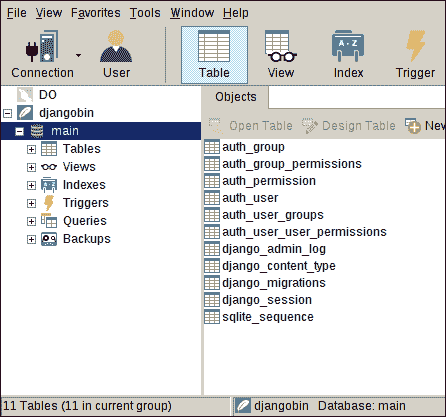
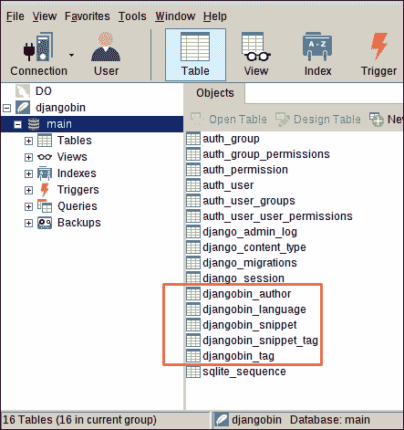

# Django 的迁移

> 原文：<https://overiq.com/django-1-11/migrations-in-django/>

最后更新于 2020 年 7 月 27 日

* * *

迁移是改变数据库模式的一种方式。同时，迁移还可以作为数据库的版本控制。在 Django 中，使用模型的常见工作流程如下:

1.  在`models.py`文件中创建或更改模型。
2.  创建迁移文件。
3.  使用步骤 2 中创建的迁移文件提交对数据库的更改。

在开发过程中，创建新模型和更改现有模型是非常常见的。Django 迁移系统允许我们随着应用的发展改变数据库模式。除此之外，迁移系统还跟踪对数据库所做的更改，以便我们可以及时向前或向后移动。如果我们不使用迁移系统，那么我们将不得不手动跟踪数据库更改，然后在服务器上执行原始 SQL 来提交更改。

当你和一个团队一起工作的时候，迁移系统也非常出色。假设您对数据库进行了一些重要的更改，并将其推送到远程服务器。您的团队成员需要做的就是进行迁移并应用它。仅此而已。他们不需要手动执行任何 SQL。

让我们创建一些迁移。

## 检查模型的错误

Django 提供了一个`check`子命令，用于检查`models.py`文件中的错误。

```py
$ ./manage.py check
System check identified no issues (0 silenced).

```

`"System check identified no issues (0 silenced)"`表示没有发现错误。现在，我们准备好创建我们的第一次迁移。在创建迁移文件之前，您应该始终使用`check`命令来查找模型中的错误。

## 创建迁移

我们使用`makemigrations`子命令来创建迁移。打开终端并键入以下命令。

```py
$ ./manage.py makemigrations djangobin

```

您将看到如下输出:

```py
Migrations for 'djangobin':
  djangobin/migrations/0001_initial.py
    - Create model Author
    - Create model Language
    - Create model Snippet
    - Create model Tag
    - Add field tags to snippet

```

在前面的命令中，我们指定了要为其创建迁移的应用的名称，即 djangobin。如果我们不指定应用名称，那么 Django 将为所有已安装的应用创建迁移，假设自上次`makemigrations`运行以来，相应应用的`models.py`文件中有任何更改。换句话说，只有当 Django 检测到`models.py`文件中的变化时，它才会创建迁移。再次尝试运行`makemigrations`命令，但这次没有指定应用的名称。

```py
$ ./manage.py makemigrations
No changes detected

```

因为自上次执行`makemigrations`命令后没有新的变化，所以得到`"No changes detected"`。

那么`makemigrations`命令做了什么？

`makemigrations`命令在 djangobin 应用的`migrations`子目录中创建了一个名为`0001_initial.py`的迁移文件。这个迁移文件反映了我们模型的当前状态。我们将使用这个迁移文件来更新我们的数据库。换句话说，Django 将使用迁移文件创建 SQL 查询来更新数据库的当前状态，使其与`models.py`同步。在下一节中，我们将查看迁移文件。

## 检查迁移

在 djangobin app 的`migrations`子目录中打开名为`0001_initial.py`的迁移文件。应该是这样的:

```py
# -*- coding: utf-8 -*-
# Generated by Django 1.11 on 2018-05-25 06:14
from __future__ import unicode_literals

from django.db import migrations, models
import django.db.models.deletion

class Migration(migrations.Migration):

    initial = True

    dependencies = [
    ]

    operations = [
        migrations.CreateModel(
            name='Author',
            fields=[
                ('id', models.AutoField(auto_created=True, primary_key=True, serialize=False, verbose_name='ID')),
                ('name', models.CharField(max_length=100)),
                ('email', models.EmailField(max_length=254, unique=True)),
                ('active', models.BooleanField(default=False)),
                ('created_on', models.DateTimeField(auto_now_add=True)),
                ('last_logged_in', models.DateTimeField(auto_now=True)),
            ],
        ),
        migrations.CreateModel(
            name='Language',
            fields=[
                ('id', models.AutoField(auto_created=True, primary_key=True, serialize=False, verbose_name='ID')),
                ('name', models.CharField(max_length=100)),
                ('lang_code', models.CharField(max_length=100, unique=True)),
                ('slug', models.SlugField(max_length=100, unique=True)),
                ('mime', models.CharField(help_text='MIME to use when sending snippet as file.', max_length=100)),
                ('file_extension', models.CharField(max_length=10)),
                ('created_on', models.DateTimeField(auto_now_add=True)),
                ('updated_on', models.DateTimeField(auto_now=True)),
            ],
            options={
                'ordering': ['name'],
            },
        ),
        migrations.CreateModel(
            name='Snippet',
            fields=[
                ('id', models.AutoField(auto_created=True, primary_key=True, serialize=False, verbose_name='ID')),
                ('title', models.CharField(blank=True, max_length=200)),
                ('original_code', models.TextField()),
                ('highlighted_code', models.TextField()),
                ('expiration', models.CharField(choices=[('never', 'Never'), ('1 week', '1 week'), ('1 month', '1 month'), ('6 month', '6 month'), ('1 year', '1 year')], max_length=10)),
                ('exposure', models.CharField(choices=[('public', 'Public'), ('unlisted', 'Unlisted'), ('private', 'Private')], max_length=10)),
                ('hits', models.IntegerField(default=0)),
                ('slug', models.CharField(max_length=100)),
                ('created_on', models.DateTimeField(auto_now_add=True)),
                ('author', models.ForeignKey(on_delete=django.db.models.deletion.CASCADE, to='djangobin.Author')),
                ('language', models.ForeignKey(on_delete=django.db.models.deletion.CASCADE, to='djangobin.Language')),
            ],
            options={
                'ordering': ['-created_on'],
            },
        ),
        migrations.CreateModel(
            name='Tag',
            fields=[
                ('id', models.AutoField(auto_created=True, primary_key=True, serialize=False, verbose_name='ID')),
                ('name', models.CharField(max_length=200, unique=True)),
                ('slug', models.CharField(max_length=200, unique=True)),
            ],
            options={
                'ordering': ['name'],
            },
        ),
        migrations.AddField(
            model_name='snippet',
            name='tags',
            field=models.ManyToManyField(to='djangobin.Tag'),
        ),
    ]

```

如您所见，迁移文件包含一个继承自`migrations.Migration`的常规 Python 类。在第 11 行中，`initial=True`表示这是我们对 djangobin 应用的第一次迁移。`dependencies`属性定义了在迁移之前应该运行哪些迁移。因为这是我们第一次迁移应用，所以设置为空列表。Django 使用迁移文件的`dependencies`属性来决定迁移文件的运行顺序。假设在对`models.py`文件中的`Language`模型进行了一些更改之后，我们已经创建了另一个迁移文件。那么第二个迁移文件的`dependencies`属性将如下所示:

```py
class Migration(migrations.Migration):

    dependencies = [
        ('djangobin', '0001_initial'),
    ]

```

在这种情况下，`dependencies`属性指的是 djangobin app 的`0001_initial`迁移。这意味着 Django 将在运行第二次迁移之前运行迁移`0001_initial`。

最后，在第 16 行，我们有`operations`属性。它按顺序定义了要为当前迁移运行的操作列表。现在您知道迁移文件是如何构造的了。让我们看一下它将生成的提交更改的 SQL 命令。

## 正在检查 SQL

您可以使用`sqlmigrate`命令查看`0001_initial.py`将生成的实际的 SQL 查询，以改变数据库的当前状态。`sqlmigrate`需要两个参数，应用名称和迁移名称。您不需要传递迁移文件的全名，开始几个字符就足够了。

```py
$ ./manage.py sqlmigrate djangobin 0001
BEGIN;
--
-- Create model Author
--
CREATE TABLE "djangobin_author" ("id" integer NOT NULL PRIMARY KEY AUTOINCREMENT, "name" varchar(100) NOT NULL UNIQUE, "email" varchar(254) NOT NULL UNIQUE, "active" bool NOT NULL, "created_on" datetime NOT NULL, "last_logged_in" datetime NOT NULL);
--
-- Create model Language
--
CREATE TABLE "djangobin_language" ("id" integer NOT NULL PRIMARY KEY AUTOINCREMENT, "name" varchar(100) NOT NULL, "lang_code" varchar(100) NOT NULL UNIQUE, "slug" varchar(100) NOT NULL UNIQUE, "mime" varchar(100) NOT NULL, "created_on" datetime NOT NULL, "updated_on" datetime NOT NULL);
--
-- Create model Snippet
--
CREATE TABLE "djangobin_snippet" ("id" integer NOT NULL PRIMARY KEY AUTOINCREMENT, "title" varchar(200) NOT NULL, "code" text NOT NULL, "html_code" text NOT NULL, "expiration" varchar(10) NOT NULL, "exposure" varchar(10) NOT NULL, "hits" integer NOT NULL, "slug" varchar(100) NOT NULL, "created_on" datetime NOT NULL, "author_id" integer NOT NULL REFERENCES "djangobin_author" ("id"), "language_id" integer NOT NULL REFERENCES "djangobin_language" ("id"));
--
-- Create model Tag
--
CREATE TABLE "djangobin_tag" ("id" integer NOT NULL PRIMARY KEY AUTOINCREMENT, "name" varchar(200) NOT NULL, "slug" varchar(200) NOT NULL);
--
-- Add field tag to snippet
--
CREATE TABLE "djangobin_snippet_tag" ("id" integer NOT NULL PRIMARY KEY AUTOINCREMENT, "snippet_id" integer NOT NULL REFERENCES "djangobin_snippet" ("id"), "tag_id" integer NOT NULL REFERENCES "djangobin_tag" ("id"));
CREATE INDEX "djangobin_snippet_author_id_683799a5" ON "djangobin_snippet" ("author_id");
CREATE INDEX "djangobin_snippet_language_id_f4016a66" ON "djangobin_snippet" ("language_id");
CREATE UNIQUE INDEX "djangobin_snippet_tag_snippet_id_tag_id_c040c9fb_uniq" ON "djangobin_snippet_tag" ("snippet_id", "tag_id");
CREATE INDEX "djangobin_snippet_tag_snippet_id_c40481f2" ON "djangobin_snippet_tag" ("snippet_id");
CREATE INDEX "djangobin_snippet_tag_tag_id_e054d4df" ON "djangobin_snippet_tag" ("tag_id");
COMMIT;

```

以`--`开头的行是注释，其他都是普通的旧 SQL。注意`sqlmigrate`并不针对数据库执行生成的 SQL，它只是打印出了 Django 用来改变数据库模式的 SQL。

## 跟踪迁移

`showmigrations`子命令显示每个已安装应用下已应用和未应用迁移的列表。回想一下，我们已经在[创建 Django 项目](/django-1-11/creating-django-project/#django-built-in-applications)一章中多次使用过这个命令。让我们再执行一次。

```py
$ ./manage.py showmigrations
admin
 [X] 0001_initial
 [X] 0002_logentry_remove_auto_add
auth
 [X] 0001_initial
 [X] 0002_alter_permission_name_max_length
 [X] 0003_alter_user_email_max_length
 [X] 0004_alter_user_username_opts
 [X] 0005_alter_user_last_login_null
 [X] 0006_require_contenttypes_0002
 [X] 0007_alter_validators_add_error_messages
 [X] 0008_alter_user_username_max_length
contenttypes
 [X] 0001_initial
 [X] 0002_remove_content_type_name
djangobin
 [ ] 0001_initial
sessions
 [X] 0001_initial

```

前面有`[X]`的所有迁移都被应用到数据库中。唯一未应用的迁移是 djangobin 应用中的`0001_initial`。

## 提交更改

要应用迁移概述的更改，我们使用`migrate`子命令。`migrate`子命令的行为取决于传递给它的参数数量。如果您运行`migrate`子命令而没有任何参数，它将应用所有已安装应用的所有未应用迁移。如果将应用名称作为参数传递，则`migrate`将仅从指定的应用运行未应用的迁移。

我们也可以使用`migrate`来取消迁移。为此，请指定应用名称，后跟要迁移到的迁移名称。我们将在下一节中看到一个这样的例子。

但是在我们运行`migrate`命令之前。让我们看看数据库的当前状态。



现在，我们的数据库中有 11 个表。好了，现在让我们运行`migrate`看看会发生什么。

```py
$ ./manage.py migrate djangobin
Operations to perform:
  Apply all migrations: djangobin
Running migrations:
  Applying djangobin.0001_initial... OK

```

如果您还没有数据库，那么`migrate`命令将在项目的根目录下创建一个名为`db.sqite3`的 SQLite 数据库，即`djangobin/django_project`。

另一方面，如果您已经有了一个数据库，那么 Django 将修改现有的数据库，使其与我们的模型同步。

让我们刷新 SQLite 数据库，看看现在有多少表。



我们现在有 16 个表，迁移命令已经为我们创建了 5 个新表。等等！为什么是 5？我们只创造了 4 款新车型，对吗？为什么多一个？

Django 创建了一个额外的表(`djangobin_snippet_tags`)来管理`Snippet`和`Tag`模型之间的多对多关系。这不是 Django 特有的，事实上，这是数据库的工作方式。

所有以`"djangobin_"`开头的表格都属于 djangobin app。以下是每张表的概要:

| 桌子 | 描述 |
| --- | --- |
| `djangobin_author` | 存储作者。 |
| `djangobin_language` | 存储语言。 |
| `djangobin_snippet` | 存储代码片段。 |
| `djangobin_tag` | 存储标签。 |
| `djangobin_snippet_tags` | 管理代码片段和标签模型之间的多对多关系。在数据库术语中，该表被称为连接表。 |

## 再次迁移

只是为了确保您完全理解迁移。我们将再演示一次。在本节中，我们将把`Snippet`模型的一个字段从`hits`重命名为`visits`，然后我们将使用`migrate`命令恢复更改。

打开 djangobin 应用内的`models.py`，将`Snippet`模型的`hits`字段重命名为`visits`，如下所示:

**djangobin/django _ project/djangobin/models . py**

```py
#...

class Snippet(models.Model):
    title = models.CharField(max_length=200, blank=True)
    original_code = models.TextField()
    highlighted_code = models.TextField(blank=True)
    expiration = models.CharField(max_length=10, choices=Pref.expiration_choices)
    exposure = models.CharField(max_length=10, choices=Pref.exposure_choices)
    visits = models.IntegerField(default=0)
    slug = models.SlugField()
    created_on = models.DateTimeField(auto_now_add=True)

    language = models.ForeignKey(Language, on_delete=models.CASCADE)
    author = models.ForeignKey(Author, on_delete=models.CASCADE)
    tags = models.ManyToManyField('Tag')

#...

```

**步骤 1** -使用`check`命令检查模型中的错误。

```py
$ ./manage.py check djangobin
System check identified no issues (0 silenced).

```

`models.py`文件中没有任何错误。让我们现在创建我们的迁移文件。

**步骤 2** -使用`makemigrations`命令创建迁移文件。

```py
$ ./manage.py makemigrations djangobin
Did you rename snippet.created_on to snippet.publication_date (a DateTimeField)? [y/N] y
Migrations for 'djangobin':
  djangobin/migrations/0002_auto_20180323_0623.py
    - Rename field created_on on snippet to publication_date

```

执行`makemigrations`命令后，Django 会提示您验证更改。按`Y`或`y`确认。这将在 djangobin 应用的`migrations`目录中创建一个新的迁移文件。

**步骤 3(可选)** -使用`sqlmigrate`命令查看 Django 用来更新数据库的 SQL 查询。

```py
$ ./manage.py sqlmigrate djangobin 0002
BEGIN;
--
-- Rename field hits on snippet to visits
--
ALTER TABLE "djangobin_snippet" RENAME TO "djangobin_snippet__old";
CREATE TABLE "djangobin_snippet" ("id" integer NOT NULL PRIMARY KEY AUTOINCREMENT, "visits" integer NOT NULL, "title" varchar(200) NOT NULL, "original_code" text NOT NULL, "highlighted_code" text NOT NULL, "expiration" varchar(10) NOT NULL, "exposure" varchar(10) NOT NULL, "slug" varchar(100) NOT NULL, "created_on" datetime NOT NULL, "author_id" integer NOT NULL REFERENCES "djangobin_author" ("id"), "language_id" integer NOT NULL REFERENCES "djangobin_language" ("id"));
INSERT INTO "djangobin_snippet" ("slug", "id", "expiration", "visits", "author_id", "title", "original_code", "created_on", "exposure", "highlighted_code", "language_id") SELECT "slug", "id", "expiration", "hits", "author_id", "title", "original_code", "created_on", "exposure", "highlighted_code", "language_id" FROM "djangobin_snippet__old";
DROP TABLE "djangobin_snippet__old";
CREATE INDEX "djangobin_snippet_author_id_683799a5" ON "djangobin_snippet" ("author_id");
CREATE INDEX "djangobin_snippet_language_id_f4016a66" ON "djangobin_snippet" ("language_id");
COMMIT;

```

对于单个字段重命名来说，这是一个很大的代码量。如果您不使用迁移，那么您必须自己编写所有这些代码。多亏了移民，你很幸运。

**步骤 4(可选)** -要查看已应用和未应用的迁移，请使用`showmigrations`命令:

```py
$ ./manage.py showmigrations djangobin
djangobin
 [X] 0001_initial
 [ ] 0002_auto_20180323_0623

```

如您所见，迁移`0002_auto_20180323_0623`目前尚未应用。

**步骤 5** -最后，使用`migrate`命令将迁移文件中存储的更改提交到数据库。

```py
$ ./manage.py migrate djangobin
Operations to perform:
  Apply all migrations: djangobin
Running migrations:
  Applying djangobin.0002_auto_20180323_0623... OK

```

## 回滚迁移

假设出于某种原因，我们不喜欢对`Snippet`模型所做的更改。有两种方法可以恢复我们所做的更改:

1.  第一种方法是在`models.py`中将字段名称从`visits`更改为`hits`，创建迁移文件，然后提交更改。
2.  第二种方法快速简单。只需使用`migrate`命令并指定您想要迁移到的应用名称和迁移文件名称，而不是更改模型和创建新的迁移。

您已经看到了如何创建迁移并提交对数据库的更改，因此，我们将使用第二种方法。

这种情况下，app 名称为`djangobin`，我们要迁移到的迁移文件名称以`0001`开头。因此，要恢复更改，请执行以下命令。

```py
$ ./manage.py migrate djangobin 0001
Operations to perform:
  Target specific migration: 0001_initial, from djangobin
Running migrations:
  Rendering model states... DONE
  Unapplying djangobin.0002_auto_20180323_0623... OK

```

此时，您可以再次应用`0002_auto_20180323_0623`迁移。通过键入以下命令。

```py
$ ./manage.py migrate djangobin 0002

```

然而，在这种情况下，我们确信我们再也不想回到
`0002_auto_20180323_0623`迁徙了。所以最好从`migrations`目录中删除。

之后，打开`models.py`文件，再次将`Snippet`模型的`visits`字段重命名为`hits`。

你现在可能已经掌握了。

## 何时创建迁移

Django 仅在您添加、修改或删除模型字段或元类时检测更改。添加、修改或删除模型方法不被视为更改。您可以通过向任何模型类添加任意方法并运行`makemigrations`命令来测试这一事实。

```py
$ ./manage.py makemigrations
No changes detected

```

希望您现在能更好地理解一般的迁移，以及它们在 Django 是如何使用的。如果你还有些困惑，我建议你再读一遍这一章。

* * *

* * *