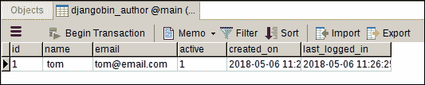
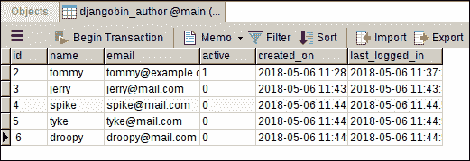

# Django ORM 基础第 1 部分

> 原文：<https://overiq.com/django-1-11/django-orm-basics-part-1/>

最后更新于 2020 年 7 月 27 日

* * *

学习了创建模型的艺术后，现在让我们将注意力转移到如何插入和访问数据库中的数据。Django ORM 提供了一种优雅而强大的与数据库交互的方式。ORM 代表对象关系映射器。它只是描述如何以面向对象的方式访问存储在数据库中的数据而不是执行 SQL 的一个花哨的词。

使用`shell`命令启动 DjangoShell。

```py
$ ./manage.py shell
Python 3.5.2 (default, Nov 23 2017, 16:37:01) 
[GCC 5.4.0 20160609] on linux
Type "help", "copyright", "credits" or "license" for more information.
>>>

```

要在 shell 中使用数据库，首先，我们必须导入必要的模型。在本章中，我们将处理 djangobin 应用中存储的模型，因此让我们从 djangobin 应用中导入所有模型开始。

```py
>>>
>>> from djangobin.models import *
>>>

```

此时，这些模型对应的表是空的。

让我们创建一个`Author`对象。

```py
>>>
>>> a = Author(name='tom', email='tom@email.com', active=True)
>>>

```

尝试打印变量`a`，您将获得以下输出:

```py
>>>
>>> a
<Author: tom : tom@email.com>
>>>
>>> print(a)
tom : tom@email.com
>>>

```

请注意，作者的字符串表示来自`Author`模型中的`__str__()`方法。如果我们没有定义`__str__()`方法，我们将得到如下输出:

```py
<Author: Author object>

```

您可以使用点(`.`)运算符来访问对象的属性。

```py
>>>
>>> a.name
'tom'
>>>
>>> a.email
'tom@email.com'
>>>
>>> a.active
True
>>>

```

请注意，在创建`Author`对象时，我们没有为`created_on`和`last_logged_in`字段提供任何值，因为这些字段将`auto_now_add`和`auto_now`设置为`True`。因此，当您将对象保存到数据库时，Django 将自动提供当前日期和时间。然而，如果我们没有设置`auto_now_add`和`auto_now`参数，那么我们将不得不向`created_on`和`last_logged_in`字段传递值，如下所示:

```py
>>>
>>> from django.utils import timezone
>>>
>>> r = Author(name="root", email="root@mail.com", active=True, 
... created_on=timezone.now, last_logged_in=timezone.now)
>>>
>>>

```

请注意，这里我使用的是`django.utils.timezone`模块，而不是 Python 内置的`datetime`模块。这是因为`django.utils.timezone`模块默认生成一个时区感知`datetime.datetime`对象(由于`settings.py`文件中的`USE_TZ = True`)。

在前面的片段中需要注意的另一件重要的事情是，我们只是将函数的名称(`timezone.now`)传递给`created_on`和`last_logged_in`参数，而不是实际调用它。这允许 Django 在插入新记录时调用`timezone.now()`。

此时，变量`a`指向的对象只存在于 Django shell 内部。要将对象保存到数据库，请调用`save()`方法。

```py
>>>
>>> a.save()
>>>

```

回想一下，我们定义的每个模型都继承自`models.Model`类，这就是`save()`方法的来源。

要查看这个新添加的对象，请打开 Navicat 中的`djangobin_author`表。



类似地，`models.Model`类也提供了一个`delete()`方法来从数据库中删除一个对象。

```py
>>>
>>> a.delete()
(1, {'djangobin.Author': 1})
>>>

```

这段代码将作者`tom`从数据库中删除。然而，它仍然存在于 Shell 内部。

```py
>>>
>>> a
<Author: tom : tom@email.com>
>>>

```

让我们通过调用`save()`方法再次保存它。

保存对象时，会自动分配主键。可以使用`id`或`pk`属性引用主键。

```py
>>>
>>> a.id
2
>>> a.pk
2
>>>

```

如果你想改变一个对象的属性，只要分配新的值，然后再次调用`save()`方法。

```py
>>>
>>> a.name = 'tommy'
>>> a.email = 'tommy@example.com'
>>>
>>> a
<Author: tommy : tommy@example.com>
>>>

```

这些更改尚未保存到数据库中。为此，调用`save()`方法。

```py
>>>
>>> a.save()
>>>

```

## 通过管理器访问数据库

默认情况下，Django 会为每个模型类添加一个名为`objects`的管理器。`objects`管理器帮助我们以各种方式查询数据库。

要访问`objects`管理器类型模型类，后跟(`.`)点运算符，然后是`objects`管理器本身。例如:

```py
>>>
>>> Author.objects
<django.db.models.manager.Manager object at 0x7f84da83a1d0>
>>>
>>> type(Author.objects)
<class 'django.db.models.manager.Manager'>
>>>

```

可以看到，`objects`只是`django.db.models.manager.Manager`类的一个实例。`objects`管理器提供了一整套方法，让我们可以轻松地与数据库交互。

我们来讨论一下`objects`经理的一些重要方法。

## create()方法

`create()`方法允许我们一次创建对象并将其提交给数据库，而不是单独调用`save()`方法。例如:

```py
>>>
>>>
>>> a2 = Author.objects.create(name='jerry', email='jerry@mail.com')
>>>
>>> a2
<Author: jerry : jerry@mail.com>
>>>
>>> a2.pk
3
>>>
>>>

```

## bulk_create()方法

`bulk_create()`方法允许我们创建和提交多个对象。它接受对象列表。例如:

```py
>>>
>>> 
>>> Author.objects.bulk_create([
...     Author(name='spike', email='spike@mail.com'),
...     Author(name='tyke', email='tyke@mail.com'),
...     Author(name='droopy', email='droopy@mail.com'),
... ])
[<Author: spike : spike@mail.com>, <Author: tyke : tyke@mail.com>, <Author: droopy : droopy@mail.com>]
>>> 
>>>

```

此时，`djangobin_author`表应该是这样的:



## all()方法

`all()`方法从表中获取所有记录。例如:

```py
>>>
>>> Author.objects.all()
<QuerySet [<Author: tommy : tommy@example.com>, <Author: jerry : jerry@mail.com>, <Author: spike : spike@mail.com>, <Author: tyke : tyke@mail.com>, <Author: droopy : droopy@mail.com>]>
>>>

```

该查询返回`djangobin_author`表中的所有记录。

`all()`方法返回一个`QuerySet`对象。一个`QuerySet`对象看起来很像一个列表，但它不是一个实际的列表，然而，在某些方面，它的行为就像一个列表。例如，您可以使用索引号访问`QuerySet`对象中的单个成员。

```py
>>>
>>> l = Author.objects.all()
>>>
>>> type(l)
<class 'django.db.models.query.QuerySet'>
>>> 
>>> l
<QuerySet [<Author: tommy : tommy@example.com>, <Author: jerry : jerry@mail.com>, <Author: spike : spike@mail.com>, <Author: tyke : tyke@mail.com>, <Author: droopy : droopy@mail.com>]>
>>> 
>>>
>>> l[0]
<Author: tommy : tommy@example.com>
>>>
>>> l[1]
<Author: jerry : jerry@mail.com>
>>>
>>> l[2]
<Author: spike : spike@mail.com>
>>>

```

虽然，变量`l`指向类型为`QuerySet`的对象，但是`l[0]`、`l[1]`、`l[2]`等等都指向类型为`Author`的对象。

```py
>>>
>>> type(l[0])
<class 'djangobin.models.Author'>
>>>
>>> type(l[1])
<class 'djangobin.models.Author'>
>>>
>>> type(l[3])
<class 'djangobin.models.Author'>
>>>

```

一个`QuerySet`物体在 Django 特别重要。我们用它来过滤、排序和切片结果。正如我们将看到的，还有许多其他方法返回一个`QuerySet`对象。

`QuerySet`对象就像列表一样是可重复的。您可以使用 for 循环遍历其中的所有对象。

```py
>>>
>>> l = Author.objects.all()
>>>
>>> for a in l:
...    print("Author: {0}".format(a.name))
...
Author: tommy
Author: jerry
Author: spike
Author: tyke
Author: droopy
>>>

```

## count()方法

`count()`方法返回查询返回的记录总数。

```py
>>>
>>> Author.objects.count()
5
>>>

```

这个查询没有任何限定，这就是为什么它返回表中所有记录的计数。前面的查询在功能上等同于下面的查询:

```py
Author.objects.all().count()

```

## 使用 filter()方法筛选记录

大多数情况下，您只想处理数据的子集。在 Django，这就是`filter()`法的工作。它接受字段名作为关键字参数，并返回一个包含符合给定条件的对象的`QuerySet`。

```py
>>>
>>> Author.objects.filter(name='tommy')
<QuerySet [<Author: tommy : tommy@example.com>]>
>>>
>>> Author.objects.filter(name='johnny')
<QuerySet []>
>>>

```

查询`Author.objects.filter(name='tommy')`大致翻译成 SQL 如下:

```py
SELECT
    "djangobin_author"."id",
    "djangobin_author"."name",
    "djangobin_author"."email",
    "djangobin_author"."active",
    "djangobin_author"."created_on",
    "djangobin_author"."last_logged_in"
FROM
    "djangobin_author"
WHERE
    "djangobin_author"."name" = tommy

```

由于数据库只有一条名为`'tommy'`的记录，`QuerySet`对象只包含一个`Author`对象。如果我们有两个名称为`'tommy'`的记录，那么`filter()`会返回一个包含两个`Author`对象的`QuerySet`。

类似地，`Author.objects.filter(name='johnny')`大致翻译成 SQL 如下:

```py
SELECT
    "djangobin_author"."id",
    "djangobin_author"."name",
    "djangobin_author"."email",
    "djangobin_author"."active",
    "djangobin_author"."created_on",
    "djangobin_author"."last_logged_in"
FROM
    "djangobin_author"
WHERE
    "djangobin_author"."name" = johnny

```

由于没有名称为`'johnny'`的记录，返回一个空的`QuerySet`。

我们也可以使用`QuerySet`对象的`query`属性直接打印 Django 用来查询数据库的原始 SQL。

```py
>>>
>>> print(Author.objects.filter(name='tommy').query)
SELECT
    "djangobin_author"."id",
    "djangobin_author"."name",
    "djangobin_author"."email",
    "djangobin_author"."active",
    "djangobin_author"."created_on",
    "djangobin_author"."last_logged_in"
FROM
    "djangobin_author"
WHERE
    "djangobin_author"."name" = tommy
>>>

```

使用关键字参数执行的匹配区分大小写。

```py
>>>
>>> Author.objects.filter(email='jerry@mail.com')
<QuerySet [<Author: jerry : jerry@mail.com>]>
>>>
>>> Author.objects.filter(email='JERRY@mail.com')
<QuerySet []>
>>>

```

最后一个查询返回一个空的`QuerySet`，因为没有电子邮件是`"JERRY@mail.com"`的记录，但是有一个电子邮件是`"jerry@mail.com"`的记录。

也可以将多个关键字参数传递给`filter()`方法。当我们这样做的时候，关键字参数被放在一起。

```py
>>>
>>> Author.objects.filter(name='spike', email='spike@mail.com')
<QuerySet [<Author: spike : spike@mail.com>]>
>>>

```

该查询大致转换为如下 SQL:

```py
SELECT
    "djangobin_author"."id",
    "djangobin_author"."name",
    "djangobin_author"."email",
    "djangobin_author"."active",
    "djangobin_author"."created_on",
    "djangobin_author"."last_logged_in"
FROM
    "djangobin_author"
WHERE
    (
        "djangobin_author"."name" = spike
        AND "djangobin_author"."email" = spike@mail.com
    )

```

## 使用 exclude()方法排除记录

`exclude()`法与`filter()`法正好相反。它返回一个`QuerySet`，只包含与给定参数不匹配的对象。

```py
>>> 
>>> Author.objects.exclude(name='spike', email='spike@mail.com')
<QuerySet [<Author: tommy : tommy@example.com>, <Author: jerry : jerry@mail.com>, <Author: tyke : tyke@mail.com>, <Author: droopy : droopy@mail.com>]>
>>> 
>>>

```

该查询大致转换为如下 SQL:

```py
>>> print(Author.objects.exclude(name='spike', email='spike@mail.com').query)
SELECT
    "djangobin_author"."id",
    "djangobin_author"."name",
    "djangobin_author"."email",
    "djangobin_author"."active",
    "djangobin_author"."created_on",
    "djangobin_author"."last_logged_in"
FROM
    "djangobin_author"
WHERE
    NOT (
        "djangobin_author"."email" = spike@mail.com
        AND "djangobin_author"."name" = spike
    )

```

## 按主键获取对象

如前所述，Django 会自动向每个模型类添加一个名为`id`的主键字段。您可以使用`id`字段或其别名`pk`通过其主键来访问对象。例如:

```py
>>>
>>> Author.objects.filter(id=2)
<QuerySet [<Author: tommy : tommy@example.com>]>
>>>
>>> Author.objects.filter(pk=2)
<QuerySet [<Author: tommy : tommy@example.com>]>
>>>

```

## 字段查找

除了传递字段名作为关键字参数。您也可以使用一种叫做查找的方法来过滤结果。查找由一个模型字段和两个下划线(`__`)以及查找名称组成。查找也作为关键字参数传递。

### 包含查找

`contains`查找执行区分大小写的包容测试。例如:

```py
>>>
>>> Author.objects.filter(name__contains="ke")
<QuerySet [<Author: spike : spike@mail.com>, <Author: tyke : tyke@mail.com>]>
>>>
>>>

```

在这个查询中，`contains`查找找到所有对象，其中`name`字段在开始、结束或两者之间包含字符串`"ke"`。

查询`Author.objects.filter(name__contains="ke")`大致翻译成 SQL 如下:

```py
SELECT
    "djangobin_author"."id",
    "djangobin_author"."name",
    "djangobin_author"."email",
    "djangobin_author"."active",
    "djangobin_author"."created_on",
    "djangobin_author"."last_logged_in"
FROM
    "djangobin_author"
WHERE
    "djangobin_author"."name" LIKE '%ke%'

```

通过`contains`查找执行的匹配区分大小写。

### 图标包含查找

工作方式与`contains`类似，但执行不区分大小写的匹配。

```py
>>>
>>> Author.objects.filter(name__icontains="KE")
<QuerySet [<Author: spike : spike@mail.com>, <Author: tyke : tyke@mail.com>]>
>>>

```

SQLite 数据库不支持区分大小写的`LIKE`语句。因此，`contains`和`icontains`查找将返回相同的结果。

### 从查找开始

`startswith`查找执行区分大小写的开头。例如:

```py
>>>
>>> Author.objects.filter(name__startswith="t")
<QuerySet [<Author: tommy : tommy@email.com>, <Author: tyke : tyke@mail.com>]>
>>>

```

在这个查询中，`startswith`查找找到了所有以字符串`"t"`开头的`name`字段的记录。

上述查询的等效 SQL 是:

```py
SELECT
    "djangobin_author"."id",
    "djangobin_author"."name",
    "djangobin_author"."email",
    "djangobin_author"."active",
    "djangobin_author"."created_on",
    "djangobin_author"."last_logged_in"
FROM
    "djangobin_author"
WHERE
    "djangobin_author"."name" LIKE 't%'

```

还有一个互补的查找叫做`endswith`。

### 查找结束

它执行区分大小写的以。例如:

```py
>>>
>>> Author.objects.filter(email__endswith="com")
<QuerySet [<Author: tom : tom@email.com>, <Author: jerry : jerry@mail.com>, <Author: spike : spike@mail.com>, <Author: tyke : tyke@mail.com>, <Author: droopy :
droopy@mail.com>]>
>>>
>>>

```

这里`endswith`查找找到所有电子邮件以`"com"`结尾的记录。

上述查询的等效 SQL 是:

```py
SELECT
    "djangobin_author"."id",
    "djangobin_author"."name",
    "djangobin_author"."email",
    "djangobin_author"."active",
    "djangobin_author"."created_on",
    "djangobin_author"."last_logged_in"
FROM
    "djangobin_author"
WHERE
    "djangobin_author"."email" LIKE "%com"

```

`startswith`和`endswith`都区分大小写。它们的不区分大小写的对等词是`istartswith`和`iendswith`。

### gt 查找

大于:

```py
>>>
>>> Author.objects.filter(id__gt=3)
<QuerySet [<Author: spike : spike@mail.com>, <Author: tyke : tyke@mail.com>, <Author: droopy : droopy@mail.com>]>
>>>

```

在这个查询中，`gt`查找找到所有的`id`或主键(`pk`)大于`3`的记录。

上述查询的等效 SQL 是:

```py
SELECT
    "djangobin_author"."id",
    "djangobin_author"."name",
    "djangobin_author"."email",
    "djangobin_author"."active",
    "djangobin_author"."created_on",
    "djangobin_author"."last_logged_in"
FROM
    "djangobin_author"
WHERE
    "djangobin_author"."id" > 3

```

还有一个互补查找叫做`lt`(小于)。

### lt 查找

小于:

```py
>>>
>>> Author.objects.filter(id__lt=3)
<QuerySet [<Author: tommy : tommy@example.com>]>
>>>
>>>

```

这里`lt`查找查找主键小于 3 的所有记录。

上述查询的等效 SQL 是:

```py
SELECT
    "djangobin_author"."id",
    "djangobin_author"."name",
    "djangobin_author"."email",
    "djangobin_author"."active",
    "djangobin_author"."created_on",
    "djangobin_author"."last_logged_in"
FROM
    "djangobin_author"
WHERE
    "djangobin_author"."id" < 3

```

还有两个类似的查找分别叫做`gte`(大于等于)和`lte`(小于等于)，分别查找大于等于和小于等于的记录。

您也可以一次传递多个查找。当我们这样做时，查找和 and 一起进行。

```py
>>>
>>> Author.objects.filter(id__lt=5, email__endswith="com")
<QuerySet [<Author: tommy : tommy@example.com>, <Author: jerry : jerry@mail.com>, <Author: spike : spike@mail.com>]>
>>> 
>>>

```

上述查询的等效 SQL 是:

```py
SELECT
    "djangobin_author"."id",
    "djangobin_author"."name",
    "djangobin_author"."email",
    "djangobin_author"."active",
    "djangobin_author"."created_on",
    "djangobin_author"."last_logged_in"
FROM
    "djangobin_author"
WHERE
    (
        "djangobin_author"."id" < 5
        AND "djangobin_author"."email" LIKE "%com"
    )

```

### 精确查找

`exact`查找执行区分大小写的精确匹配:例如:

```py
>>>
>>> Author.objects.filter(name__exact="spike")
<QuerySet [<Author: spike : spike@mail.com>]>
>>>

```

该查询返回任何名称为`spike`的对象。该查询的 SQL 等价物如下:

```py
>>> print(Author.objects.filter(name__exact="spike").query)
SELECT
    "djangobin_author"."id",
    "djangobin_author"."name",
    "djangobin_author"."email",
    "djangobin_author"."active",
    "djangobin_author"."created_on",
    "djangobin_author"."last_logged_in"
FROM
    "djangobin_author"
WHERE
    "djangobin_author"."name" = spike
>>>

```

需要记住的重要一点是，如果您没有在查询中指定任何查找，Django 将隐式应用`exact`查找。这意味着前面的查询也可以编写如下:

```py
>>>
>>> Author.objects.filter(name="spike")
<QuerySet [<Author: spike : spike@mail.com>]>
>>>

```

### iexact 查找

与`exact`查找相同，但执行不区分大小写的匹配。

```py
>>> 
>>> Author.objects.filter(name__exact="SPIKE")
<QuerySet []>
>>> 
>>> Author.objects.filter(name__iexact="SPIKE")
<QuerySet [<Author: spike : spike@mail.com>]>
>>>

```

### isnull 查找

`isnull`查找取`True`或`False`，分别添加`IS NULL`或`IS NOT NULL`操作符到查询中。

```py
>>>
>>> Author.objects.filter(name__isnull=True)
<QuerySet []>
>>> 
>>> Author.objects.filter(name__isnull=False)
<QuerySet [<Author: tommy : tommy@example.com>, <Author: jerry : jerry@mail.com>, <Author: spike : spike@mail.com>, <Author: tyke : tyke@mail.com>, <Author: droopy : droopy@mail.com>]>
>>>

```

前面两个查询的 SQL 等价物如下:

```py
>>> 
>>> Author.objects.filter(name__isnull=True).query
>>> print(Author.objects.filter(name__isnull=True).query)
SELECT
    "djangobin_author"."id",
    "djangobin_author"."name",
    "djangobin_author"."email",
    "djangobin_author"."active",
    "djangobin_author"."created_on",
    "djangobin_author"."last_logged_in"
FROM
    "djangobin_author"
WHERE
    "djangobin_author"."name" IS NULL
>>> 

>>> print(Author.objects.filter(name__isnull=False).query)
SELECT
    "djangobin_author"."id",
    "djangobin_author"."name",
    "djangobin_author"."email",
    "djangobin_author"."active",
    "djangobin_author"."created_on",
    "djangobin_author"."last_logged_in"
FROM
    "djangobin_author"
WHERE
    "djangobin_author"."name" IS NOT NULL
>>>

```

### 查找中

`in`查找找到列表中指定的所有值。例如:

```py
>>> 
>>> Author.objects.filter(name__in=['spike', 'tyke'])
<QuerySet [<Author: spike : spike@mail.com>, <Author: tyke : tyke@mail.com>]>
>>>

```

前面的查询返回`name`为`spike`或`tyke`的`Author`对象。

该查询的 SQL 等价物是:

```py
SELECT
    "djangobin_author"."id",
    "djangobin_author"."name",
    "djangobin_author"."email",
    "djangobin_author"."active",
    "djangobin_author"."created_on",
    "djangobin_author"."last_logged_in"
FROM
    "djangobin_author"
WHERE
    "djangobin_author"."name" IN ('spike', 'tyke')

```

### 日期、月份和年份查找

`day`、`month`和`year`查找分别执行精确的日、月和年匹配。例如:

```py
>>>
>>> Author.objects.filter(created_on__year=2018)
<QuerySet [<Author: tommy : tommy@example.com>, <Author: jerry : jerry@mail.com>, <Author: spike : spike@mail.com>, <Author: tyke : tyke@mail.com>, <Author: droopy : droopy@mail.com>]>
>>>

```

该查询返回 2018 年创建的所有`Author`对象。

```py
>>> 
>>> Author.objects.filter(created_on__month=3, created_on__year=2018)
<QuerySet [<Author: tommy : tommy@example.com>, <Author: jerry : jerry@mail.com>, <Author: spike : spike@mail.com>, <Author: tyke : tyke@mail.com>, <Author: droopy : droopy@mail.com>]>
>>>

```

该查询返回 2018 年 3 月创建的所有对象。

```py
>>> 
>>> Author.objects.filter(created_on__day=24, created_on__month=3, created_on__year=2018)
<QuerySet [<Author: jerry : jerry@mail.com>, <Author: spike : spike@mail.com>, <Author: tyke : tyke@mail.com>, <Author: droopy : droopy@mail.com>]>
>>>

```

该查询返回 2018 年 3 月 24 日创建的所有对象。

## 链接查询集

也可以链接多个`QuerySet`对象，以获得您想要的东西。例如:

```py
>>> 
>>> Author.objects.filter(id__gt=1).\
...     exclude(name='spike').\
...     filter(name__icontains="o")
<QuerySet [<Author: tommy : tommy@example.com>, <Author: droopy : droopy@mail.com>]>
>>>

```

在这个查询中，我们首先创建一个包含主键大于`1`的对象的`QuerySet`。然后我们排除所有名称为`spike`的物体。最后，我们只过滤在它们的`name`中包含字符`'o'`的对象。

当您在构建查询时应用一些逻辑时，链接特别有用。例如:

```py
q = Author.objects.filter(created_on__year=2018)
if True:  # some logic
    q = q.filter(active=False)

```

## 得到第一个和最后一个结果

`first()`和`last()`方法分别从`QuerySet`返回第一个和最后一个结果。

```py
>>>
>>> Author.objects.filter(created_on__year=2018)
<QuerySet [<Author: tommy : tommy@example.com>, <Author: jerry : jerry@mail.com>, <Author: spike : spike@mail.com>, <Author: tyke : tyke@mail.com>, <Author: droopy : droopy@mail.com>]>
>>> 
>>> 
>>> Author.objects.filter(created_on__year=2018).first()
<Author: tommy : tommy@example.com>
>>> 
>>>
>>> Author.objects.filter(created_on__year=2018).last()
<Author: droopy : droopy@mail.com>
>>> 
>>>

```

## 使用 get()方法检索单个对象

上节描述的`filter()`方法返回一个`QuerySet`，有时候我们只想从表中取一条记录。为了处理这些情况，`objects`经理提供了一种`get()`方法。`get()`方法接受与`filter()`方法相同的参数，但它只返回一个对象。如果它发现多个对象，它会引发`MultipleObjectsReturned`异常。如果没有找到任何对象，就会引发`DoesNotExist`异常。

```py
>>>
>>> Author.objects.get(name="tommy")
<Author: tommy : tommy@email.com>
>>>
>>> Author.objects.filter(name="tommy")
<QuerySet [<Author: tommy : tommy@example.com>]>
>>>

```

注意`get()`和`filter()`方法输出的差异。对于同一个参数，它们都返回两个不同的结果。`get()`方法返回一个`Author`的实例，而`filter()`方法返回一个`QuerySet`对象。

让我们看看如果`get()`方法遇到多条记录会发生什么。

```py
>>>
>>> Author.objects.filter(name__contains="ke")
<QuerySet [<Author: spike : spike@mail.com>, <Author: tyke : tyke@mail.com>]>
>>>
>>>
>>> Author.objects.get(name__contains="ke")
Traceback (most recent call last):
...
djangobin.models.MultipleObjectsReturned: get() returned more than one Author -- it returned 2!
>>>

```

这里`get()`方法引发`MultipleObjectsReturned`异常，因为数据库中有多个对象与给定参数匹配。

同样，如果您试图访问一个不存在的对象，那么`get()`方法将引发`DoesNotExist`异常。

```py
>>>
>>> Author.objects.get(name__contains="captain planet")
Traceback (most recent call last):
...
djangobin.models.DoesNotExist: Author matching query does not exist.
>>>

```

## 排序结果

为了排序结果，我们使用`order_by()`方法，就像`filter()`一样，它也返回一个`QuerySet`对象。它接受要作为位置参数进行排序的字段名。

```py
>>>
>>> Author.objects.order_by("id")
<QuerySet [<Author: tommy : tommy@example.com>, <Author: jerry : jerry@mail.com>, <Author: spike : spike@mail.com>, <Author: tyke : tyke@mail.com>, <Author: droopy : droopy@mail.com>]>
>>>

```

该代码以升序检索由`id`排序的所有`Author`对象。该查询的 SQL 等价物是:

```py
SELECT
    "djangobin_author"."id",
    "djangobin_author"."name",
    "djangobin_author"."email",
    "djangobin_author"."active",
    "djangobin_author"."created_on",
    "djangobin_author"."last_logged_in"
FROM
    "djangobin_author"
ORDER BY
    "djangobin_author"."id" ASC

```

这里还有一个例子，我们首先对结果进行过滤，按照`name`升序排序。

```py
>>>
>>> Author.objects.filter(id__gt=3).order_by("name")
<QuerySet [<Author: droopy : droopy@mail.com>, <Author: spike : spike@mail.com>,
 <Author: tyke : tyke@mail.com>]>
>>>

```

该查询的 SQL 等价物是:

```py
SELECT
    "djangobin_author"."id",
    "djangobin_author"."name",
    "djangobin_author"."email",
    "djangobin_author"."active",
    "djangobin_author"."created_on",
    "djangobin_author"."last_logged_in"
FROM
    "djangobin_author"
WHERE
    "djangobin_author"."id" > 3
ORDER BY
    "djangobin_author"."name" ASC

```

要反转排序顺序，请在字段名称前添加减号(`-`),如下所示:

```py
>>>
>>> Author.objects.filter(id__gt=3).order_by("-name")
<QuerySet [<Author: tyke : tyke@mail.com>, <Author: spike : spike@mail.com>, <Au
thor: droopy : droopy@mail.com>]>
>>>

```

该查询的 SQL 等价物是:

```py
SELECT
    "djangobin_author"."id",
    "djangobin_author"."name",
    "djangobin_author"."email",
    "djangobin_author"."active",
    "djangobin_author"."created_on",
    "djangobin_author"."last_logged_in"
FROM
    "djangobin_author"
WHERE
    "djangobin_author"."id" > 3
ORDER BY
    "djangobin_author"."name" DESC

```

您也可以像这样按多个字段对结果进行排序。

```py
>>>
>>> Author.objects.filter(id__gt=3).order_by("name", "-email")
<QuerySet [<Author: droopy : droopy@mail.com>, <Author: spike : spike@mail.com>,
 <Author: tyke : tyke@mail.com>]>
>>>

```

该查询首先按`name`升序对结果排序，然后按`email`降序对结果排序

## 选择字段

当您像这样查询数据库时:

```py
>>>
>>> Author.objects.filter(name__contains='foo').order_by("name")
>>>

```

它返回所有字段(列)中的数据。如果我们只需要一两个字段的数据呢？对象管理器为此作业提供了一种`values_list()`方法。`values_list()`方法接受一个或多个我们想要数据的字段名，并返回一个`QuerySet`。如果您没有向`values_list()`方法传递任何值，那么将返回所有字段的数据。例如:

```py
>>>
>>> Author.objects.values_list("id", "name")
<QuerySet [(2, 'tommy'), (3, 'jerry'), (4, 'spike'), (5, 'tyke'), (6, 'droopy')]>
>>>

```

注意`values_list()`方法返回一个`QuerySet`，其中每个元素都是一个元组。并且元组只包含来自我们在`values_list()`方法中指定的字段的数据。

下面是另一个例子:

```py
>>>
>>> Author.objects.filter(id__gt=3).values_list("id", "name")
<QuerySet [(4, 'spike'), (5, 'tyke'), (6, 'droopy')]>
>>>
>>> r = Author.objects.filter(id__gt=3).values_list("id", "name")
>>>
>>> r
<QuerySet [(4, 'spike'), (5, 'tyke'), (6, 'droopy')]>
>>>
>>> r[0]
(4, 'spike')
>>>
>>> r[0][0]
4
>>>
>>> r[0][1]
'spike'
>>>

```

`objects`管理器还提供了一个名为`values()`的相同方法，其工作原理与`values_list()`完全相同，但它返回一个`QuerySet`，其中每个元素都是字典而不是元组。

```py
>>>
>>> r = Author.objects.filter(id__gt=3).values("id", "name")
>>>
>>> r
<QuerySet [{'name': 'spike', 'id': 4}, {'name': 'tyke', 'id': 5}, {'name': 'droo
py', 'id': 6}]>
>>>
>>> type(r[0])
<class 'dict'>
>>>
>>> r[0]
{'name': 'spike', 'id': 4}
>>>
>>> r[0]['name']
'spike'
>>>
>>> r[0]['id']
4
>>>

```

## 切片结果

您可以使用 Python 列表切片语法(`[start:end]`)将您的`QuerySet`对象限制为一定数量的结果。

**例 1:**

```py
>>>
>>> Author.objects.order_by("id")[1]  
<Author: tyke : tyke@mail.com>
>>>

```

此查询按 id 按升序对结果进行排序，然后只返回 QuerySet 中的第一个对象。相当于查询的 SQL 是:

```py
SELECT
    "djangobin_author"."id",
    "djangobin_author"."name",
    "djangobin_author"."email",
    "djangobin_author"."active",
    "djangobin_author"."created_on",
    "djangobin_author"."last_logged_in"
FROM
    "djangobin_author"
ORDER BY
    "djangobin_author"."id" DESC
LIMIT 1 OFFSET 1

```

**例 2:**

```py
>>>
>>> Author.objects.order_by("-id")[:3]
<QuerySet [<Author: droopy : droopy@mail.com>, <Author: tyke : tyke@mail.com>, <
Author: spike : spike@mail.com>]>
>>>
>>>

```

该查询按 id 降序对结果进行排序，并从 QuerySet 返回前三个对象。这段代码大致翻译成 SQL 如下:

```py
SELECT
    "djangobin_author"."id",
    "djangobin_author"."name",
    "djangobin_author"."email",
    "djangobin_author"."active",
    "djangobin_author"."created_on",
    "djangobin_author"."last_logged_in"
FROM
    "djangobin_author"
ORDER BY
    "djangobin_author"."id" DESC
LIMIT 3

```

**例 3:**

```py
>>>
>>> # returns objects from 3rd index to 5th index after sorting the result
>>>
>>> Author.objects.filter(id__gt=1).order_by("-id")[2:5]
<QuerySet [<Author: spike : spike@mail.com>, <Author: jerry : jerry@mail.com>, <Author: tommy : tommy@example.com>]>
>>> 
>>>

```

该查询返回从索引 2 到索引 5 的对象。该查询的 SQL 等价物如下:

```py
SELECT
    "djangobin_author"."id",
    "djangobin_author"."name",
    "djangobin_author"."email",
    "djangobin_author"."active",
    "djangobin_author"."created_on",
    "djangobin_author"."last_logged_in"
FROM
    "djangobin_author"
ORDER BY
    "djangobin_author"."id" DESC
LIMIT 3 OFFSET 2

```

不幸的是，我们不能使用负索引来分割 queryset。

```py
>>>
>>> Author.objects.order_by("-id")[-1]
Traceback (most recent call last):
#...
AssertionError: Negative indexing is not supported.
>>>
>>>

```

## 带有 Q 对象的复杂查询

我们已经看到，当我们传递多个关键字参数来查找函数(即`filter()`、`exclude()`或`get()`)时，它们是被 and 在一起的。有时您需要使用`OR`运算符而不是`AND`运算符来组合两个或多个条件。这就是`Q`物体发挥作用的地方。

一个`Q`对象只是一个关键字参数的集合，您通常会将其传递给查找函数(`filter()`、`exclude()`或`get()`方法)。例如:

```py
from django.db.models import Q
Q(name__contains="tom")

```

这个`Q`对象封装了一个关键字参数。但是我们可以传递任意多的关键字参数。

```py
from django.db.models import Q
Q(name__icontains="tom", email__icontains="example", created_on__year=2018)

```

一旦我们使用`Q`对象创建了一个条件，我们就可以在代码中多次重用它，而无需一次又一次地重新创建它。

请注意，在前面的示例中，传递给`Q()`构造函数的多个关键字参数被一起 and。这意味着以下两个查询是等价的。

```py
>>> 
>>> from django.db.models import Q
>>>
>>> Author.objects.filter(Q(name__icontains="tom", email__icontains="example", created_on__year=2018))
<QuerySet [<Author: tommy : tommy@example.com>]>
>>> 
>>>
>>> Author.objects.filter(name__icontains="tom", email__icontains="example", created_on__year=2018)
<QuerySet [<Author: tommy : tommy@example.com>]>
>>> 
>>>

```

该查询的 SQL 等价物是:

```py
SELECT
    "djangobin_author"."id",
    "djangobin_author"."name",
    "djangobin_author"."email",
    "djangobin_author"."active",
    "djangobin_author"."created_on",
    "djangobin_author"."last_logged_in"
FROM
    "djangobin_author"
WHERE
    (
        "djangobin_author"."created_on" BETWEEN 2018 - 01 - 01 00 : 00 : 00
        AND 2018 - 12 - 31 23 : 59 : 59.999999
        AND "djangobin_author"."name" LIKE "%tom%"
        AND "djangobin_author"."email" LIKE "%example%"
    )

```

我们可以使用`&`(按位“与”)和`|`(按位“或”)运算符组合`Q`对象。当我们这样做时，一个新的`Q`对象被创建。`&`和`|`运算符允许我们分别使用`AND`或`OR`条件创建 SQL 查询。例如:

```py
>>>
>>> Author.objects.filter(Q(name__iexact="tommy") | Q(name__iexact="jerry"))
<QuerySet [<Author: tommy : tommy@example.com>, <Author: jerry : jerry@mail.com>]>
>>> 
>>>

```

该查询返回其`name`字段为`tom`或`jerry`的所有对象。该查询的 SQL 等价物是:

```py
SELECT
    "djangobin_author"."id",
    "djangobin_author"."name",
    "djangobin_author"."email",
    "djangobin_author"."active",
    "djangobin_author"."created_on",
    "djangobin_author"."last_logged_in"
FROM
    "djangobin_author"
WHERE
    (
        "djangobin_author"."name" = 'tommy'
        OR "djangobin_author"."name" = 'jerry'
    )

```

我们可以将多个`Q`对象作为位置参数传递给查找函数(例如`filter()`、`exclude()`、`get()`等)。如果我们这样做的话，`Q`的物体将会聚集在一起。例如:

```py
>>> 
>>> Author.objects.filter(
...     Q(created_on__year=2018),  
...     Q(name__iexact="tommy")| Q(name__iexact="jerry")
... )
<QuerySet [<Author: tommy : tommy@example.com>, <Author: jerry : jerry@mail.com>]>
>>>

```

该查询的 SQL 等价物是:

```py
SELECT
    "djangobin_author"."id",
    "djangobin_author"."name",
    "djangobin_author"."email",
    "djangobin_author"."active",
    "djangobin_author"."created_on",
    "djangobin_author"."last_logged_in"
FROM
    "djangobin_author"
WHERE
    (
        "djangobin_author"."created_on" BETWEEN 2018 - 01 - 01 00 : 00 : 00
        AND 2018 - 12 - 31 23 : 59 : 59.999999
        AND (
            "djangobin_author"."name" LIKE "tommy"
            OR "djangobin_author"."name" LIKE "jerry"
        )
    )

```

最后，我们还可以在调用查找函数时将关键字参数与`Q`对象混合。在这样做的时候，请记住查找函数的所有参数将被加在一起，并且所有`Q`对象必须出现在任何关键字参数之前。这意味着以下是有效的查询:

```py
>>> 
>>> Author.objects.filter(
...    Q(name__iexact="tommy") | Q(name__iexact="jerry"), 
...    active=True
... )
<QuerySet [<Author: tommy : tommy@example.com>]>
>>>

```

但下一个不是。

```py
>>>
>>> Author.objects.filter(
...    active=True,
...    Q(name__iexact="tommy") | Q(name__iexact="jerry"), 
... )
  File "<console>", line 3
SyntaxError: positional argument follows keyword argument
>>>

```

## 更新多个对象

回想一下，更新对象的一种方法是在更新其属性后调用`save()`方法。例如:

```py
>>>
>>>
>>> a = Author.objects.get(pk=2)
>>> a
<Author: tommy : tommy@email.com>
>>>
>>> a.name = 'tom'
>>> a.email = 'tom@mail.com'
>>>
>>> a.save()
>>>
>>> a
<Author: tom : tom@mail.com>
>>>
>>>

```

`objects`管理器提供一种称为`update()`的方法，一步更新一条或多条记录。就像`filter()`方法一样，它接受一个或多个关键字参数。如果更新成功，它将返回更新的行数。

```py
>>>
>>> Author.objects.filter(id__gt=3).update(active=True, name='x')
3
>>>

```

该查询修改主键大于 3 的所有作者的`active`和`name`字段。

该查询的 SQL 等价物是:

```py
UPDATE djangobin_author 
SET active=1, name='x'
WHERE id > 3;

```

这里还有一个例子，将所有对象的`active`属性修改为`False`。

```py
>>>
>>>
>>> Author.objects.update(active=False)
5
>>>
>>>

```

该查询相当于以下内容:

```py
Author.objects.all().update(active=False)

```

上述查询的等效 SQL 是:

```py
UPDATE djangobin_author SET
active=0

```

## 删除记录

正如本课前面所讨论的，我们可以使用模型的`delete()`方法从数据库中删除一个对象。例如:

```py
>>>
>>> a = Author.objects.get(pk=2)
>>>
>>> a
<Author: tom : tom@mail.com>
>>>
>>> a.delete()
(1, {'djangobin.Author': 1})
>>>
>>>

```

要一次删除多个记录，请使用`QuerySet`对象提供的`delete()`方法。例如:

```py
>>>
>>> Author.objects.all().delete()
(4, {'djangobin.Author': 4})
>>>
>>>

```

现在您应该对 Django ORM 有了一个坚实的了解。在下一课中，我们将讨论如何使用 Django ORM 访问相关表中的数据。

* * *

* * *