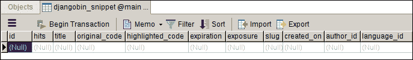
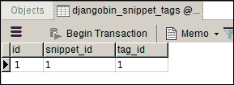

# Django ORM 基础第 2 部分

> 原文：<https://overiq.com/django-1-11/django-orm-basics-part-2/>

最后更新于 2020 年 7 月 27 日

* * *

在前一课中，我们已经介绍了使用 Django ORM 与数据库交互的所有基础知识。我们已经创建、修改和删除了许多对象。到目前为止，我们处理的对象类型都是可以独立存在的简单对象。在本课中，我们将学习如何插入和访问相关数据，但首先，我们将在表中填充一些数据。

如果您正在密切关注课程，此时，djangobin 应用的所有表都应该是空的。在我们继续之前，让我们分别给`djangobin_author`和`djangobin_language`表添加一些`Author`和`Language`对象。通过执行`shell`命令打开 Django shell，从 djangobin 应用导入所有模型。

```py
$ ./manage.py shell
Python 3.5.2 (default, Nov 23 2017, 16:37:01) 
[GCC 5.4.0 20160609] on linux
Type "help", "copyright", "credits" or "license" for more information.
(InteractiveConsole)
>>> 
>>> from djangobin.models import *
>>>

```

将以下代码复制并粘贴到 Django shell 中，以创建一些作者和语言。

```py
Author.objects.bulk_create([
    Author(name='tom', email='tom@mail.com'),
    Author(name='jerry', email='jerry@mail.com'),
    Author(name='spike', email='spike@mail.com'),
    Author(name='tyke', email='tyke@mail.com'),
])

Language.objects.bulk_create([
    Language(name='Python', lang_code='python', slug='python', mime='text/x-cython', file_extension=".py"),
    Language(name='PHP', lang_code='php', slug='php', mime='text/x-php', file_extension=".php"),
    Language(name='Java', lang_code='java', slug='java', mime='text/x-java', file_extension=".java"),
    Language(name='JavaScript', lang_code='js', slug='js', mime='application/javascript', file_extension=".js"),
])

```

```py
>>>
>>>
>>> Author.objects.bulk_create([
...     Author(name='tom', email='tom@mail.com'),
...     Author(name='jerry', email='jerry@mail.com'),
...     Author(name='spike', email='spike@mail.com'),
...     Author(name='tyke', email='tyke@mail.com'),
... ])
[<Author: tom : tom@mail.com>, <Author: jerry : jerry@mail.com>, <Author: spike : spike@mail.com>, <Author: tyke : tyke@mail.com>]
>>> 
>>> Language.objects.bulk_create([
...     Language(name='Python', lang_code='python', slug='python', mime='text/x-cython', file_extension=".py"),
...     Language(name='PHP', lang_code='php', slug='php', mime='text/x-php', file_extension=".php"),
...     Language(name='Java', lang_code='java', slug='java', mime='text/x-java', file_extension=".java"),
...     Language(name='JavaScript', lang_code='js', slug='js', mime='application/javascript', file_extension=".js"),
... ])
[<Language: Python>, <Language: PHP>, <Language: Java>, <Language: JavaScript>]
>>> 
>>>

```

现在让我们将注意力转移到`Snippet`模型上。以下是`Snippet`模型的定义:

**djangobin/django _ project/djangobin/models . py**

```py
#...

class Snippet(models.Model):
    title = models.CharField(max_length=200, blank=True)
    original_code = models.TextField()
    highlighted_code = models.TextField()
    expiration = models.CharField(max_length=10, choices=Pref.expiration_choices)
    exposure = models.CharField(max_length=10, choices=Pref.exposure_choices)
    hits = models.IntegerField(default=0)
    slug = models.SlugField()
    created_on = models.DateTimeField(auto_now_add=True)

    language = models.ForeignKey(Language, on_delete=models.CASCADE)
    author = models.ForeignKey(Author, on_delete=models.CASCADE)
    tag = models.ManyToManyField('Tag')

    class Meta:
        ordering = ['-created_on']

#...

```

这就是`djangobin_snippet`表的样子:



`Snippet`模型有两种一对多的关系。第一款是`Author`车型，第二款是`Language`车型。

一对多关系的数据将存储在`djangobin_snippet`表中。此外，`Snippet`模型的`author`和`language`字段不接受空值，因此，`Snippet`对象必须与`Author`和`Language`对象相关联。试图创建没有`Author`或`Language`对象的`Snippet`对象将引发`IntegrityError`异常。

`Snippet`模型与`Tag`模型也有多对多的关系。但是由于多对多关系的数据存储在单独的表(`djangobin_snippet_tags`)中，因此在创建`Snippet`对象时，我们不需要提供这些数据。一旦我们创建了一个`Snippet`对象，我们可以在以后给它添加标签。我们将在本章后面看到如何做到这一点。

让我们尝试在不提供作者和语言的情况下创建一个`Snippet`对象，看看会发生什么:

```py
>>>
>>>
>>> import time
>>>
>>> s = Snippet(
...     original_code = 'some code',
...     highlighted_code = '<p>some code</p>',
...     expiration="never",
...     exposure = "public",
...     slug=str(time.time()).replace(".", "")
... )
>>> 
>>>
>>> s.save()
>>>
Traceback (most recent call last):
...
django.db.utils.IntegrityError: NOT NULL constraint failed: djangobin_snippet.author_id

>>>

```

不出所料，调用`save()`方法会引发类型为`IntegrityError`的异常。如果您尝试使用`objects`管理器的`create()`方法创建一个`Snippet`对象，您会得到相同的异常。

错误是告诉我们`author_id`列有`NOT NULL`约束。因此，它不能接受`NULL`的价值观。

我们在`author_id`列而不是`language_id`列上得到`IntegrityError`的原因是`djangobin_snippet`表中`author_id`出现在`language_id`列之前。

我们可以通过将`null=True`传递给模型类中的字段构造器来允许`author`字段接受`NULL`值。目前，没有理由这么做。

好的，让我们再次尝试创建`Snippet`对象，但是这次我们将提供一个`Author`和一个`Language`对象。

```py
>>>
>>> 
>>> Author.objects.values_list("id", "name")
<QuerySet [(7, 'tom'), (8, 'jerry'), (9, 'spike'), (10, 'tyke')]>
>>> 
>>> Language.objects.values_list("id", "name")
<QuerySet [(3, 'Java'), (4, 'JavaScript'), (2, 'PHP'), (1, 'Python')]>
>>> 
>>>
>>> a1 = Author.objects.get(pk=7)
>>>
>>> a1
<Author: tom : tom@mail.com>
>>>
>>> a2 = Author.objects.get(pk=8) 
>>>
>>> a2
<Author: jerry : jerry@mail.com>
>>>
>>> l1 = Language.objects.get(pk=1)
>>>
>>> l1
<Language: Python>
>>> 
>>> 
>>> s1 = Snippet(
...     original_code = 'some code',
...     highlighted_code = '<p>some code</p>',
...     expiration="never",
...     exposure = "public",
...     slug=str(time.time()).replace(".", ""),
...     author = a1,
...     language = l1
... )
>>> 
>>> s1
<Snippet: Untitled - Python>
>>>  
>>> s1.save()
>>>

```

可以看到，这次操作成功了。您也可以使用`objects`管理器的`create()`方法来创建一个`Snippet`对象，而不是调用`Snippet()`构造函数。

```py
>>>
>>> s2 = Snippet.objects.create(
...     original_code = 'another snippet',
...     highlighted_code = '<p>another snippet</p>',
...     expiration="never",
...     exposure = "public",
...     slug=str(time.time()).replace(".", ""),
...     author = a1,
...     language = l1
... )
>>> 
>>> s2
<Snippet: Untitled - Python>
>>>

```

现在，我们可以使用点(`.`)操作符使用`s1`或`s2`变量来获取关于`Snippet`对象以及该对象所属的`Author`和`Language`对象的信息。

```py
>>>
>>>
>>> s1.title
''
>>> 
>>> s1.original_code
'some code'
>>> 
>>> s1.highlighted_code
'<p>some code</p>'
>>> 
>>> s1.expiration
'never'
>>> 
>>> s1.created_on
datetime.datetime(2018, 3, 26, 8, 19, 40, 824422, tzinfo=<UTC>)
>>> 
>>> s1.slug
'1522052373360689' 
>>>
>>> s1.language     # get the Language instance attached to s1
<Language: Python>
>>> 
>>> s1.language.slug    
'python'
>>> 
>>> s1.author       # get the Author instance attached to s1 
<Author: tom : tom@mail.com>
>>> 
>>> s1.author.email
'tom@mail.com'
>>> 
>>>

```

请注意，我们如何能够在不编写 SQL JOIN 查询的情况下访问存储在不同表中的数据。这就是 Django ORM 的力量。

在创建`Snippet`对象时，您也可以传递作者的主键，而不是传递`Author`对象，但是您必须将其分配给`author_id`关键字参数，而不是`author`。同样，我们可以将`Language`对象的主键传递给`language_id`关键字参数。

```py
>>>
>>> 
>>> Author.objects.values_list('id', 'name')
<QuerySet [(7, 'tom'), (8, 'jerry'), (9, 'spike'), (10, 'tyke')]>
>>> 
>>> Language.objects.values_list('id', 'name')
<QuerySet [(3, 'Java'), (4, 'JavaScript'), (2, 'PHP'), (1, 'Python')]>
>>> 
>>>
>>> s3 = Snippet.objects.create(
...     original_code = 'cool snippet',
...     highlighted_code = '<p>cool snippet</p>',
...     expiration="never",
...     exposure = "public",
...     slug=str(time.time()),
...     author_id = 7,
...     language_id = 2
... )
>>>
>>>

```

在我们访问下一部分之前，让我们向数据库中添加一些`Tag`对象。

```py
>>>
>>> t1 = Tag.objects.create(name="django", slug="django")
>>>
>>> t2 = Tag.objects.create(name="flask", slug="flask")
>>>

```

## 其他经理

`objects`并不是 Django 唯一可用的经理。原来，在处理多对多关系时，Django 使用一个名为 related manager 的管理器来连接数据。在`Snippet`模型`tags`领域就是这样一个管理者。您可以通过在 Django shell 中键入以下代码来验证这一点。

```py
>>>
>>> type(s1.tags)
<django.db.models.fields.related_descriptors.create_forward_many_to_many_manager.<locals>.ManyRelatedManager object at 0x7fc981e36e10>
>>>

```

由于`tags`是一个经理，你可以使用我们在[Django ORM 基础部分 1](/django-1-11/django-orm-basics-part-1/#database-access-through-managers) 一课中学到的所有管理方法。例如，要查看与`s1`和`s2`帖子相关联的所有标签，请键入以下代码:

```py
>>>
>>> s1.tags.all()
<QuerySet []>
>>>
>>> 
>>> s2.tags.all()
<QuerySet []>
>>>

```

目前，片段`s1`和`s2`没有与任何标签相关联，这就是为什么返回空的`QuerySet`的原因。

那么我们如何给现有的`Snippet`对象添加标签呢？

所有的关系管理器都自带`add()`方法，可以用来连接对象。

```py
>>>
>>> t1
<Tag: django>
>>>
>>> s1.tags.add(t1)
>>>

```

现在片段`s1`与`django`标签相关联。上述代码在`djangobin_snippet_tags`表中添加了以下记录。



```py
>>>
>>> s1.tags.all()
<QuerySet [<Tag: django>]>
>>>

```

您也可以通过将多个参数传递给`add()`方法，将多个标签与一个`Snippet`对象相关联。

```py
>>>
>>> s2.tags.add(t1, t2)
>>> 
>>> s2.tags.all()
<QuerySet [<Tag: django>, <Tag: flask>]>
>>> 
>>> s2.tags.order_by("-name")
<QuerySet [<Tag: flask>, <Tag: django>]>
>>> 
>>>

```

## 反向访问

当您在模型类中使用类似`ForeignKey`、`ManyToManyField`等字段定义关系时。该模型的每个实例都将具有访问相关对象的属性。例如，给定一个`Snippet`对象`s1`，我们可以使用`s1.author`访问其作者，使用`s1.language`访问其语言，使用`s1.tags`访问其标签。

但是，我们如何反过来访问数据呢？简单地说，我们如何访问来自`Author`实例或`Tag`实例的片段？

Django 自动在关系的另一端添加一个
`<related_model>_set`形式的关系管理器。更具体地说，给定一个`Author`对象`a1`，与该作者相关的片段由`a1.snippet_set`给出。`snippets_set`属性是类型`ManyRelatedManager`的一个实例，继承自`django.db.models.manager.Manager`，因此，我们在[一章中讨论的大多数管理器方法都可以使用。例如:](/django-1-11/django-orm-basics-part-1/#database-access-through-managers)

```py
>>>
>>> a1.snippet_set.all()
<QuerySet [<Snippet: Untitled - PHP>, <Snippet: Untitled - Python>, <Snippet: Untitled - Python>]>
>>> 
>>> a1.snippet_set.order_by("-created_on")
<QuerySet [<Snippet: Untitled - PHP>, <Snippet: Untitled - Python>, <Snippet: Untitled - Python>]>
>>> 
>>> a1.snippet_set.order_by("-created_on").values_list('id', 'created_on')
<QuerySet [(4, datetime.datetime(2018, 3, 26, 8, 48, 48, 956850, tzinfo=<UTC>)), (3, datetime.datetime(2018, 3, 26, 8, 23, 23, 534384, tzinfo=<UTC>)), (2, datetime.datetime(2018, 3, 26, 8, 19, 40, 824422, tzinfo=<UTC>))]>
>>> 
>>>

```

类似地，给定一个`Tag`实例`t1`，与这个标签相关联的片段由`t1.snippet_set`给出。

```py
>>> 
>>> t1.snippet_set.all()
<QuerySet [<Snippet: Untitled - Python>, <Snippet: Untitled - Python>]>
>>> 
>>> 
>>> t1.snippet_set.filter(exposure='public')
<QuerySet [<Snippet: Untitled - Python>, <Snippet: Untitled - Python>]>
>>> 
>>>

```

如果由于某种原因`<related_model>_set`属性看起来不直观或不可读。我们可以通过将`related_name`参数传递给模型类中的`ForeignKey`或`ManyToManyField`构造函数来更改它。例如:

```py
class Snippet(models.Model):
    #...

    language = models.ForeignKey(Language, on_delete=models.CASCADE, )
    author = models.ForeignKey(Author, on_delete=models.CASCADE, related_name='snippets')
    tags = models.ManyToManyField('Tag', related_name='snippets')

```

对于`Author`和`Tag`实例，该代码将关系名称从`snippet_set`更改为`snippets`。给定一个`Tag`实例`t1`，我们现在可以使用`t1.snippets`访问相关的片段。类似地，给定一个`Author`实例`a1`，我们可以使用`a1.snippets`访问相关的片段。

## 跨越关系的查找

到目前为止，关键字参数(有或没有查找)我们一直传递给查找函数(例如`filter()`、`exclude()`、`get()`等；)仅限于我们当前操作的模型类。

事实证明，我们还可以将相关模型类的字段名传递给查找函数。为此，请键入小写的型号名称，后跟两个下划线，然后是字段名。以下是一般格式:

```py
Model.objects.filter(related_model__field=some_value)

```

这个跨度可以是你想要的深度。此外，您还可以使用我们在第 1 课 [Django ORM 基础知识第 1 部分](/django-1-11/django-orm-basics-part-1/#field-lookups)中学到的所有查找。这种技术减少了执行给定任务所需的临时查询。例如，假设我们只想从名字以`om`结尾的作者那里找到片段。这是找到所有这些片段的漫长道路。

```py
>>>
>>> al = Author.objects.filter(name__iendswith="om")
>>>
>>> al
<QuerySet [<Author: tom : tom@mail.com>]>
>>> 
>>> sl = Snippet.objects.filter(author__in=al)  # using in lookup
>>>
>>> sl
<QuerySet [<Snippet: Untitled - PHP>, <Snippet: Untitled - Python>, <Snippet: Untitled - Python>]>
>>> 
>>> sl.count()
3
>>>
>>>

```

使用可以跨越关系的查找，我们可以在一行中编码前面的查询。

```py
>>>
>>> sl = Snippet.objects.filter(author__name__iendswith="om")
>>> 
>>> sl
<QuerySet [<Snippet: Untitled - PHP>, <Snippet: Untitled - Python>, <Snippet: Untitled - Python>]>
>>> 
>>> sl.count()
3
>>>

```

这项技术在两个方向都有效。例如，以下查询检索 2018 年创建片段的所有作者。

```py
>>> 
>>> Author.objects.filter(snippet__created_on__year=2018)
<QuerySet [<Author: tom : tom@mail.com>, <Author: tom : tom@mail.com>, <Author: tom : tom@mail.com>]>
>>>

```

请注意，前面的查询返回了同一个`Author`的三个实例，这是因为在我的 SQLite 数据库中`tom`已经创建了三个片段。为了过滤掉重复的结果，我们可以使用`distinct()`方法。`distinct()`方法在删除所有重复项后返回一个`QuerySet`。

```py
>>>
>>> Author.objects.filter(snippet__created_on__year=2018).distinct()
<QuerySet [<Author: tom : tom@mail.com>]>
>>>

```

## get_object_or_404()函数

大多数时候，我们的视图功能是这样的:

1.  代码尝试和除块。
2.  在 try 块中查询数据库。
3.  如果抛出异常，在 except 块中捕获异常并显示一个 404 页。

这种模式非常普遍，以至于 Django a 提供了一个名为
`get_object_or_404()`的简短函数。它的语法是:

```py
get_object_or_404(klass, **kwargs)

```

`klass`可以是模特、经理或查询者。

`**kwargs`表示所有的关键字参数以及我们在查找函数中使用的查找参数(`get()`、`filter()`、`exclude()`等)。

成功后，它返回给定模型的单个对象，如果找不到任何记录，它就会引发 Http404 异常。

这个方法在内部调用`objects`管理器的`get()`方法，所以你必须一直使用这个方法来获取一个单一的对象。

要使用`get_object_or_404()`，首先使用以下代码从`django.shortcuts`导入。

```py
from django.shortcuts import get_object_or_404

```

以下示例显示了如何将`get_object_or_404()`函数用于模型、queryset 和 managers。它还显示，当没有找到匹配的记录时，`get_object_or_404()`会引发`Http404`异常。

**例 1:** 其中`klass`为模型

```py
>>>
>>> from django.shortcuts import get_object_or_404
>>> 
>>> s1 = get_object_or_404(Snippet, pk=1)
>>>
>>> s1
<Snippet: Untitled - Python>
>>> 
>>>
>>> s1 = get_object_or_404(Snippet, pk=200)
Traceback (most recent call last):
  ...    
django.http.response.Http404: No Snippet matches the given query.
>>>

```

该代码相当于:

```py
>>>
>>> try:
...   s1 = Snippet.objects.get(pk=1)
... except Snippet.DoesNotExist:
...   raise Http404("Post not found")
...
>>>

```

**例 2:** 其中`klass`为 queryset

```py
>>> 
>>> queryset = Author.objects.filter(active=False)
>>> 
>>> get_object_or_404(queryset, email="tom@mail.com")
<Author: tom : tom@mail.com>
>>> 
>>> get_object_or_404(queryset, email="bob@mail.com")
...  
django.http.response.Http404: No Author matches the given query.
>>> 
>>>
Traceback (most recent call last):

```

**例 3:** 其中`klass`是经理

```py
>>> 
>>> s2 = Snippet.objects.get(id=2)
>>> 
>>> s2.tags.all()
<QuerySet [<Tag: django>, <Tag: flask>]>
>>>
>>> type(s1.tags)
<class 'django.db.models.fields.related_descriptors.create_forward_many_to_many_manager.<locals>.ManyRelatedManager'>
>>> 
>>> get_object_or_404(s2.tags, name='flask')
<Tag: flask>
>>> 
>>>

```

## get_list_or_404()方法

`get_list_or_404()`的工作方式与`get_object_or_404()`函数类似，但它返回的不是单个模型实例，而是一个`Queryset`。如果没有找到匹配的结果，则引发`Http404`异常。

```py
>>>
>>> from django.shortcuts import get_list_or_404
>>> 
>>> queryset = Author.objects.filter(active=False)
>>> 
>>> get_list_or_404(queryset, name__icontains="ke")
[<Author: spike : spike@mail.com>, <Author: tyke : tyke@mail.com>]
>>>  
>>> get_list_or_404(queryset, name__icontains="jo")
Traceback (most recent call last):
...
django.http.response.Http404: No Author matches the given query.
>>>

```

* * *

* * *