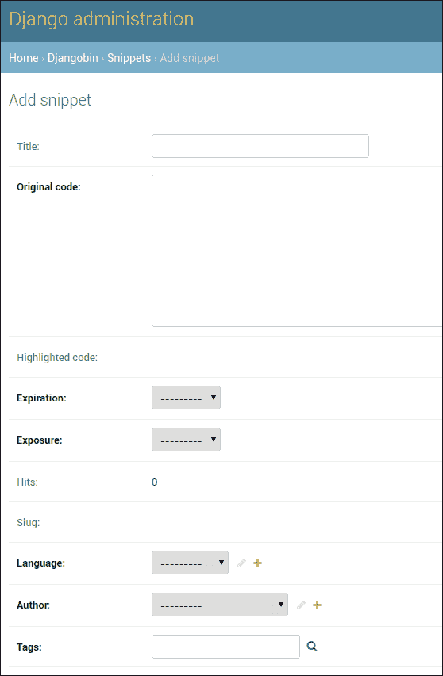

# Django 管理员应用

> 吴奇珍:t0]https://overiq . com/django-1-11/django-admin-app/

最后更新于 2020 年 7 月 27 日

* * *

如今，管理网站是任何网站不可或缺的一部分。管理员、作者和工作人员使用管理站点来管理主站点的内容。Django 提供了一个管理内容的管理网站，这样你就可以专注于构建你需要的功能，而不是创建旧的无聊的管理网站。然而，这并不意味着你不能推出自己的管理网站。如果 Django 管理网站不符合您的要求，您可以从头开始创建自己的管理网站。然而，在本系列中，我们不会这样做。如果你有兴趣建立自己的管理网站，你有两个选择。首先是等待这个系列完成，到那时你将有足够的知识来创建自己的管理网站。另一个选项是签出我的 [Django 1.10](/django-1-10/intro-to-django/) 系列，其中我从头开始创建了一个管理站点。二话不说。让我们开始使用 Django 管理应用。

## 创建超级用户

要使用管理站点，我们首先必须创建一个超级用户。在终端中输入以下命令。

```py
$ ./manage.py createsuperuser

```

首先，系统会提示您输入用户名。

```py
Username (leave blank to use 'overiq'): admin

```

接下来，输入电子邮件地址。这是可选的。

```py
Email address: admin@overiq.com

```

最后，输入密码，并通过重新键入来确认。

```py
Password:
Password (again):
Superuser created successfully.

```

现在，您可以登录到 Django 管理网站。

## Django 管理网站-第一眼

如果尚未运行，启动开发服务器，并将浏览器指向
`http://localhost:8000/admin`。您将看到如下登录页面:


输入用户名和密码，然后点击回车。成功后，您将被重定向到 Django 管理站点的索引页面。


索引页显示了项目中可用模型的列表。目前，它只显示来自`django.contrib.auth`应用的`Group`和`User`型号(在`INSTALLED_APPS`设置中的第二个应用)。要从我们的`djangobin`应用显示模型，我们必须做一点配置，这是下一节的主题。

`Group`模型用于组织权限，`User`模型代表站点用户。管理权限超出了本系列的范围。因此，我们的讨论将仅限于`User`模型。

单击“用户”链接，您将进入用户列表页面，如下所示:


*列表页面*显示特定模型的对象列表。用户列表页面显示了数据库中`User`对象的列表。从上图中可以看到，目前数据库中只有一个`User`对象，这是我们在上一节中创建的。

除了显示`User`对象，用户列表页面还允许我们执行以下任务:

*   添加新用户。
*   修改现有用户。
*   搜索和过滤用户。
*   通过单击列标题对用户数据进行排序。
*   删除用户。

Django 管理网站是非常不言自明的。任何非技术用户都应该能够毫无问题地使用它。尝试自己浏览网站。添加一些新用户并修改现有用户，这将让你更好地了解 Django 管理网站的工作方式。在下一节中，我们将把 djangobin 应用中的模型添加到 Django 管理站点。

## 向 Django 管理添加模型

默认情况下，Django 管理网站不会从我们创建的应用中加载任何模型。要将模型添加到 Django 管理中，您必须修改每个应用目录中可用的`admin.py`文件。打开 djangobin 应用内的`admin.py`，即`djangobin/django_project/djangobin`。此时，`admin.py`应该是这样的:

**决哥/决哥 _ project/决哥/决哥/admin.py】**

```py
from django.contrib import admin

# Register your models here.

```

按如下方式修改文件:

**决哥/决哥 _ project/决哥/决哥/admin.py】**

```py
from django.contrib import admin
from . import models

# Register your models here.

admin.site.register(models.Author)
admin.site.register(models.Language)
admin.site.register(models.Snippet)
admin.site.register(models.Tag)

```

在第 2 行，我们从 djangobin 应用导入模型。要将模型添加到 Django 管理站点，请将模型的名称传递给`admin.site.register()`方法。

打开浏览器，访问`http://localhost:8000/admin/`。您应该会在 djangobin 应用中看到如下模型:


## Django 管理的重要特征

在这一节中，我们将讨论 Django 管理站点的一些重要方面。我们的讨论将限于以下几点:

*   `__str__()`方法。
*   模型关系。
*   数据验证。
*   Django 追踪系统。
*   小部件。

### __str__()方法

点击 Django 管理主页中的“片段”链接，导航至片段列表页面(即`http://localhost:8000/admin/djangobin/snippet/`)。您将看到如下页面:


那么是什么让 Django admin 以这种形式显示`Snippet`对象呢？

默认情况下，Django admin 显示模型类中定义的`__str__()`方法返回的值。对于`Snippet`车型，`__str__()`方法定义如下:

**djangobin/django _ project/djangobin/models . py**

```py
#...
class Snippet(models.Model):
    #...

    def __str__(self):
        return (self.title if self.title else "Untitled") + " - " + self.language.name
#...

```

如下修改`Snippet`模型的`__str__()`方法:

```py
#...
class Snippet(models.Model):
    #...

    def __str__(self):
        return self.language.name
#...

```

刷新代码片段列表页面(`http://localhost:8000/admin/djangobin/snippet/`)，现在应该如下所示:


正如您所看到的，Django 管理站点已经接受了我们在`__str__()`方法中的更改，并开始显示代码片段的语言。我们不希望这些更改是永久性的，因为在下一节中将在单独的列中显示代码片段的语言。所以让我们回到我们最初的`__str__()`定义。

```py
#...
class Snippet(models.Model):
    #...

    def __str__(self):
        return (self.title if self.title else "Untitled") + " - " + self.language.name
#...

```

再次刷新代码片段列表页面，它应该会恢复原样。

### Django 管理网站中的模型关系

这是值得解释的最重要的事情之一。回想一下，我们的
`Snippet`模型有以下关系:

1.  与`Author`模型的一对多关系。
2.  与`Language`模型的一对多关系。
3.  与`Tag`模型的多对多关系。

作为参考，`Snippet`模型就是这样定义的。

**djangobin/django _ project/djangobin/models . py**

```py
#...

class Snippet(models.Model):
    title = models.CharField(max_length=200, blank=True)
    original_code = models.TextField()
    highlighted_code = models.TextField()
    expiration = models.CharField(max_length=10, choices=Pref.expiration_choices)
    exposure = models.CharField(max_length=10, choices=Pref.exposure_choices)
    hits = models.IntegerField(default=0)    
    slug = models.SlugField()
    created_on = models.DateTimeField(auto_now_add=True)

    language = models.ForeignKey(Language, on_delete=models.CASCADE)
    author = models.ForeignKey(Author, on_delete=models.CASCADE)
    tags = models.ManyToManyField('Tag')

#...

```

我们可以看到 Django 管理站点是如何通过添加一个新片段或编辑一个现有片段来管理模型关系的。

让我们通过点击代码片段列表页面右上角的“添加代码片段+”按钮来添加一个新的代码片段。


Django 使用单次选择`<select>`框来表示一对多的关系。我们有两种一对多的关系。第一个在`Snippet`和`Language`之间，第二个在`Snippet`和`Author`之间。使用单一选择`<select>`元素表示`Snippet`模型的`language`和`author`字段，如下所示:


您也可以通过点击`<select>`标签旁边的`+`链接来添加新的语言/作者。单击`+`图标会打开一个弹出窗口，允许您将新对象添加到数据库中。


一旦选择了语言或作者，您也可以通过单击下拉列表旁边的黄色铅笔图标来编辑它们。


同样，Django 使用多重选择`<select>`框来表示多对多关系。由于一个片段可以有一个或两个以上的标签，多重选择`<select>`框允许您在选择时按住 Ctrl 键选择多个标签。


也可以通过点击`+`链接添加新标签。

`Snippet`模型的`language`和`author`字段是通过`on_delete`参数设置为`models.CASCADE`来定义的。因此，删除作者或语言也会删除其关联的片段。

### Django 管理站点处理验证

Django 管理站点自动提供输入验证。请尝试保存一个空白代码段，或者在 Slug 字段中输入一些无效字符。您将看到如下错误:


在添加片段(和更改片段)表单中，除了`title`之外，所有字段都是必需的(我们没有考虑设置了`auto_now_add`参数`True`的`created_on`字段)。`title`字段是可选的，因为我们在`Snippet`模型中定义它时设置了`blank=True`。

此外，请注意，Django 管理网站以粗体显示必填字段。

### Django 追踪系统。

Django 会记录您对对象所做的更改。要查看更改日志，请单击对象编辑页面中的“历史记录”链接。


如果您没有对该对象进行任何更改，那么您将收到以下消息。


### 小工具

小部件指的是模型字段在表单中的显示方式。Django 根据模型中定义的字段类型提供小部件。例如，`CharField`显示为`<input>`元素，`ForeignKey`显示为选择框，`BooleanField`显示为复选框等等。我们将在[Django 表单基础](/django-1-11/django-form-basics/)一章中了解更多关于小部件以及如何覆盖它们的信息。

## 自定义列表页面

打开浏览器，点击 Django 管理网站索引页面上的“语言”链接，访问语言列表页面(`http://localhost:8000/admin/djangobin/language/`)。


该页面与用户列表页面(`http://localhost:8000/admin/auth/user/`)相似，但有细微的区别。

1.  与用户列表页面不同，它没有搜索栏。
2.  右侧没有过滤器。
3.  `Language`模型由 7 个字段组成(`name`、`lang_code`、`slug`、`mime`、`file_extension`、`created_on`和`updated_on`)，但只有`name`可见。
4.  我们不能通过点击列标题来排序。

要自定义列表页面上模型的外观，我们使用`ModelAdmin`类。`ModelAdmin`类提供了几个属性，允许我们更改模型在列表页面中的显示方式。所有这些属性都是在应用的`admin.py`文件中的`ModelAdmin`子类中定义的。以下是`ModelAdmin`的一些常见属性列表。

*   `list_display` -控制列表页面显示哪些模型字段。它接受字段名称的列表或元组。除了显示字段，它还使字段可排序。例如，

    ```py
    list_display = ('name', 'email', 'created_on',)

    ```

    这将显示来自模型类的`name`、`email`和`created_on`字段的数据，并使它们可排序。

*   `search_fields` -该属性启用列表页面上的搜索功能。它接受您想要搜索的字段名称列表或元组。它执行不区分大小写的搜索。例如:

    ```py
    search_fields = ('name', 'email',)

    ```

*   `ordering` -指定列表页面中对象列表的排序方式。它采用字段名称的列表或元组。例如:

    ```py
    ordering = ['-name']

    ```

    这将通过`name`以降序显示对象列表。请注意，该选项将覆盖内部`Meta`类的`ordering`属性。

*   `list_filter` -该属性激活列表页面右侧的过滤栏。它接受字段名称的列表或元组。Django 根据字段的类型自动提供不同的快捷方式来过滤对象。例如，如果字段类型为`DateField`，则 Django 提供`Today`、`Past 7 days`、`This month`和`This year`快捷方式。同样，如果字段类型为`BooleanField`，则 Django 提供`All`、`Yes`和`No`快捷方式。

    

*   `date_hierarchy` -该属性专门设计为在操作选择框正上方提供智能的基于日期的向下钻取导航。它需要一个字符串，而不是一个列表或元组。由于`date_hierarchy`创建基于日期的过滤器，您只能指定类型为`DateField`或`DateTimeField`的字段。下面是这个属性在列表页面上的样子。

    

让我们测试一些属性。在 djangobin 应用中打开`admin.py`，创建一个名为`LanguageAdmin`的类，该类继承自`admin.ModelAdmin`类，如下所示:

**决哥/决哥 _ project/决哥/决哥/admin.py】**

```py
from django.contrib import admin
from . import models

# Register your models here.

class LanguageAdmin(admin.ModelAdmin):
    list_display = ('name', 'lang_code', 'slug', 'mime', 'created_on')
    search_fields = ['name', 'mime']
    ordering = ['name']
    list_filter = ['created_on']
    date_hierarchy = 'created_on'

admin.site.register(models.Author)
admin.site.register(models.Language, LanguageAdmin)
admin.site.register(models.Snippet)
admin.site.register(models.Tag)

```

为了注册`LanguageAdmin`类概述的变化，我们将其名称作为第二个参数传递给注册其相应模型的`register()`方法。

刷新语言列表页面，它将如下所示:


在我们继续之前，让我们在`admin.py`文件中添加一些更多的类来定制`Snippet`和`Tag`模型的外观。

**决哥/决哥 _ project/决哥/决哥/admin.py】**

```py
#...
class LanguageAdmin(admin.ModelAdmin):
    #...
    date_hierarchy = 'created_on'

class SnippetAdmin(admin.ModelAdmin):
    list_display = ('language', 'title', 'expiration', 'exposure', 'author')
    search_fields = ['title', 'author']
    ordering = ['-created_on']
    list_filter = ['created_on']
    date_hierarchy = 'created_on'

class TagAdmin(admin.ModelAdmin):
    list_display = ('name', 'slug',)
    search_fields = ('name',)

admin.site.register(models.Author)
admin.site.register(models.Language, LanguageAdmin)
admin.site.register(models.Snippet, SnippetAdmin)
admin.site.register(models.Tag, TagAdmin)

```

## 自定义表单

为了定制表单，`admin.ModelAdmin`类提供了以下属性。

1.  `fields` -默认情况下，表单中字段的出现顺序与模型类中字段的出现顺序相同。要更改顺序，请按您想要的列表或元组顺序列出字段。例如，

    ```py
    fields = ['title', 'created_on', 'author']

    ```

    这将显示`"title"`场，然后是`"created_on"`场，最后是`"author"`场。

    除了对字段进行排序之外，您还可以使用该属性来删除一个或多个字段，使其不被完全编辑/添加。

2.  `filter_horizontal` -该属性只能与`ManyToManyField`一起使用。默认情况下，使用多重选择`<select>`框显示`ManyToManyField`字段。从一个小列表中选择记录很容易，但是如果有成百上千条记录呢？为了便于选择，Django 提供了`filter_horizontal`属性。它接受类型为`ManyToManyField`的字段名列表或元组。然后，它创建了一个良好的界面，允许搜索记录，以及查看可用的记录和选择的记录。

    让我们使用该属性来更改片段模型的`tags`字段的渲染方式。打开`admin.py`并在`SnippetAdmin`类末尾添加`filter_horizontal`属性，如下所示:

    **决哥/决哥 _ project/决哥/决哥/admin.py】**

    ```py
    class SnippetAdmin(admin.ModelAdmin):
       #...
       date_hierarchy = 'pub_date'
       filter_horizontal = ('tags',)

    ```

    访问添加代码段或更改代码段页面。您将看到这样一个小部件:

    

3.  `raw_id_fields` -毫无疑问`filter_horizontal`让选录变得更加容易。但是，如果您有数百或数千条记录，一次加载所有这些可能需要一段时间。解决办法是用`raw_id_fields`代替`filter_horizontal`。

    它接受类型为`ManyToManyField`或`ForeignKey`的字段名称列表或元组，并创建一个输入框(`<input type="text" ... />`)，您可以在其中输入记录的主键。

    打开`admin.py`文件，注释掉上一步添加到`SnippetAdmin`类的`filter_horizontal`属性。然后在它的正下方添加`raw_id_fields`属性。

    **决哥/决哥 _ project/决哥/决哥/admin.py】**

    ```py
    class SnippetAdmin(admin.ModelAdmin):
        #...
        # filter_horizontal = ('tags',)
        raw_id_fields = ('tags',)

    ```

    再次访问添加代码段或更改代码段页面。你应该这样看`tags`场。

    

    要输入数据，请单击输入框旁边的搜索图标，将会打开一个弹出窗口，允许您选择和搜索记录。

    

4.  `prepopulated_fields` -该属性自动向字段添加内容。它接受一个字典，将字段名称映射到它应该预先填充的字段。它通常用于制造鼻涕虫。例如:

    ```py
    prepopulated_fields = {'slug': ('title',)}`

    ```

    这将使用 JavaScript 从`title`字段预填充`slug`字段。

    打开`admin.py`并将`prepopulated_fields`属性添加到`TagAdmin`类，如下所示:

    **决哥/决哥 _ project/决哥/决哥/admin.py】**

    ```py
    class TagAdmin(admin.ModelAdmin):
        list_display = ('name', 'slug',)
        search_fields = ('name',)
        prepopulated_fields = {'slug': ('name',)}

    ```

    访问添加标签页面(`http://localhost:8000/admin/djangobin/tag/add/`)并在标题字段中输入一些数据。您会注意到，slug 字段会实时自动填充。

    

    `prepopulated_fields`属性仅在添加新记录时预填充字段，当您更新记录时，它不会预填充字段。

5.  `readonly_fields` -该属性使字段成为只读。它接受字段名作为列表或元组。

    就目前的情况来看，当我们创建一个新的片段时，我们需要在`highlighted_code`、`slug`和`hits`字段中输入数据。如果您考虑一下，无论您是添加一个代码片段还是更新一个现有的代码片段，向这些字段中输入数据都没有多大意义。对于`highlighted_code`和`slug`领域尤其如此。前者包含由 Pygments 包生成的 HTML 代码，后者包含访问代码片段的唯一标识符。更好的方法是将这些字段设为只读，并在保存代码片段时自动向它们提供数据。

    让我们从将这些字段设为只读开始。再次打开`admin.py`，像这样给`SnippetAdmin`添加`readonly_fields`属性:

    **决哥/决哥 _ project/决哥/决哥/admin.py】**

    ```py
    class SnippetAdmin(admin.ModelAdmin):
        #...    
        raw_id_fields = ('tags',)
        readonly_fields = ('highlighted_code', 'hits', 'slug', )

    ```

    保存文件并访问添加片段(或更改片段)页面。您应该会看到这样的页面:

    

    请注意，所有三个字段都被推到了页面的末尾，这是因为 Django 首先显示可编辑字段，然后是只读字段。我们可以使用本节前面讨论的`fields`属性轻松更改这种行为。在`SnippetAdmin`类中的`readonly_fields`属性之后，添加`fields`属性如下:

    **决哥/决哥 _ project/决哥/决哥/admin.py】**

    ```py
    class SnippetAdmin(admin.ModelAdmin):
        #...
        readonly_fields = ('highlighted_code', 'hits', 'slug', )
        fields = ('title', 'original_code', 'highlighted_code', 'expiration', 'exposure',
              'hits', 'slug', 'language', 'author', 'tags' )

    ```

    刷新“添加片段”页面，您将看到所有字段都按照`fields`属性中指定的顺序列出。

    

    既然是这样，就让我们将 Tag 模型的`slug`字段设为只读。在`admin.py`中，注释掉`prepopulated_fields = {'slug': ('name',)}`，然后将
    `readonly_fields`属性添加到`TagAdmin`，如下所示:

    **决哥/决哥 _ project/决哥/决哥/admin.py】**

    ```py
    class TagAdmin(admin.ModelAdmin):
        list_display = ('name', 'slug',)
        search_fields = ('name',)
        # prepopulated_fields = {'slug': ('name',)}
        readonly_fields = ('slug',)

    ```

    我们已将一些字段设为只读。在下一节中，我们将看到如何自动向他们提供数据。

    在我们离开这一部分之前，重要的是要提到类型为`DateField`和`DateTimeField`的模型字段，它们的`auto_now_add`或`auto_now`参数设置为`True`将不会出现在 Django 管理站点中，即使您将它们的名称添加到`fields`属性中。

    ```py
    fields = ('title', 'slug', 'pub_date', 'content', 'author', 'category', 'tags',)

    ```

    事实上，这样做会引发`FieldError`异常。

## 通过重写 save()方法自定义对象创建

每次创建或更新对象时都会调用`models.Model`类的`save()`方法。要定制对象创建，我们可以覆盖模型类中的`save()`方法。

让我们从覆盖`Snippet`模型的`save()`方法开始。

打开`models.py`，在`get_absolute_url()`方法后添加`save()`方法，如下所示:

**djangobin/django _ project/djangobin/models . py**

```py
#...
from django.shortcuts import reverse
import time

#...

class Snippet(models.Model):
    #...
    tags = models.ManyToManyField('Tag')

    def get_absolute_url(self):
        return reverse('djangobin:snippet_detail', args=[self.slug])

    def save(self, *args, **kwargs):
        if not self.slug:
            self.slug = str(time.time()).replace(".", "")
        self.highlighted_code = self.highlight()
        if not self.title:
            self.title = "Untitled"
        super(Snippet, self).save(*args, **kwargs)  # Call the "real" save() method.

#...

```

第 15 行，if 语句检查`self.slug`是否存在。如果没有，则意味着调用`save()`方法来创建代码片段。另一方面，如果`self.slug`存在，则调用`save()`方法更新片段。这个条件是必须的，否则`save()`方法会在每次更新后改变弹头。

在第 17 行，我们调用`Snippet`模型的`highlight()`方法进行实际的高亮显示，然后将其结果分配给`highlighted_code`字段。

在第 18 行，我们正在检查`self.title`是否包含值。如果没有，我们设置一个默认值`"Untitled"`。

最后，在第 20 行，我们调用被覆盖的`save()`方法将结果保存到数据库中。

完成这些更改后，请访问“添加代码片段”页面，并尝试提交一两个代码片段。


请注意数据是如何自动填充到`highlighted_code`、`slug`和`hits`字段中的。每次创建或更新`Snippet`对象时，都会运行`save()`方法。

您可能已经注意到，您仍然需要提交至少一个标签来创建一个`Snippet`对象。`Snippet`模型与`Tag`模型具有多对多的关系。我们可以通过设置`blank=True`使`Tag`字段可选。在 djangobin app 中打开`models.py`，更新如下:

```py
class Snippet(models.Model):
    #...
    author = models.ForeignKey(Author, on_delete=models.CASCADE)
    tags = models.ManyToManyField('Tag', blank=True)

    def __str__(self):
        return (self.title if self.title else "Untitled") + " - " + self.language.name
    #...

```

要提交更改，请使用`makemigrations`命令创建迁移:

```py
$ ./manage.py makemigrations djangobin
Migrations for 'djangobin':
  djangobin/migrations/0009_auto_20180328_1409.py
    - Alter field tags on snippet

```

然后，使用`migrate`命令提交迁移:

```py
$ ./manage.py migrate djangobin
Operations to perform:
  Apply all migrations: admin, auth, contenttypes, djangobin, sessions
Running migrations:
  Applying djangobin.0009_auto_20180328_1409... OK

```

再次访问“添加代码片段”页面，并创建一个新的代码片段。您会发现不再需要提交标签来创建新的代码片段。

现在让我们将注意力转移到`Tag`模型上。

就像`Snippet`对象一样，我们希望在不在`slug`字段中输入任何数据的情况下创建`Tag`对象。在前一节中，我们已经将`slug`设为只读。剩下的唯一事情就是覆盖`Tag`模型中的`save()`方法，并在那里设置`slug`字段的值。打开`model.py`文件，更新为包含`save()`方法，如下所示:

```py
#...
import time
from django.utils.text import slugify
from .utils import Preference as Pref

#...

class Tag(models.Model):
    name = models.CharField(max_length=200, unique=True)
    slug = models.SlugField(max_length=200, unique=True)

    #...

    def get_absolute_url(self):
        return reverse('djangobin:tag_list', args=[self.slug])

    def save(self, *args, **kwargs):        
        self.slug = slugify(self.name)
        super(Tag, self).save(*args, **kwargs)  # Call the "real" save() method.

```

在`save()`方法中，我们使用 Django 提供的`slugify()`功能从`name`字段创建鼻涕虫。回想一下，slug 只能包含字母、数字、下划线和连字符。如果`name`字段的值为`"enter the dragon"`，则`slugify()`功能将返回`"enter-the-dragon"`。另外，请注意，我们没有测试`slug`字段是否包含任何值，因为我们希望`save()`方法在每次更新后重新创建 slug。

从现在开始，您将能够创建新的标签，而无需在 slug 字段中输入任何值。


## 更改字段标签

Django 管理站点中的表单标签使用模型中的字段名称。如果模型中的字段名是`name`，那么表单标签就是`Name`。如果标签由多个像`pub_date`一样用下划线分隔的单词组成，那么表单标签将是`Pub date`。

在模型类中定义字段时，我们可以使用`verbose_name`参数明确指定字段标签。打开`models.py`文件，将`verbose_name`添加到`Language`模型中的`name`字段，如下所示:

**djangobin/django _ project/djangobin/models . py**

```py
#...
class Language(models.Model):
    name = models.CharField(max_length=100)
    lang_code = models.CharField(max_length=100, unique=True, verbose_name='Language Code')
    slug = models.SlugField(max_length=100, unique=True)
    #...

```

如往常一样，使用`makemigrations`和`migrate`命令提交更改。

```py
$ ./manage.py makemigrations djangobin
Migrations for 'djangobin':
  djangobin/migrations/0011_auto_20180329_0636.py
    - Alter field lang_code on language

```

```py
$ ./manage.py migrate
Operations to perform:
  Apply all migrations: admin, auth, contenttypes, djangobin, sessions
Running migrations:
  Applying djangobin.0011_auto_20180329_0636... OK

```

访问添加语言(或更改语言)页面查看更改的标签。


## 向代码段表单添加帮助文本

在[Django 模型基础](/django-1-11/basics-of-models-in-django/)一课中，我们讨论了一个名为`help_text`的字段选项。如果你还记得的话，`help_text`选项会选择一个字符串作为字段的描述。

访问添加代码片段(或更改代码片段)页面，您将获得如下表单:


如您所见，“添加代码段”表单由 3 个只读字段组成:突出显示的代码、命中和分段。第一次访问这个页面的人可能会对如何使用这些字段感到困惑。因为我们是自动向这些字段提供数据的，所以我们应该明确地告诉用户，这些字段是只读的，并且将在保存代码片段时自动填充。

要添加`help_text`参数，请在 djangobin 应用中打开`models.py`文件，并修改`Snippet`模型，如下所示:

**djangobin/django _ project/djangobin/models . py**

```py
#...
class Snippet(models.Model):
    #...
    title = models.CharField(max_length=200, blank=True)
    original_code = models.TextField()
    highlighted_code = models.TextField(blank=True, help_text="Read only field. Will contain the"
                                    " syntax-highlited version of the original code.")
    expiration = models.CharField(max_length=10, choices=expiration_choices)
    exposure = models.CharField(max_length=10, choices=exposure_choices)
    hits = models.IntegerField(default=0, help_text='Read only field. Will be updated after every visit to snippet.')
    slug = models.SlugField(help_text='Read only field. Will be filled automatically.')
    created_on = models.DateTimeField(auto_now_add=True)
    #...

```

再次运行`makemigrations`和`migrate`命令提交更改。刷新“添加代码段(或更改代码段)”页面以查看帮助文本:


* * *

* * *