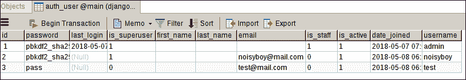
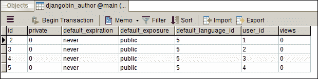
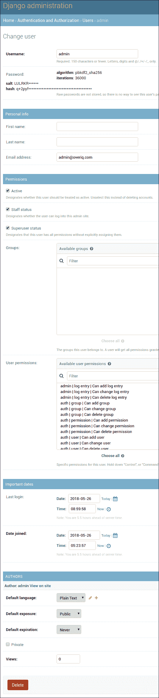

# Django 认证框架基础

> 原文：<https://overiq.com/django-1-11/django-authentication-framework-basics/>

最后更新于 2020 年 7 月 27 日

* * *

Django 认证(或`auth`)应用为用户管理提供了广泛的工具，从认证用户到重置密码。

`auth` app 挺大的。它由 URL 模式、视图、表单、装饰器、模型、中间件等组成。为了使事情简单易懂，我们的讨论将仅限于以下主题:

1.  `User`模型
2.  `AnonymousUser`模型
3.  密码散列系统
4.  登录/注销用户
5.  创建用户
6.  修改口令
7.  重置密码
8.  限制访问
9.  扩展`User`模型

我们将从基础开始，然后在后面的章节中继续讨论更复杂的主题。

## 设置身份验证框架

认证框架被实现为`'django.contrib.auth'`应用，但它也依赖于`'django.contrib.contenttype'`应用和一些中间件来正确工作。

打开`settings.py`文件，确保在`INSTALLED_APPS`列表中有`'django.contrib.auth'`和
T2，如下所示:

**djangobin/django _ project/django _ project/settings . py**

```py
#...
INSTALLED_APPS = [
    'django.contrib.admin',
    'django.contrib.auth',
    'django.contrib.contenttypes',
    'django.contrib.sessions',
    'django.contrib.messages',
    'django.contrib.staticfiles',
    'djangobin',
]
#...

```

如果你现在正在添加`'django.contrib.auth'`和`'django.contrib.contenttype'`，运行`./manage.py migrate`命令。该命令将在数据库中创建必要的表。

那么`django.contrib.contenttype`是什么呢？

`django.contrib.contenttype`应用用于跟踪项目中不同类型的内容。这个应用有高级用例，所以我们不会在这个初学者教程中介绍它。

Django `auth`应用也在幕后使用会话。因此，您必须在`settings.py`的`MIDDLEWARE`列表中拥有以下两个中间件。

1.  `django.contrib.sessions.middleware.SessionMiddleware`
2.  `django.contrib.auth.middleware.AuthenticationMiddleware`

`django.contrib.sessions.middleware.SessionMiddleware`负责生成唯一的会话标识。并且`django.contrib.auth.middleware.AuthenticationMiddleware`向`request`对象添加名为`user`的属性。在接下来的章节中，这一点的作用将变得更加明显。

最后，`MIDDLEWARE`列表应该是这样的:

**djangobin/django _ project/django _ project/settings . py**

```py
#...
MIDDLEWARE = [
    'django.middleware.security.SecurityMiddleware',
    'django.contrib.sessions.middleware.SessionMiddleware',
    'django.middleware.common.CommonMiddleware',
    'django.middleware.csrf.CsrfViewMiddleware',
    'django.contrib.auth.middleware.AuthenticationMiddleware',
    'django.contrib.messages.middleware.MessageMiddleware',
    'django.middleware.clickjacking.XFrameOptionsMiddleware',
]
#...

```

## 用户类型

Django 有两种类型的用户:

1.  匿名用户
2.  用户

### 匿名用户

未登录到应用的用户称为匿名用户。例如，经常来我们网站消费内容的用户是匿名用户。这类用户使用`AnonymousUser`模型表示。

### 用户

登录到应用的用户称为用户。这类用户使用`User`模型表示。

除了 web 请求之外，`AnonymousUser`模型并不常用，但是`User`模型在很多地方都有使用。因此，我们将大部分时间花在`User`模式上。以下部分解释了您需要了解的关于`User`型号的一切。

## 用户模型

`User`模型被认为是 Django 认证框架的核心。我们使用`User`模型存储应用用户的数据。要使用它，您必须首先从
`django.contrib.auth.models`导入它。

```py
>>>
>>> from django.contrib.auth.models import User
>>>

```

## 创建用户对象

Django 在`objects`管理器上提供了一个名为`create_user()`的自定义方法来创建用户。它接受至少三个参数用户名、密码和电子邮件。

```py
>>>
>>> u = User.objects.create_user(
... 'noisyboy',
... 'noisyboy@mail.com',
... 'password'
... )
>>>
>>>
>>> u
<User: noisyboy>
>>>
>>>

```

下表列出了`User`模型的所有字段。

| 属性 | 描述 |
| --- | --- |
| `username` | 存储用户名的 30 个字符的必填字段。它只能包含字母数字字符，即字母、数字和下划线。 |
| `password` | 存储密码的必填字段。 |
| `first_name` | 30 个字符的可选字段，用于存储用户的`first_name`。 |
| `last_name` | 30 个字符的可选字段，用于存储用户的`last_name`。 |
| `email` | 存储电子邮件地址的可选字段。 |
| `is_active` | 一个布尔值字段，它指示该帐户是否可以用于登录。 |
| `is_superuser` | 一个布尔字段，如果设置为`True`，用户拥有在 Django 管理站点执行任何 CRUD(创建、读取、更新和删除)操作的完全权限。 |
| `is_staff` | 一个布尔字段，如果设置为`True`，用户可以访问 Django 管理站点，但是在获得明确的权限之前不能执行任何 CRUD 操作。默认情况下，对于超级用户(其`is_superuser`属性为`True`的用户)`is_staff`也是`True`。 |
| `date_joined` | 存储帐户创建日期和时间的字段。该字段会自动填入创建帐户的当前日期和时间。 |
| `last_login` | 包含上次登录日期和时间的字段。 |

`create_user()`方法创建一个非超级用户，并将`is_staff`属性设置为`True`。这意味着用户可以登录到 Django 管理站点，但不能执行任何 CRUD 操作。要创建一个超级用户，使用`create_superuser()`方法，其工作原理与`create_user()`完全相同，但创建一个超级用户。

要获取新创建的`User`实例的字段值，请执行以下查询:

```py
>>>
>>> User.objects.filter(username='noisyboy').values()
<QuerySet 
[{
    'username': 'noisyboy', 
    'password': 'pbkdf2_sha256$36000$JuRTV4Vec59R$ueTUvEcLH/i/eESGTIiwk7O3iEZfW+BtpnhCmtpYK48=', 
    'is_staff': False, 
    'first_name': '', 
    'id': 2, 
    'email': 'noisyboy@mail.com', 
    'last_name': '', 
    'is_active': True, 
    'is_superuser': False, 
    'last_login': None, 
    'date_joined': datetime.datetime(2018, 4, 3, 4, 51, 8, 674638, tzinfo=<UTC>)
}]>
>>>

```

可以看到，目前`noisyboy`不是超级用户。我们可以通过将`is_superuser`属性设置为`True`，然后调用`save()`方法来轻松改变这一点:

```py
>>>
>>> u.is_superuser = True
>>>
>>> u.is_superuser
True
>>> u.save()
>>>

```

这里要注意的另一件事是前面查询的输出中`password`字段的值。它看起来像这样:

```py
'password': 'pbkdf2_sha256$36000$JuRTV4Vec59R$ueTUvEcLH/i/eESGTIiwk7O3iEZfW+BtpnhCmtpYK48=',

```

回想一下，在创建`noisyboy`用户时，我们使用字符串`"password"`作为帐户密码。为什么会变得这么长？

不将密码以纯文本形式存储到数据库中是一种常见的安全措施。相反，我们使用一个数学函数将我们的密码转换成一个长字符串，如上图所示。这种函数称为散列函数，它返回的长字符串称为密码散列。哈希函数背后的思想是这样的——从密码创建密码哈希很容易，但反向过程是不可能的。

默认情况下，Django 使用 PBKDF2 算法创建密码哈希。

这就是为什么我们使用`create_user()`方法来创建`User`对象，而不是使用`create()`或`bulk_create()`方法的原因。`create_user()`方法自动将密码转换为散列。如果我们使用`create()`或`bulk_create()`方法，它会将密码以纯文本形式保存到数据库中。我们可以通过使用`create()`方法创建新用户来验证这一点，如下所示:

```py
>>>
>>> test_user = User.objects.create(
...     username='test',
...     email='test@mail.com',
...     password='pass'
... )
>>>
>>>
>>> test_user.password
'pass'
>>>

```

Django 将用户数据存储在`auth_user`表中。执行上述代码后，`auth_user`表应该如下所示:



以下是`User`模型提供的一些方法:

| 方法 | 描述 |
| --- | --- |
| `get_username()` | 返回用户的`username`。要获取用户名，您应该使用这个属性，而不是直接引用`username`属性。 |
| `get_full_name()` | 返回`first_name`和`last_name`属性的值，中间有一个空格 |
| `check_password(pass)` | 如果传递的字符串是正确的密码，则返回`True`，否则返回`False`。它首先将密码转换为密码哈希，然后将其与保存在数据库中的密码进行比较。 |
| `set_password(passwd)` | 它用于更改用户的密码。它负责密码散列。注意`set_password()`没有保存`User`对象，你必须调用`save()`方法将更改提交给数据库。 |
| `is_authenticated()` | 如果用户通过认证(登录)，返回`True`，否则返回`False`。 |
| `is_anonymous()` | 如果用户匿名则返回`True`，否则返回`False`。 |

### get_username()

```py
>>>
>>> u.get_username()
'noisyboy'
>>> u.get_full_name()
''
>>>

```

### 检查 _ 密码()

```py
>>>
>>> u.check_password("mypass")
False
>>> u.check_password("password")
True
>>>

```

### set_password()

```py
>>>
>>> u.set_password("pass")
>>>

```

要提交更改，请调用`save()`方法。

```py
>>>
>>> u.save()
>>>

```

### is_authenticated()

```py
>>>
>>> u.is_authenticated()
True
>>>

```

这里`is_authenticated()`方法返回`True`。这并不意味着`noisyboy`目前已经登录了 Django 管理网站。事实上，在 DjangoShell 中，当在`User`实例上使用时，`is_authenticated()`总是返回`True`。我们可以通过创建一个新用户，然后检查`is_authenticated()`方法的返回值来验证这个事实。

```py
>>>
>>> new_user = User.objects.create_user(
... 'newtestuser',
... 'newtestuser@mail.com',
... 'pass'
... )
>>>
>>> new_user.is_authenticated()
True
>>>

```

Django Shell 里面`is_authenticated()`没用。正如我们将在后续课程中看到的，它的真正效用在视图和模板中发挥作用。

### is_anonymous()

```py
>>>
>>> u.is_anonymous()
False
>>>

```

对象`u`是`User`类的一个实例，这就是为什么`is_anonymous()`返回`False`。如果它属于`AnonymousUser`级，它就会返回`True`。

## 匿名用户模型

Django 还有一个名为`AnonymousUser`的模型，代表未登录的用户。换句话说，经常来我们网站消费内容的用户是匿名用户。`AnonymousUser`模型的方法和领域与`User`模型几乎相同，区别如下。

*   `id`或`pk`属性始终包含`None`。
*   `username`属性将始终为空字符串，即`''`。
*   `is_anonymous()`是`True`而不是`False`。
*   `is_authenticated()`是`False`而不是`True`。
*   `is_staff`和`is_superuser`属性永远是`False`。
*   `is_active`永远是`False`。
*   在`AnonymousUser`对象上调用`save()`或`delete()`将引发`NotImplementedError`异常。

需要注意的是`AnonymousUser`模型与`User`模型没有任何一种关系。它是一个单独的类，有自己的方法和字段。`User`和`AnonymousUser`模型唯一的相似之处就是大部分领域和方法都是一样的。这不是设计缺陷，这是故意的，目的是让事情变得更容易。

在本章的前面，我们已经讨论了
`django.contrib.auth.middleware.AuthenticationMiddleware`中间件向`request`对象添加了一个`user`属性。`request.user`返回`AnonymousUser`或`User`模型的实例。因为`User`和`AnonymousUser`类都实现了相同的接口，所以我们可以使用相同的字段和方法来获取相关信息，而不用担心对象的实际类型。

下面的例子完美地描述了我们如何利用这种行为来达到我们的目的。`test_logged_on_or_not()`视图测试用户是否使用`is_authenticated()`方法登录。我们能够编写这个代码是因为`is_authenticated()`在`AnonymousUser`模型和`User`模型中都实现了。

```py
def test_logged_on_or_not(request):
    if request.user.is_authenticated():
        return HttpResponse("You are logged in.")
    else:
        return redirect("login")

```

以上代码是这样工作的:

如果`is_authenticated()`方法返回`True`，那么用户将会得到`"You are logged in."`的响应。否则，用户将被重定向到登录页面。

实际上，您可能永远不需要创建类型为`AnonymousUser`的对象。以防万一，你很好奇，下面的代码告诉你怎么做。

```py
>>>
>>> from django.contrib.auth.models import AnonymousUser
>>> au = AnonymousUser()
>>>

```

一旦我们访问了`AnonymousUser`实例，我们就可以使用任何字段或方法来获取任何相关信息。

```py
>>>
>>> print(au.id)
None
>>> print(au.pk)
None
>>>
>>> au.username
''
>>>
>>> au.is_authenticated()
False
>>>
>>> au.is_anonymous()
True
>>>
>>> au.is_active
False
>>>
>>> au.is_superuser
False
>>>
>>>
>>> au.delete()
...  
NotImplementedError: Django doesn't provide a DB representation for AnonymousUser.
>>>
>>>
>>> au.save()
Traceback (most recent call last):
...
NotImplementedError: Django doesn't provide a DB representation for AnonymousUser.
>>>

```

如前所述，在`AnonymousUser`对象上调用`save()`或`delete()`会引发`NotImplementedError`异常。

## 扩展用户模型

Django 仅在`User`模型中提供了最少的字段来帮助您入门，但它也为您提供了扩展`User`模型的全部能力来满足您的应用需求。

回想一下，默认情况下`User`模型包含以下字段:

1.  用户名
2.  名字
3.  姓氏
4.  电子邮件
5.  密码
6.  上次登录时间
7.  不活动的
8.  is_staff
9.  是超级用户
10.  加入日期

在这一点上，您可能想知道`User`模型是否用于存储用户信息，那么定义`Author`模型有什么意义。

如果你是这么想的。你是对的。

`Author`模型的所有字段也存在于`User`模型中。这意味着我们根本不需要`Author`模型。

但是如果我们想存储一些关于用户的附加数据呢？比如出生日期、喜欢的车、娘家姓等；

为了存储关于用户的附加数据，我们必须扩展我们的`User`模型。

扩展`User`模型的第一步是创建一个新模型，其中包含您想要存储的所有附加字段。接下来，将我们的新模型与`User`模型相关联，定义一个`OneToOneField`字段，该字段包含对新模型中`User`模型的引用。

在我们的例子中，我们希望存储关于用户的以下信息:

| 田 | 描述 |
| --- | --- |
| `default_language` | 创建代码片段的默认语言 |
| `default_exposure` | 违约风险(即公共、私人和未上市) |
| `default_expiration` | 默认到期时间(即从不、1 周、1 个月、6 个月、1 年) |
| `private` | 一个布尔字段，指示其他用户是否可以查看此配置文件 |
| `views` | 一个整数字段，用于存储访问配置文件页面的次数。 |

预计到我们将要对`Author`模型进行的更改，让我们执行一些数据库清理。现在`djangobin_author`表中有一些独立于`User`模型的用户。为了避免冲突，最好从数据库中删除所有`Author`对象。请注意，删除作者也将删除与其关联的所有片段。

```py
>>>
>>> from djangobin.models import *
>>>
>>> Author.objects.all().delete()
(17, {'djangobin.Author': 4, 'djangobin.Snippet': 7, 'djangobin.Snippet_tags': 6})
>>> 
>>>

```

**注意:**并不总是可以从表中删除数据。这就是为什么在开始编写应用之前，应该正确规划数据库。

我们现在可以对`Author`模型进行更改。打开`models.py`并删除`Author`型号。在`Language`模型下面，重新定义新的`Author`模型如下:

**djangobin/django _ project/djangobin/models . py**

```py
#...
from django.contrib.auth.models import User
from .utils import Preference as Pref

class Language(models.Model):
    #...

def get_default_language():
    lang = Language.objects.get_or_create(
        name='Plain Text',
        lang_code='text',
        slug='text',
        mime='text/plain',
        file_extension='.txt',
    )

    return lang[0].id

class Author(models.Model):
    user = models.OneToOneField(User, related_name='profile')
    default_language = models.ForeignKey(Language, on_delete=models.CASCADE,
                                         default=get_default_language)
    default_exposure = models.CharField(max_length=10, choices=Pref.exposure_choices,
                                        default=Pref.SNIPPET_EXPOSURE_PUBLIC)
    default_expiration = models.CharField(max_length=10, choices=Pref.expiration_choices,
                                        default=Pref.SNIPPET_EXPIRE_NEVER)
    private = models.BooleanField(default=False)
    views = models.IntegerField(default=0)

    def __str__(self):
        return self.user.username

    def get_absolute_url(self):
        return reverse('djangobin:profile', args=[self.user.username])

    def get_snippet_count(self):
        return self.user.snippet_set.count()

class Snippet(models.Model):
    #...

```

这里没有什么新内容，除了我们如何设置`default_language`字段的默认值。我们第一次使用可调用来设置默认值。每次创建新的`Author`实例时，都会调用可调用的。

可调用程序使用了一种名为`get_or_create()`的`objects`管理器的新方法。`get_or_create()`法是`get()`和`create()`法的融合。它首先检查数据库中是否存在匹配的对象，如果不存在，则创建一个。

`get_or_create()`方法返回一个形式为`(object, created)`的元组，其中`object`是指检索或创建的实例，`created`是一个布尔值，指定是否创建新对象。

可调用返回名称为`Plain Text`的语言的主键。`Plain Text`将用于创建没有任何突出显示的片段。

`default_language`和`default_expiration`字段的默认值和选项来自我们在 Django 的[模型基础一课中定义的`Preference`课程](/django-1-11/basics-of-models-in-django/)

接下来，使用`./manage.py makemigrations`命令创建一个新的迁移文件，您将得到如下提示:

```py
$ ./manage.py makemigrations
Did you rename author.active to author.private (a BooleanField)? [y/N] n

```

输入`N`或`n`，继续。之后，您将收到另一个提示:

```py
You are trying to add a non-nullable field 'user' to author without a default; we can't do that (the database needs something to populate existing rows).
Please select a fix:
 1) Provide a one-off default now (will be set on all existing rows with a null value for this column)
 2) Quit, and let me add a default in models.py
Select an option:

```

问题是我们试图向`djangobin_author`表中添加一个带有 UNIQUE 和 NOT NULL 约束的外键。Django 认为`djangobin_author`表中可能有一些行，需要知道这些行的外键(用户)列要填什么。虽然`djangobin_author`表中没有实际作者，但 Django 对此完全不知情。

让我们选择选项 1，并提供一次性默认值`None`:

```py
Please select a fix:
 1) Provide a one-off default now (will be set on all existing rows with a null value for this column)
 2) Quit, and let me add a default in models.py
Select an option: 1
Please enter the default value now, as valid Python
The datetime and django.utils.timezone modules are available, so you can do e.g. timezone.now
Type 'exit' to exit this prompt
>>> None
Migrations for 'djangobin':
  djangobin/migrations/0013_auto_20180403_1059.py
    - Change Meta options on tag
    - Remove field active from author
    - Remove field created_on from author
    - Remove field email from author
    - Remove field last_logged_in from author
    - Remove field name from author
    - Add field default_expiration to author
    - Add field default_exposure to author
    - Add field default_language to author
    - Add field private to author
    - Add field user to author
    - Add field views to author

```

最后，使用`migrate`命令提交迁移:

```py
$ ./manage.py migrate
Operations to perform:
  Apply all migrations: admin, auth, contenttypes, djangobin, sessions
Running migrations:
  Applying djangobin.0013_auto_20180404_0457... OK

```

请记住，扩展`User`模型并不意味着每次创建新的`User`实例时都会自动创建关联的`Author`实例。您可以使用 Django ORM 或者从 Django 管理站点创建`Author`实例。

要在创建`User`实例时自动触发`Author`实例的创建，我们可以使用信号。我们将在本章后面讨论如何做到这一点。

此外，数据库中已经存在的`User`实例没有关联的`Author`实例。如果您尝试在应用的完成版本中使用这些帐户登录，这将导致错误。我们可以通过使用以下代码为每个`User`实例创建`Author`来轻松解决这个问题:

```py
>>>
>>> from django.contrib.auth.models import User
>>> from djangobin.models import *
>>>
>>> ul = User.objects.all()
>>> 
>>> ul
<QuerySet [<User: admin>, <User: noisyboy>, <User: test>, <User: newtestuser>]>
>>> 
>>> for u in ul:
...     Author.objects.get_or_create(user=u)
... 
(<Author: admin>, True)
(<Author: noisyboy>, True)
(<Author: test>, True)
(<Author: newtestuser>, True)
>>> 
>>>

```

执行上述代码后，`djangobin_author`表将如下所示:



在进入下一部分之前，让我们用`User`模型的外键替换`Snippet`模型的外键`author`，如下所示:

**djangobin/django _ project/djangobin/models . py**

```py
#...

class Snippet(models.Model):
    title = models.CharField(max_length=200, blank=True)
    original_code = models.TextField()
    highlighted_code = models.TextField(blank=True, help_text="Read only field. Will contain the"
                                    " syntax-highlited version of the original code.")
    expiration = models.CharField(max_length=10, choices=Pref.expiration_choices)
    exposure = models.CharField(max_length=10, choices=Pref.exposure_choices)
    hits = models.IntegerField(default=0, help_text='Read only field. '
                                                    'Will be updated after every visit to snippet.')
    slug = models.SlugField(help_text='Read only field. Will be filled automatically.')
    created_on = models.DateTimeField(auto_now_add=True)

    language = models.ForeignKey(Language, on_delete=models.CASCADE)
    user = models.ForeignKey(User, on_delete=models.CASCADE)
    tags = models.ManyToManyField('Tag', blank=True)

    class Meta:
        ordering = ['-created_on']

#...

```

接下来，更新`admin.py`中的`SnippetAdmin`类以使用`user`字段，如下所示:

**决哥/决哥 _ project/决哥/决哥/admin.py】**

```py
#...

class SnippetAdmin(admin.ModelAdmin):
    list_display = ('language','title', 'expiration', 'exposure', 'user')
    search_fields = ['title', 'user']
    ordering = ['-created_on']
    list_filter = ['created_on']
    date_hierarchy = 'created_on'
    # filter_horizontal = ('tags',)
    raw_id_fields = ('tags',)
    readonly_fields = ('highlighted_code', 'hits', 'slug', )
    fields = ('title', 'original_code', 'highlighted_code', 'expiration', 'exposure',
              'hits', 'slug', 'language', 'user', 'tags')

#...

```

要创建一个新的迁移运行`./manage.py makemigrations djangobin`命令并提供`None`的一次性值。

```py
$ ./manage.py makemigrations djangobin
You are trying to add a non-nullable field 'user' to snippet without a default; we can't do that (the database needs something to populate existing rows).
Please select a fix:
 1) Provide a one-off default now (will be set on all existing rows with a null value for this column)
 2) Quit, and let me add a default in models.py
Select an option: 1
Please enter the default value now, as valid Python
The datetime and django.utils.timezone modules are available, so you can do e.g. timezone.now
Type 'exit' to exit this prompt
>>> None
Migrations for 'djangobin':
  djangobin/migrations/0006_auto_20180616_0826.py
    - Remove field author from snippet
    - Add field user to snippet

```

最后，通过键入以下命令提交迁移:

```py
$ ./manage.py migrate djangobin
Operations to perform:
  Apply all migrations: djangobin
Running migrations:
  Applying djangobin.0006_auto_20180616_0826... OK

```

## 使用用户模型显示作者模型

如果你访问 Django 管理网站，你会发现`User`和`Author`模型显示在各自独立的页面上。由于`Author`模型只是`User`模型的扩展，如果我们将`Author`模型的数据与`User`模型一起显示会好得多。为此，我们必须对 djangobin 应用的`admin.py`文件进行一些更改。

在 Django 管理站点中有两种表示模型的方式:

1.  模型管理
2.  inline modeldadmin

我们已经在[Django 管理应用](/django-1-11/django-admin-app/)一章中看到了`ModelAdmin`是如何工作的。`InlineModelAdmin`允许我们在同一个页面上编辑父模型和子模型。`InlineModelAdmin`有两个子类:

1.  白板线
2.  StackedInline

这些类控制 Django 管理站点中模型字段的布局。前者以表格形式显示字段，而后者以堆叠形式显示字段(每行一个字段)。

要显示`Author`模型的字段和`User`模型的字段，在应用的`admin.py`文件中定义一个`InlineModelAdmin`(使用`TabularInline`或`StackedInline`)并将其添加到`UserAdmin`类，该类在 Django 管理器中注册`User`类。最后，注销旧的`User`型号，并随着更改再次注册。

**决哥/决哥 _ project/决哥/决哥/admin.py】**

```py
from django.contrib import admin
from django.contrib.auth.admin import UserAdmin
from django.contrib.auth.models import User
from . import models

#...

class TagAdmin(admin.ModelAdmin):
    list_display = ('name', 'slug',)
    search_fields = ('name',)
    # prepopulated_fields = {'slug': ('name',)}
    readonly_fields = ('slug',)

class AuthorInline(admin.StackedInline):
    model = models.Author

class CustomUserAdmin(UserAdmin):
    inlines = (AuthorInline, )    

admin.site.unregister(User) # unregister User model
admin.site.register(User, CustomUserAdmin) # register User model with changes
admin.site.register(models.Language, LanguageAdmin)
admin.site.register(models.Snippet, SnippetAdmin)
admin.site.register(models.Tag, TagAdmin)

```

请注意，我们已经删除了在 Django 管理站点中注册`Author`模型的行(`admin.site.register(models.Author)`)。

保存文件并访问更改用户页面。您应该会看到这样的页面:



在下一节中，我们将学习如何在创建`User`时使用信号自动触发`Author`对象的创建。

## Django 信号

把信号想象成 JavaScript 中的事件，它允许我们监听动作并做些什么。

下表列出了一些常用信号:

| 信号 | 描述 |
| --- | --- |
| `django.db.models.signals.pre_save` | 在调用模型的`save()`方法之前发送 |
| `django.db.models.signals.post_save` | 调用模型的`save()`方法后发送 |
| `django.db.models.signals.pre_delete` | 在调用模型的`delete()`方法或`QuerySet`的`delete()`方法之前发送 |
| `django.db.models.signals.post_delete` | 在模型的`delete()`方法或`QuerySet`的`delete()`方法被调用后发送 |
| `django.core.signals.request_started` | 当 Django 开始处理 HTTP 请求时发送。 |
| `django.core.signals.request_finished` | 当 Django 处理完一个 HTTP 请求时发送。 |

出于我们的目的，我们希望在保存`User`实例时得到通知，以便我们可以创建相关的`Author`对象。这意味着我们有兴趣聆听来自`User`模型的`post_save`信号。

一旦我们知道了我们想听的信号，下一步就是定义一个接收器。接收器可以是一个 Python 函数或方法，每当发送信号时都会被调用。接收器函数包含我们想要执行的逻辑。每个接收器函数必须接受两个参数，`sender`和`**kwargs`。

`sender`参数包含信号的发送方，`**kwargs`包含一些与信号发送方相关的信息。`post_save`信号发送的两个常见信息是:

1.  `instance` -已保存实例的副本。
2.  `created` -一个布尔值，指定对象是被创建还是被更新。

`post_save`信号发出许多其他的论点，但是对于我们的目的来说，这两个就足够了。打开`models.py`并在`Author`类的正下方添加接收器功能，如下所示:

**djangobin/django _ project/djangobin/models . py**

```py
#...

class Author(models.Model):
    #...

    def get_snippet_count(self):
        return self.user.snippet_set.count()

def create_author(sender, **kwargs):
    if kwargs.get('created', False):
        Author.objects.get_or_create(user=kwargs.get('instance'))

```

接收器功能就位后。下一步是将接收器连接到信号。我们这样做，借助`receiver`装饰师。`receiver`装饰器接受要连接的信号或信号列表，以及接收器函数中流行的`kwargs`参数的可选关键字参数。更新`models.py`使用`receiver`装饰器，如下所示:

**djangobin/django _ project/djangobin/models . py**

```py
#...
from django.contrib.auth.models import User
from django.dispatch import receiver
from django.db.models.signals import post_save
from .utils import Preference as Pref

# Create your models here.

#...

@receiver(post_save, sender=User)
def create_author(sender, **kwargs):    
    if kwargs.get('created', False):
        Author.objects.get_or_create(user=kwargs.get('instance'))

```

只有保存了`User`实例时才会调用`create_author()`函数。

如果现在创建一个新的`User`实例，相关的`Author`实例将自动创建。

```py
>>> 
>>> 
>>> u = User.objects.create(
...   username='foo',
...   email='foo@mail.com',
...   password='password'
... )
>>>
>>> u
<User: foo>
>>> 
>>> u.profile   ## access Author instance
<Author: foo>
>>> 
>>> 
>>> u.profile.default_language
<Language: Plain Text>
>>> 
>>> 
>>> u.profile.private
False
>>> 
>>>

```

* * *

* * *