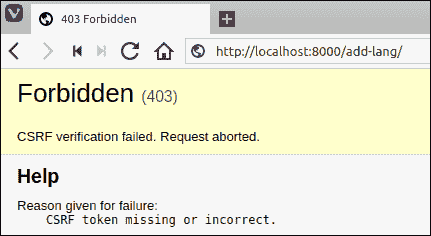
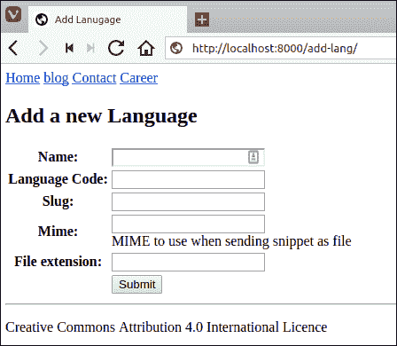
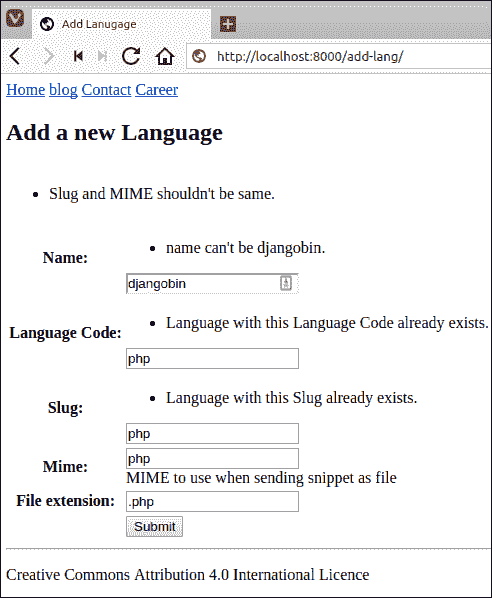
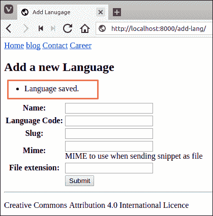
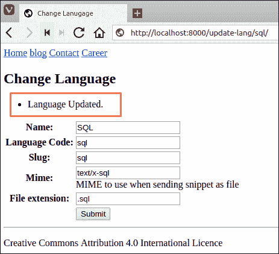

# 在 Django 中展示表单

> 原文：<https://overiq.com/django-1-11/displaying-forms-in-django/>

最后更新于 2020 年 7 月 27 日

* * *

到目前为止，我们一直在使用 Django Shell 来演示表单是如何工作的。在本课中，我们将学习如何在模板中显示表单。

Django 提供了以下三种显示表单元素的方法:

```py
>>>
>>> from djangobin.forms import LanguageForm
>>> f = LanguageForm()
>>>

```

1.  `as_p()`
2.  `as_table()`
3.  `as_ul()`

### as_p()

该方法在表单域中显示一系列`<p>`标签:

```py
>>>
>>> f.as_p()
<p><label for="id_name">Name:</label> <input type="text" name="name" maxlength="100" required id="id_name" /></p>
<p><label for="id_lang_code">Lang code:</label> <input type="text" name="lang_code" required id="id_lang_code" /></p>
<p><label for="id_slug">Slug:</label> <input type="text" name="slug" required id="id_slug" /></p>
<p><label for="id_mime">Mime:</label> <input type="text" name="mime" required id="id_mime" /></p>
<p><label for="id_created_on">Created on:</label> <input type="text" name="created_on" required id="id_created_on" /></p>
<p><label for="id_updated_on">Updated on:</label> <input type="text" name="updated_on" required id="id_updated_on" /></p>
>>>
>>>

```

### as_table()

该方法在表单域中显示一系列`<tr>`标签:

```py
>>>
>>> f.as_table()
<tr><th><label for="id_name">Name:</label></th><td><input type="text" name="name" maxlength="100" required id="id_name" /></td></tr>
<tr><th><label for="id_lang_code">Lang code:</label></th><td><input type="text" name="lang_code" required id="id_lang_code" /></td></tr>
<tr><th><label for="id_slug">Slug:</label></th><td><input type="text" name="slug" required id="id_slug" /></td></tr>
<tr><th><label for="id_mime">Mime:</label></th><td><input type="text" name="mime" required id="id_mime" /></td></tr>
<tr><th><label for="id_created_on">Created on:</label></th><td><input type="text" name="created_on" required id="id_created_on" /></td></tr>
<tr><th><label for="id_updated_on">Updated on:</label></th><td><input type="text" name="updated_on" required id="id_updated_on" /></td></tr> 
>>>
>>>

```

### as_ul()

该方法在表单域中显示一系列`<li>`标签:

```py
>>>
>>> f.as_ul()
<li><label for="id_name">Name:</label> <input type="text" name="name" maxlength="100" required id="id_name" /></li>
<li><label for="id_lang_code">Lang code:</label> <input type="text" name="lang_code" required id="id_lang_code" /></li>
<li><label for="id_slug">Slug:</label> <input type="text" name="slug" required id="id_slug" /></li>
<li><label for="id_mime">Mime:</label> <input type="text" name="mime" required id="id_mime" /></li>
<li><label for="id_created_on">Created on:</label> <input type="text" name="created_on" required id="id_created_on" /></li>
<li><label for="id_updated_on">Updated on:</label> <input type="text" name="updated_on" required id="id_updated_on" /></li>
>>>
>>>

```

请注意，渲染的 HTML 没有`<form>`标签和提交按钮。表单方法只输出表单字段。为了使表单充分发挥作用，我们必须手动添加`<form>`标签和提交按钮，如下所示:

```py
<form action="/url-to-submit/" method="post">    
    {{ form.as_p }}
    <input type="submit" value="Submit" />
</form>

```

我们也可以在模板中输出表单字段，只需输入`{{ f }}`，相当于`{{ f.as_table }}`。

```py
<form action="/url-to-submit/" method="post">    
    {{ f }}
    <input type="submit" value="Submit" />
</form>

```

在表单的绑定状态下，这些方法还会输出验证错误以及前一个请求中填充的数据。

```py
>>>
>>> f2 = LanguageForm()
>>>
>>> f2.is_bound
False
>>>
>>> print(f2.as_p())
<p><label for="id_name">Name:</label> <input type="text" name="name" maxlength="100" required id="id_name" /></p>
<p><label for="id_lang_code">Lang code:</label> <input type="text" name="lang_code" required id="id_lang_code" /></p>
<p><label for="id_slug">Slug:</label> <input type="text" name="slug" required id="id_slug" /></p>
<p><label for="id_mime">Mime:</label> <input type="text" name="mime" required id="id_mime" /></p>
<p><label for="id_created_on">Created on:</label> <input type="text" name="created_on" required id="id_created_on" /></p>
<p><label for="id_updated_on">Updated on:</label> <input type="text" name="updated_on" required id="id_updated_on" /></p>
>>>

```

让我们用一些数据绑定表单`f2`。

```py
>>> 
>>> data = {
...     'name': 'sql',
...     'lang_code': 'sql',
...     'slug': 'sql###',               
... }
>>>
>>>
>>> f2 = LanguageForm(data)
>>>
>>> 
>>> f2.is_valid()
False
>>>
>>>
>>> print(f2.as_p())
<ul class="errorlist nonfield"><li>Slug and MIME shouldn&#39;t be same.</li></ul>
<p><label for="id_name">Name:</label> <input type="text" name="name" value="sql" maxlength="100" required id="id_name" /></p>
<p><label for="id_lang_code">Lang code:</label> <input type="text" name="lang_code" value="sql" required id="id_lang_code" /></p>
<ul class="errorlist"><li>Enter a valid &#39;slug&#39; consisting of letters, numbers, underscores or hyphens.</li></ul>
<p><label for="id_slug">Slug:</label> <input type="text" name="slug" value="sql###" required id="id_slug" /></p>
<ul class="errorlist"><li>This field is required.</li></ul>
<p><label for="id_mime">Mime:</label> <input type="text" name="mime" required id="id_mime" /></p>
<ul class="errorlist"><li>This field is required.</li></ul>
<p><label for="id_created_on">Created on:</label> <input type="text" name="created_on" required id="id_created_on" /></p>
<ul class="errorlist"><li>This field is required.</li></ul>
<p><label for="id_updated_on">Updated on:</label> <input type="text" name="updated_on" required id="id_updated_on" /></p>
>>>

```

我们已经在 Shell 中探索了足够多的形式，现在让我们创建一个真实的形式。

## 创建真实表单

从 djangobin app 打开`views.py`文件，在文件末尾添加`add_lang()`视图:

**djangobin/django_project/djangobin/views.py**

```py
from django.shortcuts import HttpResponse, render, redirect
from .forms import LanguageForm

#...

def profile(request, username):
    return HttpResponse("<p>Profile page of #{}</p>".format(username))

def add_lang(request):
    if request.POST:
        f = LanguageForm(request.POST)
        if f.is_valid():
            lang = f.save()
            return redirect('djangobin:add_lang')

    else:
        f = LanguageForm()

    return render(request, 'djangobin/add_lang.html', {'form': f} )

```

以下是它的工作原理:

1.  当一个 GET 请求到来时，我们创建一个未绑定的`LanguageForm`(第 18 行)并渲染一个空表单(第 20 行)。

2.  如果请求是 POST(第 11 行)，我们创建一个绑定表单(第 12 行)，并使用`is_valid()`方法进行验证。如果表单有效，我们保存语言并将用户重定向到添加语言页面。另一方面，如果验证失败，控制从 if-else 语句中出来，我们返回一个包含表单数据和验证错误的新响应(第 20 行)。

接下来，打开`urls.py`并在文件末尾添加`add_lang`网址模式:

**决哥/决哥 _ 项目/决哥/URL . py】**

```py
#...
urlpatterns = [
    #...
    url('^tag/(?P<tag>[\w-]+)/$', views.tag_list, name='tag_list'),
    url('^add-lang/$', views.add_lang, name='add_lang'),
]

```

最后，这里是`add_lang.html`模板的代码。

**djangobin/django _ project/djangobin/templates/djangobin/add _ lang . html**

```py



    Add Lanugage




    <h2>Add a new Language</h2>

    <form action="" method="post">
        
        <table>
            {{ form.as_table }}
            <tr>
                <td></td>
                <td><input type="submit"></td>
            </tr>
        </table>
    </form>



```

这里没有什么新东西，除了``标签。`csrf_token`是 Django 用来防止 CSRF(跨站点请求伪造)攻击的特殊标签。您不需要知道它在内部是如何工作的，只需将``放入您的表单模板中，Django 将处理其他一切。如果您有兴趣了解更多关于 CSRF 袭击的信息，请点击这里的。

默认情况下，Django 希望您在每个表单上添加`csrf_token`标签。如果您没有这样做，那么在提交表单时，您将会收到类似下面这样的 HTTP 403 禁止错误:



使用`./manage.py runserver`启动服务器，访问`http://localhost:8000/add-lang/`。您将看到如下添加语言:



在具有唯一约束的字段中输入一些重复数据。您将得到如下验证错误:



字段的验证错误显示在字段本身的上方。另外，请注意表单顶部的错误，上面写着“Slug 和 MIME 不应该相同。”。这是非字段错误，因此，它显示在所有字段上方的表单顶部。

请记住`LanguageForm`表单正在执行两个验证:表单验证和模型验证。非字段错误(“Slug 和 MIME 不应该相同”)来自表单验证，而关于重复数据的错误来自模型验证。

现在，输入数据库中尚不存在的新语言。这一次，表单会将数据保存到数据库中，然后您将被重定向到“添加语言”页面。


我们的数据已保存，但没有得到任何确认。我们可以使用 flash 消息轻松解决这个问题。

## 火急文电

网络应用是关于用户体验的。每次操作后，您必须通知用户操作的结果。这些通知通常也称为闪存消息。Django 提供了一个名为`django.contrib.messages`的内置框架来显示 flash 消息。`django.contrib.messages`框架已经预装了，所以您不必配置任何东西来使用它。

要显示闪光信息，我们必须首先从`django.contrib`包导入`messages`包。

```py
from django.contrib import messages

```

`messages`包提供了一个名为`add_message()`的功能来设置 flash 消息。`add_message()`函数接受两个参数，`request`对象和您想要显示的消息。这里有一个例子:

```py
from django.contrib import messages
messages.add_message(request, 'Email Sent!')

```

我们还可以将消息级别传递给`add_message()`功能。消息级别允许我们在模板中格式化 flash 消息。下表列出了可以从`django.contrib.messages`包导入的内置消息级别。

| 常量 | 描述 |
| --- | --- |
| `DEBUG` | 它用于显示开发相关消息。 |
| `INFO` | 它用于显示信息性消息。 |
| `SUCCESS` | 它用于显示与成功相关的消息。 |
| `WARNING` | 它用于显示与警告相关的消息。 |
| `ERROR` | 它用于显示与错误相关的消息。 |

以下是一些如何设置消息级别的示例:

```py
from django.contrib import messages

messages.add_message(request, messages.DEBUG, '10 queries executed.')
messages.add_message(request, messages.INFO, 'Your are loggedin as staff member.')
messages.add_message(request, messages.SUCCESS, 'Email verification sent.')
messages.add_message(request, messages.WARNING, 'Change you password.')
messages.add_message(request, messages.ERROR, 'Failed to update the profile.')

```

要访问模板中的 flash 消息，我们使用`messages`变量，如下所示:

```py

<ul class="messages">
    
    <li class="{{ message.tags }}">{{ message }}</li>
    
</ul>


```

就像`request`变量一样，`messages`是另一个特殊的变量，如果你使用`render()`函数，你可以在模板中访问它。

现在你知道如何使用 flash 消息了，让我们以添加语言的形式来使用它。

打开 Django 斌的`views.py`并修改为使用`django.contrib.messages`框架，如下所示:

**djangobin/django_project/djangobin/views.py**

```py
from django.shortcuts import HttpResponse, render, reverse, redirect
from django.contrib import messages
from .forms import LanguageForm

#...

def add_lang(request):
    if request.POST:
        f = LanguageForm(request.POST)
        if f.is_valid():
            lang = f.save()
            messages.add_message(request, messages.INFO, 'Language saved.')
            return redirect('djangobin:add_lang')

    else:
        f = LanguageForm()

    return render(request, 'djangobin/add_lang.html', {'form': f} )

```

接下来，显示 flash 消息修改`add_lang.html`模板如下:

```py



    Add Lanugage




    <h2>Add a new Language</h2>

    
        <ul class="messages">
            
                <li class="{{ message.tags }}">{{ message }}</li>
            
        </ul>
    

    <form action="" method="post">
        
        <table>
            {{ form.as_table }}
            <tr>
                <td></td>
                <td><input type="submit"></td>
            </tr>
        </table>
    </form>



```

在`http://127.0.0.1:8000/cadmin/post/add/`重新访问添加帖子表单并添加语言。这一次你会得到这样的成功信息:



## 通过表单更新数据

我们到现在建立的表格，只能创造新的记录吗？更新那些记录怎么样？

在更新记录时，第一步是显示预先填充了数据库数据的表单。Django 为此任务提供了一个`instance`参数。下面的 shell 会话演示了如何使用它。

```py
>>> 
>>> from djangobin.models import *
>>> from djangobin.forms import *
>>> 
>>> 
>>> l = Language.objects.get(name='SQL')
>>> 
>>> l
<Language: SQL>
>>> 
>>>
>>> f = LanguageForm(instance=l)
>>> 
>>> print(f.as_p())
<p><label for="id_name">Name:</label> <input type="text" name="name" value="SQL" maxlength="100" id="id_name" required /></p>
<p><label for="id_lang_code">Language Code:</label> <input type="text" name="lang_code" value="sql" maxlength="100" id="id_lang_code" required /></p>
<p><label for="id_slug">Slug:</label> <input type="text" name="slug" value="sql" maxlength="100" id="id_slug" required /></p>
<p><label for="id_mime">Mime:</label> <input type="text" name="mime" value="text/x-sql" maxlength="100" id="id_mime" required /> <span class="helptext">MIME to use when sending snippet as file</span></p>
<p><label for="id_file_extension">File extension:</label> <input type="text" name="file_extension" value=".sql" maxlength="10" id="id_file_extension" required /></p>
>>> 
>>>

```

请注意，`print(f.as_p())`的输出包含所有预填充了数据库数据的表单字段。

此时，你可能会想，“我们的表单有数据，所以它应该处于绑定状态”，对吗？答案是:没有，表单还处于未绑定状态。`instance`属性的使用仅限于显示数据。就这样。我们可以通过在表单对象上使用`is_bound`属性来验证这个事实。

```py
>>> 
>>> f.is_bound
False
>>>

```

那么我们如何在更新对象时将数据绑定到表单呢？

要将数据绑定到表单，请传递包含数据的字典以及实例属性，如下所示:

```py
>>> 
>>> f = LanguageForm({}, instance=l)
>>> 
>>> f.is_bound
True
>>>

```

虽然字典是空的，但我们的形式仍然处于绑定状态。

在现实世界中，我们会传递`request.POST`而不是空字典(`{}`)。

```py
f = CategoryForm(request.POST, instance=c)

```

另一件需要记住的重要事情是，在保存数据时，`save()`方法将使用来自`request.POST`的数据，而不是来自`instance=c`的数据。

让我们利用这些知识来创建 Change 语言形式。

打开 Django 斌的`views.py`，在`add_lang()`视图下方增加`update_lang()`视图功能，如下图:

**djangobin/django_project/djangobin/views.py**

```py
from django.shortcuts import HttpResponse, render, redirect, get_object_or_404
from django.contrib import messages
from .forms import LanguageForm
from .models import Language

#...

def add_lang(request):
    #...

def update_lang(request, lang_slug):
    l = get_object_or_404(Language, slug__iexact=lang_slug)
    if request.POST:
        f = LanguageForm(request.POST, instance=l)
        if f.is_valid():
            lang = f.save()
            messages.add_message(request, messages.INFO, 'Language Updated.')
            return redirect('djangobin:update_lang', lang.slug)

    else:
        f = LanguageForm(instance=l)

    return render(request, 'djangobin/update_lang.html', {'form': f} )

```

在`urls.py`文件中，添加`update_lang`网址模式如下:

**决哥/决哥 _ 项目/决哥/URL . py】**

```py
#...

urlpatterns = [
    #...
    url('^add-lang/$', views.add_lang, name='add_lang'),
    url('^update-lang/(?P<lang_slug>[\w-]+)/$', views.update_lang, name='update_lang'),
]

```

这里是`update_lang.html`模板的代码:

**djangobin/django _ project/djangobin/templates/djangobin/update _ lang . html**

```py



    Change Lanugage




    <h2>Change Language</h2>

    
        <ul class="messages">
            
                <li class="{{ message.tags }}">{{ message }}</li>
            
        </ul>
    

    <form action="" method="post">
        
        <table>
            {{ form.as_table }}
            <tr>
                <td></td>
                <td><input type="submit"></td>
            </tr>
        </table>
    </form>



```

访问`http://localhost:8000/update-lang/sql/`会看到如下的更改语言页面:



就像“添加语言”页面一样，“更改语言”页面显示验证错误，并预先填充来自上一个请求的数据。更新完语言后，点击“提交”按钮将更改保存到数据库。

* * *

* * *