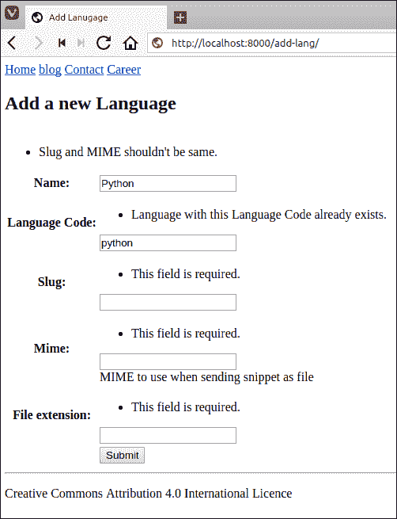
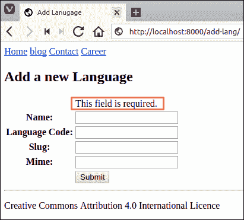
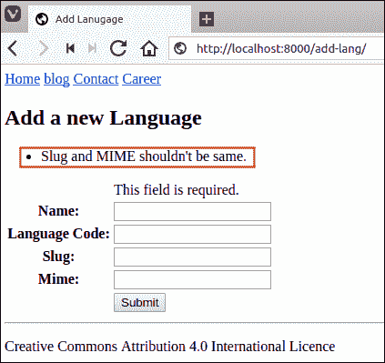
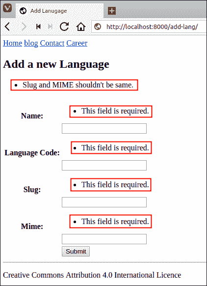
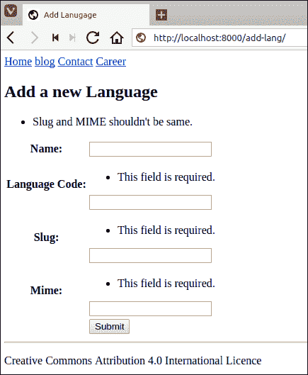
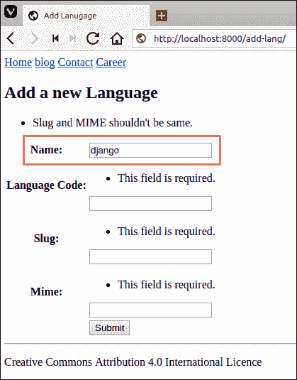
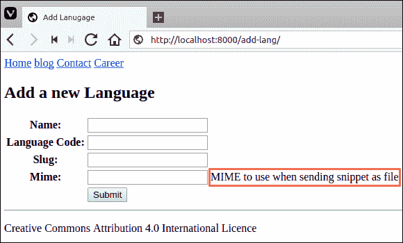

# Django 手动渲染表单字段

> 原文：<https://overiq.com/django-1-11/django-rendering-form-fields-manually/>

最后更新于 2020 年 7 月 27 日

* * *

在[上一课](/django-1-11/displaying-forms-in-django/)中，我们已经看到了几种显示表单的方法。毫无疑问，这些方法让我们能够快速创建表单，但它们也对表单的渲染方式提供了最少的控制。如果你想对你的表单有一个完美的像素控制，请继续阅读。

目前，我们的`add_lang.html`模板是这样的:

**djangobin/django _ project/djangobin/templates/djangobin/add _ lang . html**

```py



    Add Lanugage




    <h2>Add a new Language</h2>

    
        <ul class="messages">
            
                <li class="{{ message.tags }}">{{ message }}</li>
            
        </ul>
    

    <form action="" method="post">
        
        <table>
            {{ form.as_table }}
            <tr>
                <td></td>
                <td><input type="submit"></td>
            </tr>
        </table>
    </form>



```

在手动渲染每个字段之前，用以下代码替换`<form>`标记:

```py
<form action="" method="post">
        
        <table>            
            <tr>
                <th>
                    <label for="id_name">Name:</label>
                </th>
                <td>
                    <input type="text" name="name" maxlength="100" id="id_name" />
                </td>
            </tr>
            <tr>
                <th>
                    <label for="id_lang_code">Language Code:</label>
                </th>
                <td>
                    <input type="text" name="lang_code" maxlength="100" id="id_lang_code" />
                </td>
            </tr>
            <tr>
                <th>
                    <label for="id_slug">Slug:</label>
                </th>
                <td>
                    <input type="text" name="slug" maxlength="100" id="id_slug" />
                </td>
            </tr>
            <tr>
                <th>
                    <label for="id_mime">Mime:</label>
                </th>
                <td>
                    <input type="text" name="mime" maxlength="100" id="id_mime" />
                </td>
            </tr>
            <tr>
                <td></td>
                <td><input type="submit"></td>
            </tr>
        </table>
    </form>

```

将浏览器指向`http://127.0.0.1:8000/add-lang/`。在`name`和`lang_code`字段中输入一些数据(数据是否有效无关紧要，只需填写即可)，将后面两个字段留空(即 Slug 和 Mime)。最后点击提交按钮。您将再次显示一个空表单。

等一下！这是怎么回事？我们所有的表单域都是必需的，但是为什么现在会显示任何错误呢？

问题是我们在硬编码我们的 HTML，我们没有使用像`as_p()`或`as_table()`这样的表单方法来显示表单字段。因此，我们无法向用户显示表单的绑定状态。

如果我们使用类似`as_p()`或`as_table()`的方法，而不是硬编码单个表单字段，我们会得到如下验证错误:



除了验证错误之外，表单没有预填充我们在上次请求中提交表单时在`name`和`lang_code`字段中输入的数据(有效或无效)。

在下一节中，我们将学习如何纠正所有这些问题。

## 显示特定于字段的错误

要显示与特定字段相关的错误，请使用`form.field_name.errors`变量。例如，这就是我们如何显示与`name`字段相关的错误。

```py
{# check whether there are any errors or not #}


    <ul>
    
        <li>{{ error }}</li>
    


```

打开`add_lang.html`，修改文件如下:

**djangobin/django _ project/djangobin/templates/djangobin/add _ lang . html**

```py
{# ... #}
<table>
    <tr>
        <td></td>            
        
            
                <td>{{ error }}</td>
            
        
    </tr>
    <tr>
        <th>
            <label for="id_name">Name</label>
        </th>
        <td>
            <input type="text" id="id_name" name="name">
        </td>
    </tr>  
    <tr>
        <th>
            <label for="id_email">Email</label>
        </th>
        <td>
            <input type="email" id="id_email" name="email">
        </td>
    </tr>
{# ... #}
</table>
...

```

访问`http://127.0.0.1:8000/add-lang/`点击提交按钮，无需在任何字段输入数据。您应该会在`name`字段上方看到如下的`This field is required.`错误消息:



## 显示非字段错误

回想一下，我们可以覆盖表单的`clean()`方法来添加需要访问多个字段的验证。`clean()`方法提出的错误并不是针对某一个领域的，事实上，错误属于整个形式。在 Django 术语中，我们称这种错误为**非现场错误**。要访问模板内的非字段错误，我们使用`form.non_field_errors`变量。例如，我们可以使用以下代码在反馈表单中显示非字段错误。

```py

<ul>
    
        <li>{{ error }}</li>
    
</ul>


```

打开`add_lang.html`，修改如下:

**djangobin/django _ project/djangobin/templates/djangobin/add _ lang . html**

```py
{# ... #}
    
        <ul class="messages">
            
                <li class="{{ message.tags }}">{{ message }}</li>
            
        </ul>
    

    
        <ul>
            
                <li>{{ error }}</li>
            
        </ul>
    

    <form action="" method="post">
        
        <table>
{# ... #}

```

访问添加语言页面，在`slug`和`mime`字段输入相同的数据，然后点击提交。您将在表单顶部看到一个非字段错误，如下所示:



## 使用快捷方式

Django 提供了显示字段错误和非字段错误的快捷方式。我们还可以如下显示与`name`字段相关的错误:

```py
{{ form.name.errors }}

```

上述代码相当于:

```py

    <ul class="errorlist">
    
        <li>{{ error }}</li>
    
    </ul>


```

同样，我们可以使用以下快捷方式显示非字段错误:

```py
{{ form.non_field_errors }}

```

上述代码相当于:

```py

    <ul class="errorlist">
        
            <li>{{ error }}</li>
        
    </ul>


```

打开`add_lang.html`模板，修改文件使用这些快捷方式，如下所示:

**djangobin/django _ project/djangobin/templates/djangobin/add _ lang . html**

```py
{# ... #}
    
        <ul class="messages">
            
                <li class="{{ message.tags }}">{{ message }}</li>
            
        </ul>
    

    {{ form.non_field_errors }}

    <form action="" method="post">
        
        <table>
            <tr>
                <th><label for="id_name">Name:</label></th>
                <td>
                    {{ form.name.errors }}
                    <input type="text" name="name" required maxlength="100" id="id_name" />
                </td>
            </tr>
            <tr>
                <th><label for="id_lang_code">Language Code:</label></th>
                <td>
                    {{ form.lang_code.errors }}
                    <input type="text" name="lang_code" required maxlength="100" id="id_lang_code" />
                </td>
            </tr>
            <tr>
                <th><label for="id_slug">Slug:</label></th>
                <td>
                    {{ form.slug.errors }}
                    <input type="text" name="slug" required maxlength="100" id="id_slug" />
                </td>
            </tr>
            <tr>
                <th><label for="id_mime">Mime:</label></th>
                <td>
                    {{ form.mime.errors }}
                    <input type="text" name="mime" required maxlength="100" id="id_mime" />
                </td>
            </tr>
            <tr>
                <td></td>
                <td><input type="submit"></td>
            </tr>
        </table>
    </form>
{# ... #}

```

访问`http://127.0.0.1:8000/add-lang/`并点击提交按钮，无需输入任何内容，此时您应该会在每个字段上方看到`This field is required.`错误信息。



## 填充字段值

我们表单中最大的可用性问题是，在绑定状态下，它不显示用户在之前的请求中提交的任何数据。例如，在`name`字段输入`django`，点击提交。您应该会看到这样一个表单:



注意`name`字段中没有数据。Django 在变量`form.field_name.value`中提供了绑定字段值。因此要在`name`字段中显示数据，请将相应`<input>`元素的`value`属性设置为`{{ form.name.value }}`。

但是有一个小问题。如果表单处于未绑定状态，`{{ form.name.value }}`将打印`None`。因此，在显示任何内容之前，您必须始终使用``标记首先检查`form.name.value`变量中值的存在。例如:

```py

    <input type="text" id="id_name" name="name" value="{{ form.name.value }}">

    <input type="text" id="id_name" name="name">


```

打开`add-lang.html`，修改表单如下:

**djangobin/django _ project/djangobin/templates/djangobin/add _ lang . html**

```py
{# ... #}
<form action="" method="post">
    
    <table>
        <tr>
            <td><label for="id_name">Name</label></td>
            <td>
                {{ form.name.errors }}
                
                    <input type="text" id="id_name" name="name" value="{{ form.name.value }}">
                
                    <input type="text" id="id_name" name="name">
                
            </td>
        </tr>
{# ... #}

```

再次访问`http://127.0.0.1:8000/add-lang/`，在`name`字段输入`"django"`，点击提交。



不出所料，我们的绑定表单在`name`字段中预填充了数据。

Django 还提供了`{{ form.field_name }}`快捷方式，可以在绑定和未绑定状态下输出整个表单域。换句话说，`{{ form.name }}`和:

```py

    <input type="text" id="id_name" name="name" value="{{ form.name.value }}">

    <input type="text" id="id_name" name="name">


```

打开`add_lang.html`并修改文件以使用该新快捷方式，如下所示:

**djangobin/django _ project/djangobin/templates/djangobin/add _ lang . html**

```py
{# ... #}
    {{ form.non_field_errors }}

    <form action="" method="post">
        
        <table>
            <tr>
                <th>
                    <label for="id_name">Name:</label>
                </th>
                <td>
                    {{ form.name.errors }}
                    {{ form.name }}
                </td>
            </tr>
            <tr>
                <th>
                    <label for="id_lang_code">Language Code:</label>
                </th>
                <td>
                    {{ form.lang_code.errors }}
                    {{ form.lang_code }}
                </td>
            </tr>
            <tr>
                <th>
                    <label for="id_slug">Slug:</label>
                </th>
                <td>
                    {{ form.slug.errors }}
                    {{ form.slug }}
                </td>
            </tr>
            <tr>
                <th>
                    <label for="id_mime">Mime:</label>
                </th>
                <td>
                    {{ form.mime.errors }}
                    {{ form.mime }}
                </td>
            </tr>
            <tr>
                <td></td>
                <td><input type="submit"></td>
            </tr>
        </table>
    </form>
{# ... #}

```

这个快捷方式需要注意的一点是，它会生成`id_fieldname`形式的`id`值，所以如果字段的名称是`name`，那么`id`属性的值就是`id_name`。

我们的反馈表正在按预期运行。它可以显示验证错误，也可以预先填充来自上一个请求的数据。

## 显示标签

Django 提供了以下两个变量来分别生成标签 id 和标签名称。

1.  `form.field_name.id_for_label`。
2.  `form.field_name.label`。

下面是我们如何在`<label>`标签中使用它们。

```py
<label for="{{ form.name.id_for_label }}">{{ form.name.label }}</label>

```

这将输出:

```py
<label for="id_name">Name</label>

```

就像其他字段一样，Django 提供了使用`{{ form.field_name.label_tag}}`变量生成完整`<label>`标签的快捷方式。

所以，`{{ form.name.label_tag }}`

相当于:

```py
<label for="{{ form.name.id_for_label }}">{{ form.name.label }}</label>

```

打开`add_lang.html`并修改文件以使用`form.field_name.label_tag`变量，如下所示:

**djangobin/django _ project/djangobin/templates/djangobin/add _ lang . html**

```py
{# ... #}
    <form action="" method="post">
        
        <table>
            <tr>
                <th>{{ form.name.label_tag }}</th>
                <td>
                    {{ form.name.errors }}
                    {{ form.name }}
                </td>
            </tr>
            <tr>
                <th>{{ form.lang_code.label_tag }}</th>
                <td>
                    {{ form.lang_code.errors }}
                    {{ form.lang_code }}
                </td>
            </tr>
            <tr>
                <th>{{ form.slug.label_tag }}</th>
                <td>
                    {{ form.slug.errors }}
                    {{ form.slug }}
                </td>
            </tr>
            <tr>
                <th>{{ form.mime.label_tag }}</th>
                <td>
                    {{ form.mime.errors }}
                    {{ form.mime }}
                </td>
            </tr>
            <tr>
                <td></td>
                <td><input type="submit"></td>
            </tr>
        </table>
    </form>
{# ... #}

```

## 打印帮助 _ 文本

如果`help_text`属性是为模型或表单类中的字段定义的，我们也可以打印它的值。要打印`help_text`我们使用`{{ form.field_name.help_text }}`变量。

回想一下，我们已经为`Language`模型中的`mime`字段定义了`help_text`属性，如下所示:

**djangobin/django _ project/djangobin/models . py**

```py
#...
class Language(models.Model):
    name = models.CharField(max_length=100)
    lang_code = models.CharField(max_length=100, unique=True, verbose_name='Language Code')
    slug = models.SlugField(max_length=100, unique=True)
    mime = models.CharField(max_length=100, help_text='MIME to use when sending snippet as file.')
    #...

```

再次打开`add_lang.html`并在`{{ form.name }}`正下方添加`{{ form.name.help_text }}`，如下所示:

**djangobin/django _ project/djangobin/templates/djangobin/add _ lang . html**

```py
...
<form action="" method="post">
    
    <table>
        ...
        <tr>
            <th>{{ form.mime.label_tag }}</th>
                <td>
                    {{ form.mime.errors }}
                    {{ form.mime }}
                    {{ form.mime.help_text }}
                </td>
            </tr>
            <tr>
                <td></td>
                <td><input type="submit"></td>
            </tr>
    </table>  
</form>
...

```

参观`http://127.0.0.1:8000/add-lang/`你会看到`mime`场旁边的`help_text`如下。



## 在表单域上循环

Django 还有一个锦囊妙计，可以让你进一步缩短代码。我们可以使用下面的代码简单地循环表单字段，而不是手动键入单个字段。

```py
{# ... #}
<form action="" method="post">
            
            <table>
                
                    <tr>
                        <td>{{ field.label_tag }}</td>
                        <td>
                            {{ field.errors }}
                            {{ field }}                            
                        </td>
                        <td>
                            
                            {{ field.help_text }}
                            
                        </td>
                    </tr>
                
                    <tr>
                        <td></td>
                        <td><input type="submit" value="Submit"></td>
                    </tr>
            </table>
        </form>    
{# ... #}

```

像往常一样，这个方法不输出`<form>`标签和提交按钮(`<input type="submit">`)，你必须在代码中手动添加它们。

如您所见，在您键入的代码量和您得到的控制之间有一个权衡。代码越少，我们的控制力就越弱。在为 djangobin 应用创建表单时，我们将使用我们在这里学到的一些变量。

* * *

* * *