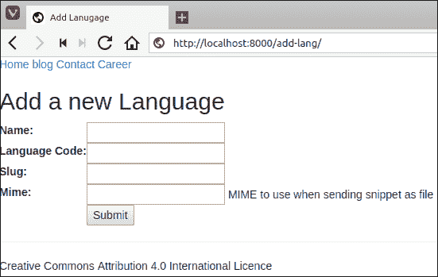
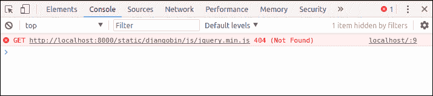

# 在 Django 中处理静态内容

> 原文：<https://overiq.com/django-1-11/handling-static-content-in-django/>

最后更新于 2020 年 7 月 27 日

* * *

在这个阶段，我们的网站看起来非常简单，因为我们还没有向其中添加任何图像、CSS 和 JavaScript。在 Django，我们称这些文件为*静态文件*，因为它们不经常变化。在本课中，我们将学习如何在 Django 中使用静态文件。

## 静态文件配置

1.  Django 提供了一个名为`staticfiles`的内置应用来管理静态文件。第一步是确定你已经把`'django.contrib.staticfiles'`列入了`INSTALLED_APPS`名单。如果`'django.contrib.staticfiles'`没有列出，现在就添加到`INSTALLED_APPS`列表中。此时，`INSTALLED_APPS`的设置应该是这样的:

    **djangobin/django _ project/django _ project/settings . py**

    ```py
    #...

    INSTALLED_APPS = [
        'django.contrib.admin',
        'django.contrib.auth',
        'django.contrib.contenttypes',
        'django.contrib.sessions',
        'django.contrib.messages',
        'django.contrib.staticfiles',
        'djangobin',        
    ]

    #...

    ```

2.  就像模板一样，Django 会自动在每个安装的应用的`static`目录中搜索静态文件。在 djangobin 应用中创建一个名为`static`的新目录。在这个`static`目录中创建另一个名为`djangobin`的目录。回想一下，为了解决名称冲突，我们遵循了与创建`templates`目录时相同的惯例[。](/django-1-11/basics-of-django-templates/#where-to-store-django-templates)

    为了方便管理文件，在`static/djangobin`目录中创建三个名为`css`、`js`和`images`的新目录。这是我们存储静态资产的地方。

    您也可以使用`STATICFILES_DIR`设置指定其他目录来搜索静态文件。例如:

    ```py
    STATICFILES_DIR  = [
        os.path.join(BASE_DIR, 'static-dir1'),
        '/opt/dir2',
    ]

    ```

    但是，我们的项目不够大，无法将静态文件存储在多个目录中，因此我们不打算定义此设置。

3.  `STATIC_URL`设置定义访问静态文件的基本 URL。默认设置为`/static/`。(斜线很重要)。这意味着存储在`djangobin/static/djangobimg/`中的图像文件`logo.png`可以通过网址`http://127.0.0.1:8000/static/djangobimg/logo.png`访问。

    如果我们将`STATIC_URL`设置为`'static-assets'`，那么`logo.jpg`将在`http://127.0.0.1:8000/static-assets/djangobimg/logo.png`可用。

## 下载静态文件

有了我们的目录，我们就可以提供静态内容了。下载[这个](/media/uploads/2018/5/29/static-assets.tar.gz) zip 文件，将其解压缩，并将所有`css`和`js`文件放入适当的目录，如下所示:

```py
djangobin/  <----- djangobin app directory
├── static
│   └── djangobin
│       ├── css
│       │   ├── all.css
│       │   ├── bootstrap.min.css
│       │   ├── bootstrap-select.min.css
│       │   ├── default.css
│       │   └── main.css
│       ├── images
│       └── js
│           ├── bootstrap.min.js
│           ├── bootstrap-select.min.js
│           └── jquery.js
│

```

## 加载静态文件

我们使用静态标签``，来加载静态文件，但是在我们使用这个标签之前，我们必须在我们的模板中使用下面的代码来加载它。

```py


```

从全网站`templates`目录(即`djangobin/templates/`)打开`base.html`，修改如下:

**决哥/决哥 _ project/决哥/样板/决哥/base.html**

```py
<!DOCTYPE html>

<html>
<head>
    <title>Default Title</title>
    <link rel="stylesheet" href="">
    <script src=""></script>
</head>
<body>
{# ... #}

```

保存文件并访问`http://localhost:8000/add-lang/`查看更改。



要检查网站是否正确加载了所有文件，请在谷歌浏览器中点击 Ctrl+Shift+J 打开开发者工具。如果控制台屏幕是空的，那么这意味着所有文件都加载良好。另一方面，如果有问题，您将在控制台中得到如下 404 错误:



如果是这种情况，请确保您已经下载了所有的资产，并按照指示将它们放在正确的目录中。另外，请仔细检查`base.html`文件中静态标签中指定的路径。

## 设置 STATIC_ROOT

目前，我们正在使用 Django 开发服务器提供静态文件。出于性能和安全原因，在生产中，我们将使用 Nginx 来服务静态文件。

为了实现这一点，我们需要设置另一个名为`STATIC_ROOT`的设置。打开`settings.py`文件后添加`STATIC_ROOT`设置如下:

**djangobin/django _ project/django _ project/settings . py**

```py
#...
STATIC_URL = '/static/'

STATIC_ROOT = os.path.join(BASE_DIR, 'staticfiles')

```

接下来，在项目根目录中创建一个名为`staticfiles`的目录。

`STATIC_ROOT`指定存储项目所有静态文件副本的位置。

要将所有文件收集到`STATIC_ROOT`中，我们使用`./manage.py collectstatic`命令。当我们准备部署我们的应用时，我们执行这个命令。由于我们仍处于开发阶段，我们将把它的执行推迟到第[章在 Django](/django-1-11/deploying-django-project-to-digitalocean/)的部署。

* * *

* * *