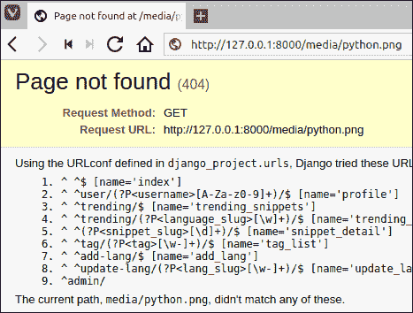
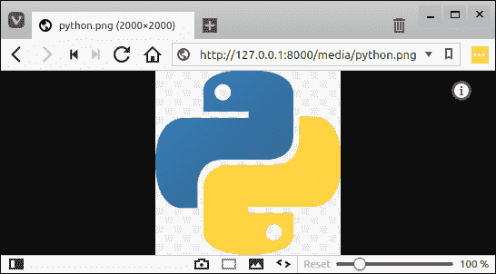

# 在 Django 中处理媒体文件

> 原文：<https://overiq.com/django-1-11/handling-media-files-in-django/>

最后更新于 2020 年 7 月 27 日

* * *

在 Django，用户上传的文件被称为媒体文件。以下是媒体文件的一些示例:

*   一个用户上传了图片，pdf，ppt 等。
*   电子商务网站上的产品图片。
*   个人资料图像。等等

就像静态文件一样，为了提供媒体文件，我们必须在`settings.py`文件中添加一些配置。

## 媒体文件配置

媒体文件取决于两种配置:

1.  `MEDIA_ROOT`
2.  `MEDIA_URL`

这些变量都不是默认设置的。

## 媒体根设置

它包含将上传媒体文件的文件系统的绝对路径。它接受字符串，而不是列表或元组。

在 Django 项目根目录(`djangobin/django_project`)内新建一个名为`media`的目录，与`manage.py`所在的位置相同。

```py
django_project/
├── db.sqlite3
├── djangobin
├── django_project
├── manage.py
├── media           <------------
├── staticfiles
└── templates

5 directories, 2 files

```

打开`settings.py`文件，在文件末尾添加以下代码，就在我们之前设置的`STATIC_ROOT`设置下面。

**djangobin/django _ project/django _ project/settings . py**

```py
#...
STATIC_ROOT = os.path.join(BASE_DIR, 'staticfies')

MEDIA_ROOT  = os.path.join(BASE_DIR, 'media')

```

## 媒体 _ 网址设置

该设置的工作原理类似于`STATIC_URL`，用于访问媒体文件。就在`MEDIA_ROOT`变量下面，定义`MEDIA_ROOT`变量如下:

**djangobin/django _ project/django _ project/settings . py**

```py
#...
MEDIA_ROOT  = os.path.join(BASE_DIR, 'media')

MEDIA_URL = '/media/'

```

下载[这个](/media/uploads/2018/2/6/python-5098a18d-52ac-4e6f-8008-77af1a5c1800.png)的图片，保存为`media`目录下的`python.png`。要访问文件，请访问`http://127.0.0.1:8000/media/python.png`。您将得到一个 HTTP 404 错误，如下所示:



但是为什么呢？

问题是 Django 开发服务器默认不提供媒体文件。为了让 Django 开发服务器提供静态服务，我们必须在 sitewide `urls.py`文件中添加一个 URL 模式。

在 Django 项目配置目录(`djangobin/django_project/django_project`)中打开`urls.py`，更新如下:

**djangobin/django _ project/django _ project/URLs . py**

```py
from django.conf.urls import url, include
from django.contrib import admin
from django.conf import settings
from django.conf.urls.static import static

urlpatterns = [
    url(r'^', include('djangobin.urls', namespace='djangobin')),
    url(r'^admin/', admin.site.urls),
]

if settings.DEBUG:
    urlpatterns += static(settings.MEDIA_URL, document_root=settings.MEDIA_ROOT)

```

现在再次访问`http://127.0.0.1:8000/media/python.png`，这次你应该可以看到图像了。



就像静态文件一样，在生产中，您应该始终使用真实的 web 服务器来提供媒体文件。不幸的是，我们的项目不依赖于媒体文件。然而，随着目录结构的布局，实现需要媒体文件的功能并不需要太多时间。作为一个挑战，在完成这个系列之后，尝试自己实现这样的特性。

* * *

* * *