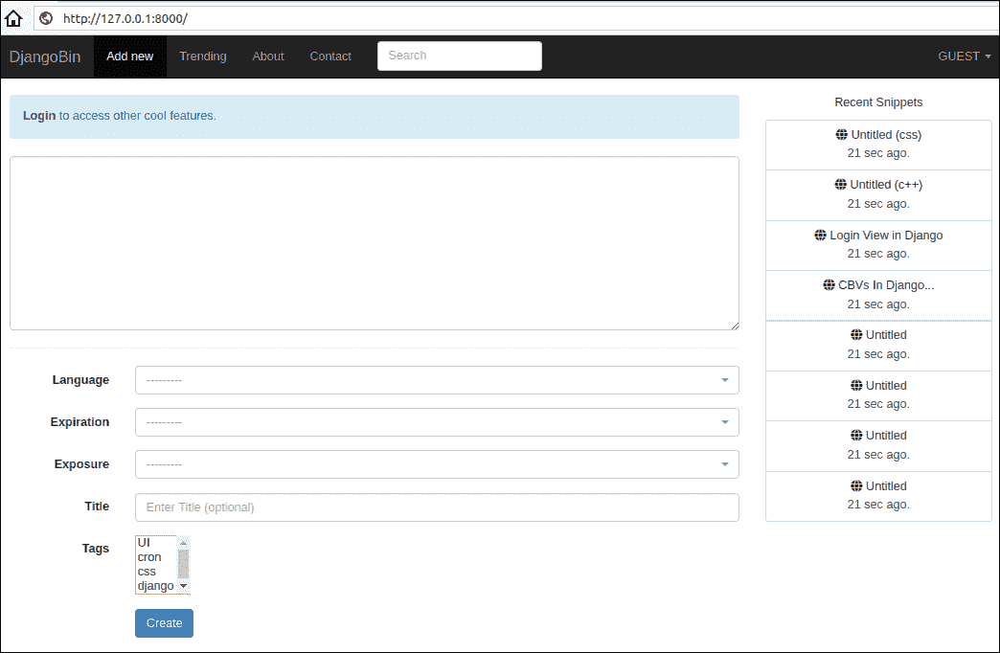
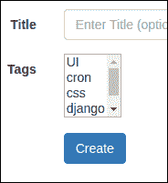
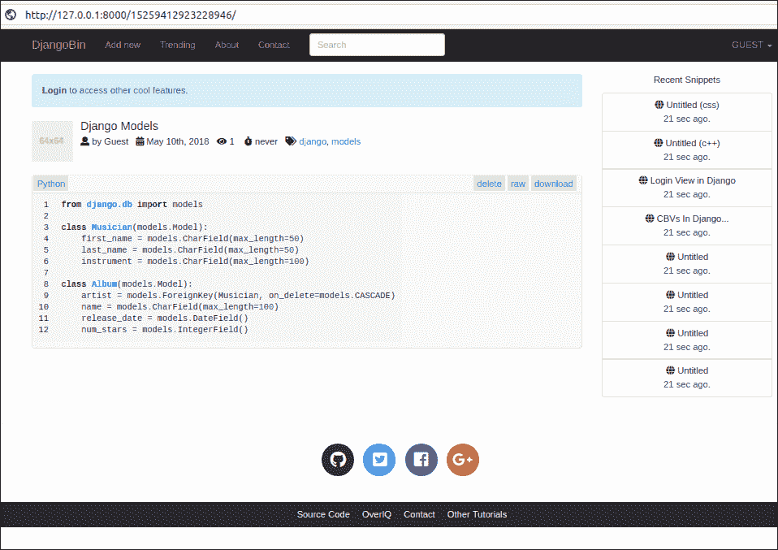
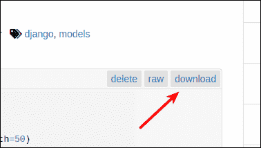
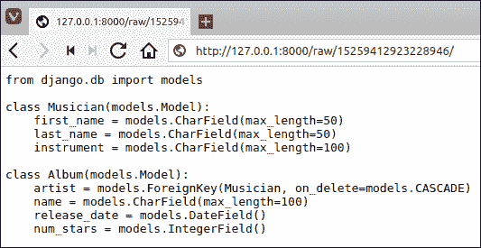
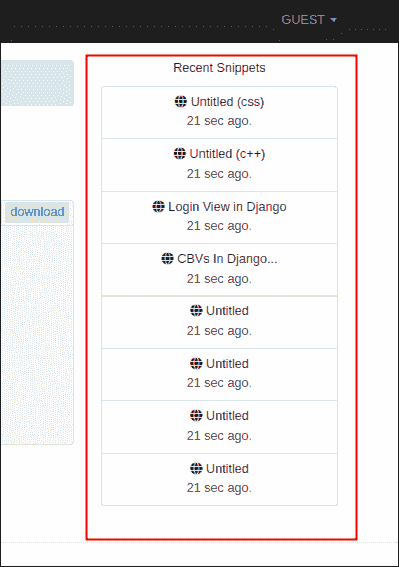
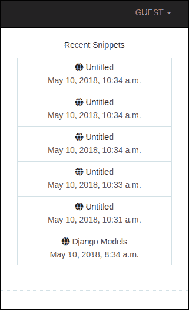
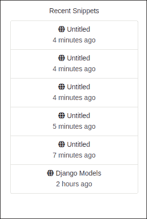

# 构建 djangobin——第一步

> 原文：<https://overiq.com/django-1-11/building-djangobin-the-first-steps/>

最后更新于 2020 年 7 月 27 日

* * *

在前几章中，我们已经了解了很多关于 Django 的知识。在本章中，我们将开始构建 djangobin 应用。

## 创建片段

让我们从构建一个允许用户提交新代码片段的表单开始。

打开 djangobin 应用的`forms.py`文件。此时，它应该是这样的:

**djangobin/django _ project/djangobin/forms . py**

```py
from django import forms
from django.core.exceptions import ValidationError
from .models import Language

class LanguageForm(forms.ModelForm):
    class Meta:
        model = Language
        fields = '__all__'

    def clean_name(self):
        name = self.cleaned_data['name']
        if name == 'djangobin' or name == 'DJANGOBIN':
            raise ValidationError("name can't be {}.".format(name))

        # Always return the data
        return name

    def clean_slug(self):
        return self.cleaned_data['slug'].lower()

    def clean(self):
        cleaned_data = super(LanguageForm, self).clean()
        slug = cleaned_data.get('slug')
        mime = cleaned_data.get('mime')

        if slug == mime:
            raise ValidationError("Slug and MIME shouldn't be same.")

        # Always return the data
        return cleaned_data

```

删除所有内容并输入以下代码:

**djangobin/django _ project/djangobin/forms . py**

```py
from django import forms
from django.core.exceptions import ValidationError
from .models import Snippet, Language, Author
from .utils import Preference, get_current_user

class SnippetForm(forms.ModelForm):

    class Meta:
        model = Snippet
        fields = ('original_code', 'language', 'expiration', 'exposure', 'title', 'tags')
        widgets = {
            'original_code': forms.Textarea(attrs={'class': 'form-control', 'rows': '10',
                                                        'spellcheck': 'false'}),
            'language': forms.Select(attrs={'class': 'selectpicker foo form-control',
                                            'data-live-search': 'true',
                                            'data-size': '5'}),
            'expiration': forms.Select(attrs={'class': 'selectpicker form-control'}),
            'exposure': forms.Select(attrs={'class': 'selectpicker form-control'}),
            'title': forms.TextInput(attrs={'class': 'selectpicker form-control',
                                            'placeholder': 'Enter Title (optional)'}),            
        }

    def save(self, request):
        # get the Snippet object, without saving it into the database
        snippet = super(SnippetForm, self).save(commit=False)
        snippet.user = get_current_user(request)
        snippet.save()
        return snippet

```

这里我们定义了一个继承自`forms.ModelForm`的`SnippetForm`类。`Meta`类的`model`属性将`SnippetForm`连接到`Snippet`模型，`fields`属性指定了您想要在表单中显示的模型字段列表。

在第 12 行，我们使用内部`Meta`类的`widgets`属性向模型字段添加引导 CSS 类和其他属性。

在第 24-29 行，我们覆盖了`ModelForm`类的`save()`方法。`save()`方法以`request`为参数，这样登录的用户就可以在方法内部访问。在第 26 行，我们用`commit=True`调用父类的`save()`方法。默认情况下，`ModelForm`的`save()`方法创建表单连接到的模型实例，将其保存到数据库并返回。如果用`commit=True`调用`save()`方法，那么它只创建并返回模型实例，而不将其保存到数据库中。当我们想要在保存或设置一些附加数据之前修改对象时，我们通常会这样做，这是我们接下来要做的。

在第 27 行，我们用`request`参数调用`get_current_user()`函数。`get_current_user()`是 djangobin 应用的`utils.py`文件中定义的实用功能，如下所示:

**决哥/决哥 _ 项目/决哥/utils.py】**

```py
from django.contrib.auth.models import User

class Preference:
    #...

def get_current_user(request):
    if request.user.is_authenticated:
        return request.user
    else:
       return User.objects.filter(username='guest')[0]

```

一个`Snippet`模型与`User`模型有一对多的关系。因此，`Snippet`对象必须与`User`对象相关联。如果用户在登录后创建代码片段，那么我们希望将代码片段分配给该用户。否则，我们希望将代码片段分配给来宾用户。这本质上就是`get_current_user()`的功能。如果用户已登录，则`get_current_user()`返回该用户的实例。否则，它返回一个来宾用户的实例，该实例只是一个`User`对象，其`username`为`guest`。

一旦设置了用户，我们保存`Snippet`对象并返回。

启动 Django shell 并创建一个新的`guest`用户，如下所示:

```py
>>>
>>> from django.contrib.auth.models import User
>>> 
>>> User.objects.create_user(
...  username='guest',
...  email='guest@overiq.com',
...  password='password'
... )
<User: guest>
>>>

```

接下来，打开`views.py`并在文件顶部添加修改`index()`查看功能，如下所示:

**djangobin/django_project/djangobin/views.py**

```py
from django.shortcuts import HttpResponse, render, redirect, get_object_or_404, reverse
from django.contrib import messages
from .forms import SnippetForm
from .models import Language

def index(request):        
    if request.method ==  'POST':
        f = SnippetForm(request.POST)

        if f.is_valid():
            snippet = f.save(request)            
            return redirect(reverse('djangobin:snippet_detail', args=[snippet.slug]))

    else:
        f = SnippetForm()
    return render(request, 'djangobin/index.html', {'form': f})

def snippet_detail(request, snippet_slug):
    #...

```

该视图功能显示`SnippetForm`表单，并将提交的片段保存到数据库。

在此之前，我们进入下一部分，删除`add_lang`和`update_lang`网址模式，并查看与之相关的功能。

## Django 宾的基本模板

接下来，让我们为 djangobin 应用设置一个基础模板。在 djangobin 应用的`templates/`目录中创建一个名为`base.html`的模板，代码如下:

**决哥/决哥 _ project/决哥/样板/决哥/base.html**

```py
<!DOCTYPE html>
<html lang="en">
<head>

    

    <meta charset="utf-8">
    <meta http-equiv="X-UA-Compatible" content="IE=edge">
    <meta name="viewport" content="width=device-width, initial-scale=1">
    <title>Djangobin</title>

    <!-- Bootstrap -->
    <link rel="stylesheet" href="" >

    <!-- Latest compiled and minified CSS -->
    <link rel="stylesheet" href="" >

    <link href="https://use.fontawesome.com/releases/v5.0.7/css/all.css" rel="stylesheet">

    <!-- HTML5 shim and Respond.js for IE8 support of HTML5 elements and media queries -->
    <!-- WARNING: Respond.js doesn't work if you view the page via file:// -->
    <!--[if lt IE 9]>
    <script src="https://oss.maxcdn.com/html5shiv/3.7.3/html5shiv.min.js"></script>
    <script src="https://oss.maxcdn.com/respond/1.4.2/respond.min.js"></script>
    <![endif]-->

    <link rel="stylesheet" href="">
    <link rel="stylesheet" href="">
</head>
<body>

<nav class="navbar navbar-default navbar-inverse navbar-fixed-top">
    <div class="container">
        <!-- Brand and toggle get grouped for better mobile display -->
        <div class="navbar-header">
            <button type="button" class="navbar-toggle collapsed"
                    data-toggle="collapse" data-target="#bs-example-navbar-collapse-1"
                    aria-expanded="false">
                <span class="sr-only">Toggle navigation</span>
                <span class="icon-bar"></span>
                <span class="icon-bar"></span>
                <span class="icon-bar"></span>
            </button>
            <a class="navbar-brand" href="">DjangoBin</a>
        </div>

        <!-- Collect the nav links, forms, and other content for toggling -->
        <div class="collapse navbar-collapse" id="bs-example-navbar-collapse-1">
            <ul class="nav navbar-nav">
                <li class='active' >
                    <a href="">Add new</a>
                </li>
                <li class='active'>
                    <a href="">Trending<span class="sr-only">(current)</span></a>
                </li>
                <li class='active'>
                    <a href="">About</a>
                </li>
                <li class='active'>
                    <a href="">Contact</a>
                </li>
            </ul>

            <form action="" class="navbar-form navbar-left" method="get">
                <div class="form-group">
                    <input type="text" name="query" class="form-control" placeholder="Search" value="">
                </div>
            </form>
            <ul class="nav navbar-nav navbar-right">
                <li class="dropdown">
                    <a href="#" class="dropdown-toggle" data-toggle="dropdown" role="button"
                       aria-haspopup="true" aria-expanded="false">
                        
                            {{ request.user.username|upper }}
                        
                            GUEST
                        
                        <span class="caret"></span>
                    </a>
                    
                        <ul class="dropdown-menu">
                            <li><a href="">My Pastes</a></li>
                            <li><a href="">Account Details</a></li>
                            <li><a href="">Settings</a></li>
                            <li role="separator" class="divider"></li>
                            <li><a href="">Logout</a></li>
                        </ul>
                    
                        <ul class="dropdown-menu">
                            <li><a href="">Sign Up</a></li>
                            <li><a href="">Login</a></li>
                        </ul>
                    
                </li>
            </ul>
        </div><!-- /.navbar-collapse -->
    </div><!-- /.container-fluid -->
</nav>

<div class="container">

    <div class="row">

        <div class="col-lg-9 col-md-9">

            
                <p class="alert alert-info">
                    <a href="" class="alert-link">Login</a> to access other cool features.
                </p>
            

            
                {#  override this block in the child template  #}
            

        </div>

        <div class="col-lg-3 col-md-3 text-center hidden-sm hidden-xs">
            <p>Recent Snippets</p>

            <div class="list-group">
                <a href="#" class="list-group-item">
                    <h5 class="list-group-item-heading"><span class="fas fa-globe"
                        "></span> Untitled (css)</h5>
                    <p class="list-group-item-text">21 sec ago.</p>
                </a>

                <a href="#" class="list-group-item">
                    <h5 class="list-group-item-heading"><span class="fas fa-globe"
                        "></span> Untitled (c++)</h5>
                    <p class="list-group-item-text">21 sec ago.</p>
                </a>
                <a href="#" class="list-group-item">
                    <h5 class="list-group-item-heading"><span class="fas fa-globe"
                        "></span> Login View in Django</h5>
                    <p class="list-group-item-text">21 sec ago.</p>
                </a>
                <a href="#" class="list-group-item">
                    <h5 class="list-group-item-heading"><span class="fas fa-globe"
                        "></span> CBVs In Django...</h5>
                    <p class="list-group-item-text">21 sec ago.</p>
                </a>
                <a href="#" class="list-group-item">
                    <h5 class="list-group-item-heading"><span class="fas fa-globe"
                        "></span> Untitled</h5>
                    <p class="list-group-item-text">21 sec ago.</p>
                </a>
                <a href="#" class="list-group-item">
                    <h5 class="list-group-item-heading"><span class="fas fa-globe"
                        "></span> Untitled</h5>
                    <p class="list-group-item-text">21 sec ago.</p>
                </a>
                <a href="#" class="list-group-item">
                    <h5 class="list-group-item-heading"><span class="fas fa-globe"
                        "></span> Untitled</h5>
                    <p class="list-group-item-text">21 sec ago.</p>
                </a>
                <a href="#" class="list-group-item">
                    <h5 class="list-group-item-heading"><span class="fas fa-globe"
                        "></span> Untitled</h5>
                    <p class="list-group-item-text">21 sec ago.</p>
                </a>
            </div>

        </div>
    </div>
</div>

<hr>

<footer>
    <div class="social-icons">
        <div class="container text-center">
            <ul class="list-inline">
                <li class="list-inline-item social-github">
                    <a href="https://github.com/">
                        <i class="fab fa-github"></i>
                    </a>
                </li>
                <li class="list-inline-item social-twitter">
                    <a href="https://twitter.com/">
                        <i class="fab fa-twitter-square"></i>
                    </a>
                </li>
                <li class="list-inline-item social-facebook">
                    <a href="https://www.facebook.com/">
                        <i class="fab fa-facebook-square"></i>
                    </a>
                </li>
                <li class="list-inline-item social-google-plus">
                    <a href="https://plus.google.com/">
                        <i class="fab fa-google-plus-g"></i>
                    </a>
                </li>
            </ul>
        </div>
    </div>

    <div class="main-footer">
        <div class="container text-center">
            <ul>
                <li><a href="#">Source Code</a></li>
                <li><a href="#">OverIQ</a></li>
                <li><a href="#">Contact</a></li>
                <li><a href="#">Other Tutorials</a></li>
            </ul>
        </div>
    </div>
</footer>

<!-- jQuery (necessary for Bootstrap's JavaScript plugins) -->
<script src=></script>

<!-- Include all compiled plugins (below), or include individual files as needed -->
<!-- Latest compiled and minified JavaScript -->
<script src=></script>

<!-- Latest compiled and minified JavaScript -->
<script src=></script>

<script>
    $(function () {
        $('[data-toggle="tooltip"]').tooltip()
    })

</script>

</body>
</html>

```

大部分代码应该是直接的。但我们仍然会仔细检查，只是为了确保你明白一切。

回想一下，在模板内部，您总是可以访问`request`变量。我们使用这个变量来访问当前 web 请求和登录用户的详细信息。

在第 5 行，我们使用``标签加载``标签。

在第 10 行，我们定义了一个名为`title`的块。从该模板继承的模板可以用内容填充块。

在第 27-28 行，我们使用``标签为 CSS 文件构建 URL。

在第 50-61 行中，我们使用几个``标签将一类`active`添加到相应的`<li>`元素中，以突出显示菜单中的当前选项。

在第 73-77 行，我们测试用户是否登录。如果是，我们在应用`upper`过滤器后显示登录的用户名。如果用户没有登录，我们显示`GUEST`。

在第 80-93 行，我们再次测试用户是否登录。如果是这样，我们会显示一些与个人资料相关的链接，如我的贴、设置、注销等。否则，我们会显示登录和注册页面的链接。

在第 107-111 行，我们显示了一个登录页面的链接，只有当用户没有登录并且`request.path`不等于`/login/`时。

在第 114 行，我们定义了一个名为`main`的块。该块的内容将由子模板提供。

在第 214-221 行，我们再次使用``标签来构建到 JavaScript 文件的链接。

你可能已经注意到了，大部分`<a>`元素的`href`属性是空的。我们将继续更新它们。

现在，我们在`templates`目录
中创建一个名为`index.html`的子模板，代码如下:

**djangobin/django _ project/djangobin/templates/djangobin/index . html**

```py






    <form action="" class="form-horizontal" method="post">

        

        {{ form.original_code.errors }}

        {{ form.original_code }}

        <hr>

        <div class="form-group">
            <label for="{{ form.language.id_for_label }}" class="col-sm-2 control-label">Language</label>
            <div class="col-lg-10 col-md-10 col-sm-10">
                {{ form.language }}
            </div>
        </div>

        {{ form.expiration.errors }}

        <div class="form-group">
            <label for="{{ form.expiration.id_for_label }}" class="col-sm-2  control-label">Expiration</label>
            <div class="col-lg-10 col-md-10 col-sm-10">
                {{ form.expiration }}
            </div>
        </div>

        {{ form.exposure.errors }}

        <div class="form-group">
            <label for="{{ form.exposure.id_for_label }}" class="col-sm-2  control-label">Exposure</label>
            <div class="col-lg-10 col-md-10 col-sm-10">
                {{ form.exposure }}
            </div>
        </div>

        <div class="form-group">
            <label for="{{ form.title.id_for_label }}" class="col-sm-2  control-label">Title</label>
            <div class="col-lg-10 col-md-10 col-sm-10">
                {{ form.title }}
            </div>
        </div>

        <div class="form-group">
            <label for="{{ form.tags.id_for_label }}" class="col-sm-2  control-label">Tags</label>
            <div class="col-lg-10 col-md-10 col-sm-10">
                {{ form.tags }}
            </div>
        </div>

        <div class="form-group">
            <label for="inputEmail3" class="col-sm-2 control-label"></label>
            <div class="col-lg-10 col-md-10 col-sm-10">
                <button type="submit" class="btn btn-primary">Create</button>
            </div>
        </div>

    </form>



```

这个模板中没有值得解释的新内容。我们只是在利用我们到目前为止学到的东西。如果您需要复习 Django 模板章节的[基础知识。](/django-1-11/basics-of-django-templates/)

如果你现在访问`http://localhost:8000/`。您将看到这样的页面:



页面显示正确，但有一个问题。

仔细看看`Tags`场是如何渲染的:



由于`Snippet`模型与`Tag`模型具有多对多的关系，因此使用多重选择`<select>`框显示标签。这意味着您只能选择数据库中已经存在的标签。

不可能预料到用户将用来创建片段的所有标签。因此，更好的方法是让用户在创建代码片段时指定一个逗号分隔的标签列表。为此，我们必须在`SnippetForm`类中定义一个新的表单字段。

在`forms.py`中，定义`Meta`类上方的`snippet_tag`字段，如下所示:

**djangobin/django _ project/djangobin/forms . py**

```py
#...
class SnippetForm(forms.ModelForm):

    snippet_tags = forms.CharField(required=False,
                           widget=forms.TextInput(attrs={
                               'class': 'selectpicker form-control',
                               'placeholder': 'Enter tags (optional)'
                            }))

    class Meta:
        model = Snippet
#...

```

另外，从`Meta`类的`fields`属性中移除`tags`字段。

**djangobin/django _ project/djangobin/forms . py**

```py
#...
    class Meta:
        model = Snippet
        fields = ('original_code', 'language', 'expiration', 'exposure', 'title',)
        widgets = {
#...

```

为了融入这些变化，我们现在必须更新`SnippetForm`类的`save()`方法。

**djangobin/django _ project/djangobin/forms . py**

```py
from django import forms
from django.core.exceptions import ValidationError
from .models import Snippet, Language, Author, Tag
from .utils import Preference, get_current_user

class SnippetForm(forms.ModelForm):
    #...

    def save(self, request):
        snippet = super(SnippetForm, self).save(commit=False)
        snippet.user = get_current_user(request)
        snippet.save()
        tag_list = [tag.strip().lower() 
                   for tag in self.cleaned_data['snippet_tags'].split(',') if tag ]
        if len(tag_list) > 0:
            for tag in tag_list:
                t = Tag.objects.get_or_create(name=tag)
                snippet.tags.add(t[0])
        return snippet

```

在第 14 行，我们使用列表理解和表单对象的`cleaned_data`属性来创建提交标签的列表。

如果`tag_list`不为空，我们使用 for 循环对其进行循环。在 for 循环中，我们创建`Tag`对象(仅当它不存在时)并将其与`Snippet`对象相关联。

需要注意的是，`SnippetForm`的`snippet_tags`场是一个全新的场，与`Snippet`模型的`tags`场没有任何关系。

最后，更新`index.html`使用`snippets_tags`字段，如下所示:

**djangobin/django _ project/djangobin/templates/djangobin/index . html**

```py
{# ... #}
        <div class="form-group">
            <label for="{{ form.title.id_for_label }}" class="col-sm-2  control-label">Title</label>
            <div class="col-lg-10 col-md-10 col-sm-10">
                {{ form.title }}
            </div>
        </div>

        <div class="form-group">
            <label for="{{ form.snippet_tags.id_for_label }}" class="col-sm-2  control-label">Tags</label>
            <div class="col-lg-10 col-md-10 col-sm-10">
                {{ form.snippet_tags }}
            </div>
        </div>

        <div class="form-group">
            <label for="inputEmail3" class="col-sm-2 control-label"></label>
            <div class="col-lg-10 col-md-10 col-sm-10">
                <button type="submit" class="btn btn-primary">Create</button>
            </div>
        </div>
{# ... #}

```

我们现在可以在创建片段时指定逗号分隔的标签列表。
在下一节中，我们将创建页面来显示高亮显示的片段。

## 显示代码片段

在`views.py`文件中，修改`snippet_detail()`视图，就在`index()`视图的下方功能如下:

**djangobin/django_project/djangobin/views.py**

```py
#...
from .models import Language, Snippet

#...

def snippet_detail(request, snippet_slug):
    snippet = get_object_or_404(Snippet, slug=snippet_slug)
    snippet.hits += 1
    snippet.save()
    return render(request, 'djangobin/snippet_detail.html', {'snippet': snippet})

```

该视图函数显示高亮显示的代码片段，并将点击次数增加 1。

在`templates`目录中创建新模板`snippet_detail.html`，代码如下:

**djangobin/django _ project/djangobin/templates/djangobin/snippet _ detail . html**

```py






    <div class="media post-meta">
        <div class="media-left">
            <a href="#">
                
            </a>
        </div>
        <div class="media-body">
            <h4 class="media-heading">{{ snippet.title|default:"Untitled" }}</h4>
            <p>
                <i class="fas fa-user" data-toggle="tooltip" title="" data-original-title="Paste creator"></i> by
                {{ snippet.user.username|capfirst }} &nbsp;
                <i class="fas fa-calendar-alt" data-toggle="tooltip" title="" data-original-title="Creation Date" ></i>
                <time title="{{ snippet.created_on }}">{{ snippet.created_on|date:"M jS,  Y" }}</time> &nbsp;</span>
                <i class="fas fa-eye"  data-toggle="tooltip" title="" data-original-title="Visits to this paste" ></i>
                {{ snippet.hits }} &nbsp;&nbsp;
                <i class="fas fa-stopwatch" data-toggle="tooltip" title="" data-original-title="Expiration time"></i>
                {{ snippet.expiration }}  &nbsp;
                
                    <i class="fas fa-tags" data-toggle="tooltip" title="" data-original-title="Tags"></i>
                    
                        <a href="">{{ tag }}</a>,
                    
                
            </p>
        </div>

    </div>

    <div class="codeblock">
        <div class="toolbar clearfix">
            <span class="at-left"><a href="">{{ snippet.language }}</a></span>
            <span class="at-right">
                <a onclick="return confirm('Sure you want to delete this paste? ')" href="">delete</a>
                <a href="">raw</a>
                <a href="">download</a>
            </span>
        </div>
        <div class="code-wrapper">{{ snippet.highlighted_code|safe }}</div>
    </div>



```

在第 13-31 行，我们显示了代码片段的元数据，在第 44 行，我们显示了高亮显示的代码。

现在访问`http://localhost:8000/`并尝试创建一个片段。您将获得如下代码片段详细信息页面:



## 下载代码片段

就在`snippet_detail()`视图下方，定义`download_snippet()`视图功能如下:

```py
#...

def download_snippet(request, snippet_slug):
    snippet = get_object_or_404(Snippet, slug=snippet_slug)
    file_extension = snippet.language.file_extension
    filename = snippet.slug + file_extension
    res = HttpResponse(snippet.original_code)
    res['content-disposition'] = 'attachment; filename=' + filename + ";"
    return res

```

这个视图函数从数据库中检索代码片段，并将其发送给客户端。

请注意，我们正在创建`HttpResponse`实例之后设置一个名为`Content-Disposition`的附加标题。`Content-Disposition`标题告诉浏览器将响应保存为附件，而不是显示。

接下来，打开 djangobin 应用的`urls.py`并添加一个名为`download_snippet`的新 URL 模式，如下所示:

**决哥/决哥 _ 项目/决哥/URL . py】**

```py
#...

urlpatterns = [
    #...
    url('^trending/$', views.trending_snippets, name='trending_snippets'),
    url('^trending/(?P<language_slug>[\w]+)/$', views.trending_snippets, name='trending_snippets'),
    url('^(?P<snippet_slug>[\d]+)/$', views.snippet_detail, name='snippet_detail'),
    url('^tag/(?P<tag>[\w-]+)/$', views.tag_list, name='tag_list'),
    url('^download/(?P<snippet_slug>[\d]+)/$', views.download_snippet, name='download_snippet'),
]

```

现在，为了让用户下载代码，我们必须在代码片段详细信息页面中添加一个链接。打开`snippet_detail.html`并用`class="codeblock"`修改`<div>`标签，如下所示:

**djangobin/django _ project/djangobin/templates/djangobin/snippet _ detail . html**

```py
{#  ...  #}
    <div class="codeblock">
        <div class="toolbar clearfix">
            <span class="at-left"><a href="">{{ snippet.language }}</a></span>
            <span class="at-right">
                <a onclick="return confirm('Sure you want to delete this paste? ')" href="">delete</a>
                <a href="">raw</a>
                <a href="">download</a>
            </span>
        </div>
        <div class="code-wrapper">{{ snippet.highlighted_code|safe }}</div>
    </div>
{#  ...  #}

```

访问`http://localhost:8000/`并创建一个新的片段。在代码片段详细信息页面中，单击“下载”链接下载代码片段。



## 显示原始片段

在`views.py`中，在`download_snippet()`视图下方增加`raw_snippet()`视图功能，如下:

**djangobin/django_project/djangobin/views.py**

```py
#...
def raw_snippet(request, snippet_slug):
    snippet = get_object_or_404(Snippet, slug=snippet_slug)
    return HttpResponse(snippet.original_code, content_type=snippet.language.mime)

```

该视图将以原始格式显示代码片段。

将名为`raw_snippet`的新网址模式添加到`urls.py`中，如下所示:

**决哥/决哥 _ 项目/决哥/utils.py】**

```py
#...
urlpatterns = [
    #...
    url('^(?P<snippet_slug>[\d]+)/$', views.snippet_detail, name='snippet_detail'),
    url('^tag/(?P<tag>[\w-]+)/$', views.tag_list, name='tag_list'),
    url('^download/(?P<snippet_slug>[\d]+)/$', views.download_snippet, name='download_snippet'),
    url('^raw/(?P<snippet_slug>[\d]+)/$', views.raw_snippet, name='raw_snippet'), 
]

```

最后，在`snippet_detail.html`模板中添加一个到原始片段的链接，如下所示:

```py
{# ... #}
<div class="codeblock">
    <div class="toolbar clearfix">
            <span class="at-left"><a href="">{{ snippet.language }}</a></span>
            <span class="at-right">
                <a onclick="return confirm('Sure you want to delete this paste? ')" href="">delete</a>
                <a href="">raw</a>
                <a href="">download</a>
            </span>
        </div>
    <div class="code-wrapper">{{ snippet.highlighted_code|safe }}</div>
</div>
{# ... #}

```

现在，您可以通过单击片段详细信息页面中的“原始”链接来查看原始片段。



## 使用上下文处理器显示最近的片段

我们希望在 Djangobin 应用的每个页面上显示最近的公开片段。目前，最近的 Snippet 列表只是一系列硬编码的`<a>`标签。



首先，您可能认为我们可以通过执行以下操作来轻松显示最近的片段:

**djangobin/django_project/djangobin/views.py**

```py
def snippet_detail(request, snippet_slug):
    recent_snippet = Snippet.objects.filter(exposure='public').order_by("-created_on")[:8]
    snippet = get_object_or_404(Snippet, slug=snippet_slug)
    snippet.hits += 1
    snippet.save()
    return render(request, 'djangobin/snippet_detail.html', {'snippet': snippet, 
                                                             'recent_snippet': recent_snippet})

```

这种方法没有错，唯一的问题是，如果我们选择走这条路线，那么我们将不得不重复获取最近的代码片段列表，并将其传递给每个视图函数中的相应模板——上下文处理器来拯救。

在课程[加载模板](/django-1-11/loading-templates-in-django/)中，我们了解到`render()`功能会自动使所有模板中的某些变量可用。两个这样的变量是`request`和`message`。包含当前请求数据的`request`变量和包含闪光信息的`messages`变量。`render()`功能使用名为`RequestContext`的东西来实现这一点。

`RequestContext`只是`Context`的一个特殊子类。`RequestContext`与`Context`的不同之处在于:

1.  它接受`request`作为它的第一个参数。
2.  它基于`context_processors`选项自动填充模板上下文。

`context_processors`只是一个可调用的列表，叫做上下文处理器。每个上下文处理器都是一个接受`HttpRequest`对象并返回要合并到模板上下文中的项目字典的函数。默认情况下`context_processors`列表如下:

**djangobin/django _ project/django _ project/settings . py**

```py
#...
TEMPLATES = [
    {
        'BACKEND': 'django.template.backends.django.DjangoTemplates',
        'DIRS': [
            os.path.join(BASE_DIR, 'templates'),
        ],
        'APP_DIRS': True,
        'OPTIONS': {
            'context_processors': [
                'django.template.context_processors.debug',
                'django.template.context_processors.request',
                'django.contrib.auth.context_processors.auth',
                'django.contrib.messages.context_processors.messages',
            ],
        },
    },
]
#...

```

`request`和`message`可调用的来源如下:

```py
def request(request):
    return {'request': request}

def messages(request):
    """
    Returns a lazy 'messages' context variable.
    """
    return {
        'messages': get_messages(request),
        'DEFAULT_MESSAGE_LEVELS': DEFAULT_LEVELS,
    }

```

现在你知道`request`和`messages`变量来自哪里了。

要使变量对所有模板都是全局可访问的，您必须定义一个自定义上下文处理器。

在`djangobin`应用目录中创建一个名为`context_processors.py`的新文件，并向其中添加以下代码:

**djangobin/django _ project/djangobin/context _ processors . py**

```py
from .models import Snippet

def recent_snippets(request):
    return dict(recent_snippets=Snippet.objects.filter(exposure='public').order_by("-id")[:8])

```

将此上下文处理器添加到`settings.py`文件中的`context_processors`选项，如下所示:

**djangobin/django _ project/django _ project/settings . py**

```py
#...
TEMPLATES = [
    {
        'BACKEND': 'django.template.backends.django.DjangoTemplates',
        'DIRS': [
            os.path.join(BASE_DIR, 'templates'),
        ],
        'APP_DIRS': True,
        'OPTIONS': {
            'context_processors': [
                'django.template.context_processors.debug',
                'django.template.context_processors.request',
                'django.contrib.auth.context_processors.auth',
                'django.contrib.messages.context_processors.messages',
                'djangobin.context_processors.recent_snippets',
            ],
        },
    },
]
#...

```

现在，我们所有的模板都可以访问`recent_snippets`变量。

为了显示最近的片段，我们必须在 djangobin 应用的`base.html`文件中进行一些更改。打开`base.html`，修改如下:

**决哥/决哥 _ project/决哥/样板/决哥/base.html**

```py
{# ... #}
<div class="col-lg-3 col-md-3 text-center hidden-sm hidden-xs">
            <p>Recent Snippets</p>
            <div class="list-group">

                
                    <a href="{{ recent_snippet.get_absolute_url }}" class="list-group-item">
                        <h5 class="list-group-item-heading"><span class="fa fa-globe
"></span> {{ recent_snippet.title }}</h5>
                        <p class="list-group-item-text">{{ recent_snippet.created_on }}</p>
                    </a>
                

            </div>        

        </div>
{# ... #}

```

访问主页或片段详细信息页面，您将看到如下所示的最近片段列表:



### 人性化时间

目前，最近摘录列表以下列格式显示日期和时间:

```py
"April 12, 2018, 7:09 a.m"

```

更方便用户的方法是这样显示日期和时间:

*   两周前
*   23 小时前
*   10 秒前等等。

Django 自带一个名为 humanize 的内置应用，它提供模板过滤器来格式化数字、日期和时间。

默认情况下不安装人性化应用。要安装它，请将

`django.contrib.humanize`添加到`settings.py`文件中的`INSTALLED_APPS`列表，如下所示:

**djangobin/django _ project/django _ project/settings . py**

```py
#...
INSTALLED_APPS = [
    'django.contrib.admin',
    'django.contrib.auth',
    'django.contrib.contenttypes',
    'django.contrib.sessions',
    'django.contrib.messages',
    'django.contrib.staticfiles',
    'django.contrib.humanize',
    'djangobin',
]
#...

```

现在打开`base.html`模板，并在加载静态模板标签的线的正下方添加``:

**决哥/决哥 _ project/决哥/样板/决哥/base.html**

```py
<!DOCTYPE html>
<html lang="en">
<head>

    
    

    <meta charset="utf-8">
    <meta http-equiv="X-UA-Compatible" content="IE=edge">
{# ... #}

```

最后将`naturaltime`滤镜添加到`base.html`中，如下所示:

**决哥/决哥 _ project/决哥/样板/决哥/base.html**

```py
{# ... #}
<div class="col-lg-3 col-md-3 text-center hidden-sm hidden-xs">
            <p>Recent Snippets</p>

            <div class="list-group">

                
                    <a href="{{ recent_snippet.get_absolute_url }}" class="list-group-item">
                        <h5 class="list-group-item-heading"><span class="fa fa-globe
"></span> {{ recent_snippet.title }}</h5>
                        <p class="list-group-item-text">{{ recent_snippet.created_on|naturaltime }}</p>
                    </a>
                

            </div>

        </div>
{# ... #}

```

访问主页或代码片段详细信息页面，您将看到更新的日期和时间格式如下:



* * *

* * *