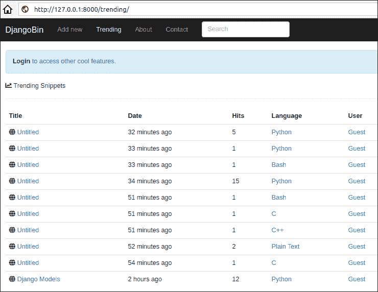
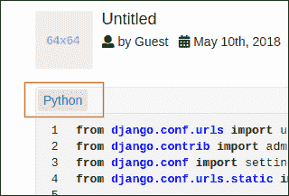
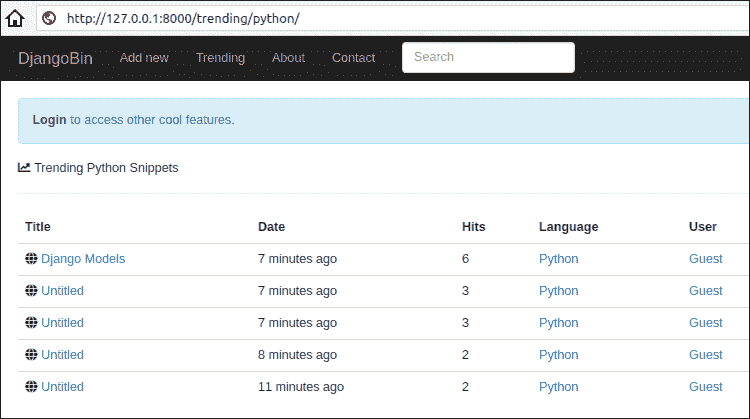
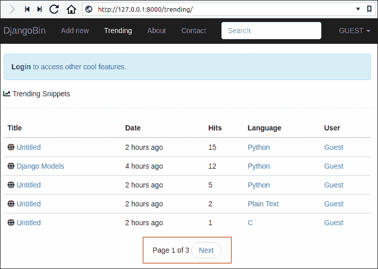
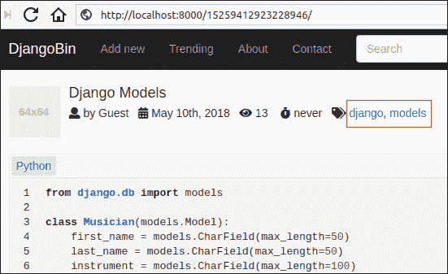
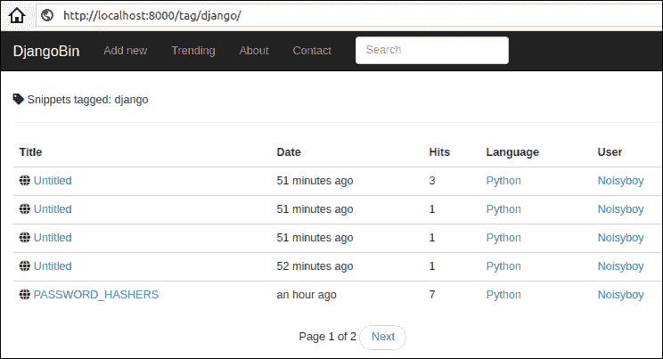

# 创建趋势片段页面

> 原文：<https://overiq.com/django-1-11/creating-trending-snippet-page/>

最后更新于 2020 年 7 月 27 日

* * *

我们的下一个任务是根据代码片段的点击量显示代码片段列表页面。我们希望在 URL 路径`/trending/`显示所有语言的趋势片段列表，在 URL 路径`/trending/<language_slug>/`显示特定语言的片段列表。

让我们从修改`views.py`文件中的`trending_snippets`视图功能开始，如下所示:

**djangobin/django_project/djangobin/views.py**

```py
#...
def raw_snippet(request, snippet_slug):
    #...

def trending_snippets(request, language_slug=''):
    lang = None
    snippets = Snippet.objects
    if language_slug:
        snippets = snippets.filter(language__slug=language_slug)
        lang = get_object_or_404(Language, slug=language_slug)
    snippets = snippets.all()
    return render(request, 'djangobin/trending.html', {'snippets': snippets, 'lang': lang})

def tag_list(request, tag):
    #...

```

在 djangobin 应用的`templates`目录中创建`trending.html`模板，代码如下:

**djangobin/django _ project/djangobin/templates/djangobin/trending . html**

```py






    Trending {{ lang.name }} Snippets - {{ block.super }}




    <h5><i class="fas fa-chart-line"></i> Trending {{ lang.name }} Snippets</h5>
    <hr>

    <table class="table">
        <thead>
        <tr>
            <th>Title</th>
            <th>Date</th>
            <th>Hits</th>
            <th>Language</th>
            <th>User</th>
        </tr>
        </thead>
        <tbody>

        
            <tr>
                <td><i class="fas fa-globe"></i>
                    <a href="{{ snippet.get_absolute_url }}">{{ snippet.title }}</a>
                </td>
                <td title="{{ snippet.created_on }}">{{ snippet.created_on|naturaltime }}</td>
                <td>{{ snippet.hits }}</td>
                <td><a href="">{{ snippet.language }}</a></td>
                
                    <td><a href="{{ snippet.user.profile.get_absolute_url }}">{{ snippet.user.username|title }}</a></td>
                
                    <td>-</td>
                

            </tr>
        
            <tr class="text-center">
                <td colspan="4">There are no snippets.</td>
            </tr>
        

        </tbody>
    </table>



```

这里有几件事需要注意:

在第 27-46 行，我们使用一个``标签来循环代码片段列表。

在第 29-34 行，我们显示片段标题、创建时间、点击量和语言名称。

在第 35-39 行，我们检查代码片段创建者概要文件是否是私有的。如果配置文件不是私有的，我们会显示用户名和用户配置文件页面的链接。另一方面，如果配置文件是私有的，我们在用户列中显示一个`-`(破折号)。

接下来，更新 djangobin 应用的`base.html`模板，以包含一个指向趋势片段页面的链接:

**决哥/决哥 _ project/决哥/样板/决哥/base.html**

```py
{# ... #}
            <ul class="nav navbar-nav">
                <li class='active' >
                    <a href="">Add new</a>
                </li>
                <li class='active'>
                    <a href="">Trending<span class="sr-only">(current)</span></a>
                </li>
                <li class='active'>
                    <a href="">About</a>
                </li>
                <li class='active'>
                    <a href="">Contact</a>
                </li>
            </ul>
{# ... #}

```

同样，要显示特定语言的趋势片段，请添加到`snippet_detail.html`模板的链接，如下所示:

**djangobin/django _ project/djangobin/templates/djangobin/snippet _ detail . html**

```py
{# ... #}
    <div class="codeblock">

        <div class="toolbar clearfix">
            <span class="at-left"><a href="">{{ snippet.language }}</a></span>
            <span class="at-right">
                <a onclick="return confirm('Sure you want to delete this paste? ')" href="">delete</a>
                <a href="">raw</a>
                <a href="">download</a>
            </span>
        </div>
        <div class="code-wrapper">{{ snippet.highlighted_code|safe }}</div>
    </div>

   
{# ... #}

```

将浏览器导航至`http://127.0.0.1:8000/trending/`。您将看到所有语言的趋势片段列表。



要查看特定语言的趋势片段，请单击“语言”列中的语言名称。

查看特定语言的趋势片段的另一种方法是单击片段详细信息页面中的语言名称。



无论哪种方式，您最终都会得到一个特定语言的片段列表，如下所示:



## 分页基础

让我们假设我们的网站变得非常受欢迎，并开始每天接受数百万次访问。

突然我们就有问题了！

就目前情况而言，我们正在趋势片段页面中同时显示所有片段。这不仅会增加页面大小，还会降低用户体验。用户将不得不费力地浏览代码片段列表，以找出他们在寻找什么。

解决方案是使用分页，将一个长列表分成多个页面。

Django 提供了一个名为`Paginator`的类，它允许我们创建分页记录。使用时，从`django.core.paginator`模块导入。

```py
from django.core.paginator import Paginator

```

要使用分页，我们必须首先创建一个`Paginator`对象。`Paginator`构造函数有以下语法:

```py
paginator_object = Paginator(object_list, records_per_page)

```

`object_list`可以是元组、列表、查询集等。`records_per_page`是你想在每页上显示的记录数。

下面是创建一个`Paginator`对象以每页显示 5 个片段的代码:

```py
paginator = Paginator(Snippet.objects.all(), 5)

```

`Paginator`对象有以下属性和方法，在创建分页记录时经常使用。

| 属性/方法 | 描述 |
| --- | --- |
| `count` | count 属性返回所有页面中的记录总数。 |
| `num_pages` | `num_pages`属性返回总页数。 |
| `page(number)` | `page()`方法接受一个页码，并返回该页的一个`Page`实例。我们使用`Page`实例来访问页面中的记录。如果参数不是数字，则抛出`PageNotAnInteger`异常。如果指定的页面不存在，它会抛出一个`EmptyPage`异常。 |

`Page`对象也提供了一些有用的属性和方法。

| 属性/方法 | 描述 |
| --- | --- |
| `object_list` | 此页面中的对象列表。 |
| `number` | `1`基于当前页面的数字计数。 |
| `has_next()` | 如果有下一页，返回`True`。否则`False`。 |
| `has_previous()` | 如果有上一页，返回`True`。否则`False`。 |
| `next_page_number()` | 返回下一个页码。如果下一页不存在，它抛出一个`django.core.paginator.InvalidPage`异常 |
| `previous_page_number()` | 返回上一页的页码。如果上一页不存在，它抛出一个`django.core.paginator.InvalidPage`异常 |
| `paginator` | 该属性返回附着在`Page`对象上的`Paginated`对象。 |

打开 Django shell，让我们尝试一下到目前为止学到的一些东西:

```py
>>>
>>> from django.core.paginator import Paginator
>>> from djangobin.models import *
>>>
>>> p = Paginator(Snippet.objects.all(), 3)   # Creating a Paginator object to show 3 snippet per page
>>>
>>> type(p)
<class 'django.core.paginator.Paginator'>
>>>
>>> p.count      # total number of records across all the pages
10
>>>
>>> p.num_pages    # total number of pages
4
>>>

```

获取第一页的记录:

```py
>>>
>>> page1 = p.page(1)   # creating Page object for the first page.
>>>>
>>> page1
<Page 1 of 4>
>>>
>>> type(page1)
<class 'django.core.paginator.Page'>
>>>
>>> page1.object_list   # get a list of posts for the first page.
<QuerySet [<Snippet: Untitled - Python>, <Snippet: Untitled - Python>, <Snippet: Untitled - Bash>]>
>>>
>>> page1.number
1
>>>
>>> page1.has_previous()
False
>>>
>>> page1.has_next()
True
>>>
>>> page1.next_page_number()
2
>>>
>>> page1.previous_page_number()
...    
django.core.paginator.EmptyPage: That page number is less than 1
>>>
Traceback (most recent call last):  

```

要访问`Paginator`对象，请使用`paginator`属性:

```py
>>>
>>> page1.paginator
<django.core.paginator.Paginator object at 0x0000000004331550>
>>>

```

`page1.paginator`和`p`指向同一个对象:

```py
>>>
>>> page1.paginator == p
True
>>>

```

一旦我们访问了`Paginator`对象，我们也可以访问它的属性和方法。

```py
>>>
>>> page1.paginator.num_pages
4
>>>

```

同样，我们可以访问第二页的记录:

```py
>>>
>>> page2 = p.page('2')      # creating Page object for the second page.
>>>                          # notice that we are passing a string with integer value
>>>
>>> page2.object_list
<QuerySet [<Snippet: Untitled - Python>, <Snippet: Untitled - Bash>, <Snippet: Untitled - C>]>
>>>
>>> page2.number
2
>>>
>>> page2.has_previous()
True
>>>
>>> page2.has_next()
True
>>>
>>> page2.previous_page_number()
1
>>>
>>> page2.next_page_number()
3
>>>
>>> pagea = p.page('a')     # Here we are passing string with a non integer value.
....    
django.core.paginator.PageNotAnInteger: That page number is not an integer
>>>
>>>
>>> page100 = p.page(100)    # Trying to access records for 100th page
...   
django.core.paginator.EmptyPage: That page contains no results
>>>

```

我希望你明白这里的意思。

一旦我们访问了`Page`对象，我们就可以在我们的模板中使用它来循环页面中的每个项目。考虑以下代码:

```py
>>>
>>>
>>> p = Paginator(Snippet.objects.all(), 3)
>>>
>>> page1 = p.page(1)
>>>
>>> from django import template
>>>
>>> t = template.Template("<p>{{s}}</p>")
>>>
>>> c = template.Context({'snippets': page1 })
>>>
>>> t.render(c)
'<p>Untitled - Python</p><p>Untitled - Python</p><p>Untitled - Bash</p>'
>>>

```

所以我们使用分页所需要做的就是将`Page`对象作为上下文变量传递给模板。就这样。我们不需要修改我们的``标签来使用`Page`对象。

## 将分页添加到趋势分析代码段页面

我们的目标是使用以下网址模式对代码片段列表进行分页:

```py
/trending/?page=<page_numer>

```

同样，为了给特定语言的代码片段列表分页，我们将使用以下 URL 模式。

```py
/trending/<language_slug>/?page=<page_numer>

```

打开`views.py`并修改`trending_snippets()`查看功能如下:

**djangobin/django_project/djangobin/views.py**

```py
#...
from django.core.paginator import Paginator, PageNotAnInteger, EmptyPage
from .forms import SnippetForm
from .models import Language, Snippet

#...
def trending_snippets(request, language_slug=''):
    lang = None
    snippets = Snippet.objects
    if language_slug:
        snippets = snippets.filter(language__slug=language_slug)
        lang = get_object_or_404(Language, slug=language_slug)
    snippets = snippets.all()

    paginator = Paginator(snippets, 5)

    # get the page parameter from the query string
    # if page parameter is available get() method will return empty string ''
    page = request.GET.get('page')

    try:
        # create Page object for the given page
        posts = paginator.page(page)
    except PageNotAnInteger:
        # if page parameter in the query string is not available, return the first page
        snippets = paginator.page(1)
    except EmptyPage:
        # if the value of the page parameter exceeds num_pages then return the last page
        snippets = paginator.page(paginator.num_pages)

    return render(request, 'djangobin/trending.html', {'snippets': snippets, 'lang': lang})

```

创建分页记录的代码(从第 16 行到第 30 行)在所有视图中都是相同的。我们可以将任务分配给一个函数，而不是一遍又一遍地复制和粘贴相同的代码。

在`utils.py`文件末尾添加`paginate_records()`功能如下:

**决哥/决哥 _ 项目/决哥/utils.py】**

```py
from django.contrib.auth.models import User
from django.core.paginator import Paginator, InvalidPage, EmptyPage, PageNotAnInteger

def get_current_user(request):
    #...

def paginate_result(request, object_list, item_per_page):
    paginator = Paginator(object_list, item_per_page)

    page = request.GET.get('page')

    try:
        results = paginator.page(page)
    except PageNotAnInteger:
        # If page is not an integer, deliver first page.
        results = paginator.page(1)
    except EmptyPage:
        # If page is out of range (e.g. 9999), deliver last page of results.
        results = paginator.page(paginator.num_pages)

    return results

```

然后，更新`views.py`中的`trending_snippets()`视图，使用`paginate_result()`功能，如下所示:

**djangobin/django_project/djangobin/views.py**

```py
from django.shortcuts import (HttpResponse, render, redirect,
                              get_object_or_404, reverse, get_list_or_404)
#...
from .forms import SnippetForm
from .utils import paginate_result

#...

def trending_snippets(request, language_slug=''):
    lang = None
    snippets = Snippet.objects
    if language_slug:
        snippets = snippets.filter(language__slug=language_slug)
        lang = get_object_or_404(Language, slug=language_slug)

    snippet_list = get_list_or_404(snippets.filter(exposure='public').order_by('-hits'))
    snippets = paginate_result(request, snippet_list, 5)

    return render(request, 'djangobin/trending.html', {'snippets': snippets, 'lang': lang})

```

接下来，通过在结束的`<table>`标签后添加以下代码，添加到`trending_snippets.html`的分页链接。

**djangobin/django _ project/djangobin/templates/djangobin/trending . html**

```py
{# ... #}
            </tr>
        
            <tr class="text-center">
                <td colspan="4">There are no snippets.</td>
            </tr>
        

        </tbody>
    </table>

    
        <nav aria-label="...">
            <ul class="pager">

                <li>Page {{ snippets.number }} of {{ snippets.paginator.num_pages }}</li>

                
                    <li><a href="?page={{ snippets.previous_page_number }}">Previous</a></li>
                

                
                    <li><a href="?page={{ snippets.next_page_number }}">Next</a></li>
                
            </ul>
        </nav>
    



```

打开浏览器，访问`http://127.0.0.1:8000/trending/`。您将在表格下方看到分页链接，如下所示:



## 创建标签页

本节的目标是创建一个标签页面，允许用户浏览特定标签的片段。

打开`views.py`并修改`tag_list`视图，如下所示:

**djangobin/django_project/djangobin/views.py**

```py
#...
from .forms import SnippetForm
from .models import Language, Snippet, Tag
from .utils import paginate_result

#...
def trending_snippets(request, language_slug=''):
    #...

def tag_list(request, tag):
    t = get_object_or_404(Tag, name=tag)
    snippet_list = get_list_or_404(t.snippet_set)
    snippets = paginate_result(request, snippet_list, 5)
    return render(request, 'djangobin/tag_list.html', {'snippets': snippets, 'tag': t})

```

在 djangobin 应用中创建一个名为`tag_list.html`的模板，并向其中添加以下代码:

**决哥/决哥 _ project/决哥/样板/决哥/标记 _list.html】**

```py






    Snippets tagged "{{ tag.name }}" - {{ block.super }}




    <h5><i class="fas fa-tag"></i> Snippets tagged: {{ tag.name }}</h5>
    <hr>

    <table class="table">
        <thead>
        <tr>
            <th>Title</th>
            <th>Date</th>
            <th>Hits</th>
            <th>Language</th>
            <th>User</th>
        </tr>
        </thead>
        <tbody>

        
            <tr>
                <td><i class="fas fa-globe"></i>
                    <a href="{{ snippet.get_absolute_url }}">{{ snippet.title|default:"Untitled" }}</a>
                </td>
                <td>{{ snippet.created_on|naturaltime }}</td>
                <td>{{ snippet.hits }}</td>
                <td><a href="">{{ snippet.language }}</a></td>
                
                    <td><a href="{{ snippet.user.profile.get_absolute_url }}">{{ snippet.user.username|title }}</a></td>
                
                    <td>-</td>
                

            </tr>
        

        </tbody>
    </table>

    
        <nav aria-label="...">
            <ul class="pager">

                <li>Page {{ snippets.number }} of {{ snippets.paginator.num_pages }}</li>

                
                    <li><a href="?page={{ snippets.previous_page_number }}">Previous</a></li>
                

                
                    <li><a href="?page={{ snippets.next_page_number }}">Next</a></li>
                
            </ul>
        </nav>
    



```

这里没有什么新的，这个模板几乎类似于趋势片段页面。

更新`snippet_detail.html`模板，显示标签列表页面的链接，如下所示:

**djangobin/django _ project/djangobin/templates/djangobin/snippet _ detail . html**

```py
{# ... #}
        <div class="media-body">
            <h4 class="media-heading">{{ snippet.title|default:"Untitled" }}</h4>
            <p>
                <i class="fas fa-user" data-toggle="tooltip" title="" data-original-title="Paste creator"></i> by
                {{ snippet.user.username|capfirst }} &nbsp;
                <i class="fas fa-calendar-alt" data-toggle="tooltip" title="" data-original-title="Creation Date" ></i>
                <time title="{{ snippet.created_on }}">{{ snippet.created_on|date:"M jS,  Y" }}</time> &nbsp;</span>
                <i class="fas fa-eye"  data-toggle="tooltip" title="" data-original-title="Visits to this paste" ></i>
                {{ snippet.hits }} &nbsp;&nbsp;
                <i class="fas fa-stopwatch" data-toggle="tooltip" title="" data-original-title="Expiration time"></i>
                {{ snippet.expiration }}  &nbsp;
                
                    <i class="fas fa-tags" data-toggle="tooltip" title="" data-original-title="Tags"></i>
                    
                        <a href="{{ tag.get_absolute_url }}">{{ tag }}</a>,
                    
                
            </p>
        </div>
{# ... #}

```

打开浏览器，点击代码片段详细信息页面中的任何标签。您应该会看到如下标签列表页面:





* * *

* * *