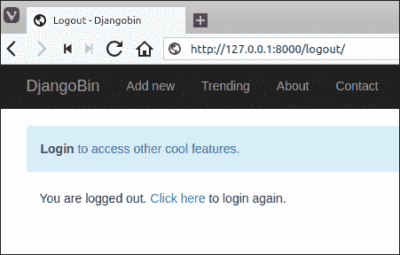

# Django 用户登录和注销

> 原文：<https://overiq.com/django-1-11/django-logging-users-in-and-out/>

最后更新于 2020 年 7 月 27 日

* * *

Django 为登录和注销用户提供了内置的 URL 模式和视图功能。但是在我们将它们添加到我们的项目之前，我们将使用 Django 身份验证框架提供的一些实用功能自行创建登录和注销系统。

## 身份验证()和登录()功能

Django 认证框架(`django.contrib.auth`)提供`authenticate()`和`login()`功能，其工作分别是认证和登录用户。

`authenticate()`函数接受两个关键字参数`username`和`password`，如果`username`和`password`有效，则返回一个类型为`User`的对象。否则返回`None`。

```py
>>>
>>> from django.contrib import auth
>>>
>>> user = auth.authenticate(username='admin', password='passwordd')
>>>
>>> user
<User: admin>
>>>
>>> if user is not None:
...     print("Credentials are valid")
... else:
...     print("Invalid Credentials")
...
Credentials are valid
>>>
>>>

```

`authenticate()`功能只验证提供的凭证是否有效。它不会登录用户。

要登录用户，我们使用`login()`功能。它需要两个参数，`request`对象(`HttpRequest`)和一个`User`对象。它的工作原理是使用[Django 会话框架](/django-1-10/sessions-in-django/)在会话中保存用户标识。

用户一旦登录，应该可以注销，这是`logout()`功能的职责。

## 注销()功能

要注销用户，我们使用`logout()`功能。它接受请求(`HttpRequest`)对象并返回`None`。调用`logout()`功能会完全删除与登录用户相关的会话数据和 cookie。

需要注意的是，如果用户还没有登录，调用`logout()`函数不会抛出任何错误。

现在我们有足够的知识来推出我们自己的登录系统。

## 创建登录系统

在 djangobin app 的`views.py`文件中，在文件末尾添加`login`、`logout`和`user_details`视图，如下所示:

**djangobin/django_project/djangobin/views.py**

```py
#...
from django.core.mail import mail_admins
from django.contrib.auth.models import User
from django.contrib import auth
import datetime
from .forms import SnippetForm, ContactForm
from .models import Language, Snippet, Tag
from .utils import paginate_result

#...

def profile(request):
    #...

def login(request):
    if request.user.is_authenticated():
        return redirect('djangobin:admin')

    if request.method == 'POST':
        username = request.POST.get('username')
        password = request.POST.get('password')
        user = auth.authenticate(username=username, password=password)

        if user is not None:
            # correct username and password login the user
            auth.login(request, user)
            return redirect('djangobin:user_details')

        else:
            messages.error(request, 'Error wrong username/password')

    return render(request, 'djangobin/login.html')

def logout(request):
    auth.logout(request)
    return render(request,'djangobin/logout.html')

def user_details(request):    
    user = get_object_or_404(User, id=request.user.id)    
    return render(request, 'djangobin/user_details.html', {'user': user})

```

然后用下面的代码创建三个模板`login.html`、`logout.html`和`user_details.html`:

**决哥/决哥 _ 项目/决哥/样板/决哥/登录. html**

```py



    Login - {{ block.super }}




    <div class="row">
        <div class="col-lg-6 col-md-6 col-sm-6">

            <h4>Login</h4>
            <hr>

            
                
                    <p class="alert alert-info">{{ message }}</p>
                
            

                <form method="post">

                    

                    <table class="table">
                        <tr>
                            <th><label for="id_username">Username:</label></th>
                            <td><input type="text" name="username" id="id_username" required /></td>
                        </tr>
                        <tr>
                            <th><label for="id_password">Password:</label></th>
                            <td><input type="password" name="password" id="id_password" required /></td>
                        </tr>
                        <tr>
                            <td><input type="hidden" name="next" value=""></td>
                            <td><button type="submit" class="btn btn-primary">Submit</button></td>
                        </tr>
                    </table>

                </form>            
        </div>

        <div class="col-lg-6 col-md-6 col-sm-6">
            <h4>Related Links</h4>
            <p>
                <a href="/password-reset/">Forgot Password?</a> <br>
                <a href="/register/">Create new account.</a> <br>
                <a href="/contact/">Feedback</a>
            </p>
        </div>

    </div>



```

**djangobin/django _ project/djangobin/templates/djangobin/logout . html**

```py



    Logout - {{ block.super }}




    <div class="container">

        <p>You are logged out. <a href="">Click here</a> to login again.</p>

    </div>



```

**djangobin/django _ project/djangobin/templates/djangobin/user _ details . html**

```py



    User Details - {{ block.super }}




    <div class="row">

        <div class="col-lg-6 col-md-6 col-sm-6">

            <h4>Account Details</h4>

            <hr>

            <dl class="dl-horizontal">
                <dt>Username</dt>
                <dd>{{ request.user.username }}</dd>

                <dt>Email</dt>
                <dd>{{ request.user.email }}</dd>

                <dt>Date Joined</dt>
                <dd>{{ request.user.date_joined }}</dd>

                <dt>Last Login</dt>
                <dd>{{ request.user.last_login }}</dd>

                <dt>Snippet created</dt>
                <dd>{{ request.user.profile.get_snippet_count }}</dd>
            </dl>

        </div>

        <div class="col-lg-6 col-md-6 col-sm-6">
            <h4>Related Links</h4>
            <p>
                <a href="">My Pastes</a> <br>
                <a href="">Settings</a> <br>
                <a href="">Change Password.</a> <br>
                <a href="">Logout.</a> <br>
            </p>
        </div>

    </div>



```

这里没有什么特别的，我们只是使用我们在[Django 认证框架基础知识](/django-1-11/django-authentication-framework-basics/#creating-a-user-object)一章中学到的一些属性来获取一些关于登录用户的信息。

在`base.html`文件中添加登录和注销页面的链接，如下所示:

**决哥/决哥 _ project/决哥/样板/决哥/base.html**

```py
{# ... #}
                    
                        <ul class="dropdown-menu">
                            <li><a href="">My Pastes</a></li>
                            <li><a href="">Account Details</a></li>
                            <li><a href="">Settings</a></li>
                            <li role="separator" class="divider"></li>
                            <li><a href="">Logout</a></li>
                        </ul>
                    
                        <ul class="dropdown-menu">
                            <li><a href="">Sign Up</a></li>
                            <li><a href="">Login</a></li>
                        </ul>
                    
                </li>
            </ul>
        </div><!-- /.navbar-collapse -->
    </div><!-- /.container-fluid -->
</nav>

<div class="container">

    <div class="row">

        <div class="col-lg-9 col-md-9">

            
                <p class="alert alert-info">
                    <a href="" class="alert-link">Login</a> to access other cool features.
                </p>
            

            
                {#  override this block in the child template  #}
            

        </div>
{# ... #}

```

最后，在 djangobin 应用的`urls.py`文件中添加以下三种 URL 模式:

**决哥/决哥 _ 项目/决哥/URL . py】**

```py
#...
urlpatterns = [
    #...
    url('^contact/$', views.contact, name='contact'),
    url(r'^login/$', views.login, name='login'),
    url(r'^logout/$', views.logout, name='logout'),
    url(r'^userdetails/$', views.user_details, name='user_details'),
]

```

启动开发服务器，访问`http://127.0.0.1:8000/login/`。你应该得到这样一页:


输入虚假的用户名和密码，您会得到如下错误:


现在输入正确的用户名和密码，您将被重定向到用户详细信息页面:


要注销，请单击页面右侧的注销链接。您应该会看到这样的注销页面:



## 使用内置的登录()和注销()视图

Django 提供了两个内置视图`django.contrib.auth.login()`和`django.contrib.auth.logout()`，分别用于登录和注销用户。

要使用这些视图，请从`django.contrib.auth`包导入它们，并更新`urls.py`文件中的`login`和`logout`网址模式，如下所示:

**决哥/决哥 _ 项目/决哥/URL . py】**

```py
#...
from django.contrib.auth import views as auth_views
from . import views

# app_name = 'djangobin'

urlpatterns = [
    #...
    url(r'^login/$', auth_views.login, name='login'),
    url(r'^logout/$', auth_views.logout, name='logout'),
    url(r'^userdetails/$', views.user_details, name='user_details'),
]

```

保存`urls.py`文件，访问`http://127.0.0.1:8000/login/`。您将获得如下`TemplateDoesNotExist`例外:


问题在于，默认情况下，`django.contrib.auth.login()`视图会寻找一个名为`registration/login.html`的模板。然而，Django 没有提供这个模板，这就是为什么会引发`TemplateDoesNotExist`异常。

另外，请注意模板加载器死后部分。它告诉你 Django 试图找到模板的确切顺序。

我们可以使用`template_name`关键字参数将不同的模板传递给`django.contrib.auth.login()`视图，如下所示:

```py
url(r'^login/$',
    auth_views.login, 
    {'template_name': 'djangobin/login.html'}, 
    name='login'
)

```

同样，默认情况下，`django.contrib.auth.logout()`视图使用管理应用(`django.contrib.admin`)中的`registration/logged_out.html`模板。如果你从 Django 管理网站注销，你会看到同样的模板。

参观`http://127.0.0.1:8000/logout/`自己看看。


就像`django.contrib.auth.login()`视图一样，我们可以通过将`template_name`关键字参数传递给`django.contrib.auth.logout()`视图来使用不同的模板，如下所示:

```py
url(r'^logout/$', 
    auth_views.logout, 
    {'template_name': 'djangobin/logout.html'}, 
    name='logout'
)

```

修改登录和注销网址模式以使用自定义模板，如下所示:

**决哥/决哥 _ 项目/决哥/URL . py】**

```py
#...

urlpatterns = [
    #...
    url(r'^login/$', auth_views.login, {'template_name': 'djangobin/login.html'}, name='login'),
    url(r'^logout/$', auth_views.logout, {'template_name': 'djangobin/logout.html'}, name='logout'),
    url(r'^userdetails/$', views.user_details, name='user_details'),    
]

```

接下来，更新`login.html`模板，使用`django.contrib.auth.login()`提供的`form`模板变量，视图如下:

**决哥/决哥 _ 项目/决哥/样板/决哥/登录. html**

```py



    Login - {{ block.super }}




    <div class="row">
        <div class="col-lg-6 col-md-6 col-sm-6">

            <h4>Login</h4>
            <hr>

            
                
                    <p class="alert alert-info">{{ message }}</p>
                
            

            <form method="post">

                

                <table class="table">
                    {{ form.as_table }}
                    <tr>
                        <td>&nbsp;</td>
                        <td><button type="submit" class="btn btn-primary">Submit</button></td>
                    </tr>
                </table>

            </form>
        </div>

        <div class="col-lg-6 col-md-6 col-sm-6">
            <h4>Related Links</h4>
            <p>
                <a href="/password-reset/">Forgot Password?</a> <br>
                <a href="/register/">Create new account.</a> <br>
                <a href="#">Feedback</a>
            </p>
        </div>

    </div>



```

我们的登录视图几乎准备好了。访问`http://127.0.0.1:8000/login/`并尝试使用错误的用户名和密码登录。你会遇到这样的错误:


请尝试使用正确的用户名和密码再次登录。成功后，您将重定向至`/accounts/profile/`网址。这是`django.contrib.auth.login()`视图的另一个默认行为。


我们在 djangobin 的`urls.py`中没有任何 URL 模式来匹配`/accounts/profile/`的 URL 路径，这就是服务器返回 HTTP 404 错误的原因。

我们可以使用`LOGIN_REDIRECT_URL`设置轻松覆盖这种行为。打开`settings.py`文件，在文件末尾添加`LOGIN_REDIRECT_URL`，如下所示:

**djangobin/django _ project/django _ project/settings . py**

```py
#...
MANAGERS = (
    ('OverIQ', 'manager@overiq.com'),
)

LOGIN_REDIRECT_URL = 'djangobin:index'

```

这将把重定向网址从`/accounts/profile/`改为`/`

我们也可以直接传递网址路径，而不是传递网址模式的名称。

从现在开始，成功登录后，`django.contrib.auth.login()`视图会将用户重定向到`/` URL 路径，而不是`/accounts/profile/`。

但这仍然有一些局限性。例如，假设您正在浏览趋势片段，然后决定登录。登录后，再次重定向到趋势页面而不是`/` URL 更有意义。

要做到这一点，我们可以嵌入一个名为`next`的隐藏字段，其中包含登录后要重定向到的 URL。

当`django.contrib.auth.login()`视图接收到`next`作为开机自检数据时，它会重定向到隐藏的`next`字段中指定的网址。

`django.contrib.auth.login()`视图还提供了一个名为`next`的上下文变量，其中包含用户登录后将被重定向的网址。`next`变量的值可以是`/accounts/profile/`或`LOGIN_REDIRECT_URL`变量中指定的网址。

我们使用如下查询字符串指定`next`字段的值:

`http://127.0.0.1:8000/login/?next=/trending/`

打开`login.html`并添加名为`next`的隐藏字段，如下所示:

**决哥/决哥 _ 项目/决哥/样板/决哥/登录. html**

```py
{# ... #}
            <form method="post">

                

                <table class="table">
                    {{ form.as_table }}
                    <tr>
                        <td><input type="hidden" name="next" value="{{ next }}"></td>
                        <td><button type="submit" class="btn btn-primary">Submit</button></td>
                    </tr>
                </table>

            </form>
{# ... #}

```

以上代码是这样工作的:

如果我们使用`http://localhost:8000/login/`网址访问登录页面，那么登录`django.contrib.auth.login()`后会将用户重定向到`/`网址。另一方面，如果我们访问登录页面，使用`http://127.0.0.1:8000/login/?next=/trending/`网址，那么`django.contrib.auth.login()`视图会将用户重定向到`/trending/`网址。

接下来，修改`base.html`为`next`查询参数提供一个值，如下所示:

**决哥/决哥 _ project/决哥/样板/决哥/base.html**

```py
{# ... #}
<div class="container">

    <div class="row">

        <div class="col-lg-9 col-md-9">

            
                <p class="alert alert-info">
                    <a href="?next={{ request.path }}" class="alert-link">Login</a> to access other cool features.
                </p>
            
{# ... #}

```

让我们测试一下是否一切正常。

如果您已经登录，请先通过直接访问`http://localhost:8000/logout/`网址或点击页面右上角的注销链接注销。

然后，导航至登录页面(`http://localhost:8000/login/`)，输入正确的用户名和密码。成功后，您将被重定向到 djangobin 的索引页面:


再次注销，并通过单击趋势分析片段页面中的“登录”链接再次导航到登录页面。这次登录后，您将被重定向到`/trending/`而不是`/`网址。


## 使用电子邮件和密码登录

如您所见，默认情况下，Django 要求您输入用户名和密码才能登录应用。如果你故意想要这种行为，没关系。然而，为了向您展示如何选择替代路线，我们的 djangobin 应用将使用电子邮件和密码来验证用户。为了完成这项任务，我们将创建一个自定义表单和视图函数。

打开`forms.py`并添加`LoginForm`类，如下所示:

**djangobin/django _ project/djangobin/forms . py**

```py
#...
class ContactForm(forms.Form):
    #...

class LoginForm(forms.Form):
    email = forms.EmailField()
    password = forms.CharField(widget=forms.PasswordInput)

```

接下来，修改`login()`视图功能，使用`LoginForm`如下:

**djangobin/django_project/djangobin/views.py**

```py
#...
from .forms import SnippetForm, ContactForm, LoginForm
#...

def login(request):
    if request.method == 'POST':

        f = LoginForm(request.POST)
        if f.is_valid():

            user = User.objects.filter(email=f.cleaned_data['email'])

            if user:
                user = auth.authenticate(
                    username=user[0].username,
                    password=f.cleaned_data['password'],
                )

                if user:
                    auth.login(request, user)
                    return redirect( request.GET.get('next') or 'djangobin:index' )

            messages.add_message(request, messages.INFO, 'Invalid email/password.')
            return redirect('djangobin:login')

    else:
        f = LoginForm()

    return render(request, 'djangobin/login.html', {'form': f})

```

在第 12 行，我们正在检查与提交的电子邮件相关联的任何用户是否存在。

如果用户存在，在第 15 行，我们使用`authenticate()`功能对其进行认证。请注意，传递给`authenticate()`函数的参数仍然是用户名和密码。

如果认证成功，我们使用`login()`功能登录用户并重定向。

更新`urls.py`文件中的`login`和`logout`网址模式，使用`views.py`文件的`login()`和`logout`功能，如下所示:

**决哥/决哥 _ 项目/决哥/URL . py】**

```py
#...
urlpatterns = [
    #...
    url(r'^login/$', views.login, name='login'),
    url(r'^logout/$', views.logout, name='logout'),
    url(r'^userdetails/$', views.user_details, name='user_details'),
]

```

访问登录页面，输入不正确的电子邮件和密码。您将得到如下错误:


现在，输入正确的电子邮件和密码，您将被重定向到索引页面。

我们的登录和注销系统工作正常，但是从可用性的角度来看，还是有一个问题。

问题是登录表单对登录用户仍然可见。


向登录用户显示登录表单是毫无意义的。要解决该问题，只需在`login()`查看功能开始时检查用户是否登录，如下所示:

**djangobin/django_project/djangobin/views.py**

```py
#...

def login(request):

    if request.user.is_authenticated:
        return redirect('djangobin:profile', username=request.user.username)

    if request.method == 'POST':

        f = LoginForm(request.POST)
        if f.is_valid():

```

如果您现在访问`http://localhost:8000/login/`，登录后，您将被重定向到用户配置文件页面。


目前，用户配置文件页面只显示用户的姓名。我们将对其进行更新，以显示即将到来的课程中的片段列表。

## 限制访问

实现登录系统的关键是防止对管理页面的未授权访问。

限制访问页面的一个简单方法是首先使用`is_authenticated()`方法检查用户是否通过身份验证，然后相应地重定向用户。例如:

```py
def our_view(request):
    if not request.user.is_authenticated():
        return redirect("login")

    return render(request, 'app/view.html')

```

我们可以在每个管理视图功能开始时复制并粘贴这个条件。这是可行的，但 Django 提供了一个更好的方法。

限制页面访问的首选方式是使用`login_required`装饰器。要使用`login_required`装饰器，您必须从`django.contrib.auth.decorators`模块导入它。

让我们更新`user_details`和`logout`视图以使用`login_required`装饰器，如下所示:

**djangobin/django_project/djangobin/views.py**

```py
#...
from django.contrib import auth
from django.contrib.auth.decorators import login_required
import datetime
from .forms import SnippetForm, ContactForm, LoginForm
#...

#...

@login_required
def logout(request):
    auth.logout(request)
    return render(request,'djangobin/logout.html')

@login_required
def user_details(request):
    user = get_object_or_404(User, id=request.user.id)
    return render(request, 'djangobin/user_details.html', {'user': user})

```

以下是`login_required`装饰器的工作原理:

如果用户没有登录，那么它会将用户重定向到`/accounts/login/`(默认登录网址)，将当前绝对网址作为一个值传递给`next`查询参数。另一方面，如果用户登录了，那么`login_required`将什么也不做。

要更改默认登录网址，我们使用`LOGIN_URL`设置。`LOGIN_URL`接受网址路径或网址模式的名称。打开`settings.py`文件，在文件末尾添加以下变量。

**djangobin/django _ project/django _ project/settings . py**

```py
#...

LOGIN_REDIRECT_URL = 'djangobin:index'

LOGIN_URL = 'djangobin:login'

```

这将默认登录从`/accounts/login/`更改为`/login/`。如果您尝试访问应用了`login_required`装饰器的视图，您将被重定向到`/login/`网址，而不是`/accounts/login/`。

要验证更改，请访问`http://localhost:8000/userdetails/`网址，您将被重定向到`http://localhost:8000/login/?next=/userdetails/`。


* * *

* * *