# Django 的用户注册

> 原文：<https://overiq.com/django-1-11/user-registration-in-django/>

最后更新于 2020 年 7 月 27 日

* * *

Django 认证框架(`django.contrib.auth`)提供了一个名为`UserCreationForm`(继承自`ModelForm`类)的表单来处理新用户的创建。它有三个字段，即`username`、`password1`和`password2`(用于密码确认)。要使用`UserCreationForm`，必须首先从`django.contrib.auth.forms`导入，如下所示:

```py
from django.contrib.auth.forms import UserCreationForm

```

不幸的是，Django 没有提供任何视图来处理用户的创建，所以我们必须创建自己的视图。

在 djangobin 应用的`urls.py`文件中，在`urlpatterns`列表的末尾添加一个名为`signup`的 URL 模式。

**决哥/决哥 _ 项目/决哥/URL . py】**

```py
#...
urlpatterns = [
    #...
    url(r'^userdetails/$', views.user_details, name='user_details'),
    url(r'^signup/$', views.signup, name='signup'),
]

```

在 Django 斌的`views.py`中创建一个名为`signup()`的视图函数，如下所示:

**djangobin/django_project/djangobin/views.py**

```py
#...
from django.contrib.auth.decorators import login_required
from django.contrib.auth.forms import UserCreationForm
import datetime
from .forms import SnippetForm, ContactForm, LoginForm
#...

def login(request, **kwargs):
    #...

def signup(request):

    if request.user.is_authenticated:
        return redirect('djangobin:profile', username=request.user.username)

    if request.method == 'POST':
        f = UserCreationForm(request.POST)
        if f.is_valid():
            f.save()
            messages.success(request, 'Account created successfully')
            return redirect('signup')

    else:
        f = UserCreationForm()

    return render(request, 'djangobin/signup.html', {'form': f})

```

接下来，在`templates`目录中创建新模板`signup.html`，代码如下:

**决哥/决哥 _ project/决哥/样板/决哥/signup.html】**

```py



    Sign Up - {{ block.super }}




    <div class="row">
        <div class="col-lg-6 col-md-6 col-sm-6">
            <h4>Sign Up</h4>
            <hr>
            
                
                    <p class="alert alert-info">{{ message }}</p>
                
            

            <form method="post">

                

                <table class="table">
                    {{ form.as_table }}
                    <tr>
                        <td><input type="hidden" name="next" value="{{ next }}"></td>
                        <td><button type="submit" class="btn btn-primary">Submit</button></td>
                    </tr>
                </table>

            </form>
        </div>

        <div class="col-lg-6 col-md-6 col-sm-6">
            <h4>Related Links</h4>
            <p>
                <a href="/reset-password/">Forgot Password?</a> <br>
                <a href="">Login.</a> <br>
            </p>
        </div>

    </div>



```

在`base.html`模板中添加注册页面链接，如下所示:

**决哥/决哥 _ project/决哥/样板/决哥/base.html**

```py
{# ... #}
                    
                        <ul class="dropdown-menu">
                            <li><a href="">My Pastes</a></li>
                            <li><a href="">Account Details</a></li>
                            <li><a href="">Settings</a></li>
                            <li role="separator" class="divider"></li>
                            <li><a href="">Logout</a></li>
                        </ul>
                    
                        <ul class="dropdown-menu">
                            <li><a href="">Sign Up</a></li>
                            <li><a href="?next={{ request.path }}">Login</a></li>
                        </ul>
                    
{# ... #}

```

打开浏览器，导航至`http://127.0.0.1:8000/signup/`。你应该看到这样的注册页面。

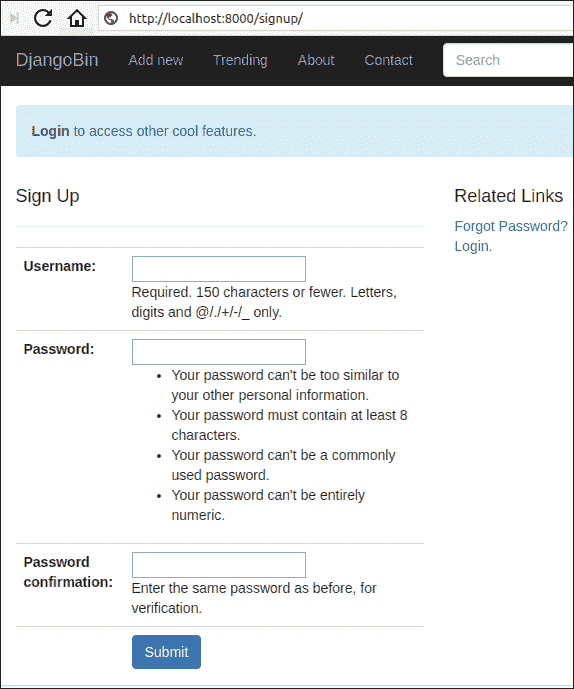

通过输入用户名和密码创建新用户。成功后，您将收到“帐户创建成功”的消息。

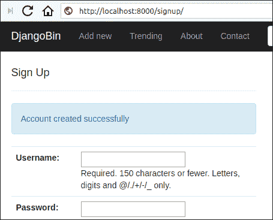

如果输入的用户名已经存在或密码不匹配，则表单将显示如下错误:

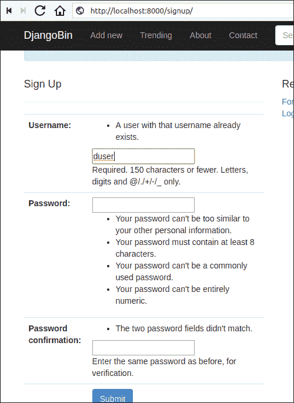

使用`UserCreationForm`创建的用户将`is_superuser`、`is_staff`属性设置为`False`，但`is_active`设置为`True`，这意味着这些用户无法登录 Django 管理网站。

另一点要记住的是，每次我们创建一个新的`User`对象时，一个相关的`Author`实例将被自动创建。这是因为来自`User`模型的`post_save`信号触发了在`models.py`文件中定义的`create_author()`功能的执行。

`UserCreationForm`唯一的缺点就是没有`email`场。因此，我们无法使用它发送电子邮件验证来验证帐户。

大多数情况下，用户注册包括以下步骤:

1.  用户填写登记表并点击提交。
2.  该网站向提交的电子邮件发送电子邮件验证链接。
3.  用户点击激活链接验证帐户。

此时，我们有两个选择:

1.  扩展`UserCreationForm`以包括电子邮件字段和电子邮件验证功能。
2.  从头开始创建全新的用户注册表单。

[在 Django 1.10 系列](/django-1-10/django-creating-users-using-usercreationform/)中，我们已经看到了如何从头开始创建登记表。因此，在本系列中，我们将采用另一种方法。

## 扩展用户创建表单

打开 djangobin 的`forms.py`并在文件末尾添加`CreateUserForm`，如下所示:

**djangobin/django _ project/djangobin/forms . py**

```py
#...
from django.core.exceptions import ValidationError
from django.contrib.auth.models import User
from django.contrib.auth.forms import UserCreationForm
from django.contrib.auth.tokens import default_token_generator
from django.utils.encoding import force_bytes
from django.utils.http import urlsafe_base64_encode
from django.conf import settings
from django.template.loader import render_to_string
from django.core.mail import send_mail
from .models import Snippet, Language, Author, Tag
from .utils import Preference, get_current_user

#...

class CreateUserForm(UserCreationForm):
    class Meta:
        model = User
        fields = ('username', 'email', 'password1', 'password2')

    def clean_email(self):
        email = self.cleaned_data['email']
        if not email:
            raise ValidationError("This field is required.")
        if User.objects.filter(email=self.cleaned_data['email']).count():
            raise ValidationError("Email is taken.")
        return self.cleaned_data['email']

    def save(self, request):

        user = super(CreateUserForm, self).save(commit=False)
        user.is_active = False
        user.save()

        context = {
            # 'from_email': settings.DEFAULT_FROM_EMAIL,
            'request': request,
            'protocol': request.scheme,
            'username': self.cleaned_data.get('username'),
            'domain': request.META['HTTP_HOST'],
            'uid': urlsafe_base64_encode(force_bytes(user.pk)),
            'token': default_token_generator.make_token(user),
        }

        subject = render_to_string('djangobin/email/activation_subject.txt', context)
        email = render_to_string('djangobin/email/activation_email.txt', context)

        send_mail(subject, email, settings.DEFAULT_FROM_EMAIL, [user.email])

        return user

```

创建自定义登记表的第一步是创建一个继承自`UserCreationForm`类的类。

在第 19 行，我们指定要在表单中显示的模型字段。

在第 21-27 行中，我们为电子邮件字段定义了一种清理方法。此方法确保用户必须提供唯一的电子邮件 id。

最后，在第 29-50 行，我们覆盖了`UserCreationForm`的`save()`方法。`save()`方法做两件事:将`is_active`属性设置为`False`后，将用户保存到数据库中(这样账户就不能用来登录)，并向用户邮箱发送邮件验证。

要发送电子邮件，我们使用内置的`send_mail()`功能。

电子邮件正文和主题的代码存储在 djangobin 的`templates/djangobin`目录下的`email`子目录中。

**djangobin/django _ project/djangobin/templates/djangobin/email/activation _ subject . txt**

```py
Action Required to Complete the Account Creation - djangobin

```

**djangobin/django _ project/djangobin/templates/djangobin/email/activation _ email . txt**

```py
Hello {{ username }}!

To confirm your registration, visit the following link:

{{ protocol }}://{{ domain }}

Welcome to Djanagobin!

```

在第 45-46 行，我们使用了一个名为`render_to_string()`的新函数。`render_to_string()`函数加载模板，渲染它并返回结果字符串。

我们在第 35-43 行定义的`context`变量包含我们的模板将使用的数据。

这里有两个重要的信息:

1.  用户界面设计（User Interface Design 的缩写）
2.  代币

我们使用这两条信息来创建激活链接，该链接将被发送到用户的电子邮件中。

`uid`是编码在 base 64 中的用户主键，令牌是使用用户相关数据和当前时间戳创建的哈希值。令牌用于检查激活方式是否有效。默认情况下，令牌仅在 3 天内有效。

我们在激活链接中包含了用户主键的编码版本，这样激活功能就可以确定它需要激活的用户。

为了从用户的主键创建基本 64 值，我们使用`urlsafe_base64_encode()`函数。它接受字节串并返回一个以 64 为基数的值。要将整数转换为字节串，我们使用`force_bytes()`函数(第 41 行)。

为了生成令牌，Django 提供了一个名为`PasswordResetTokenGenerator`的类。

这个类有两种方法:

1.  `make_token(user)`
2.  `check_token(user, token)`

`make_token()`接受用户，并基于用户相关数据返回令牌(第 42 行)。令牌是这样的:

```py
4vf-8544d0407636ec564e5b

```

完整的验证链接如下所示:

```py
http://example.com/MQ/4vf-8544d0407636ec564e5b/

```

其中`MQ`指的是编码在 base 64 中的用户主键。

现在你知道激活是如何产生的了。让我们看看当用户点击链接时会发生什么。

激活账户的第一步是在 base 64 中解码用户的主键(在上面的 URL 中为`MQ`)。为此，我们使用`urlsafe_base64_decode()`功能。该函数返回字节串，因此我们使用`force_bytes()`函数将字节串转换为字符串。

一旦我们有了主键，我们就从数据库中获取关联的对象，并调用`check_token()`来验证令牌是否有效。

如果令牌有效，我们将`is_active`属性设置为`True`，并将用户重定向到登录页面。另一方面，如果令牌无效，我们会向用户显示一条无效令牌错误消息。

打开`views.py`并修改`signup()`查看功能，使用`CreateUserForm`如下:

**djangobin/django_project/djangobin/views.py**

```py
#...
import datetime
from .forms import SnippetForm, ContactForm, LoginForm, CreateUserForm
from .models import Language, Snippet, Tag
from .utils import paginate_result
#...

def signup(request):
    if request.method == 'POST':
        f = CreateUserForm(request.POST)
        if f.is_valid():
            f.save(request)
            messages.success(request, 'Account created successfully. Check email to verify the account.')
            return redirect('djangobin:signup')

    else:
        f = CreateUserForm()

    return render(request, 'djangobin/signup.html', {'form': f})

```

激活用户的查看功能称为`activate_account()`，在`signup()`查看功能的正下方定义:

**djangobin/django_project/djangobin/views.py**

```py
#...
import datetime
from django.contrib.auth.tokens import default_token_generator
from django.utils.encoding import force_bytes, force_text
from django.utils.http import urlsafe_base64_encode, urlsafe_base64_decode
from .forms import SnippetForm, ContactForm, LoginForm, CreateUserForm
#...

#...

def signup(request):
    #...

def activate_account(request, uidb64, token):
    try:
        uid = force_text(urlsafe_base64_decode(uidb64))
        user = User.objects.get(pk=uid)
    except (TypeError, ValueError, OverflowError, User.DoesNotExist):
        user = None
    if (user is not None and default_token_generator.check_token(user, token)):
        user.is_active = True
        user.save()
        messages.add_message(request, messages.INFO, 'Account activated. Please login.')
    else:
        messages.add_message(request, messages.INFO, 'Link Expired. Contact admin to activate your account.')

    return redirect('djangobin:login')

```

在 djangobin 的`urls.py`文件中，添加一个新的网址模式来激活帐户，如下所示:

**决哥/决哥 _ 项目/决哥/URL . py】**

```py
#...
urlpatterns = [
    #...
    url(r'^userdetails/$', views.user_details, name='user_details'),
    url(r'^signup/$', views.signup, name='signup'),
    url(r'^activate/'
        r'(?P<uidb64>[0-9A-Za-z_\-]+)/'
        r'(?P<token>[0-9A-Za-z]{1,13}'
        r'-[0-9A-Za-z]{1,20})/$',
        views.activate_account, name='activate'),
]

```

现在，打开浏览器，导航至`http://localhost:8000/signup/`。在所有字段中输入数据，然后点击提交。

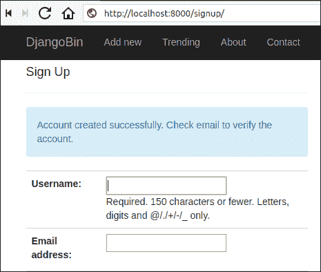

在 shell 中，运行服务器时，您会收到一封如下所示的验证电子邮件:

```py
[11/May/2018 11:27:31] "GET /signup/ HTTP/1.1" 200 10594
Content-Type: text/plain; charset="utf-8"
MIME-Version: 1.0
Content-Transfer-Encoding: 7bit
Subject: Action Required to Complete the Account Creation - djangobin
From: infooveriq@gmail.com
To: django@example.com
Date: Fri, 11 May 2018 11:27:53 -0000
Message-ID: <20180511112753.25336.4090@pc>

Hello django!

To confirm your registration, visit the following link:

http://localhost:8000/activate/MTM/4w3-81e3511bd45dc04e8ba9/

Welcome to Djanagobin!
-------------------------------------------------------------------------------

```

要激活帐户，请复制验证链接并将其粘贴到浏览器地址栏中。成功后，您将被重定向到登录页面:


如果链接过期或被篡改，那么会看到以下错误。

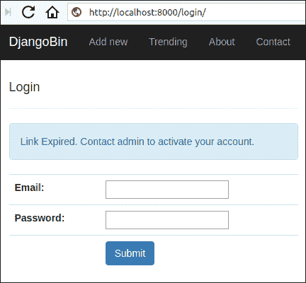

## 重置密码

让我们承认，偶尔，每个人都会忘记自己的密码。重置密码涉及使用以下四个内置视图功能:

*   `password_reset()`
*   `password_reset_done()`
*   `password_reset_confirm()`
*   `password_reset_complete()`

以下是重置密码的工作流程:

1.  `password_reset()`视图显示允许用户输入电子邮件的表单，并将密码重置链接发送到用户的电子邮件。

2.  `password_reset_done()`视图显示一个页面，其中包含如何重置密码的说明，如打开电子邮件、单击链接、在垃圾邮件中查找电子邮件等。该视图在`password_reset()`视图工作完成后立即调用。请注意，无论在步骤 1 中输入的电子邮件是否存在于数据库中，该视图都将始终被调用。这可以防止潜在的攻击者知道数据库中是否存在电子邮件。

3.  当用户访问发送到电子邮件的密码重置链接时，会调用`password_reset_confirm()`。它显示了一个输入新密码的表单。

4.  最后调用`password_reset_complete()`视图通知用户密码已经更改。

下表列出了这些视图函数使用的默认模板:

| 视角 | 模板 |
| --- | --- |
| `password_reset()` | 注册/密码重置 _form.html，注册/密码重置 _email.html，注册/密码重置 _subject.txt |
| `password_reset_done()` | 注册/密码重置 _ 完成. html |
| `password_reset_confirm()` | 注册/密码重置确认. html |
| `password_reset_complete()` | 注册/密码重置确认. html |

这些模板存储在`django.contrib.admin`应用的`templates`目录中。

所有这些模板的外观和感觉都非常类似于 Django 管理网站。因此，它们不适合我们的项目。

那么我们如何覆盖默认模板呢？

如果你在`django/contrib/auth/views.py`中检查视图函数的签名，你会发现它们每个都接受一个名为`template_name`的参数。

**django/contib/auth/views . py**

```py
def password_reset(request,
                   template_name='registration/password_reset_form.html',
                   email_template_name='registration/password_reset_email.html',
                   subject_template_name='registration/password_reset_subject.txt',
                   password_reset_form=PasswordResetForm,
                   #...):

def password_reset_done(request,
                        template_name='registration/password_reset_done.html',
                        extra_context=None):                   

def password_reset_confirm(request, uidb64=None, token=None,
                           template_name='registration/password_reset_confirm.html',
                           token_generator=default_token_generator,
                           #...):

def password_reset_complete(request,
                            template_name='registration/password_reset_complete.html',
                            extra_context=None):

```

我们还将覆盖用于创建电子邮件的默认模板。如果你密切关注`password_reset()`签名，你会发现感兴趣的论点是:`email_template_name`和`subject_template_name`。

打开`urls.py`文件，在列表末尾添加以下 4 个网址模式:

**决哥/决哥 _ 项目/决哥/URL . py】**

```py
#...
urlpatterns = [
    #...
    url(r'^activate/'
        r'(?P<uidb64>[0-9A-Za-z_\-]+)/'
        r'(?P<token>[0-9A-Za-z]{1,13}'
        r'-[0-9A-Za-z]{1,20})/$',
        views.activate_account, name='activate'),

    # password reset URLs

    url('^password-reset/$', auth_views.password_reset,
        {'template_name': 'djangobin/password_reset.html',
         'email_template_name': 'djangobin/email/password_reset_email.txt',
         'subject_template_name': 'djangobin/email/password_reset_subject.txt',
         'post_reset_redirect': 'djangobin:password_reset_done',
        },
        name='password_reset'),

    url('^password-reset-done/$', auth_views.password_reset_done,
        {'template_name': 'djangobin/password_reset_done.html',},
        name='password_reset_done'),

    url(r'^password-confirm/'
        r'(?P<uidb64>[0-9A-Za-z_\-]+)/'
        r'(?P<token>[0-9A-Za-z]{1,13}'
        r'-[0-9A-Za-z]{1,20})/$',
        auth_views.password_reset_confirm,
        {'template_name': 'djangobin/password_reset_confirm.html',
         'post_reset_redirect': 'djangobin:password_reset_complete'},
        name='password_reset_confirm'),

    url(r'password-reset-complete/$',
        auth_views.password_reset_complete,
        {'template_name':
             'djangobin/password_reset_complete.html'},
        name='password_reset_complete'),
    ]

```

这里有几件事需要注意:

*   `password_reset`和`password_reset_confirm`网址模式中的`post_reset_redirect`参数指定了在视图完成工作后要重定向的网址。

*   就像`activate_account()`视图一样`password_reset_confirm()`也以`uidb64`(在 base 64 中编码的用户 id)和`token`作为参数。像往常一样，`password_reset_confirm()`视图解码`uidb64`中的值，以知道它正在为用户重置密码。令牌用于检查密码重置链接是否有效。

用于重置密码的模板代码如下:

**djangobin/django _ project/djangobin/templates/djangobin/password _ reset . html**

```py



    Password Reset - {{ block.super }}




    <div class="row">
        <div class="col-lg-6 col-md-6 col-sm-6">
            <h4>Password Reset</h4>
            <hr>
            
                
                    <p class="alert alert-info">{{ message }}</p>
                
            

            <form method="post">

                

                <table class="table">
                    {{ form.as_table }}
                    <tr>
                        <td><input type="hidden" name="next" value="{{ next }}"></td>
                        <td><button type="submit" class="btn btn-primary">Submit</button></td>
                    </tr>
                </table>

            </form>
        </div>

        <div class="col-lg-6 col-md-6 col-sm-6">
            <h4>Related Links</h4>
            <p>
                <a href="">Sign Up</a> <br>
                <a href="">Login.</a> <br>
            </p>
        </div>

    </div>



```

**djangobin/django _ project/djangobin/templates/djangobin/email/password _ reset _ email . txt**

```py
Hello {{ user.email }}!

We've received a request to reset {{ user.get_username }}'s password.

If you would like to reset the password, visit the following link:

{{ protocol }}://{{ domain }}

If you did not request a password reset, please disregard this mail.

~ Djangobin

```

**djangobin/django _ project/djangobin/templates/djangobin/email/password _ reset _ subject . txt**

```py
Password Reset Request - Djangobin

```

**djangobin/django _ project/djangobin/templates/djangobin/password _ reset _ done . html**

```py







    <div class="row">

        <div class="col-lg-6 col-md-6 col-sm-6">
            <h4>Email Sent</h4>
            <hr>
            <p>Password reset link is sent to your email.</p>
        </div>

        <div class="col-lg-6 col-md-6 col-sm-6">
            <h4>Related Links</h4>
            <p>
                <a href="">Forgot Password?</a> <br>
                <a href="">Sign Up.</a> <br>
                <a href="#">Feedback</a>
            </p>
        </div>

    </div>



```

**djangobin/django _ project/djangobin/templates/djangobin/password _ reset _ confirm . html**

```py







    <div class="row">

        <div class="col-lg-6 col-md-6 col-sm-6">

            <h4>Enter your new password.</h4>
            <hr>
            
                <form action="" method="post">
                    <table>
                        
                        {{ form.as_table }}
                        <tr>
                            <td></td>
                            <td><button type="submit" class="btn btn-primary">Reset Password</button></td>
                        </tr>
                    </table>
                </form>
            
                <p>This Link is no longer valid. Click <a href="">here</a> to create a new one.</p>
            

        </div>

        <div class="col-lg-6 col-md-6 col-sm-6">
            <h4>Related Links</h4>
            <p>
                <a href="">Forgot Password?</a> <br>
                <a href="">Sign Up.</a> <br>
                <a href="#">Feedback</a>
            </p>
        </div>

    </div>



```

**djangobin/django _ project/djangobin/templates/djangobin/password _ reset _ complete . html**

```py







    <div class="row">

        <div class="col-lg-6 col-md-6 col-sm-6">

            <h4>Password Reset Success</h4>

            <hr>

            <div class="db-form">

                <p>Your password has been reset. Click <a href="">here</a> to login.</p>

            </div>
        </div>

        <div class="col-lg-6 col-md-6 col-sm-6">
            <h4>Related Links</h4>
            <p>
                <a href="">Forgot Password?</a> <br>
                <a href="">Sign Up.</a>
                <a href="#">Feedback</a>
            </p>
        </div>

    </div>



```

打开浏览器，导航至`http://localhost:8000/password-reset/`。您将看到一个密码重置页面，要求您发送如下电子邮件:

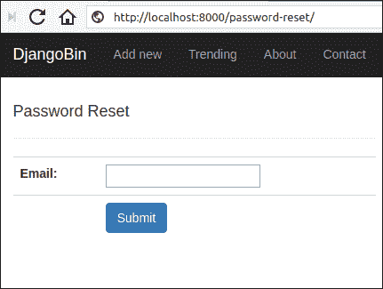

输入有效的电子邮件并点击提交。您将被带到`http://localhost:8000/password-reset-done/`网址，如下所示:


如果输入的电子邮件存在于数据库中，那么您应该会在 shell 中看到以下输出。

```py
[11/May/2018 13:07:33] "GET /password-reset/ HTTP/1.1" 200 9524
Content-Type: text/plain; charset="utf-8"
MIME-Version: 1.0
Content-Transfer-Encoding: 7bit
Subject: Password Reset Request - Djangobin
From: infooveriq@gmail.com
To: noisyboy@mail.com
Date: Fri, 11 May 2018 13:14:49 -0000
Message-ID: <20180511131449.29374.83844@pc>

Hello noisyboy@mail.com!

We've received a request to reset noisyboy's password.

If you would like to reset the password, visit the following link:

http://localhost:8000/password-confirm/Mg/4w3-32c4a6bf60ae7b9dee77/

If you did not request a password reset, please disregard this mail.

~ Djangobin
-------------------------------------------------------------------------------

```

复制链接并将其粘贴到浏览器地址栏中。您将收到一份输入新密码的表格。

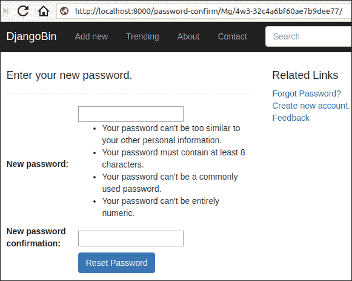

输入新密码，然后按回车键。最后，你会得到这样的成功信息:

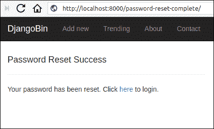

需要注意的是，密码重置链接仅在 3 天内有效。要延长链接的有效性，请使用`PASSWORD_RESET_TIMEOUT_DAYS`设置。

此外，密码重置链接在密码重置成功后会自动过期。尝试访问过期、被篡改或已被使用的密码重置链接将导致以下错误:

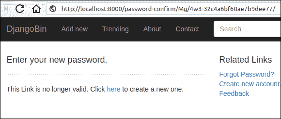

## 密码更改器

在本节中，我们将创建一个表单，允许登录用户更改他们的密码。

就像密码重置一样，Django 提供了以下两个内置视图来处理密码更改:

1.  `password_change`
2.  `password_change_done`

`password_change`视图显示一个表单，允许登录用户在输入旧密码后更改用户密码。

用户更改密码后，`password_change_done`视图显示成功消息。

这两个视图都有密码保护，因此您必须先登录才能访问它们。

默认情况下，`password_change()`和`password_change_done()`分别使用 Django 管理应用(`django.contrib.admin`)中的`password_change_form.html`和`password_change_done.html`模板。我们可以通过使用`template_name`关键字参数来覆盖这个行为。

打开`urls.py`文件，在列表末尾添加以下两个网址模式:

**决哥/决哥 _ 项目/决哥/URL . py】**

```py
#...
urlpatterns = [
    #...

    # password change URLs

    url(r'^password-change/$', auth_views.password_change,
        {'template_name': 'djangobin/password_change.html',
        'post_change_redirect': 'djangobin:password_change_done'},
        name='password_change'
        ),

    url(r'^password-change-done/$', auth_views.password_change_done,
        {'template_name': 'djangobin/password_change_done.html'},
        name='password_change_done'
        ),
    ]

```

在`templates`目录中创建新模板`password_change.html`和`password_change_done.html`，代码如下:

**djangobin/django _ project/djangobin/templates/djangobin/password _ change . html**

```py



    Password Change - {{ block.super }}




    <div class="row">

        <div class="col-lg-6 col-md-6 col-sm-6">

            <h4>Password change</h4>
            <hr>

            <form action="" method="post" class="form-horizontal" >
                

                 <table class="table">
                    {{ form.as_table }}
                    <tr>
                        <td>&nbsp;</td>
                        <td><button type="submit" class="btn btn-primary">Submit</button></td>
                    </tr>
                </table>

            </form>

        </div>

        <div class="col-lg-6 col-md-6 col-sm-6">
            <h4>Related Links</h4>
            <p>
                <a href="">My Pastes</a> <br>
                <a href="">Account Details</a> <br>
                <a href="">Settings</a> <br>
                <a href="">Feedback</a>
            </p>
        </div>

    </div>



```

**djangobin/django _ project/djangobin/templates/djangobin/password _ change _ done . html**

```py



    Password Change Done - {{ block.super }}




    <div class="row">

        <div class="col-lg-6 col-md-6 col-sm-6">

            <h4>Password change successful</h4>
            <hr>

            <p>Your password was changed.</p>

        </div>

        <div class="col-lg-6 col-md-6 col-sm-6">
            <h4>Related Links</h4>
            <p>
                <a href="">My Pastes</a> <br>
                <a href="">Account Details</a> <br>
                <a href="">Settings</a> <br>
                <a href="">Feedback</a>
            </p>
        </div>

    </div>



```

现在，打开浏览器，导航至`http://localhost:8000/password-change/`。您应该会看到这样的密码更改页面:

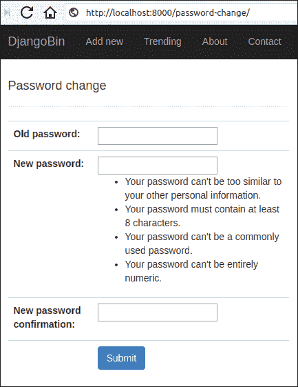

更改您的密码，成功后，您将获得如下页面:

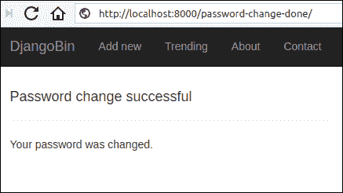

* * *

* * *