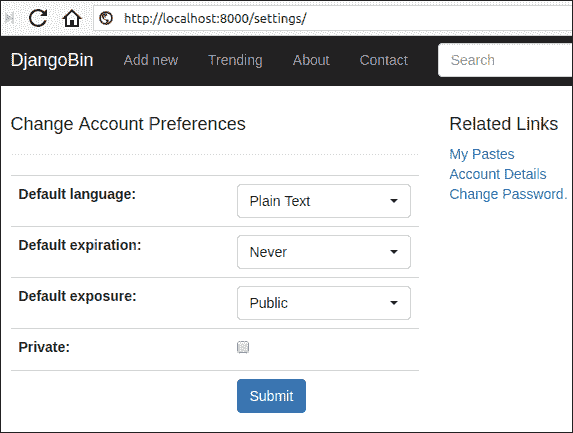
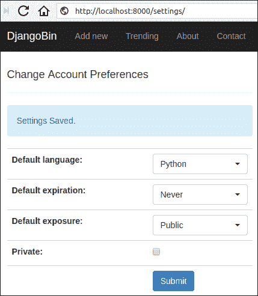
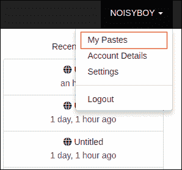
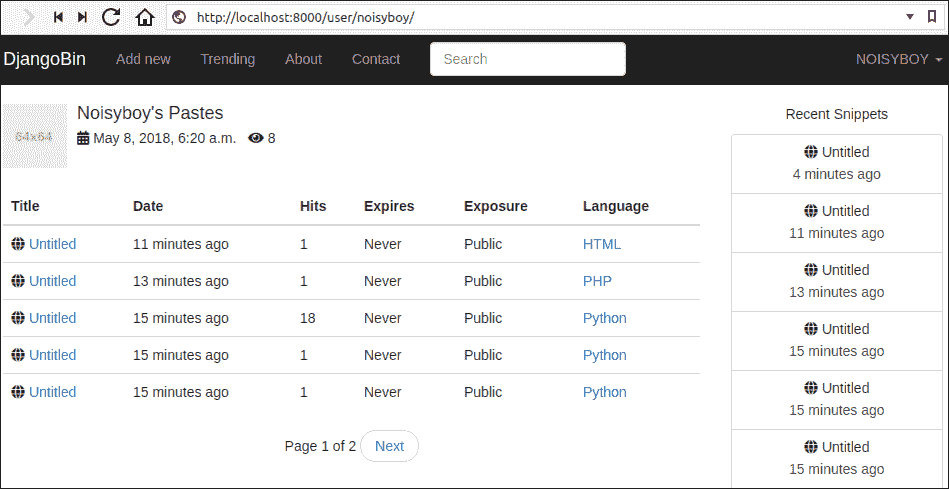
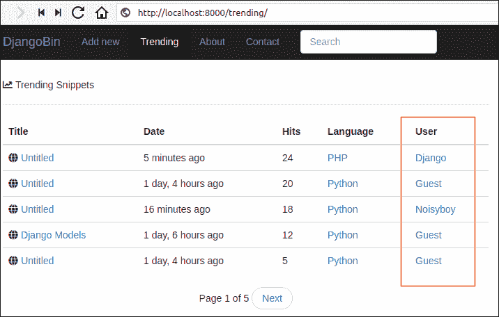
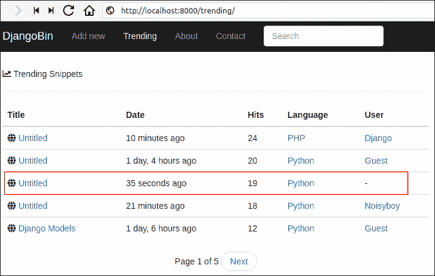
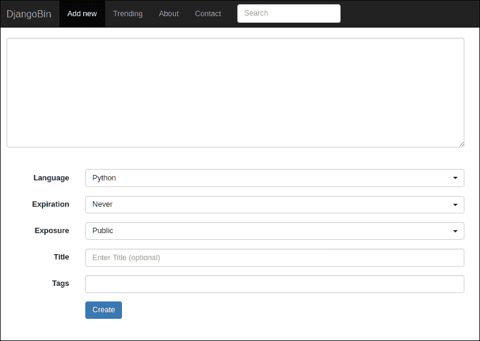
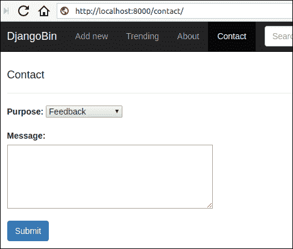

# 为 Djangobin 构建配置文件页面

> 原文：<https://overiq.com/django-1-11/building-profile-pages-for-djangobin/>

最后更新于 2020 年 7 月 27 日

* * *

## 创建设置视图

设置视图将允许登录用户更改首选项，如默认语言、过期和暴露。它还允许用户更改配置文件可见性选项。

概要视图(我们接下来将创建)以相反的时间顺序(即最新的第一个)显示了用户创建的代码片段的分页列表。默认情况下，配置文件页面是公共的。

所有这些设置都是由`Author`模型定义的。以下是它的外观，供您参考:

**djangobin/django _ project/djangobin/models . py**

```py
#...
class Author(models.Model):
    user = models.OneToOneField(User, related_name='profile')
    default_language = models.ForeignKey(Language, on_delete=models.CASCADE,
                                         default=get_default_language)
    default_exposure = models.CharField(max_length=10, choices=Pref.exposure_choices,
                                        default=Pref.SNIPPET_EXPOSURE_PUBLIC)
    default_expiration = models.CharField(max_length=10, choices=Pref.expiration_choices,
                                        default=Pref.SNIPPET_EXPIRE_NEVER)
    private = models.BooleanField(default=False)
    views = models.IntegerField(default=0)
    #...

```

让我们从在`forms.py`中添加名为`SettingForm`的类开始，如下所示:

**djangobin/django _ project/djangobin/forms . py**

```py
#...
class SettingForm(forms.ModelForm):    

    class Meta:
        model = Author
        fields = ('default_language', 'default_expiration' , 'default_exposure' , 'private')
        widgets = {
            'default_language': forms.Select(attrs={'class': 'selectpicker foo form-control',
                                                    'data-live-search': 'true',
                                                    'data-size': '5'}),
            'default_expiration': forms.Select(attrs={'class': 'selectpicker form-control'}),
            'default_exposure': forms.Select(attrs={'class': 'selectpicker form-control'})

        }

```

在`views.py`中，在`activate_account()`视图的正下方添加`settings()`视图，如下所示:

**djangobin/django_project/djangobin/views.py**

```py
#...
from .forms import SnippetForm, ContactForm, LoginForm, CreateUserForm, SettingForm
#...

@login_required
def settings(request):
    user = get_object_or_404(User, id=request.user.id)
    if request.method == 'POST':
        f = SettingForm(request.POST, instance=user.profile)
        if f.is_valid():
            f.save()
            messages.add_message(request, messages.INFO, 'Settings Saved.')
            return redirect(reverse('djangobin:settings'))

    else:
        f = SettingForm(instance=user.profile)

    return render(request, 'djangobin/settings.html', {'form': f})

```

`settings.html`模板的代码如下:

**djangobin/django _ project/djangobin/templates/djangobin/settings . html**

```py






    Account Preferences - {{ block.super }}




    <div class="row">

        <div class="col-lg-6 col-md-6 col-sm-6">

            <h4>Change Account Preferences</h4>

            <hr>

            
                
                    <p class="alert alert-info">{{ message }}</p>
                
            

            <form action="" method="post" class="form-horizontal" >
                

                <table class="table">
                    {{ form.as_table }}
                    <tr>
                        <td>&nbsp;</td>
                        <td><button type="submit" class="btn btn-primary">Submit</button></td>
                    </tr>
                </table>

            </form>

        </div>

        <div class="col-lg-6 col-md-6 col-sm-6">
            <h4>Related Links</h4>
            <p>
                <a href="">My Pastes</a> <br>
                <a href="">Account Details</a> <br>
                <a href="/password-change/">Change Password.</a> <br>
            </p>
        </div>

    </div>



```

将名为`settings`的新网址模式添加到`urls.py`中，如下所示:

**决哥/决哥 _ 项目/决哥/URL . py】**

```py
#...
urlpatterns = [
    #...
    url(r'password-reset-complete/$',
        auth_views.password_reset_complete,
        {'template_name':'djangobin/password_reset_complete.html'},
        name='password_reset_complete'),

    url('^settings/$', views.settings, name='settings'),
]

```

最后，将设置页面的链接添加到`base.html`，如下所示:

**决哥/决哥 _ project/决哥/样板/决哥/base.html**

```py
{# ... #}
                    
                        <ul class="dropdown-menu">
                            <li><a href="">My Pastes</a></li>
                            <li><a href="">Account Details</a></li>
                            <li><a href="">Settings</a></li>
                            <li role="separator" class="divider"></li>
                            <li><a href="">Logout</a></li>
                        </ul>
                    
                        <ul class="dropdown-menu">
                            <li><a href="">Sign Up</a></li>
                            <li><a href="?next={{ request.path }}">Login</a></li>
                        </ul>
                    
{# ... #}

```

登录 Djangobin，访问`http://localhost:8000/settings/`。您应该会看到“帐户首选项”页面，如下所示:



选择所需的首选项，然后点击提交。您应该会看到如下消息:



## 创建纵断面图

概要视图以相反的时间顺序(即最新的第一个)显示用户创建的代码片段的分页列表。如果用户的配置文件是私有的，那么它的用户名将不会出现在趋势代码片段页面和标签列表页面中。

打开`views.py`并更新`profile()`查看功能如下:

**djangobin/django_project/djangobin/views.py**

```py
from django.shortcuts import (HttpResponse, render, redirect,
                        get_object_or_404, reverse, get_list_or_404, Http404)
#...

def profile(request, username):
    user = get_object_or_404(User, username=username)

    # if the profile is private and logged in user is not same as the user being viewed,
    # show 404 error
    if user.profile.private and request.user.username != user.username:
        raise Http404

    # if the profile is not private and logged in user is not same as the user being viewed,
    # then only show public snippets of the user
    elif not user.profile.private and request.user.username != user.username:
        snippet_list = user.snippet_set.filter(exposure='public')
        user.profile.views += 1
        user.profile.save()

    # logged in user is same as the user being viewed
    # show everything
    else:
        snippet_list = user.snippet_set.all()

    snippets = paginate_result(request, snippet_list, 5)

    return render(request, 'djangobin/profile.html',
                  {'user' : user, 'snippets' : snippets } )

```

视图功能是这样工作的:

1.  该视图接受一个名为`username`的额外参数，该参数将来自网址。

2.  在第 7 行，我们使用`get_object_or_404()`获取相关的`User`对象。如果没有找到匹配的对象，`get_object_or_404()`将返回一个 HTTP 404 错误。

3.  在第 11 行，我们正在检查配置文件是否是私有的，并且登录的用户是否与正在查看的用户相同。如果条件为真，我们显示一个 HTTP 404 错误；否则，程序控制转移到第 16 行的 elif 语句。

4.  在第 16 行，我们正在检查配置文件是否不是私有的，并且登录的用户是否与正在查看的用户不同。如果条件为真，我们检索用户的公共片段，并将概要视图计数增加 1；否则，程序控制转移到第 23 行的 else 语句。

5.  如果程序控制进入 else 语句，那么这意味着登录的用户与正在查看的用户相同。结果，我们获取了用户的所有片段。

6.  在第 26 行，我们调用`paginate_result()`来获取分页结果。最后，在第 28 行，我们通过调用`render()`函数来渲染带有上下文数据的模板。

`profile.html`的代码如下:

**djangobin/django _ project/djangobin/templates/djangobin/profile . html**

```py







    <div class="media post-meta">
        <div class="media-left">
            <a href="#">
                
            </a>
        </div>
        <div class="media-body">
            <h4 class="media-heading">{{ user.username|capfirst }}'s Pastes</h4>
            <p>
                <i class="fas fa-calendar-alt" data-toggle="tooltip" title="" data-original-title="Account creation date" ></i> {{ user.date_joined }} &nbsp;
                <i class="fas fa-eye" data-toggle="tooltip" title="" data-original-title="Visits to this page"></i> {{ user.profile.views }} &nbsp;
            </p>
        </div>
    </div>

    <table class="table">
        <thead>
        <tr>
            <th>Title</th>
            <th>Date</th>
            <th>Hits</th>
            <th class="hidden-md">Expires</th>
            <th class="hidden-md">Exposure</th>
            <th class="hidden-md">Language</th>
        </tr>
        </thead>
        <tbody>
        
            <tr>
                <td><i class="fas fa-globe"></i>
                    <a href="{{ snippet.get_absolute_url }}">{{ snippet.title|default:"Untitled" }}</a>
                </td>
                <td title="{{ snippet.created_on }}">{{ snippet.created_on|naturaltime }}</td>
                <td>{{ snippet.hits }}</td>
                <td>{{ snippet.expiration|capfirst }}</td>
                <td>{{ snippet.exposure|capfirst }}</td>
                <td><a href="{{ snippet.language.get_absolute_url }}">{{ snippet.language }}</a></td>
            </tr>
        
        </tbody>
    </table>

    {#  display pagination links  #}
    
        <nav aria-label="...">
            <ul class="pager">

                <li>Page {{ snippets.number }} of {{ snippets.paginator.num_pages }}</li>

                
                    <li><a href="?page={{ snippets.previous_page_number }}">Previous</a></li>
                

                
                    <li><a href="?page={{ snippets.next_page_number }}">Next</a></li>
                
            </ul>
        </nav>
    



```

接下来，在`base.html`模板中添加到纵断面图的链接，如下所示:

**决哥/决哥 _ project/决哥/样板/决哥/base.html**

```py
{# ... #}
            <ul class="nav navbar-nav navbar-right">
                <li class="dropdown">
                    <a href="#" class="dropdown-toggle" data-toggle="dropdown" role="button"
                       aria-haspopup="true" aria-expanded="false">
                        
                            {{ request.user.username|upper }}
                        
                            GUEST
                        
                        <span class="caret"></span>
                    </a>
                    
                        <ul class="dropdown-menu">
                            <li><a href="">My Pastes</a></li>
                            <li><a href="">Account Details</a></li>
                            <li><a href="">Settings</a></li>
                            <li role="separator" class="divider"></li>
                            <li><a href="">Logout</a></li>
                        </ul>
                    
                        <ul class="dropdown-menu">
                            <li><a href="">Sign Up</a></li>
                            <li><a href="?next={{ request.path }}">Login</a></li>
                        </ul>
                    
                </li>
            </ul>
{# ... #}

```

要查看登录到 Djangobin 的配置文件页面，请单击屏幕右上角的下拉列表，然后选择我的粘贴。



您应该会看到登录用户的配置文件页面，如下所示:



要查看其他用户的配置文件页面，请访问趋势片段页面或标签列表页面，然后单击“用户”列中列出的用户名。



请注意，趋势片段和标签列表页面中的配置文件链接仅在用户配置文件非私有时才会出现。如果配置文件是私有的，那么你会看到一个破折号(`-`)代替用户名。



## 为视图创建装饰器

一切看起来都很好，但实际上，我们的应用受到了关于私人片段的主要隐私问题的困扰。

我们希望私有代码片段只能由创建它们的用户访问(在他们登录之后)。然而，就目前的情况来看，如果你知道私有代码片段的网址，那么无论你是否创建了它，你都可以访问它们。换句话说，私有代码片段被视为未列出的代码片段(请记住，未列出的代码片段是不出现在网站任何页面上的代码片段。只有链接到代码片段的用户才能访问它)。

您可以通过登录到 Djangobin 并创建一个私有片段来验证这一点。复制代码片段的网址，在“私人”或“匿名”模式下打开一个新的浏览器窗口，粘贴网址，你应该可以查看代码片段。

这个问题不仅仅局限于查看片段。用户还可以查看原始片段并下载它们。

起初你可能会想，这样做可以解决问题:

```py
def snippet_detail(request, snippet_slug):
    snippet = get_object_or_404(Snippet, slug=snippet_slug)

    # if the snippet is private and snippet's creator is not the same as logged in user, 
    # show HTTP 404 error
    if snippet.exposure == 'private' and snippet.user != request.user:
        raise Http404

    snippet.hits += 1
    snippet.save()
    return render(request, 'djangobin/snippet_detail.html', {'snippet': snippet,})

```

当然，这是解决问题的可能方法之一。但是如果你走这条路，你将不得不在所有其他视图中一遍又一遍地复制和粘贴相同的代码。我们可以做得更好——装修工人来救援。

装饰器是特殊的函数，它以另一个函数作为参数，并扩展原始函数而不显式修改它。您可以将装饰器视为您的函数的守卫，在调用原始函数之前，装饰器运行，这使得它们适合于执行需要在调用原始函数之前完成的任务(或测试)。

我们使用`login_required`装饰机已经有一段时间了，没有太在意。

```py
@login_required
def my_view(request):
    #...
    pass

```

以下是当您访问与`my_view`功能相关联的网址时会发生的情况。

调用`login_required()`装饰器检查用户是否登录。如果用户未登录，则将用户重定向至`/account/login/`(或`LOGIN_URL`设置指定的网址)；否则，将照常调用`my_view()`函数。

用装修师的基本概念下外带。我们现在将创建我们自己的定制装饰器。

在`models.py`旁边新建一个名为`decorators.py`的文件，并添加以下代码:

**djangobin/django _ project/djangobin/decorators . py**

```py
from functools import wraps
from django.shortcuts import Http404, get_object_or_404
from django.contrib.auth import get_user_model
from .models import Language, Snippet

def private_snippet(func):
    def wrapper(request, *args, **kwargs):        
        snippet = Snippet.objects.get(slug=kwargs.get('snippet_slug'))
        if snippet.exposure == 'private' and request.user != snippet.user:
            raise Http404
        return func(request, *args, **kwargs)
    return wrapper

```

这里我们定义了一个名为`private_snippet`的装饰器。它检查代码片段暴露是否是私有的，并且登录的用户是否与代码片段创建者相同。如果是，则调用 view 函数；否则，它会显示一个 HTTP 404 错误。

现在修改，`views.py`使用`private_snippet`装饰器，如下所示:

**djangobin/django_project/djangobin/views.py**

```py
#...
from .forms import SnippetForm, ContactForm, LoginForm, CreateUserForm, SettingForm
from .models import Language, Snippet, Tag
from .utils import paginate_results
from .decorators import private_snippet

#...

@private_snippet
def snippet_detail(request, snippet_slug):
    snippet = get_object_or_404(Snippet, slug=snippet_slug)
    snippet.hits += 1
    snippet.save()
    return render(request, 'djangobin/snippet_detail.html', {'snippet': snippet,})

@private_snippet
def download_snippet(request, snippet_slug):
    snippet = get_object_or_404(Snippet, slug=snippet_slug)
    file_extension = snippet.language.file_extension
    filename = snippet.slug + file_extension
    res = HttpResponse(snippet.original_code)
    res['content-disposition'] = 'attachment; filename=' + filename + ";"
    return res

@private_snippet
def raw_snippet(request, snippet_slug):
    snippet = get_object_or_404(Snippet, slug=snippet_slug)
    return HttpResponse(snippet.original_code, content_type=snippet.language.mime)

#...

```

如果您现在试图查看或下载另一个用户的私人代码片段，您将会得到一个 HTTP 404 错误。

## 使用首选项初始化 SnippetForm

设置视图就位后，用户现在可以设置他们的首选项。但是就目前的情况来看，每次你创建一个新的代码片段，你必须从`language`、`expiration`和`exposure`字段中选择值。如果大多数时候你创建了永不过期的公共片段，那么自动将`expiration`和`exposure`字段分别初始化为`Never`和`Public`是有意义的。

我想提醒你注意的另一点是`Exposure`字段的选项。目前`Exposure`下拉菜单显示三个选项:`Public`、`Unlisted`和`Private`。无论用户是否登录，这些选项始终显示。除非用户登录，否则他不能创建私人片段，因此向访客用户显示`Private`选项是完全没有意义的。此外，作为访客创建私有片段没有意义，因为您将无法访问它们。更好的方法是仅在用户登录时显示`Private`选项。这样，我们就能够将私有代码片段与登录的用户相关联。

要进行这些更改，我们必须更改表单的初始化方式。打开`form.py`文件并覆盖`SnippetForm`的`__init__()`方法，如下所示:

**djangobin/django _ project/djangobin/forms . py**

```py
#...
from .utils import Preference as Pref, get_current_user
#...

class SnippetForm(forms.ModelForm):
    #...

    class Meta:
        #...

    # override default __init__ so we can set the user preferences
    def __init__(self, request, *args, **kwargs):
        super(SnippetForm, self).__init__(*args, **kwargs)

        if request.user.is_authenticated:
            self.fields['exposure'].choices = Pref.exposure_choices
            self.initial = request.user.profile.get_preferences()
        else:
            self.fields['exposure'].choices = \
                [ (k, v) for k, v in Pref.exposure_choices if k != 'private' ]

            l = Language.objects.get(name='Plain Text')
            self.initial = {'language': l.id, 'exposure': 'public', 'expiration': 'never'}

```

除`request`参数外，我们指定`__init__()`接受`*args`和
T3。这只是皮德尼肯的一种说法，即`__init__()`可以接受任意数量的位置和关键字参数。

在第 14 行，我们正在调用父类的`__init__()`方法，这对于保留基础`__init__()`方法提供的功能是必要的。

在第 16 行，我们使用`User`对象的`is_authenticated`属性检查用户是否登录。如果用户已登录，我们会将所有曝光选项分配给`exposure`字段。

在下一行中，我们使用`Author`模型的`get_preferences`方法为`language`、`expiration`和`exposure`字段提供初始值。`get_preferences()`方法在`Author`模型中定义如下:

**djangobin/django _ project/djangobin/models . py**

```py
class Author(models.Model):
    #...

    def get_snippet_count(self):
        return self.user.snippet_set.count()

    def get_preferences(self):
        return {'language': self.default_language.id, 'exposure': self.default_exposure,
                'expiration': self.default_expiration}

```

另一方面，如果用户没有登录。那么我们只给`exposure`字段提供两个选项:`Public`和`Unlisted`。最后，在第 24 行，我们为来宾用户设置初始值。

现在，修改`index()`视图以使用更新后的`SnippetForm`，如下所示:

**djangobin/django_project/djangobin/views.py**

```py
#...
def index(request):
    if request.method == 'POST':
        f = SnippetForm(request, request.POST)

        if f.is_valid():
            snippet = f.save(request)
            return redirect(reverse('djangobin:snippet_detail', args=[snippet.slug]))

    else:
        f = SnippetForm(request)
    return render(request, 'djangobin/index.html', {'form': f} )

#...

```

要查看我们的劳动成果，打开浏览器，导航至`http://localhost:8000/`。您将看到“语言”、“过期”和“暴露”字段预先填充了如下数据:



如果您已经登录，那么这些字段将根据您的偏好进行填充。

### 删除片段

在本节中，我们将添加一个视图函数来删除片段。

打开`views.py`，在`profile()`视图的正下方添加一个名为`delete_snippet()`的视图，如下所示:

**djangobin/django_project/djangobin/views.py**

```py
#...

def profile(request, username):
    #....

@login_required
def delete_snippet(request, snippet_slug):
    snippet = get_object_or_404(Snippet, slug=snippet_slug)
    if not snippet.user == request.user:
        raise Http404
    snippet.delete()
    return redirect('djangobin:profile', request.user)

```

视图功能工作如下:

1.  `delete_snippet()`接受两个参数`request`和`snippet_slug`。
2.  在第 8 行，我们尝试使用`get_object_or_404()`函数检索`Snippet`对象。如果没有找到匹配的片段，`get_object_or_404()`将返回 HTTP 404 错误。
3.  在第 9 行，我们测试登录的用户是否是代码片段作者。如果没有，我们显示一个 HTTP 404 错误，否则，我们使用`delete()`方法删除代码片段(第 11 行)。
4.  最后，在第 12 行，我们将登录的用户重定向到配置文件页面。

接下来，添加一个新的网址模式来删除`urls.py`中的片段，如下所示:

**决哥/决哥 _ 项目/决哥/URL . py】**

```py
#...

urlpatterns = [
    #...
    url(r'^password-change-done/$', auth_views.password_change_done,
        {'template_name': 'djangobin/password_change_done.html'},
        name='password_change_done'
        ),

    url('^settings/$', views.settings, name='settings'),
    url('^delete/(?P<snippet_slug>[\d]+)/$', views.delete_snippet, name='delete_snippet'),
]

```

现在，让我们在代码片段详细信息页面中添加一个删除代码片段的链接:

**djangobin/django _ project/djangobin/templates/djangobin/snippet _ detail . html**

```py
{# ... #}
    <div class="toolbar clearfix">
            <span class="at-left"><a href="">{{ snippet.language }}</a></span>
            <span class="at-right">
                
                    <a onclick="return confirm('Sure you want to delete this paste? ')"
                   href="">delete</a>
                
                <a href="">raw</a>
                <a href="">download</a>
            </span>
        </div>
{# ... #}

```

我们希望只向创建代码片段的用户显示删除链接。在第 5 行，我们使用``标签来检查我们检查登录的用户是否是代码片段作者。如果是这样，我们显示链接来删除代码片段。

## 重访联系人表单

我们的联系人表单由四个字段组成(姓名、电子邮件、目的和消息)，并且都是必填字段。

但是，询问登录用户的姓名和电子邮件是不可取的。如果用户登录，我们最好隐藏这些字段，并在发送电子邮件时自动填充它们。

请注意，只是隐藏表单中的字段并不会使它们成为可选的。我们必须动态地将字段的`required`属性设置为`False`，使其成为可选的。

为此，我们将覆盖`Form`类的`__init__()`方法。

打开`forms.py`文件，修改`ContactForm`类，如下所示:

**djangobin/django _ project/djangobin/forms . py**

```py
class ContactForm(forms.Form):
    #...
    name = forms.CharField()
    email = forms.EmailField()
    purpose = forms.ChoiceField(choices=purpose_choices)
    message = forms.CharField(widget=forms.Textarea(attrs={'cols': 40, 'rows': 5}))

    def __init__(self, request, *args, **kwargs):
        super(ContactForm, self).__init__(*args, **kwargs)
        if request.user.is_authenticated:
            self.fields['name'].required = False
            self.fields['email'].required = False

```

在第 10 行，我们测试用户是否通过了身份验证。如果是这样，我们通过将名称和电子邮件字段的`required`属性设置为`False`，使其成为可选字段。

接下来，修改`contact.html`如下:

**djangobin/django _ project/djangobin/templates/djangobin/contact . html**

```py
{# ... #}
    <form method="post">

        

        

            <div class="form-group row">
                <div class="col-lg-5">
                    {{ form.name.errors }}
                    {{ form.name.label_tag }}
                    {{ form.name }}
                </div>
            </div>

            <div class="form-group row">
                <div class="col-lg-5">
                    {{ form.email.errors }}
                    {{ form.email.label_tag }}
                    {{ form.email }}
                </div>
            </div>

        

        <div class="form-group row">
            <div class="col-lg-5">
                {{ form.purpose.errors }}
                {{ form.purpose.label_tag }}
                {{ form.purpose }}
            </div>
        </div>
{# ... #}

```

在第 6-24 行中，我们使用``标签仅在用户未登录时显示姓名和电子邮件字段。

最后，修改`contact()`视图如下:

**djangobin/django_project/djangobin/views.py**

```py
#...
def contact(request):
    if request.method == 'POST':
        f = ContactForm(request, request.POST)
        if f.is_valid():

            if request.user.is_authenticated:
                name = request.user.username
                email = request.user.email
            else:
                name = f.cleaned_data['name']
                email = f.cleaned_data['email']

            subject = "You have a new Feedback from {}:<{}>".format(name, email)

            message = "Purpose: {}\n\nDate: {}\n\nMessage:\n\n {}".format(
                dict(f.purpose_choices).get(f.cleaned_data['purpose']),
                datetime.datetime.now(),
                f.cleaned_data['message']
            )

            send_feedback_mail.delay(subject, message)

            messages.add_message(request, messages.INFO, 'Thanks for submitting your feedback.')

            return redirect('djangobin:contact')

    else:
        f = ContactForm(request)

    return render(request, 'djangobin/contact.html', {'form': f})
#...

```

在第 10 行，我们测试用户是否通过了身份验证。如果是，我们使用`request.name`对象设置姓名和电子邮件。否则，我们使用表单对象的`cleaned_data`属性设置名称和电子邮件。

如果您现在登录后访问联系人表单。您应该会看到这样一个表单:



选择目的，输入您的信息，然后点击提交。在运行服务器的 shell 中，您通常会得到如下输出:

```py
[17/Jun/2018 06:18:07] "GET /contact/ HTTP/1.1" 200 9406
[17/Jun/2018 06:18:16] "GET /contact/ HTTP/1.1" 200 9939
Content-Type: text/plain; charset="utf-8"
MIME-Version: 1.0
Content-Transfer-Encoding: 7bit
Subject: [Django] You have a new Feedback from noisyboy:<noisyboy@mail.com>
From: infooveriq@gmail.com
To: admin@overiq.com
Date: Sun, 17 Jun 2018 06:20:30 -0000
Message-ID: <20180617062030.13043.69352@pc>

Purpose: Feedback

Date: 2018-06-17 06:20:30.243083

Message:

Great tool!
-------------------------------------------------------------------------------

```

* * *

* * *