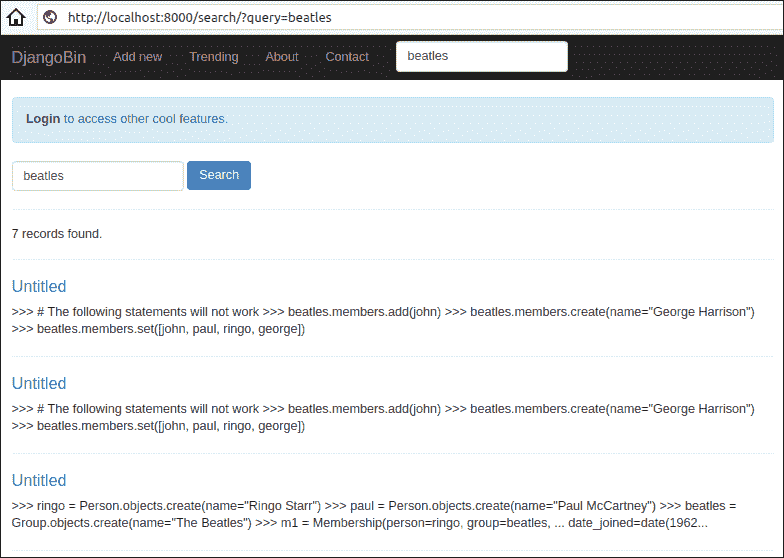
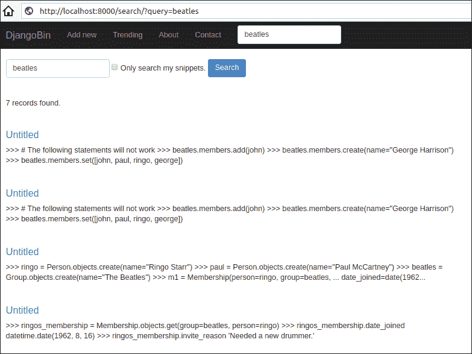

# 搜索片段

> 原文：<https://overiq.com/django-1-11/searching-snippets/>

最后更新于 2020 年 7 月 27 日

* * *

在本课中，我们将添加一个视图，允许用户通过关键字搜索片段。

让我们从创建一个搜索表单开始。

在`forms.py`中，在文件末尾定义`SearchForm`类，如下所示:

**djangobin/django _ project/djangobin/forms . py**

```py
#...

class SearchForm(forms.Form):
    query = forms.CharField(widget=forms.TextInput(attrs={'class': 'form-control',
                                                              'placeholder': 'Search'}))
    mysnippet = forms.BooleanField(required=False)

```

`query`字段是用户输入搜索词的地方。`mysnippet`字段仅对登录的用户可见。如果选中，它只允许用户搜索他的片段。

接下来，在`profile()`视图正下方的`views.py`中添加一个名为`search()`的新视图，如下所示:

**djangobin/django_project/djangobin/views.py**

```py
#...
from django.db.models import Q
from .forms import SnippetForm, ContactForm, LoginForm, CreateUserForm, \
            SettingForm, SearchForm
#...

def search(request):
    f = SearchForm(request.GET)
    snippets = []

    if f.is_valid():

        query = f.cleaned_data.get('query')
        mysnippets = f.cleaned_data.get('mysnippet')

        # if mysnippet field is selected, search only logged in user's snippets
        if mysnippets:
            snippet_list = Snippet.objects.filter(
                Q(user=request.user),
                Q(original_code__icontains=query) | Q(title__icontains=query)
            )

        else:
            qs1 = Snippet.objects.filter(
                Q(exposure='public'),
                Q(original_code__icontains = query) | Q(title__icontains = query)
                # Q(user=request.user)
            )

            # if the user is logged in then search his snippets
            if request.user.is_authenticated:
               qs2 = Snippet.objects.filter(Q(user=request.user),
                                            Q(original_code__icontains=query) | Q(title__icontains=query))
               snippet_list = (qs1 | qs2).distinct()

            else:
                snippet_list = qs1

        snippets = paginate_result(request, snippet_list, 5)

    return render(request, 'djangobin/search.html', {'form': f, 'snippets': snippets })

```

该视图功能的工作原理如下:

1.  在第 9 行中，我们通过将`request.GET`数据传递给表单构造器来实例化一个`SearchForm`实例。我们一开始将数据绑定到表单的原因是，只有当用户在页面顶部的搜索框中提交查询时，才会调用`search()`函数。此外，查询是使用 GET 请求提交的，这允许用户根据自己的意愿为搜索添加书签。

2.  在第 12 行，我们使用`is_valid()`方法来确定表单是否有效。如果表单无效，我们渲染一个没有任何数据的空表单；否则，操作过程取决于表单的提交方式。有两种可能的情况:

如果提交表单时勾选了`mysnippet`字段，那么这将触发以下 If 块的执行。

```py
#...
        # if mysnippet field is selected, search only logged in user's snippets
        if mysnippets:
            snippet_list = Snippet.objects.filter(
                Q(user=request.user),
                Q(original_code__icontains=query) | Q(title__icontains=query)
            )
#...

```

另一方面，如果提交的表单没有勾选`mysnippet`字段，那么这将触发 else 块的执行。

```py
#...
        else:
            qs1 = Snippet.objects.filter(
                Q(exposure='public'),
                Q(original_code__icontains = query) | Q(title__icontains = query)
                # Q(user=request.user)
            )

            # if the user is logged in then search his snippets
            if request.user.is_authenticated:
               qs2 = Snippet.objects.filter(Q(user=request.user),
                                            Q(original_code__icontains=query) | Q(title__icontains=query))
               snippet_list = (qs1 | qs2).distinct()

            else:
                snippet_list = qs1
#...

```

如果用户登录，我们会创建一个新的 queryset，其中包含用户创建的代码片段。查询结果`qs1`和`qs2`可能包含重复的结果。要删除重复项，请使用`|`(按位或)运算符组合两个查询集，然后对结果查询集应用`distinct()`方法。我们现在得到了独特的结果。

在第 40 行，我们调用`paginate_result()`来获取分页结果。

最后，在第 42 行，我们渲染模板。

将名为`search`的网址模式添加到`urls.py`中，如下所示:

**决哥/决哥 _ 项目/决哥/URL . py】**

```py
#...
urlpatterns = [
    #...
    url('^delete/(?P<snippet_slug>[\d]+)/$', views.delete_snippet, name='delete_snippet'),
    url('^search/$', views.search, name='search'),
]

```

创建一个名为`search.html`的模板，并添加以下代码:

**djangobin/django _ project/djangobin/templates/djangobin/search . html**

```py



    {{ request.GET.query }} - {{ block.super }}




    <form action="" class="form-inline">

        <div class="form-group">
            {{ form.query }}
        </div>

        
            <div class="checkbox">
                <label>
                    {{ form.mysnippet }} Only search my snippets.
                </label>
            </div>
        

        <button type="submit" class="btn btn-primary">Search</button>
    </form>

    <hr>

    

        
            <h5>{{ snippets.paginator.count }} record{{ snippets.paginator.count|pluralize }} found.</h5>
            <hr>
        

        <h4><a href="{{ snippet.get_absolute_url }}">{{ snippet.title }}</a></h4>
        <p>{{ snippet.original_code|truncatechars:250 }}</p>
        <hr>

    
        <h5>No records found.</h5>
    

    
        <nav aria-label="...">
            <ul class="pager">

                <li>Page {{ snippets.number }} of {{ snippets.paginator.num_pages }}</li>

                
                    <li><a href="?query={{ request.GET.query }}&page={{ snippets.previous_page_number }}">Previous</a></li>
                

                
                    <li><a href="?query={{ request.GET.query }}&page={{ snippets.next_page_number }}">Next</a></li>
                
            </ul>
        </nav>
    



```

接下来，更新`<form>`元素`base.html`如下:

```py
{# ... #}
                <li class='active'>
                    <a href="">About</a>
                </li>
                <li class='active'>
                    <a href="">Contact</a>
                </li>
            </ul>

            <form action="" class="navbar-form navbar-left" method="get">
                <div class="form-group">
                    <input type="text" name="query" class="form-control"
                           placeholder="Search" value="{{ request.GET.query }}">
                </div>
            </form>

            <ul class="nav navbar-nav navbar-right">
                <li class="dropdown">
                    <a href="#" class="dropdown-toggle" data-toggle="dropdown" role="button"
                       aria-haspopup="true" aria-expanded="false">
                        
                            {{ request.user.username|upper }}
                        
{# ... #}

```

现在，打开浏览器，导航至`http://localhost:8000/`。在页面顶部的搜索框中输入查询，然后按 Enter 键。您应该会看到如下搜索结果:



如果您已经登录，您将看到搜索框旁边的`mysnippet`选择框，如下所示:



提交勾选了`mysnippet`字段的表单时，搜索结果将仅限于您的片段。

* * *

* * *