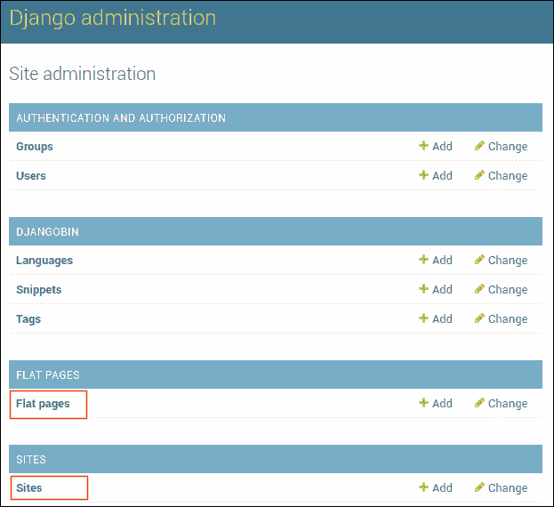
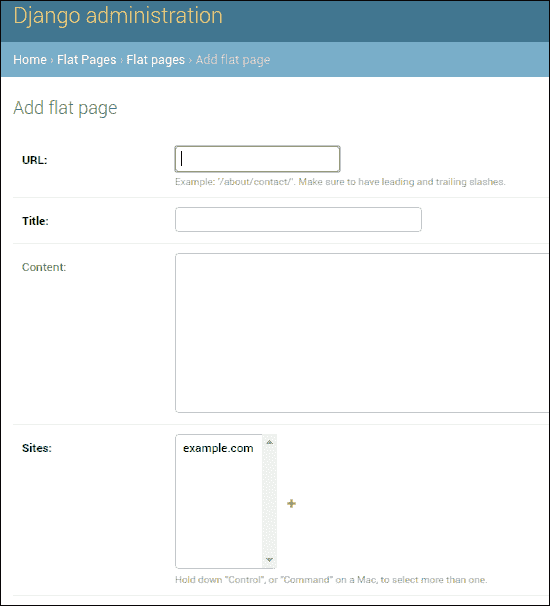
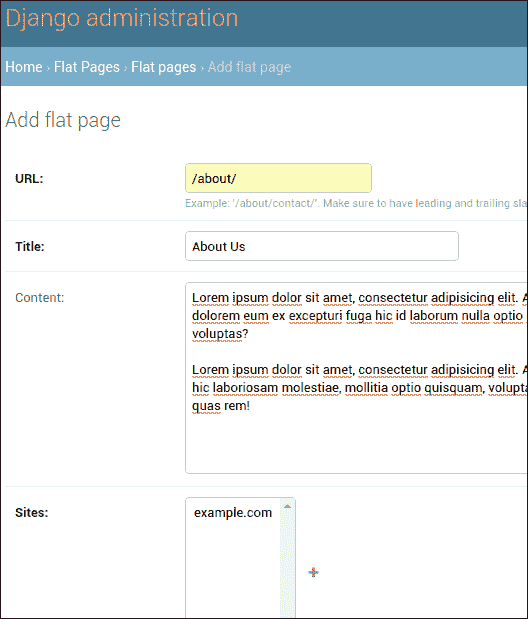
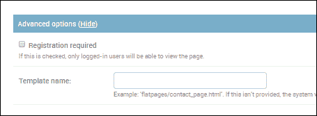
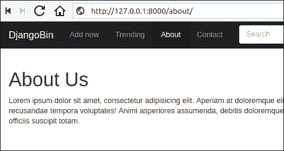
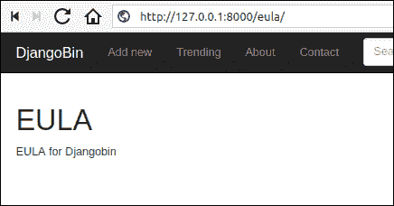

# Django 的`flatpages`

> 原文：<https://overiq.com/django-1-11/flatpages-in-django/>

最后更新于 2020 年 7 月 27 日

* * *

Web 应用通常包含不常更改的页面。例如，关于我们、EULA(最终用户许可协议)、使用条款等。这种页面被称为平面页面。Django 提供了一个名为`django.contrib.flatpages`的内置应用来处理平板页面。

## 安装平板应用

默认情况下，flatpages 应用(`django.contrib.flatpages`)未启用。要安装它，请打开`settings.py`文件并将`django.contrib.flatpages`添加到`INSTALLED_APPS`列表，如下所示:

**djangobin/django _ project/django _ project/settings . py**

```py
#...

INSTALLED_APPS = [
    'django.contrib.admin',
    'django.contrib.auth',
    'django.contrib.contenttypes',
    'django.contrib.sessions',
    'django.contrib.messages',
    'django.contrib.staticfiles',
    'django.contrib.humanize',
    'django.contrib.flatpages'
    'djangobin',
]

#...

```

flatpages 应用依赖于另一个名为 Sites framework ( `django.contrib.sites`)的应用，默认情况下该应用也未启用。要启用站点框架，请将`django.contrib.sites`添加到`INSTALLED_APPS`设置中，并在`settings.py`文件的末尾定义一个值为 1 的`SITE_ID`变量。

**djangobin/django _ project/django _ project/settings . py**

```py
#...

INSTALLED_APPS = [
    'django.contrib.admin',
    'django.contrib.auth',
    'django.contrib.contenttypes',
    'django.contrib.sessions',
    'django.contrib.messages',
    'django.contrib.staticfiles',
    'django.contrib.humanize',
    'django.contrib.flatpages',
    'django.contrib.sites',
    'djangobin',
]

#...

LOGIN_URL = 'djangobin:login'

SITE_ID = 1

```

现在像往常一样运行`migrate`命令，创建必要的表格。

```py
$ ./manage.py migrate
Operations to perform:
  Apply all migrations: admin, auth, contenttypes, djangobin, flatpages, sessions, sites
Running migrations:
  Applying sites.0001_initial... OK
  Applying flatpages.0001_initial... OK
  Applying sites.0002_alter_domain_unique... OK
```

## 平面页面模型

平面页面在数据库中使用`FlatPage`模型表示。以下是`FlatPage`型号的外观:

```py
class FlatPage(models.Model):
    url = models.CharField(maxlength=100)
    title = models.CharField(maxlength=200)
    content = models.TextField(blank=True)
    enable_comments = models.BooleanField(default=False)
    template_name = models.CharField(maxlength=70, blank=True)
    registration_required = models.BooleanField(default=False)
    sites = models.ManyToManyField(Site)

```

让我们逐一检查每个字段。

1.  `url`(必选):该字段表示平面页面将出现的网址。它只能接受以斜杠开头和结尾的网址。比如`/about/`、`/eula/`、`/about-us/`等。

2.  `title`(必选):页面标题。

3.  `content`(可选):HTML 格式的平面页面内容。

4.  `enable_comments`(可选):一个`Boolean`字段，指定您是否要启用平面页面的注释。请注意，将此字段设置为`True`不会自动在平面页面中创建注释框。如果你想有一个评论表，你必须自己编码。我们仅将此字段用作模板中的标志，以检查是否为平面页面启用了注释。

5.  `template_name`(可选):用于渲染平面页面的模板。如果没有给出，它将回到默认模板`flatpages/default.html`。

6.  `registration_required`(可选):一个`Boolean`字段，如果设置为`True`，那么只有登录的用户才能查看该平面页面。

7.  `sites`(必选):这个字段很重要。每个平面页面都与一个使用多对多关系的站点相关联。换句话说，一个`FlatPage`对象可以属于一个或多个`Site`对象。

## 网站框架

Sites 框架(`django.contrib.sites`)允许我们从同一个数据库和 Django 项目运行多个网站。Sites 框架提供了一个名为`Site`的模型，它包含以下两个字段:

1.  领域
2.  名字

`domain` -用于指定是网站的地址。比如 example.com 或者`http://example.com`。

`name` -该字段常用于指定一个人可读易记的网站名称。

启用站点框架时，我们定义了值为 1 的`SITE_ID`变量，因为这是我们的第一个站点。

当我们在`settings.py`文件中将`django.contrib.sites`添加到`INSTALLED_APPS`后运行`migrate`命令时，Django 自动添加一条记录，其中`domain`和`name`字段设置为`example.com`。

这就是你需要知道的关于站点框架的全部内容。

了解了平面页面的结构后，让我们创建一些平面页面。此时，有两种方法可以创建平面页面。

1.  Django 管理网站。
2.  Django 奥姆。

让我们尝试通过 Django 管理网站创建平面页面。

## 使用 Django 管理网站创建平面页面

访问`http://127.0.0.1:8000/admin/`并登录 Django 管理网站。

您应该会看到`Flat Page`和`Sites`与所有其他已安装的应用一起列出，如下所示:



单击平面页面前面的“添加”链接以创建新的平面页面。您应该会看到这样的添加平面页面表单:



通过输入以下详细信息创建“关于”页面:



如上所述，`url`、`title`和`sites`字段是必需的。

请注意表单底部的高级选项部分。单击显示链接使其可见。“高级”部分允许您为以下字段设置值:

*   `registration_required`
*   `template_name`



我们现在不需要在这些字段中输入任何数据。

完成后，点击页面底部的保存按钮。

## 使用 Django ORM 创建平面页面

平面页面实现为`FlatPage`模型。要使用`FlatPage`模型，我们必须首先从`django.contrib.flatpages.models`模块导入它，如下所示:

```py
from django.contrib.flatpages.models import FlatPage

```

此时，我们的数据库中有一个名为“关于”的平面页面。要在 shell 中获取它，请键入以下代码:

```py
>>> 
>>> au = FlatPage.objects.get(title='About Us')
>>> 
>>> au.url
'/about/'
>>> 
>>> au.title
'About Us'
>>> 
>>> au.content
'Lorem ipsum dolor sit amet, consectetur adipisicing elit. Adipisci aspernatur beatae cumque delectus dolorem eum ex excepturi fuga hic id laborum nulla optio quam, quasi, quidem quod totam vero voluptas?\r\n\r\nLorem ipsum dolor sit amet, consectetur adipisicing elit. At autem culpa debitis distinctio, dolore fugiat hic laboriosam molestiae, mollitia optio quisquam, voluptate. At dignissimos dolore fuga iusto mollitia quas rem!'
>>> 
>>> au.sites.all()
<QuerySet [<Site: example.com>]>
>>>
>>>

```

让我们创建一个 EULA 页面。

```py
>>>
>>> eula = FlatPage.objects.create(
...     url='/eula/',
...     title = "EULA",
...     content = "EULA for Djangobin"
... )
>>>
>>> eula
<FlatPage: /eula/ -- EULA>
>>>
>>>

```

现在我们有两个平面页面“关于”和“EULA”。与*关于*页面不同， *EULA* 页面此时不可用，因为它不与任何`Site`对象相关联。请考虑以下几点:

```py
>>>
>>> au.sites.all()
<QuerySet [<Site: example.com>]>
>>> 
>>> eula.sites.all()
<QuerySet []>
>>> 
>>>

```

上面的代码演示了我们的“关于”页面与一个站点相关联，但是“EULA”页面与任何站点都不相关联。

要使 EULA 平板可用，将其连接到一个`Site`对象，如下所示:

```py
>>>
>>> from django.contrib.sites.models import Site  # import Site model
>>>
>>> site = Site.objects.get(id=1)   # get the site object
>>>
>>> site
<Site: example.com>
>>>
>>> eula.sites.add(site)
>>> 
>>> eula.sites.all()
<QuerySet [<Site: example.com>]>
>>> 
>>>

```

## 为平面页面创建模板

我们现在有两个平面页面，但无法显示它们。默认情况下，`FlatPage`对象使用`flatpages/default.html`模板，除非您在创建/更新`FlatPage`对象时指定了不同的模板。

Django 不提供`flatpages/default.html`模板，你得自己创建一个。在 djangobin 的`templates`目录中，创建一个名为`flatpages`的新目录。然后在`flatpages`目录中创建一个名为`default.html`的新文件，并在其中添加以下代码。

**djangobin/django _ project/blog/templates/flat page/default . html**

```py



    {{ flatpage.title }} - {{ block.super }}




    <h1>{{ flatpage.title }}</h1>

    <p>{{ flatpage.content|linebreaks }}</p>



```

注意模板中使用的`flatpage`变量。所有的平面页面模板都被传递一个名为`flatpage`的上下文变量，它是一个`FlatPage`对象。一旦我们有了`FlatPage`对象，我们可以通过在属性名称后面键入一个(`.`)点来访问任何相关信息。在我们的例子中，我们只输出`FlatPage`对象的`title`和`content`属性的值。

## 网址模式

一切都准备好了。我们只需要一些网址模式来访问平面页面。打开 djangobin 的`urls.py`，在`urlpatterns`列表的末尾添加以下两个网址模式。

**djangobin/django _ project/blog/URL . py**

```py
#...
from django.contrib.flatpages import views as flat_views
from . import views
#...

urlpatterns = [
    #...
    url('^search/$', views.search, name='search'),
    url(r'^about/$', flat_views.flatpage, {'url': '/about/'}, name='about'),
    url(r'^eula/$', flat_views.flatpage, {'url': '/eula/'}, name='eula'),        
]

```

平面页面应用(`django.contrib.flatpages`)提供了一个`flatpage()`视图，其工作是渲染平面页面。它接受一个名为`url`的必需参数，这是我们在创建平面页面时输入的模板的网址。

打开 Django 斌的`base.html`并添加到*关于*和 *EULA* 页面的链接如下:

**决哥/决哥 _ project/决哥/样板/决哥/base.html**

```py
{# ... #}
        <div class="collapse navbar-collapse" id="bs-example-navbar-collapse-1">
            <ul class="nav navbar-nav">
                <li class='active' >
                    <a href="">Add new</a>
                </li>
                <li class='active'>
                    <a href="">Trending<span class="sr-only">(current)</span></a>
                </li>
                <li class='active'>
                    <a href="">About</a>
                </li>
                <li class='active'>
                    <a href="">Contact</a>
                </li>
            </ul>

{# ... #}

    <div class="main-footer">
        <div class="container text-center">
            <ul>
                <li><a href="#">Source Code</a></li>
                <li><a href="https://overiq.com/">OverIQ</a></li>
                <li><a href="">EULA</a></li>
            </ul>
        </div>
    </div>
</footer>
{# ... #}

```

打开浏览器，访问`http://127.0.0.1:8000/about/`和`http://127.0.0.1:8000/eula/`。你应该看到*关于*和 *EULA* 页面如下:





* * *

* * *