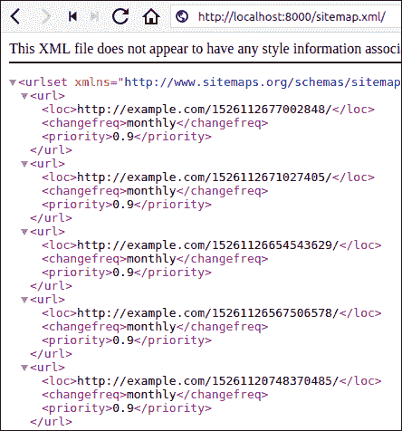
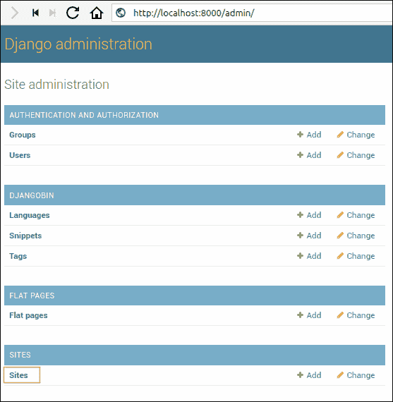
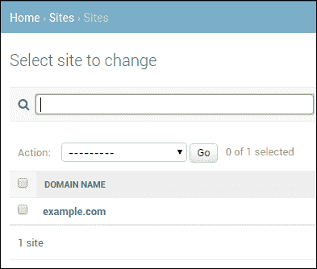
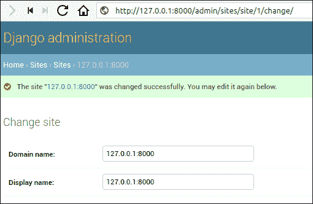

# 在 Django 中创建站点地图

> 原文：<https://overiq.com/django-1-11/creating-sitemaps-in-django/>

最后更新于 2020 年 7 月 27 日

* * *

网站地图只是网站中的一个链接列表，你希望搜索引擎对其进行抓取和索引。除此之外，网站地图还被用来告诉页面的以下信息:

1.  页面更改的频率。
2.  页面的最后修改日期。
3.  网址相对于其他网址的优先级。

## 网站地图的类型

网站地图有两种类型:

1.  HTML 网站地图。
2.  XML 站点映射。

## html 站点地图

一个 HTML 网站地图是为用户设计的，帮助他们浏览网站。要创建一个 HTML 站点地图，只需使用`<ol>`或`<ul>`标签列出你的网址，如下所示:

```py
<h2>DjangoBin Sitemap</h2>

<ul>
    <li><a href="http://example.com">Home</a></li>
    <li><a href="http://example.com/blog">Blog</a></li>
    <li><a href="http://example.com/contact">contact</a></li>
    <li><a href="http://example.com/careers">Careers</a></li>
    <li><a href="http://example.com/eula">EULA</a></li>
</ul>

```

请记住，HTML 网站地图是供人类消费的，它们不是为搜索引擎准备的。出于这个原因，谷歌网站管理员工具和其他工具甚至不允许你提交一个 HTML 网站地图。

## XML 站点映射

XML 站点地图是当今创建站点地图的最首选方式。各大搜索引擎提供的站长工具都接受 XML sitemap。下面是一个 XML 站点地图的例子:

```py
<?xml version="1.0" encoding="UTF-8"?>
<urlset >
  <url>
    <loc>http://www.example.com/home</loc>
    <lastmod>2017-05-10</lastmod>
    <changefreq>monthly</changefreq>
    <priority>0.9</priority>
  </url>
  <url>
    <loc>http://www.example.com/blog/</loc>
    <lastmod>2017-05-10</lastmod>
    <changefreq>monthly</changefreq>
    <priority>0.6</priority>
  </url>
  <url>
    <loc>http://www.example.com/contact/</loc>
    <lastmod>2017-05-10</lastmod>
    <changefreq>monthly</changefreq>
    <priority>0.6</priority>
  </url>
</urlset>

```

Django 提供了一个站点地图框架(`django.contrib.sitemaps`)，它自动化了创建站点地图的过程。

## 安装站点地图框架

要安装站点地图框架，请将`'django.contrib.sitemaps'`添加到`settings.py`文件中的`INSTALLED_APPS`列表中。站点地图框架也依赖于站点框架(`django.contrib.sites`)，我们在上一课已经安装了该框架。此时，`INSTALLED_APPS`的设定应该是这样的:

**djangobin/django _ project/django _ project/settings . py**

```py
#...

INSTALLED_APPS = [
    'django.contrib.admin',
    'django.contrib.auth',
    'django.contrib.contenttypes',
    'django.contrib.sessions',
    'django.contrib.messages',
    'django.contrib.staticfiles',
    'django.contrib.humanize',
    'django.contrib.flatpages',
    'django.contrib.sites',
    'django.contrib.sitemaps',
    'djangobin',
]

#...

```

sitemaps 框架不需要任何额外的表。所以不需要运行`migrate`命令。我们可以通过运行`migrate`命令来验证这个事实，如下所示:

```py
$ ./manage.py migrate
Operations to perform:
  Apply all migrations: admin, auth, contenttypes, djangobin, flatpages, sessions, sites
Running migrations:
  No migrations to apply.
```

请注意输出“没有要应用的迁移”。这告诉我们 sitemap 框架不会创建任何额外的表。

我们现在准备创建站点地图。

## 创建站点地图类

站点地图类只是一个继承自`django.contrib.sitemaps.Sitemap`类的 Python 类。sitemap 类表示 sitemap 中条目的一部分。例如，一个站点地图类可以代表博客的所有条目，而另一个站点地图类可以代表所有的平面页面等等。

在我们的例子中，我们希望站点地图包含所有公共片段和平面页面的链接。因此，我们将创建两个站点地图类:`SnippetfSitemap`和`FlatPageSitemap`。

在`djangobin` app 目录中创建新文件`sitemaps.py`，并添加以下代码。

**【django _ project/django gobin/site maps . py】**

```py
from django.contrib.sitemaps import Sitemap
from django.contrib.flatpages.models import FlatPage
from .models import Snippet

class SnippetSitemap(Sitemap):
    changefreq = 'monthly'
    priority = 0.9

    def items(self):
        return Snippet.objects.all()

class FlatPageSitemap(Sitemap):
    changefreq = 'monthly'
    priority = 0.9

    def items(self):
        return FlatPage.objects.all()

```

以下是它的工作原理:

在第 1-3 行，我们导入必要的类和函数。

在第 6-11 行，我们定义了一个名为`SnippetSitemap`的站点地图类。

在第 7-8 行，我们正在设置`changefreq`和`priority`属性。`changefreq`和`priority`是可选的类属性，分别指示页面更改的频率和相对于其他网址的优先级。

`changefreq`属性的其他可能值有:

*   `'always'`
*   `'hourly'`
*   `'daily'`
*   `'weekly'`
*   `'monthly'`
*   `'yearly'`
*   `'never'`

同样，`priority`属性只能包含从`0.0`到`1.0`的值。

`changefreq`和`priority`类属性对应于`<changefreq>`和`<priority>` XML 元素。换句话说，站点地图框架将使用来自`changefreq`和`priority`属性的数据在站点地图文件中创建`<changefreq>`和`<priority>`元素。

接下来，我们定义`items()`方法。`items()`方法的工作是返回一个对象列表，我们希望它的网址在站点地图中。

注意`items()`方法只是返回一个对象列表。它本身不构建网址。构建`Snippet`模型的`get_absolute_url()`方法将被隐式调用。

`FlatPageSitemap`类的定义方式类似。唯一的区别是这里`items()`方法返回的是一个`FlatPage`对象的列表，而不是`Snippet`对象。

我们的网站地图课程已经准备好了。我们只需要为它创建一个网址模式。

站点地图框架(`django.contrib.sitemaps`)提供了一个名为`sitemap()`的视图，它方便了从`Sitemap`类创建站点地图。`sitemap()`视图接受一个名为`sitemaps`的必需参数，它是一个字典对象，映射到其站点地图类的短节标签。

打开 Django 斌的`urls.py`，修改如下:

**决哥/决哥 _ 项目/决哥/URL . py】**

```py
#...
from django.contrib.flatpages import views as flat_views
from django.contrib.sitemaps.views import sitemap
from . import views
from .sitemaps import SnippetSitemap, FlatPageSitemap

# app_name = 'djangobin'

sitemaps = {
    'snippets': SnippetSitemap,
    'flatpages': FlatPageSitemap,
}

urlpatterns = [
                #...
    url(r'^about/$', flat_views.flatpage, {'url': '/about/'}, name='about'),
    url(r'^eula/$', flat_views.flatpage, {'url': '/eula/'}, name='eula'),
    url(r'^sitemap\.xml/$', sitemap, {'sitemaps': sitemaps}, name='sitemap'),
]

```

在第 3 行和第 5 行，我们导入必要的类。

在第 9-12 行，我们定义了一个将短标签映射到 sitemap 类的字典。

最后，在 18 中，我们定义了一个名为`sitemap`的新 URL 模式，并将`sitemaps`字典作为关键字参数传递。

我们的 Django 项目已经准备好提供网站地图。打开浏览器，导航至`http://127.0.0.1:8000/sitemap.xml/`。您应该会看到这样的页面:



我们的网站地图工作正常，但是请注意网址的主机部分包含`example.com`。这个领域来自于 Django 网站框架(`django.contrib.sites`)。要更改它，登录 Django 管理，然后访问网站列表页面(`http://127.0.0.1:8000/admin/sites/site/`)。





单击域名，将显示“更改网站”表单。在表单中，将域名和显示名称更改为`127.0.0.1:8000`，然后单击保存更新更改。



再次重访站点地图页面(`http://127.0.0.1:8000/sitemap.xml/`)。在这一点上，你的网站地图应该使用`127.0.0.1:8000`而不是`example.com`作为主机来生成网址。您需要在部署时再次更新此设置。

* * *

* * *