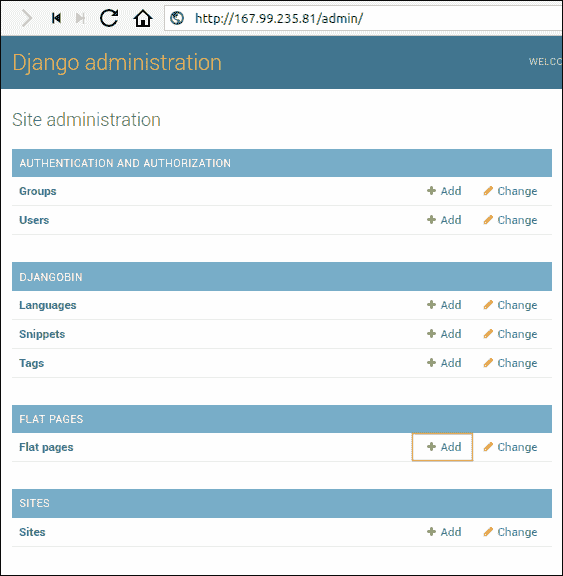

# 将 Django 项目部署到 DigitalOcean

> 原文：<https://overiq.com/django-1-11/deploying-django-project-to-digitalocean/>

最后更新于 2020 年 7 月 27 日

* * *

本章提供了将 Django 项目部署到 DigitalOcean 服务器的分步指南。

DigitalOcean 是领先的虚拟专用网服务提供商之一，他们的计划非常便宜——起价仅为每月 5 美元。

如果您没有 DigitalOcean 账户，使用[这个](https://m.do.co/c/6368552a6567)链接注册，您将获得 10 美元的免费点数。

本章中使用的 Django 项目的 git 存储库可在[这里](https://github.com/overiq/djangobin)获得。但是如果你想的话，你也可以继续你自己的项目。

## 创建液滴

登录您的 DigitalOcean 帐户，您将进入仪表板页面。


单击页面顶部的“创建”按钮，并选择水滴。


在“创建水滴”页面的“选择图像”部分下，选择 Ubuntu 16.04。


选择液滴尺寸:


选择服务器将位于的区域:


附加选项和 SSH 密钥是可选的。

给你的小滴命名，然后点击创建按钮。


创建小滴后，您将收到一封电子邮件，其中包含登录服务器所需的凭据。

## 连接到服务器

要连接到服务器，请启动终端并键入以下命令:

```py
$ ssh root@167.99.235.81

```

**注意:** Windows 用户可以使用 PuTTY SSH 客户端连接服务器。


如果您是第一次登录，系统会提示您更改密码。


## 创建具有有限访问权限的用户

您永远不应该以 root 用户身份运行应用，因为如果攻击者闯入您的应用，他会立即以 root 用户身份访问整个系统。

此外，根用户非常强大，因此可以执行任何操作，即使这会导致系统崩溃。您想格式化磁盘吗？或者删除`/usr`目录，只要执行命令就搞定了。当你是根时，系统假设你知道自己在做什么。

由于这个原因，Linux 中的大多数应用都是作为具有受限访问权限的系统用户运行的。

为了添加额外的安全层，有些发行版禁用了根访问。要执行管理操作，您必须使用`sudo`命令提升权限。

要创建新用户，请输入以下命令:

```py
$ adduser django

```

您将被要求输入密码和一些可选的详细信息。


接下来，通过执行以下命令将用户添加到`sudo`组:

```py
gpasswd -a django sudo

```


现在，该用户能够执行管理命令。

要使用新创建的用户登录，请键入`su`，后跟用户名:

```py
su django

```


使用`cd`命令将当前工作目录更改为用户的主目录:

```py
$ cd

```


下一步，我们将更新我们的系统并安装一些必要的软件包。

## 安装 PIP、PostgreSQL 和 Nginx

首先，使用以下命令更新系统:

```py
$ sudo apt-get update
$ sudo apt-get upgrade

```

Ubuntu 16.04 预装了 Python 3.5，所以我们不需要安装 Python。但是，您确实需要安装 pip。

### 点

要安装画中画，请键入以下内容:

```py
$ sudo apt-get install python3-pip

```

### Virtualenv(虚拟环境)

就像我们在开发中所做的那样，我们将使用 virtualenv 来创建一个虚拟环境。通过键入以下命令安装 virtualenv:

```py
$ pip3 install virtualenv

```

### 一种数据库系统

PostgreSQL 是 Django 社区中首选的数据库。要安装它，请键入:

```py
$ sudo apt-get install postgresql postgresql-contrib

```

安装后数据库服务器将自动启动。要测试服务器类型的状态:

```py
$ sudo service postgresql status

```

输出将如下所示:

```py
● postgresql.service - PostgreSQL RDBMS
   Loaded: loaded (/lib/systemd/system/postgresql.service; enabled; vendor preset: enabled)
   Active: active (exited) since Fri 2018-05-18 13:33:21 UTC; 1h 54min ago
 Main PID: 20416 (code=exited, status=0/SUCCESS)
   CGroup: /system.slice/postgresql.service

May 18 13:33:21 djangobin-ubuntu systemd[1]: Starting PostgreSQL RDBMS...
May 18 13:33:21 djangobin-ubuntu systemd[1]: Started PostgreSQL RDBMS.
May 18 13:33:26 djangobin-ubuntu systemd[1]: Started PostgreSQL RDBMS.

```

### Nginx

Nginx 是一款占用空间极小的高性能 web 服务器。我们将使用 Nginx 作为代理服务器，为静态文件提供服务。要按类型安装，请执行以下操作:

```py
$ sudo apt-get install nginx

```

安装后，Nginx 将自动启动。我们可以通过键入以下命令来检查 Nginx 服务器的状态:

```py
$ sudo service nginx status

```

输出如下所示:

```py
● nginx.service - A high-performance web server and a reverse proxy server
   Loaded: loaded (/lib/systemd/system/nginx.service; enabled; vendor preset: enabled)
   Active: active (running) since Fri 2018-05-18 15:17:51 UTC; 9min ago
 Main PID: 22691 (nginx)
   CGroup: /system.slice/nginx.service
           ├─22691 nginx: master process /usr/sbin/nginx -g daemon on; master_process on
           └─22692 nginx: worker process                           

May 18 15:17:51 djangobin-ubuntu systemd[1]: Starting A high performance web server and a reverse proxy server...
May 18 15:17:51 djangobin-ubuntu systemd[1]: Started A high performance web server and a reverse proxy server.

```

我们还可以通过直接向 Nginx 请求一个页面来测试它是否正在运行。打开浏览器，访问`http://167.99.235.81/`(用你的 IP 替换 167.99.235.81)。你应该得到这样一页:


### 拉比特

安装 rabbitmq:

```py
$ sudo apt-get install rabbitmq-server

```

## 创建数据库和用户

当您安装 PostgreSQL 时，它会自动创建一个名为`postgres`的用户来执行管理任务。

在我们做任何事情之前，让我们通过`psql`用这个账户登录，创建一个新的数据库。

```py
$ sudo -u postgres psql

```

输出将如下所示:

```py
psql (9.5.12)
Type "help" for help.

postgres=# 
postgres=#

```

通过键入以下命令创建新数据库:

```py
postgres=# CREATE DATABASE djangobin;
CREATE DATABASE
postgres=#

```

接下来，通过键入以下内容创建新用户:

```py
postgres=# 
postgres=# CREATE ROLE db_user WITH LOGIN PASSWORD 'password' CREATEDB;
CREATE ROLE
postgres=#

```

最后，将数据库`djangobin`上的所有权限授予`db_user`:

## 创建虚拟环境和设置项目

要克隆存储库，请键入以下命令:

```py
$ git clone https://github.com/overiq/djangobin.git

```

这将在您当前的工作目录中创建一个名为`djangobin`的目录。使用`cd`命令将当前工作目录更改为`djangobin`，并创建一个新的虚拟环境:

```py
$ cd djangobin
$ virtualenv env

```

完成后，激活虚拟环境并将`cd`放入`django_project`目录(与`manage.py`所在位置相同)。

```py
$ source env/bin/activate
$ cd django_project/

```

接下来，安装需求文件中的依赖项。

```py
$ pip install -r requirements.txt

```

由于我们在生产中使用 PostgreSQL 数据库，因此需要为 Python 安装 PostgreSQL 数据库适配器，称为 psycopg2。

```py
$ pip install psycopg2

```

创建一个 JSON 文件来存储敏感配置。

```py
$ nano djangobin-secrets.json

```

并向其中添加以下代码:

**决哥/决哥 _ 项目/决哥的秘密。json】**

```py
{
  "SECRET_KEY": "rj3vhyKiDRNmth75sxJKgS9JP8Gp7SpsS9xAlvBMTXW3Z6VTODvvFcV3TmtrZUbGkHBcs$",
  "DATABASE_NAME": "djangobin",
  "DATABASE_USER": "db_user",
  "DATABASE_PASSWORD": "password",
  "DATABASE_HOST": "127.0.0.1",
  "DATABASE_PORT": "5432",
  "EMAIL_HOST_USER": "apikey",
  "EMAIL_HOST": "smtp.sendgrid.net",
  "EMAIL_HOST_PASSWORD": "TW.qQecgRphQDa3TkLLlj18pqA.5Xrjod3G8XXojH45W4loxAsktdY3Nc",
  "EMAIL_PORT": 587
}

```

确保适当地替换数据库凭证和应用编程接口密钥。

此时，如果您试图执行`./manage.py`文件，您将会得到一个错误，因为 Django 不知道您的设置文件位于何处:

使用`export`命令临时指定设置文件位置:

```py
export DJANGO_SETTINGS_MODULE=django_project.settings.prod

```

有了这个命令，我们已经将应用置于生产模式。

要在`djangobin`数据库中创建所有必要的表，运行`migrate`命令:

```py
$ ./manage.py migrate

```

键入以下命令，为项目创建超级用户:

```py
$ ./manage.py createsuperuser
Username (leave blank to use 'django'): admin
Email address: admin@mail.com
Password: 
Password (again): 
Superuser created successfully.

```

接下来，创建一个访客用户，将其`is_active`属性设置为`False`，这样该账号就不能用来登录了。

```py
$ ./manage.py createsuperuser
Username (leave blank to use 'django'): guest
Email address: guest@mail.com
Password: 
Password (again): 
Superuser created successfully.
$
$
$ ./manage.py shell
Python 3.5.2 (default, Nov 23 2017, 16:37:01) 
[GCC 5.4.0 20160609] on linux
Type "help", "copyright", "credits" or "license" for more information.
(InteractiveConsole)
>>> 
>>> from django.contrib.auth.models import User
>>> 
>>> u = User.objects.get(username="guest")
>>> 
>>> u.is_active
True
>>> 
>>> u.is_active = False
>>> 
>>> u.save()
>>> 
>>> u.is_active
False
>>>

```

如前所述，我们将通过 Nginx 服务器提供静态文件。要收集`static`目录中项目的所有静态文件，请键入以下命令:

```py
$ ./manage.py collectstatic

```

## Gunicorn

Nginx 将面向外部世界，服务于静态文件。但是，它无法与 Django 应用通信；它需要一些东西来运行应用，从 web 向它提供请求，并返回响应。这就是古尼科恩进入戏剧的地方。

通过键入以下命令安装 Gunicorn:

```py
$ pip install gunicorn

```

要通过 Gunicorn 为我们的应用提供服务，请键入以下命令:

```py
$ gunicorn -w 3 -b 0.0.0.0:8000 django_project.wsgi
[2018-05-19 07:07:32 +0000] [25653] [INFO] Starting gunicorn 19.8.1
[2018-05-19 07:07:32 +0000] [25653] [INFO] Listening at: http://0.0.0.0:8000 (25653)
[2018-05-19 07:07:32 +0000] [25653] [INFO] Using worker: sync
[2018-05-19 07:07:32 +0000] [25656] [INFO] Booting worker with pid: 25656
[2018-05-19 07:07:32 +0000] [25658] [INFO] Booting worker with pid: 25658
[2018-05-19 07:07:32 +0000] [25659] [INFO] Booting worker with pid: 25659

```

该命令用三个工作进程启动 Gunicorn，并将套接字绑定到`0.0.0.0`地址。默认情况下，Gunicorn 只监听本地接口(即`127.0.0.1`)，这意味着您无法从网络上的其他计算机访问您的作品。要告诉 Gunicorn 监听所有接口，请将插座绑定到`0.0.0.0`。

打开浏览器，导航至`http://167.99.235.81:8000/`。您应该会看到这样的页面:


我们的应用似乎坏了。这是意料之中的，因为我们还没有提供静态文件。

## 设置 Nginx

Gunicorn 已经启动并运行，现在我们需要配置 Nginx 来将请求传递给它。

首先在`/etc/nginx/sites-available/`目录中创建一个服务器配置文件:

```py
$  sudo nano /etc/nginx/sites-available/djangobin

```

接下来，将以下配置添加到文件中:

**/etc/nginx/sites-available/djangobin**

```py
server {
    server_name 167.99.235.81;

    access_log off;

    location /static/ {
        alias /home/django/djangobin2/django_project/static/;
    }

    location / {
        proxy_set_header Host $http_host;
        proxy_pass http://127.0.0.1:8000;
        proxy_set_header X-Forwarded-Host $server_name;
        proxy_set_header X-Real-IP $remote_addr;
        add_header P3P 'CP="ALL DSP COR PSAa PSDa OUR NOR ONL UNI COM NAV"';
    }
}

```

将`167.99.235.81`替换为您的 IP 和`static`目录的路径，以匹配您自己的文件系统。

要启用此配置，请在`sites-enabled`文件夹中创建一个符号链接。

```py
$ sudo ln -s /etc/nginx/sites-available/djangobin /etc/nginx/sites-enabled/djangobin

```

测试配置文件语法:

```py
$ sudo nginx -t
nginx: the configuration file /etc/nginx/nginx.conf syntax is ok
nginx: configuration file /etc/nginx/nginx.conf test is successful

```

最后，重新启动服务器以使更改生效。

```py
$ sudo service nginx restart

```

现在，我们准备测试一切是否正常。

首先，通过键入以下命令启动 Celery 工人和 Celery 节拍:

```py
$ celery -A django_project worker -l info -B

```

按 Ctrl+Z，然后按`bg`将流程放入后台。然后，通过键入以下命令启动 Gunicorn:

```py
$ gunicorn -w 3 -b 127.0.0.1:8000 django_project.wsgi

```

请注意，这一次我们将套接字绑定为在本地接口(即 127.0.0.1)上侦听，因为这一次 Nginx 将面对外部世界，而不是 Gunicorn。

打开浏览器，访问`http://167.99.235.81/`。您应该会看到 DjangoBin 的索引页面，如下所示:


如果你试图访问关于或 EULA 平面页面，你会得到 404 错误，因为这些页面还不存在于数据库中。要创建这些页面，请访问`http://167.99.235.81/admin/`登录 Django 管理网站。


输入我们在本章前面创建的用户和密码。

单击“平面页面”前面的“添加”链接，并添加关于和 EULA 页面，如下所示:




在此期间，让我们更新 sites 框架(`django.contrib.sites`)中的域名，以便 sitemap 框架可以生成正确的链接。

访问`http://<your_ip_address>/admin/sites/site/`的网站列表页面。单击域名进行编辑，并在域名和显示名称字段中输入您的服务器 IP 地址，如下所示:


点击保存按钮更新更改。

最后，访问联系人页面并提交消息。在`ADMINS`设置中列出的所有管理员将收到如下电子邮件:


事情按预期进行，但是如果 gunicorn 或 Celery 由于某种原因被杀死，或者 DigitalOcean 在执行一些维护后重新启动您的液滴，会发生什么？

在这种情况下，用户将看到 502 错误网关错误:


我们可以通过使用名为 Supervisor 的过程监控工具来防止此类错误。

## 与主管一起监控流程

Supervisor 是一个允许我们监控流程的工具。它的工作是确保某些进程保持运行。如果进程由于某种原因死亡，主管将自动启动它。

通过键入以下命令安装 Supervisor:

```py
$ sudo apt-get install supervisor

```

安装后，Supervisor 将自动启动。我们可以通过键入以下内容来检查它的状态:

```py
$ sudo service supervisor status
● supervisor.service - Supervisor process control system for UNIX
   Loaded: loaded (/lib/systemd/system/supervisor.service; enabled; vendor preset: enabled)
   Active: active (running) since Sat 2018-05-19 15:27:28 UTC; 1min 16s ago
     Docs: http://supervisord.org
 Main PID: 592 (supervisord)
   CGroup: /system.slice/supervisor.service
           └─592 /usr/bin/python /usr/bin/supervisord -n -c /etc/supervisor/supervisord.conf

May 19 15:27:28 djangobin-ubuntu systemd[1]: Started Supervisor process control system for UNIX.
May 19 15:27:28 djangobin-ubuntu supervisord[592]: 2018-05-19 15:27:28,830 CRIT Supervisor running a
May 19 15:27:28 djangobin-ubuntu supervisord[592]: 2018-05-19 15:27:28,831 WARN No file matches via 
May 19 15:27:28 djangobin-ubuntu supervisord[592]: 2018-05-19 15:27:28,847 INFO RPC interface 'super
May 19 15:27:28 djangobin-ubuntu supervisord[592]: 2018-05-19 15:27:28,847 CRIT Server 'unix_http_se
May 19 15:27:28 djangobin-ubuntu supervisord[592]: 2018-05-19 15:27:28,848 INFO supervisord started

```

安装 Supervisor 后，我们现在可以访问`echo_supervisord_conf`命令来创建配置文件。

配置文件是 Windows-INI 风格的文件，定义了要运行的程序、如何处理输出、要传递给程序的环境变量等等。

当 Supervisor 启动时，它会自动从`/etc/supervisor/conf.d/`目录中读取配置。

通过键入以下命令创建新的配置文件:

```py
$ echo_supervisord_conf > ./djangobin.conf

```

然后使用`mv`命令将其移动到`/etc/supervisor/conf.d/`目录:

```py
$ sudo mv djangobin.conf /etc/supervisor/conf.d/

```

如果打开`djangobin.conf`文件，会发现里面包含了大量的小节和注释(以`;`开头的行)。删除文件顶部除`supervisor`部分以外的所有部分。此时，文件应该如下所示:

**/etc/supervisor/conf . d/djangobin . conf**

```py
[supervisord]
logfile=/tmp/supervisord.log ; (main log file;default $CWD/supervisord.log)
logfile_maxbytes=50MB        ; (max main logfile bytes b4 rotation;default 50MB)
logfile_backups=10           ; (num of main logfile rotation backups;default 10)
loglevel=info                ; (log level;default info; others: debug,warn,trace)
pidfile=/tmp/supervisord.pid ; (supervisord pidfile;default supervisord.pid)
nodaemon=false               ; (start in foreground if true;default false)
minfds=1024                  ; (min. avail startup file descriptors;default 1024)
minprocs=200                 ; (min. avail process descriptors;default 200)

```

下一步是添加一个或多个`[program:x]`部分，以便主管知道启动和监控哪些程序。程序段中的`x`指的是赋予每个段的任意唯一标签。该标签将用于管理程序。

下表列出了我们可以在`[program]`部分定义的一些常见选项。

| [计]选项 | 描述 | 需要 |
| --- | --- | --- |
| `command` | 此选项指定要运行的程序的路径。 | 是 |
| `directory` | 它指定了主管在运行程序之前将`cd`放入的目录 | 不 |
| `autostart` | 如果设置为`true`，则告诉主管在系统启动时启动程序。 | 不 |
| `autorestart` | 如果设置为`true`，如果程序死亡或被杀死，告诉主管启动程序。 | 不 |
| `stdout_logfile` | 存储流程标准输出的文件。 | 不 |
| `stderr_logfile` | 存储流程标准错误的文件。 | 不 |

打开`djangobin.conf`文件，在文件末尾添加以下三个`[program]`部分:

**/etc/supervisor/conf . d/djangobin . conf**

```py
[program:gunicorn]
command=/home/django/djangobin2/env/bin/gunicorn --access-logfile - --workers 3 --bind 127.0.0.1:8000 django_project.wsgi:application
directory=/home/django/djangobin2/django_project
autostart=true
autorestart=true
stderr_logfile=/var/log/gunicorn.err.log
stdout_logfile=/var/log/gunicorn.out.log

[program:celery_worker]
command=/home/django/djangobin2/env/bin/celery -A django_project worker -l info
directory=/home/django/djangobin2/django_project
autostart=true
autorestart=true
stderr_logfile=/var/log/celery.err.log
stdout_logfile=/var/log/celery.out.log

[program:celery_beat]
command=/home/django/djangobin2/env/bin/celery -A django_project beat -l info
directory=/home/django/djangobin2/django_project
autostart=true
autorestart=true
stderr_logfile=/var/log/celery_beat.err.log
stdout_logfile=/var/log/celery_beat.out.log

```

我们还希望 Supervisor 将`DJANGO_SETTINGS_MODULE`环境变量传递给所有三个流程。为此，在`[supervisord]`部分末尾添加`environment`选项，如下所示:

**/etc/supervisor/conf . d/djangobin . conf**

```py
[supervisord]
logfile=/tmp/supervisord.log ; (main log file;default $CWD/supervisord.log)
logfile_maxbytes=50MB        ; (max main logfile bytes b4 rotation;default 50MB)
logfile_backups=10           ; (num of main logfile rotation backups;default 10)
loglevel=info                ; (log level;default info; others: debug,warn,trace)
pidfile=/tmp/supervisord.pid ; (supervisord pidfile;default supervisord.pid)
nodaemon=false               ; (start in foreground if true;default false)
minfds=1024                  ; (min. avail startup file descriptors;default 1024)
minprocs=200                 ; (min. avail process descriptors;default 200)
environment=DJANGO_SETTINGS_MODULE="django_project.settings.prod"

```

告诉 Supervisor 加载此新配置，并键入以下两个命令:

```py
$ sudo supervisorctl reread
celery_beat: available
celery_worker: available
gunicorn: available
$ sudo supervisorctl update
celery_beat: added process group
celery_worker: added process group
gunicorn: added process group

```

每次修改配置文件时，都必须执行这两个命令。

现在，我们所有的程序都在运行。您可以随时通过键入以下命令来检查程序的状态:

```py
$ sudo supervisorctl status
celery_beat                      RUNNING   pid 6027, uptime 1:44:03
celery_worker                    RUNNING   pid 6028, uptime 1:44:03
gunicorn                         RUNNING   pid 6029, uptime 1:44:03
supervisor>

```

如果我们在不传递任何参数的情况下启动`supervisorctl`程序，它将启动一个交互式 Shell，允许我们控制当前由 Supervisor 管理的进程。

```py
$ sudo supervisorctl
celery_beat                      RUNNING   pid 6027, uptime 1:48:42
celery_worker                    RUNNING   pid 6028, uptime 1:48:42
gunicorn                         RUNNING   pid 6029, uptime 1:48:42
supervisor>

```

如您所见，在交互模式下`supervisorctl`从打印当前管理程序的状态开始。

进入交互式 Shell 后，要查看可用命令，请键入`help`:

```py
supervisor> 
supervisor> help

default commands (type help <topic>):
=====================================
add    exit      open  reload  restart   start   tail   
avail  fg        pid   remove  shutdown  status  update 
clear  maintail  quit  reread  signal    stop    version

supervisor>

```

现在，我们可以使用程序标签后面的相应命令来停止、启动和重新启动进程。

```py
supervisor> 
supervisor> stop gunicorn 
gunicorn: stopped
supervisor> 
supervisor> start gunicorn 
gunicorn: started
supervisor> 
supervisor> restart gunicorn 
gunicorn: stopped
gunicorn: started
supervisor>

```

要获取所有正在运行的进程的状态，请键入`status`:

```py
celery_beat                      RUNNING   pid 6027, uptime 5:51:00
celery_worker                    RUNNING   pid 6028, uptime 5:51:00
gunicorn                         RUNNING   pid 12502, uptime 0:02:06
supervisor>

```

我们还可以使用`tail`命令读取日志文件的内容:

```py
supervisor> 
supervisor> tail gunicorn 
27.0.0.1 - - [20/May/2018:13:56:42 +0000] "GET / HTTP/1.0" 200 10327 "-" "Mozilla/5.0 (Windows NT 10.0; Win64; x64) AppleWebKit/537.36 (KHTML, like Gecko) Chrome/63.0.3239.132 Safari/537.36"
127.0.0.1 - - [20/May/2018:13:56:42 +0000] "GET / HTTP/1.0" 200 10327 "-" "Mozilla/5.0 (Windows NT 10.0; Win64; x64) AppleWebKit/537.36 (KHTML, like Gecko) Chrome/63.0.3239.132 Safari/537.36"
127.0.0.1 - - [20/May/2018:13:56:43 +0000] "POST /GponForm/diag_Form?images/ HTTP/1.0" 404 92 "-" "Mozilla/5.0 (Windows NT 10.0; Win64; x64)"
127.0.0.1 - - [20/May/2018:13:57:31 +0000] "GET / HTTP/1.0" 200 10327 "-" "Mozilla/5.0 (Windows NT 10.0; WOW64) AppleWebKit/537.36 (KHTML, like Gecko) Chrome/51.0.2704.103 Safari/537.36"

supervisor>

```

默认情况下，`tail`命令从`stdout`读取。以下是我们如何从`stderr`中阅读。

```py
supervisor> 
supervisor> tail gunicorn stderr
[2018-05-20 17:29:28 +0000] [12492] [INFO] Worker exiting (pid: 12492)
[2018-05-20 17:29:28 +0000] [12493] [INFO] Worker exiting (pid: 12493)
[2018-05-20 17:29:28 +0000] [12490] [INFO] Worker exiting (pid: 12490)
[2018-05-20 17:29:29 +0000] [12487] [INFO] Shutting down: Master
[2018-05-20 17:29:29 +0000] [12502] [INFO] Starting gunicorn 19.8.1
[2018-05-20 17:29:29 +0000] [12502] [INFO] Listening at: http://127.0.0.1:8000 (12502)
[2018-05-20 17:29:29 +0000] [12502] [INFO] Using worker: sync
[2018-05-20 17:29:29 +0000] [12505] [INFO] Booting worker with pid: 12505
[2018-05-20 17:29:29 +0000] [12507] [INFO] Booting worker with pid: 12507
[2018-05-20 17:29:29 +0000] [12508] [INFO] Booting worker with pid: 12508

supervisor>

```

最后，我们可以一次停止、启动和重新启动所有进程，如下所示:

```py
supervisor> 
supervisor> stop all
celery_beat: stopped
gunicorn: stopped
celery_worker: stopped
supervisor> 
supervisor> 
supervisor> start all
celery_beat: started
celery_worker: started
gunicorn: started
supervisor> 
supervisor> 
supervisor> restart all
celery_beat: stopped
gunicorn: stopped
celery_worker: stopped
celery_beat: started
celery_worker: started
gunicorn: started
supervisor>

```

完成后，按 Ctrl+C 或键入`quit`退出监管器 Shell。

主管正在监控我们的所有流程。如果任何进程因为某种原因死亡或被终止，主管将自动启动该进程。

作为测试，尝试使用`sudo reboot`命令重新启动液滴。您会发现所有进程都会在启动时自动启动。

恭喜，您已经成功部署了 DjangoBin 项目。

* * *

* * *