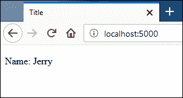

# Flask 中的模板

> 原文：<https://overiq.com/flask-101/templates-in-flask/>

最后更新于 2020 年 7 月 27 日

* * *

到目前为止，我们一直在视图函数中直接硬编码 HTML 字符串。尽管这种方法对于演示目的来说很好，但是在构建真实世界的应用时并不太合适。如今大多数网页都很长，由许多动态组件组成。我们使用模板，而不是在视图函数中嵌入大块的 HTML 字符串(维护起来会很糟糕)。

## 模板

模板只是一个文本文件，其中包含静态 HTML 代码以及一些特殊的标记，这些标记表示在请求时已知的动态内容。替换动态标记并生成平面 HTML 页面的过程称为模板渲染。Flask 附带了一个名为 Jinja 的模板引擎，它负责解析模板并将其转换为平面 HTML 页面。

Jinja 模板引擎是 Python 中最强大、最流行的模板引擎之一。如果你曾经使用过 Django 模板，那么你会有宾至如归的感觉。需要注意的是，Jinja 和 Flask 是两个独立的包，可以独立使用。

## 使用 render_template()渲染模板

默认情况下，Flask 会在应用文件夹内名为`templates`的子目录中查找模板。我们可以通过在创建应用实例时将`template_folder`参数传递给`Flask`构造函数来改变这个默认行为。

```py
app = Flask(__name__, template_folder="jinja_templates")

```

此代码将模板的默认位置更改为应用目录内的`jinja_templates`目录。目前，我们没有任何理由这样做，所以我们将继续使用默认的`templates`目录来存储模板。

在`flask_app`应用目录中创建一个名为`templates`的新目录。在`templates`目录内创建一个名为`index.html`的模板，代码如下:

**flask _ app/templates/index . html**

```py
<!DOCTYPE html>
<html lang="en">
<head>
    <meta charset="UTF-8">
    <title>Title</title>
</head>
<body>

    <p>Name: {{ name }}</p>

</body>
</html>

```

请注意，除了裸露的 HTML 之外，模板还有一个标记为`{{ name }}`的动态组件。双花括号`{{ }}`内的`name`代表一个变量，其值将在渲染模板时指定。假设`name`的值是`Jerry`，那么渲染完模板后，你会得到下面的 HTML。

```py
<!DOCTYPE html>
<html lang="en">
<head>
    <meta charset="UTF-8">
    <title>Title</title>
</head>
<body>

    <p>Name: Jerry</p>

</body>
</html>

```

Flask 提供了一个名为`render_template()`的函数来渲染模板。正是这个功能将 Jinja 和 Flask 融为一体。为了渲染一个模板，我们调用`render_template()`，使用模板名称以及您想要作为关键字参数传递给模板的数据。`render_template()`函数渲染模板并返回字符串形式的 HTML。我们传递给模板的关键字参数被称为模板上下文，或者简称为模板上下文。下面的列表显示了如何使用`render_template()`渲染`index.html`模板(更改被突出显示)。

**Flask _app/main2.py**

```py
from flask import Flask, request, render_template
app = Flask(__name__)

@app.route('/')
def index():
    return render_template('index.html', name='Jerry')
#...

```

注意`name='Jerry'`中的`name`是指模板`index.html`中引用的变量。

如果您现在访问 [http://localhost:5000/](http://localhost:5000/) ，您将获得以下响应:



如果您有相当多的参数要传递给`render_template()`，那么不要使用逗号(`,`)来分隔它们，而是创建一个字典，并对其应用`**`运算符来将关键字参数传递给函数。例如:

```py
@app.route('/')
def index():
    name, age, profession = "Jerry", 24, 'Programmer'
    template_context = dict(name=name, age=age , profession=profession)
    return render_template('index.html', **template_context)

```

`index.html`模板现在可以访问三个模板变量:`name`、`age`和`profession`。

如果不指定模板上下文会发生什么？

什么都不会发生，你不会得到任何警告或异常，Jinja 会像往常一样渲染模板，并打印空字符串来代替变量。要在操作中查看此行为，请修改`index()`查看功能如下:

**Flask _app/main2.py**

```py
#...
@app.route('/')
def index():
    return render_template('index.html')
#...

```

并访问 [http://localhost:5000/](http://localhost:5000/) 。这一次，您将获得以下 HTML 响应:

```py
<!DOCTYPE html>
<html lang="en">
<head>
    <meta charset="UTF-8">
    <title>Title</title>
</head>
<body>

    <p>Name: </p>

</body>
</html>

```

现在您应该对模板在 Flask 中的使用有了一个大概的了解，下一节将展示如何在控制台中渲染模板。

## 控制台内的渲染模板

出于测试目的，在控制台内渲染模板相当容易，而不是创建几个文件。启动 Python shell，从`jinja2`包导入`Template`类，如下所示。

```py
>>>
>>> from jinja2 import Template
>>>

```

要创建`Template`对象，只需将模板的内容作为原始字符串传递。

```py
>>>
>>> t = Template("Name: {{ name }}")
>>>

```

要渲染模板，请调用`Template`对象的`render()`方法，并将数据作为关键字参数。

```py
>>>
>>> t.render(name='Jerry')
'Name: Jerry'
>>>

```

在下一课中，我们将讨论 Jinja 模板语言。

* * *

* * *