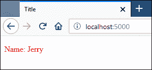

# 在 Flask 中提供静态文件

> 原文：<https://overiq.com/flask-101/serving-static-files-in-flask/>

最后更新于 2020 年 7 月 27 日

* * *

静态文件是不常改变的文件，例如，CSS 文件、JS 文件、字体文件等。默认情况下，Flask 会在应用目录内的`static`子目录中查找静态文件。我们可以通过在创建应用实例时将目录名传递给`static_folder`关键字参数来更改此默认值，如下所示:

```py
app = Flask(__name__, static_folder="static_dir")

```

这会将静态文件的默认位置更改为应用目录内的`static_dir`目录。

目前，我们将坚持默认的`static`目录。在`flask_app`目录中创建一个名为`static`的目录。在`static`目录内创建一个 CSS 文件`style.css`，内容如下。

**flask _ app/static/style . CSS**

```py
body {
    color: red
}

```

回想一下，在第[课【Flask basic】](/flask-101/flask-basics/)中，我们讨论过 Flask 会自动添加表单的路径`/static/<filename>`来处理静态文件。因此，我们需要为静态文件提供的只是使用`url_for()`函数创建网址，如下所示:

```py
<script src="{{ url_for('static', filename='jquery.js') }}"></script>

```

**输出:**

```py
<script src="/static/jquery.js"></script>

```

打开`index.html`模板，添加`<link>`标签如下(更改突出显示):

**flask _ app/templates/index . html**

```py
<!DOCTYPE html>
<html lang="en">
<head>
    <meta charset="UTF-8">
    <title>Title</title>
    <link rel="stylesheet" href="{{ url_for('static', filename='style.css') }}">
</head>

```

如果还没有运行就启动服务器，访问 [http://localhost:5000/](http://localhost:5000/) ，应该会看到页面主体是红色的，如下图:



这里描述的服务静态文件的方法仅用于开发。在生产中，我们使用一个真实的网络服务器，如 Nginx 或 Apache 来服务静态文件。

* * *

* * *